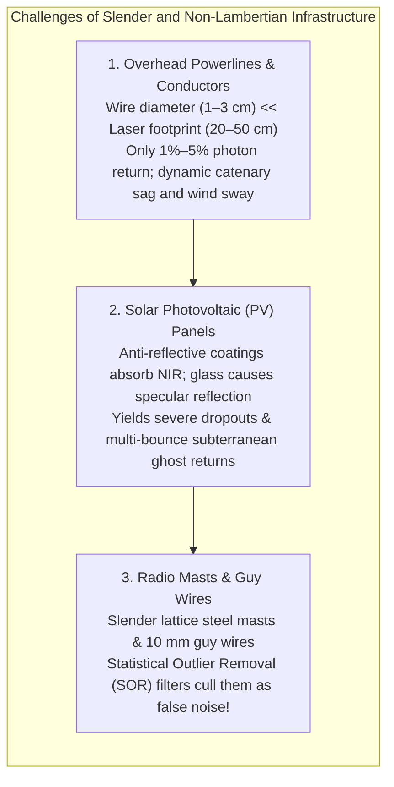
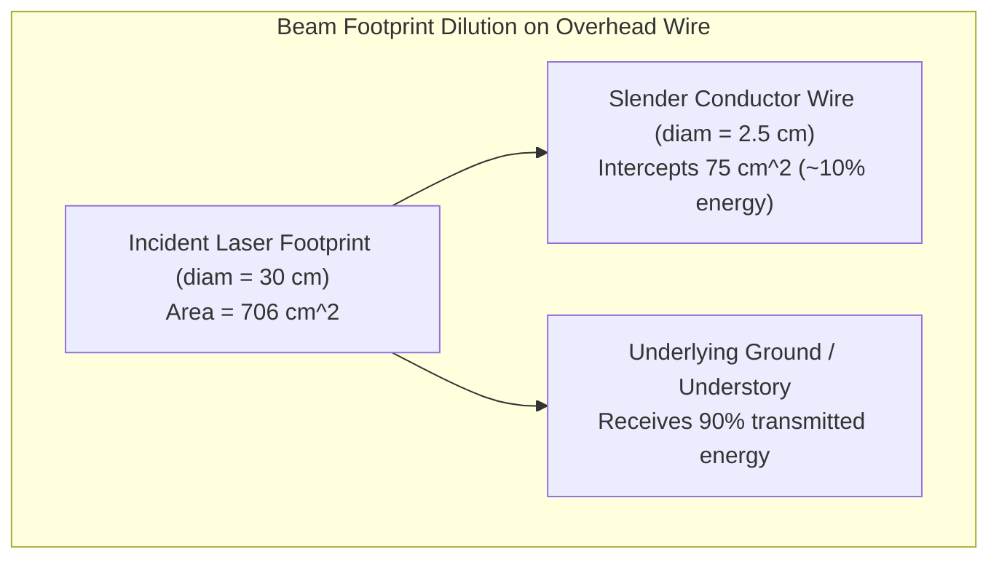
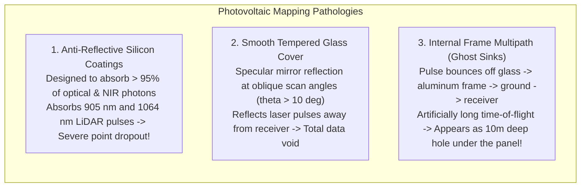
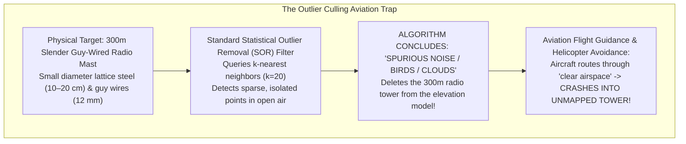

# Chapter 20: Naming, Ontologies, and the Confusing Definitions of Surface Objects

*What is "the ground"? What each DSM or DTM dataset includes or excludes, and the ontological grey zones of buildings, roads, bridges, pipes, wires, solar panels, and indoor space.*

---

## 20.3 Dealing with Wires, Powerlines, Solar Panels, and Antennas

Slender, non-Lambertian, and dynamically moving infrastructure objects—high-voltage electrical transmission conductors, guy-wired telecommunications masts, and utility-scale solar photovoltaic farms—represent some of the most difficult physical targets in digital surface modeling. Standard remote sensing filters frequently classify thin wires and radio spires as transient noise (culling them as birds or clouds) or fail to detect them entirely due to beam footprint dilution, creating life-threatening aviation hazards and invalidating utility vegetation management.

---

### 20.3.1 Overhead Transmission Lines and Catenary Sag Physics

Electrical utility corridors represent a multi-billion-dollar application of airborne LiDAR and helicopter mobile mapping. To prevent catastrophic wildfires and blackout-inducing flashovers, utilities must measure the exact 3D clearance between sagging conductors and encroaching tree branches.

#### The Thin-Wire Detection Problem
High-voltage aluminum-conductor steel-reinforced (ACSR) cables have physical diameters of only $d_{\text{wire}} \approx 1.5\text{–}3.5\text{ cm}$. 
* An airborne laser scanner operating at $H = 1000\text{ m}$ with divergence $\gamma = 0.3\text{ mrad}$ produces a circular ground footprint diameter of $D \approx 30\text{ cm}$ (area $A_{\text{footprint}} \approx 706\text{ cm}^2$).
* The projected area of the wire intersecting the beam is $A_{\text{wire}} = d_{\text{wire}} \times D \approx 2.5\text{ cm} \times 30\text{ cm} = 75\text{ cm}^2$.
* The wire intercepts only **$\approx 10\%$ of the incident optical pulse energy**; the remaining $90\%$ passes unimpeded to strike the ground below.
* Unless the laser receiver features high dynamic range, short dead-time, and sensitive constant fraction discriminators, the weak wire echo is lost in background noise, resulting in "dotted" or missing transmission lines.

#### Dynamic Catenary Sag Across Timescales
A powerline is not a static physical object. The spatial position of an overhead conductor varies dynamically across hours, days, and seasons:
1. **Thermal and Joule Heating Sag ($I^2 R$):** As electrical current $I$ increases during peak power demand, resistive heating ($P = I^2 R$) elevates conductor core temperatures to $75^\circ\text{–}100^\circ\text{C}$. The aluminum strands undergo **thermal expansion**, elongating the cable and increasing the mid-span sag by $1.0\text{–}3.5\text{ meters}$ toward the ground.
2. **Ambient Temperature Shifts:** Winter cold snaps contract the cable (reducing sag), while blistering summer heat waves drop the line toward vegetation.
3. **Wind Sway and Conductor Galloping:** Strong cross-winds induce aerodynamic drag, swinging the catenary arc laterally out of the vertical plane by $10^\circ\text{–}30^\circ$, while freezing freezing rain produces asymmetric ice accretion that induces low-frequency aeroelastic oscillations ("galloping").

#### ASPRS Point Cloud Classification
The ASPRS LAS 1.4 specification reserves dedicated semantic classes for electrical infrastructure:
* **Class 14:** Wire – Conductor (Phase wires carrying current).
* **Class 15:** Transmission Tower (Steel lattice towers and wooden poles).
* **Class 16:** Wire – Structure Connector (Insulators and hardware).
* **Class 17:** Wire – Guard / Shield Wire (Optical ground wires [OPGW] at the top of the tower).

---

### 18.3.2 Solar Photovoltaic (PV) Farms: Specular Glare and Ghost Returns

Utility-scale solar farms present extreme radiometric and geometric anomalies in airborne LiDAR and photogrammetry:

1. **Near-Infrared Absorption:** Solar cells are engineered with specialized anti-reflective silicon nitride coatings designed to maximize photon absorption across $400\text{–}1100\text{ nm}$. Standard airborne LiDAR wavelengths ($1064\text{ nm}$ and $905\text{ nm}$) are absorbed, producing low return amplitudes.
2. **Specular Reflection:** The smooth tempered glass front surface behaves as an optical mirror. At off-nadir scan angles ($>10^\circ\text{–}15^\circ$), the laser beam bounces away from the aircraft, resulting in empty data voids across solar arrays.
3. **Subterranean "Ghost Sinks" (Multipath):** Laser photons that bounce between the underside of the panel, the metal racking frame, and the ground undergo delayed multipath travel times. The receiver logs these delayed photons as spatial points located **$3\text{–}15\text{ meters}$ beneath the true ground level**, creating false subterranean depression pits in the raw point cloud.

---

### 18.3.3 Telecommunications Antennas and the Outlier Filter Trap

Slender communications masts, cell tower spires, and tensioned steel guy wires present a critical safety paradox:

* **The Problem:** Standard automated point cloud cleaning engines utilize **Statistical Outlier Removal (SOR)** or radius outlier filters. These algorithms identify points whose mean distance to their $k$-nearest neighbors exceeds a statistical threshold, classifying isolated points in the open sky as birds, aircraft, or cloud spray.
* **The Catastrophe:** Slender radio masts and guy wires have few neighboring returns in open air. Automated SOR filters aggressively delete the tower returns as "noise."
* In aviation obstacle databases (FAA, Eurocontrol), relying on uninspected automated LiDAR filtering strips lethal $300\text{-meter}$ towers from the final terrain model, creating a fatal hazard for emergency medical helicopters and low-altitude aviation.
* **The Rule:** Critical aviation obstacle points must be protected by explicit inclusion masks or manual human verification before deploying noise filters.
