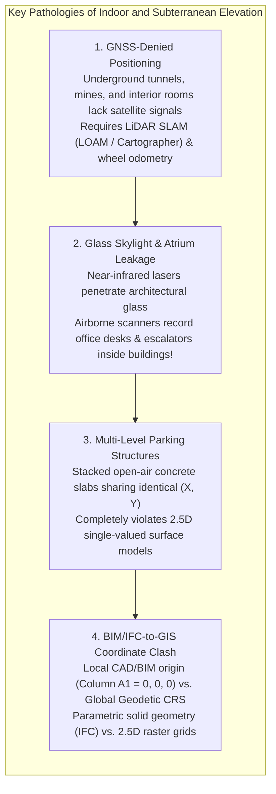
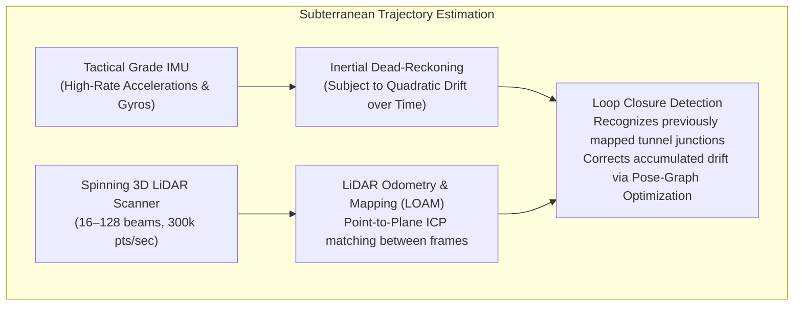
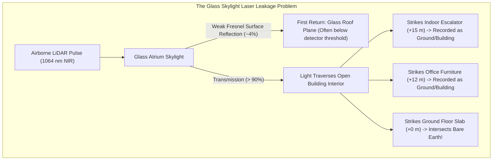
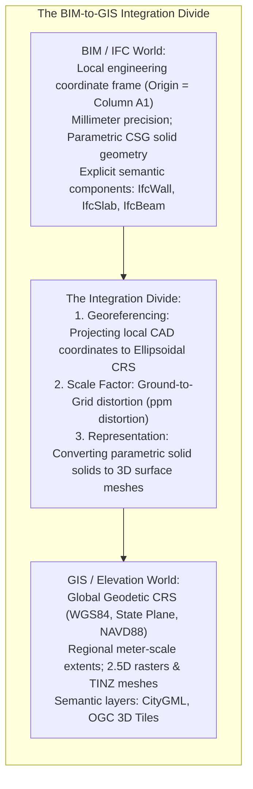

# Chapter 19: Key File Formats, Metadata, Archiving, and Data Discovery (STAC & Beyond) -> Chapter 20
# Chapter 20: Naming, Ontologies, and the Confusing Definitions of Surface Objects

*What is "the ground"? What each DSM or DTM dataset includes or excludes, and the ontological grey zones of buildings, roads, bridges, pipes, wires, solar panels, and indoor space.*

---

## 20.4 Dealing with Innerspace: Inside-Building and Subterranean Issues

Classical digital elevation models treat buildings and terrain as opaque, solid exterior boundaries. However, modern geospatial applications—indoor emergency navigation, smart city twins, underground utility engineering, and mining—require mapping the hollow spaces *inside* and *beneath* the surface: subterranean rail tunnels, multi-level parking garages, limestone caves, underground mines, and building interiors. 

Navigating this "innerspace" challenges the core tenets of geospatial data: GNSS satellite signals vanish, optical lasers penetrate transparent skylights to record ghost indoor surfaces, and parametric architectural BIM models clash with global geodetic coordinate systems.

---

### 20.4.1 Mapping GNSS-Denied Subterranean Spaces with SLAM

The moment a mapping sensor enters a road tunnel, subway tube, or underground mine, the satellite constellation that provides absolute geodetic georeferencing is completely blocked:

#### The Drift Problem in Linear Tunnels
In long, straight featureless tunnels (such as high-speed rail boreholes or drainage pipes):
* **Geometric Degeneracy:** The tunnel cross-section is an identical cylinder for kilometers. Along the longitudinal axis of the tunnel, the point-to-plane ICP residual is zero everywhere, causing the SLAM solver to lose along-track velocity constraints.
* **IMU Position Divergence:** Without GNSS updates or distinct visual/geometric features, tactical IMU positions drift quadratically ($\Delta x \propto \frac{1}{2} a_{\text{bias}} t^2$), accumulating several meters of position error after just $500\text{–}1000\text{ meters}$ of travel.
* **Operational Remedy:** Subterranean mobile laser scanning systems must tie into physical geodetic control networks: retroreflective prism targets surveyed through the tunnel portals using high-precision total stations, providing absolute geodetic anchor constraints to bound SLAM drift.

---

### 20.4.2 The Glass and Skylight Penetration Trap

A common, bizarre pathology in high-resolution urban airborne LiDAR surveys occurs over modern architecture featuring glass skylights, transparent atrium roofs, and glass-curtain walls:

#### Why Lasers See Inside Buildings
Standard airborne topographic laser scanners operate at near-infrared wavelengths ($\lambda = 1064\text{ nm}$ or $905\text{ nm}$):
* Architectural glass is engineered to transmit optical and near-infrared light. The Fresnel reflectance off the front glass surface is only $\approx 4\%$.
* In many cases, the weak front-surface reflection fails to cross the detector's constant fraction discriminator (CFD) threshold.
* Over $90\%$ of the laser photon energy passes straight through the skylight into the building interior, reflecting off third-floor mezzanine railings, indoor potted ficus trees, office desks, and basement floor slabs.
* **The Catastrophic Result:** Automated ground classification algorithms identify the indoor floor slab as "bare earth" and the indoor escalators as "vegetation," building a digital elevation model that punches an open, jagged crater right through the center of a 50-story commercial tower!

---

### 20.4.3 Multi-Level Parking Decks: The Limits of 2.5D

A five-story above-ground concrete parking garage represents the ultimate breakdown of single-valued surface modeling:
* **Top Roof Deck:** Open to the sky; captured by airborne LiDAR as a flat horizontal surface ($Z = +15\text{ m}$).
* **Interior Decks:** Four intermediate concrete floor slabs ($Z = +12\text{ m}, +9\text{ m}, +6\text{ m}, +3\text{ m}$) supporting parked vehicles and structural support columns.
* **Ground Level:** Concrete ground slab ($Z = 0\text{ m}$) where water drains.

In a standard GIS:
* A 2.5D raster DEM can store only **one single elevation** at coordinate $(X, Y)$. If it stores $+15\text{ m}$ (the roof), the entire volume below is treated as solid rock. If it stores $0\text{ m}$ (the ground), the building is completely erased.
* **Engineering Impact:** An autonomous delivery robot navigating the second-floor ramp ($+6\text{ m}$) or an indoor emergency responder looking for a stairwell cannot operate on a 2.5D elevation surface. They require a true 3D spatial model where each level is an independent surface facet linked by vertical ramp topology.

---

### 20.4.4 Bridging the Divide: BIM/IFC to 3D GIS Integration

In civil engineering and architecture, buildings and infrastructure are modeled using **Building Information Modeling (BIM)** standardized by buildingSMART in the **Industry Foundation Classes (IFC, ISO 16739-1)**. 

Bridging the gap between BIM and geospatial elevation models exposes three fundamental technical divides:

1. **Local vs. Geodetic Coordinate Systems:** BIM models are drawn in an engineering tangent plane where $(0, 0, 0)$ is set to a local structural milestone (e.g., column intersection A-1). Integrating BIM into a national DEM requires a rigorous 7-parameter or 14-parameter Helmert transformation into the project's projected coordinate reference system (CRS).
2. **Ground-to-Grid Scale Factor:** In local CAD/BIM construction models, distances are measured strictly on the **ground**. In projected geospatial grids (e.g., State Plane or UTM), grid distances are distorted by the map projection scale factor $k$ and the elevation height factor:
   $$\text{Combined Scale Factor (CSF)} = k \cdot \frac{R}{R + H}$$
   Failing to apply the CSF when placing a $500\text{-meter}$ BIM bridge model into a GIS elevation model creates multi-decimeter positioning errors at the bridge abutments.
3. **Parametric Solids to Surface Meshes:** IFC models store walls, pipes, and beams as parametric Constructive Solid Geometry (CSG) extrusions. To ingest a BIM model into a geospatial terrain model, software (e.g., Safe Software FME or ArcGIS GeoBIM) must tessellate the parametric solids into discrete 3D triangular boundary representations (`PolyhedralSurfaceZ` or OGC 3D Tiles).
