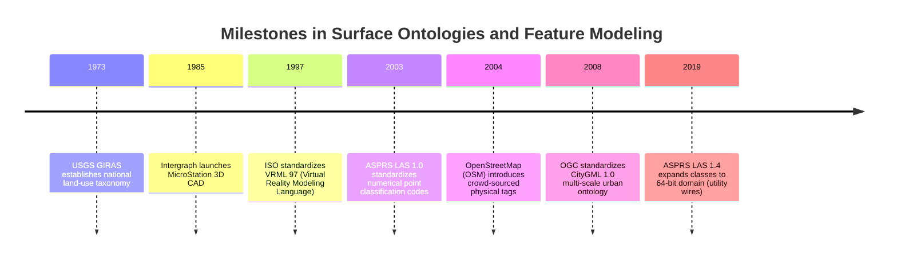
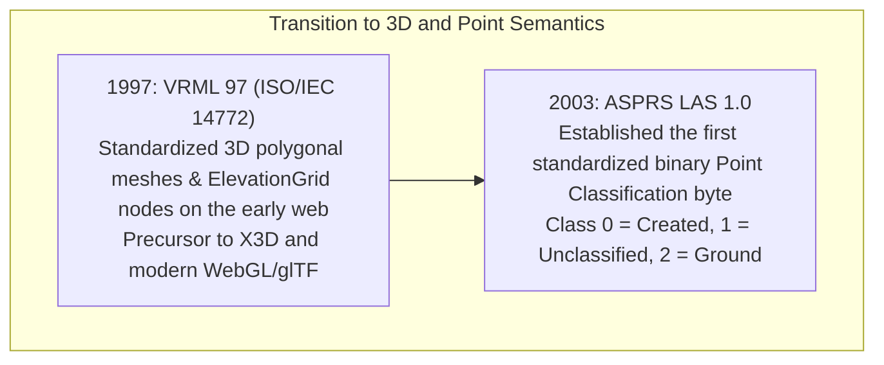
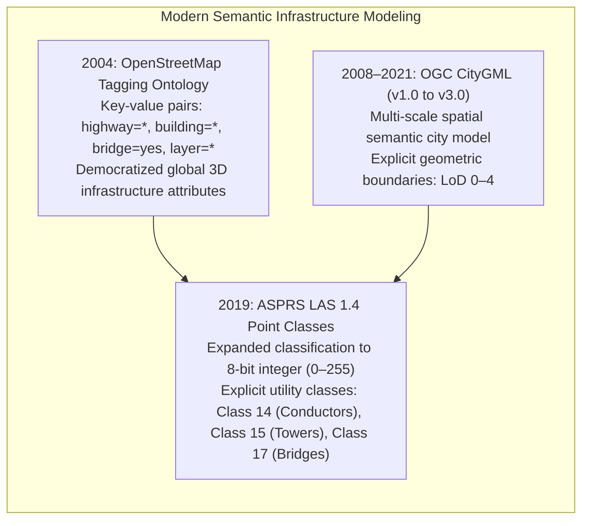

# Chapter 20: Naming, Ontologies, and the Confusing Definitions of Surface Objects

*What is "the ground"? What each DSM or DTM dataset includes or excludes, and the ontological grey zones of buildings, roads, bridges, pipes, wires, solar panels, and indoor space.*

---

## 20.5 Historical Evolution of Surface Ontologies and Semantic Classifications

The classification of physical Earth objects in digital computers reflects a half-century evolution: from land-use category codes digitized on punch cards to standardized point cloud classification schemas and crowd-sourced global infrastructure ontologies.

---

### 19.5.1 The Genesis of Surface Classification (1973–1985)

#### 1973: USGS GIRAS (Geographic Information Retrieval and Analysis System)
In 1973, the U.S. Geological Survey developed the **GIRAS** system, led by James Anderson and Richard Witmer. GIRAS was designed to classify every square kilometer of the United States:
* Established the **Anderson Land Use and Land Cover Classification System** (USGS Professional Paper 964).
* Structured land cover into a strict two-level hierarchical taxonomy: Level I categories (Urban, Agricultural, Rangeland, Forest, Water, Wetland, Barren, Tundra, Perennial Ice) subdivided into Level II specific classes.
* GIRAS established the core ontological principle that digital terrain surfaces must be coupled to semantic land-cover categories.

#### 1985: Intergraph MicroStation and 3D CAD Topology
In 1985, Bentley Systems and Intergraph Corporation released **MicroStation** (initially PseudoStation) for 3D computer-aided drafting:
* MicroStation introduced 3D vector "elements" (B-spline curves, complex chains, 3D solids) to highway and civil engineering.
* Established the engineering convention of using 3D vector alignments as structural breaklines, separating natural earth grading from human-built pavement and structural retaining walls.

---

### 19.5.2 3D Web Standards and Point Cloud Schemas (1997–2003)

#### 1997: VRML 97 and X3D
In 1997, the International Organization for Standardization published **VRML 97 (ISO/IEC 14772-1)**, the Virtual Reality Modeling Language. VRML introduced the `ElevationGrid` node—a 3D graphics primitive defining a regular grid of heights rendered as a continuous, textured polygonal mesh. While VRML struggled with bandwidth limitations on dial-up internet, it laid the mathematical and conceptual groundwork for modern 3D geospatial rendering engines (Cesium, Three.js, glTF).

#### 2003: ASPRS Standardizes LAS Point Classification Codes
Prior to 2003, commercial airborne LiDAR vendors used proprietary, conflicting integer codes to label point returns (e.g., one vendor used `1` for ground, another used `1` for tree canopy). 
* In May 2003, the American Society for Photogrammetry and Remote Sensing released **LAS 1.0**, establishing the **Standardized Point Classification Lookup Table**:
  * `0`: Created, never classified
  * `1`: Unassigned / Default
  * `2`: **Ground (Bare Earth)**
  * `3`: Low Vegetation
  * `4`: Medium Vegetation
  * `5`: High Vegetation
  * `6`: Building
  * `7`: Low Point (Noise / Pit)
  * `9`: Water Surface
* This standardized numerical schema allowed software engines to automatically separate bare-earth DTMs from vegetative DSMs worldwide.

---

### 19.5.3 The Crowd-Sourced and Smart City Era (2004–Present)

#### 2004: The OpenStreetMap Physical Feature Ontology
When Steve Coast founded OpenStreetMap in 2004, the platform rejected rigid relational schemas in favor of a flexible, open **Key-Value Tagging Ontology**:
* Features are tagged with physical real-world descriptions: `highway=motorway`, `bridge=yes`, `layer=2`, `tunnel=yes`.
* This crowd-sourced ontology proved that global infrastructure could be classified without centralized bureaucratic mandates, establishing the semantic keys used today to hydro-enforce flood models and route autonomous vehicles through 3D cities.

#### 2008: OGC CityGML (Levels of Detail 0–4)
In 2008, the Open Geospatial Consortium standardized **CityGML 1.0** (updated to CityGML 3.0 in 2021). Developed by researchers at the University of Bonn and TU Munich, CityGML bridged geospatial GIS with architectural CAD, establishing standard multi-scale geometric and semantic representations for terrain, buildings, tunnels, water bodies, and vegetation.

#### 2019: ASPRS LAS 1.4 Expanded Classes
In LAS 1.4, ASPRS expanded the classification field to a full 8-bit integer ($0\text{–}255$), standardizing specialized classes for modern utility, civil, and coastal mapping:
* `Class 13`: Wire – Guard
* `Class 14`: Wire – Conductor (Phase)
* `Class 15`: Transmission Tower
* `Class 17`: Bridge Deck
* `Class 18`: High Noise (Clouds, birds, aircraft)
* `Class 20`: Ignored Ground (Ground points adjacent to breaklines excluded from interpolation)
* `Class 22`: Temporal Exclusion (Points removed due to moving cars or construction machinery)
