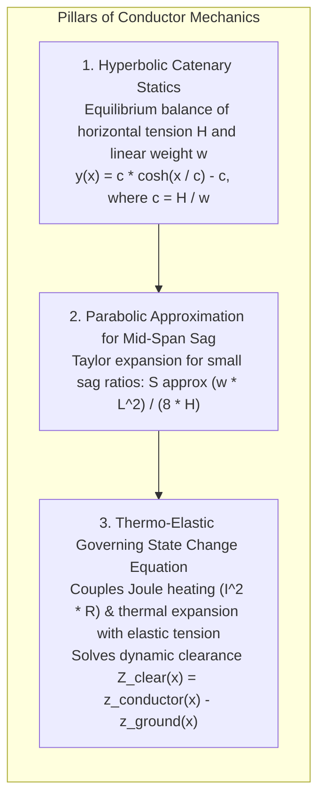
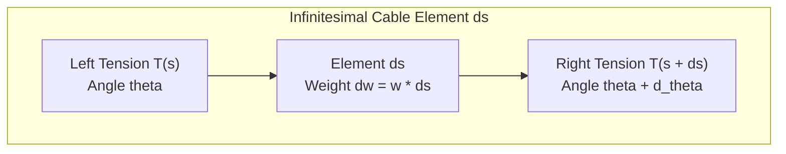
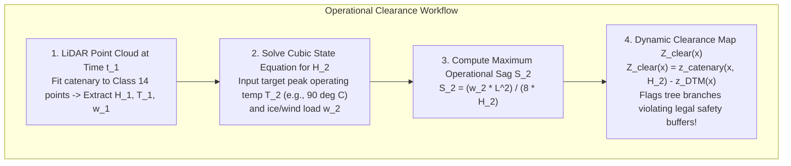

# Chapter 20: Naming, Ontologies, and the Confusing Definitions of Surface Objects

*What is "the ground"? What each DSM or DTM dataset includes or excludes, and the ontological grey zones of buildings, roads, bridges, pipes, wires, solar panels, and indoor space.*

---

## 20.6 Mathematical Foundations of Catenary Sag and Thermal Conductor Mechanics

To accurately extract, model, and predict vegetation clearance conflicts for overhead powerlines from airborne LiDAR point clouds, geospatial engineers must apply the exact equations of catenary statics and thermo-elastic deformation. A powerline captured by a laser scanner at 09:00 during a cool morning will hang significantly lower at 15:00 under peak electrical loading. 

This section derives the classical hyperbolic catenary curve, its parabolic engineering approximation, and the cubic governing state equation relating conductor temperature, mechanical tension, and vertical sag.

---

### 20.6.1 The Classical Hyperbolic Catenary Curve

Consider a flexible, perfectly inextensible cable suspended between two rigid support towers separated by horizontal span length $L$. Let the origin $(0, 0)$ be located at the lowest point (the vertex) of the cable.

Let:
* $w = \rho g A$ denote the linear weight density of the cable ($\text{N/m}$).
* $H$ denote the constant horizontal component of cable tension ($\text{N}$).
* $T(s)$ denote the total tangential tension at arc length $s$.
* $\theta(s)$ denote the angle of the tangent to the cable with respect to the horizontal.

#### Step 1: Differential Equilibrium Equations
Resolving horizontal and vertical forces on an infinitesimal segment of arc length $ds$:

$$\sum F_x = 0 \implies T \cos\theta = H = \text{constant}$$

$$\sum F_y = 0 \implies d(T \sin\theta) = w \, ds$$

Dividing the vertical differential by the constant horizontal tension $H$:

$$\frac{d(T \sin\theta)}{T \cos\theta} = d(\tan\theta) = \frac{w}{H} ds$$

Because $\tan\theta = \frac{dy}{dx}$ is the slope of the curve:

$$\frac{d}{dx}\left(\frac{dy}{dx}\right) dx = \frac{w}{H} ds \implies \frac{d^2 y}{dx^2} = \frac{w}{H} \frac{ds}{dx}$$

By the Pythagorean theorem for differential arc length:

$$ds = \sqrt{dx^2 + dy^2} = \sqrt{1 + \left(\frac{dy}{dx}\right)^2} dx \implies \frac{ds}{dx} = \sqrt{1 + \left(\frac{dy}{dx}\right)^2}$$

Defining the **catenary parameter** $c = \frac{H}{w}$ (units of meters), we obtain the non-linear second-order ordinary differential equation:

$$\frac{d^2 y}{dx^2} = \frac{1}{c} \sqrt{1 + \left(\frac{dy}{dx}\right)^2}$$

#### Step 2: Solving the Differential Equation
Let $u = \frac{dy}{dx}$. Then $\frac{du}{dx} = \frac{1}{c}\sqrt{1 + u^2}$. Separating variables:

$$\int \frac{du}{\sqrt{1 + u^2}} = \int \frac{1}{c} \, dx$$

Using the standard inverse hyperbolic sine integral $\int \frac{du}{\sqrt{1+u^2}} = \operatorname{arcsinh}(u)$:

$$\operatorname{arcsinh}(u) = \frac{x}{c} + C_1$$

At the lowest point of the span ($x = 0$), the slope is horizontal: $u(0) = \left.\frac{dy}{dx}\right|_{x=0} = 0 \implies C_1 = 0$.

Therefore:

$$u = \frac{dy}{dx} = \sinh\left(\frac{x}{c}\right)$$

Integrating once more with respect to $x$:

$$y(x) = \int \sinh\left(\frac{x}{c}\right) dx = c \cosh\left(\frac{x}{c}\right) + C_2$$

Enforcing the boundary condition that $y(0) = 0$ yields $C_2 = -c$. This establishes the **classical hyperbolic catenary equation**:

$$y(x) = c \left[ \cosh\left(\frac{x}{c}\right) - 1 \right] = \frac{H}{w} \left[ \cosh\left(\frac{w x}{H}\right) - 1 \right]$$

---

### 20.6.2 Parabolic Approximation for Mid-Span Sag

In overhead transmission engineering, the horizontal tension $H$ is maintained at high levels ($10\text{–}50\text{ kN}$), meaning $c = \frac{H}{w}$ ranges from $1000\text{ m}$ to $3000\text{ m}$. For typical spans ($L \approx 200\text{–}400\text{ m}$), the ratio $\frac{x}{c} \ll 1$.

Expanding $\cosh(u)$ in a Taylor series about $u = 0$:

$$\cosh(u) = 1 + \frac{u^2}{2!} + \frac{u^4}{4!} + \dots$$

Substituting $u = \frac{x}{c}$:

$$y(x) \approx c \left[ \left(1 + \frac{x^2}{2 c^2} + \frac{x^4}{24 c^4}\right) - 1 \right] = \frac{x^2}{2c} + \frac{x^4}{24 c^3}$$

Dropping fourth-order terms yields the **parabolic approximation**:

$$y(x) \approx \frac{w x^2}{2 H}$$

The **maximum mid-span sag ($S$)** occurs at the tower supports ($x = \pm L/2$):

$$S = y\left(\frac{L}{2}\right) \approx \frac{w (L/2)^2}{2 H} = \frac{w L^2}{8 H}$$

#### Total Cable Arc Length ($s$)
The total physical arc length of the cable across the span $L$ is:

$$s = 2 \int_0^{L/2} \sqrt{1 + \sinh^2\left(\frac{x}{c}\right)} dx = 2 c \sinh\left(\frac{L}{2c}\right)$$

Expanding $\sinh(u) \approx u + \frac{u^3}{6}$:

$$s \approx 2 c \left[ \frac{L}{2c} + \frac{1}{6}\left(\frac{L}{2c}\right)^3 \right] = L + \frac{L^3}{24 c^2} = L + \frac{8 S^2}{3 L}$$

This closed-form relation demonstrates that a small change in physical cable length ($\Delta s$) produces a massively amplified change in vertical mid-span sag ($\Delta S$).

---

### 20.6.3 The Governing Thermo-Elastic State Change Equation

As electric current flows through the aluminum conductor, Joule resistive heating ($P = I^2 R$) elevates temperature from initial state $T_1$ to operational state $T_2$. The physical length of the cable changes due to both **thermal elongation** and **elastic tension relaxation**:

$$s_2 - s_1 = \underbrace{\alpha (T_2 - T_1) L}_{\text{Thermal Expansion}} + \underbrace{\frac{H_2 - H_1}{E A} L}_{\text{Elastic Hooke's Law}}$$

where $\alpha$ is the coefficient of thermal expansion ($\text{K}^{-1}$), $E$ is Young's modulus of elasticity ($\text{N/m}^2$), and $A$ is the total cross-sectional area ($\text{m}^2$).

Equating this physical change in arc length to the geometric arc length difference $s_2 - s_1 = \frac{L^3 w_2^2}{24 H_2^2} - \frac{L^3 w_1^2}{24 H_1^2}$:

$$\frac{L^3 w_2^2}{24 H_2^2} - \frac{L^3 w_1^2}{24 H_1^2} = \alpha (T_2 - T_1) L + \frac{H_2 - H_1}{E A} L$$

Dividing through by $L$ and multiplying by $E A$:

$$\frac{E A L^2 w_2^2}{24 H_2^2} - \frac{E A L^2 w_1^2}{24 H_1^2} = E A \alpha (T_2 - T_1) + H_2 - H_1$$

Multiplying through by $H_2^2$ and rearranging into standard polynomial form yields the **Cubic Governing State Change Equation**:

$$H_2^3 + \left[ \frac{E A L^2 w_1^2}{24 H_1^2} - H_1 + E A \alpha (T_2 - T_1) \right] H_2^2 = \frac{E A L^2 w_2^2}{24}$$

By solving this cubic polynomial for $H_2$ using Cardano's formula, utility engineers calculate the worst-case physical conductor sag $S_2$ at maximum operating temperature ($90^\circ\text{–}120^\circ\text{C}$), generating true dynamic vegetation clearance maps against the underlying bare-earth DTM.
