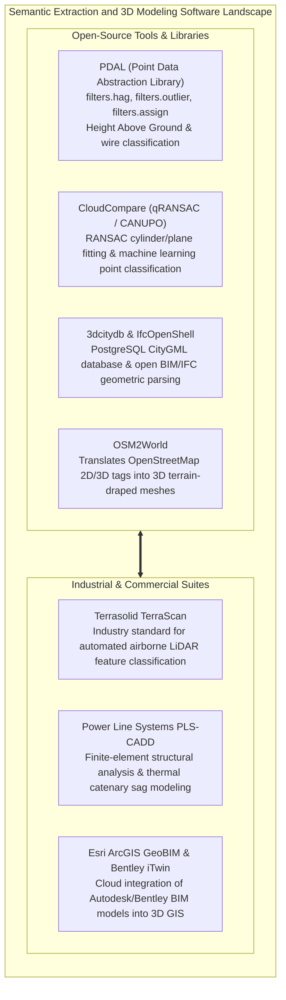

# Chapter 20: Naming, Ontologies, and the Confusing Definitions of Surface Objects

*What is "the ground"? What each DSM or DTM dataset includes or excludes, and the ontological grey zones of buildings, roads, bridges, pipes, wires, solar panels, and indoor space.*

---

## 20.7 Software Ecosystem for Feature Extraction, 3D City Models, and Utility Infrastructure

Extracting semantic features from elevation point clouds and reconciling architectural models with geospatial terrain spans open-source computational geometry engines, urban database schemas, and highly specialized commercial utility design suites.



---

### 20.7.1 Open-Source Tools and Pipelines

#### Computing Height Above Ground (HAG) with PDAL
To separate above-ground structures (buildings, trees, powerlines) from bare earth, PDAL calculates the vertical distance $\Delta z = z_{\text{point}} - z_{\text{ground}}$ for every point using a Delaunay triangulation of classified ground points:

```json
{
  "pipeline": [
    {
      "type": "readers.las",
      "filename": "classified_points.las"
    },
    {
      "type": "filters.hag_delaunay",
      "count": 10
    },
    {
      "type": "filters.range",
      "limits": "HeightAboveGround[2.0:150.0]"
    },
    {
      "type": "writers.las",
      "filename": "above_ground_infrastructure.las",
      "extra_dims": "HeightAboveGround=float32"
    }
  ]
}
```

* `filters.hag_delaunay` projects each point onto the underlying bare-earth surface, computing its exact height above ground.
* `filters.range` extracts features between $2.0\text{ m}$ (filtering out low grass and cars) and $150.0\text{ m}$ (isolating buildings, tree canopies, and transmission towers).

#### Parsing BIM Geometry with IfcOpenShell
In Python, **IfcOpenShell** extracts 3D boundary representation meshes directly from Industry Foundation Classes (`.ifc`) files for ingestion into GIS elevation models:

```python
"""Extracting 3D Building Geometry from BIM/IFC using IfcOpenShell."""

import ifcopenshell
import ifcopenshell.geom

# 1. Open the architectural IFC model
ifc_file = ifcopenshell.open("building_model.ifc")

# 2. Configure geometry settings to produce triangulated 3D meshes
settings = ifcopenshell.geom.settings()
settings.set(settings.USE_WORLD_COORDS, True)

# 3. Extract all structural slabs and roofs
elements = ifc_file.by_type("IfcSlab") + ifc_file.by_type("IfcRoof")
for element in elements:
  shape = ifcopenshell.geom.create_shape(settings, element)
  verts = shape.geometry.verts  # 1D array of 3D coordinates (x, y, z)
  faces = shape.geometry.faces  # Triangular facet indices
  print(
      f"Extracted {element.is_a()} {element.Name}: {len(verts)//3} vertices,"
      f" {len(faces)//3} triangles"
  )
```

#### CityGML Management with `3dcitydb`
The **3D City Database (`3dcitydb`)** is a free, open-source relational schema for PostgreSQL/PostGIS:
* Stores multi-scale urban semantic objects (CityGML LoD 1 to LoD 4).
* Supports 3D spatial queries, building texture management, and direct export to OGC 3D Tiles and Cesium for high-performance web visualization.

---

### 20.7.2 Commercial and Industrial Suites

#### Terrasolid TerraScan
Running inside Bentley MicroStation, **TerraScan** is the global production standard for airborne LiDAR processing:
* **Automated Macro Classification:** Executes chained macro routines that classify ground (Progressive TIN), buildings (detecting planar roof facets and vertical wall steps), vegetation (echo ratio and height above ground), and transmission lines.
* **Vectorizing Buildings:** Fits regular 3D parametric roof models to classified building point clouds, exporting clean vector polygons for urban mapping.

#### Power Line Systems PLS-CADD
PLS-CADD is the undisputed engineering standard for electrical transmission line design:
* Ingests classified LiDAR points (`Class 14` conductors, `Class 15` towers).
* **Non-Linear Finite Element Catenary Engine:** Fits exact physical catenaries to conductor points, calculating operating temperature $T_1$ and mechanical tension $H_1$ directly from surveyed sag.
* **Thermal Rating & Clearances:** Simulates emergency electrical loading (e.g., $100^\circ\text{C}$ line temperature) and hurricane cross-winds, highlighting vegetation encroachment zones on 3D profile displays.

#### Esri ArcGIS GeoBIM and Bentley iTwin
* **ArcGIS GeoBIM:** Connects ArcGIS Pro and Enterprise directly to Autodesk Construction Cloud, allowing planners to click on a 3D building in a regional GIS elevation scene and view real-time architectural BIM blueprints, structural sheets, and maintenance schedules.
* **Bentley iTwin:** Bridges infrastructure engineering CAD models with reality meshes generated from drone photogrammetry and mobile laser scans.

---

### 20.7.3 Software Comparison Matrix

| Software Suite | License Model | Primary Domain | Key Feature Extraction Capabilities | Primary Role in Elevation Workflows |
| :--- | :--- | :--- | :--- | :--- |
| **PDAL** | Open-Source (BSD) | Point Cloud CLI | HAG computation, Statistical Outlier Removal | Automated headless point classification and HAG filtering. |
| **CloudCompare** | Open-Source (GPLv2) | 3D Point / Mesh | RANSAC shape detection (cylinders, spheres, planes) | Manual inspection, point cloud editing, geometric fitting. |
| **IfcOpenShell** | Open-Source (LGPL) | BIM / IFC (Python/C++) | Converts parametric IFC solids into 3D vector meshes | Bridging architectural CAD models into 3D GIS databases. |
| **`3dcitydb`** | Open-Source (Apache 2.0)| CityGML / PostGIS | Relational storage of CityGML LoD 1–4 city models | Municipal 3D spatial database for smart cities. |
| **TerraScan** | Commercial (Terrasolid) | Airborne LiDAR | Automated macros for ground, buildings, trees, wires | Industrial high-throughput point cloud production. |
| **PLS-CADD** | Commercial (PLS) | Overhead Powerlines | Non-linear finite element thermal catenary modeling | Utility transmission vegetation management and sag analysis. |
| **ArcGIS GeoBIM** | Commercial (Esri) | BIM / 3D GIS Cloud | Cloud-to-cloud Autodesk Revit to 3D GIS integration | Infrastructure digital twins and urban planning. |
| **Bentley iTwin** | Commercial (Bentley) | Engineering Twins | Reality mesh to parametric infrastructure alignment | Large-scale transportation corridor asset management. |
