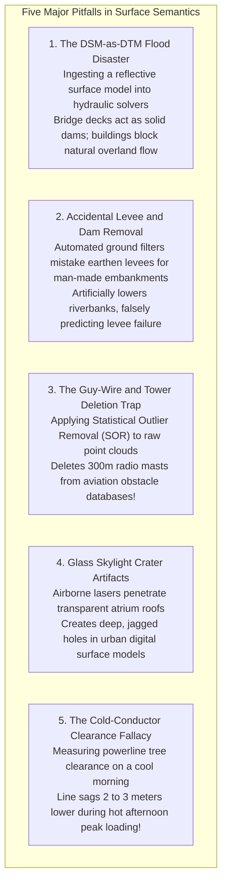

# Chapter 20: Naming, Ontologies, and the Confusing Definitions of Surface Objects

*What is "the ground"? What each DSM or DTM dataset includes or excludes, and the ontological grey zones of buildings, roads, bridges, pipes, wires, solar panels, and indoor space.*

---

## 20.8 Common Pitfalls and Key Takeaways

The semantic classification of elevation models is filled with subtle ontological traps. Assuming that an elevation model represents the bare ground when it actually captures tree canopies, or allowing automated filters to delete earthen levees or aviation radio towers, leads to disastrous engineering and life-safety failures.

---

### 20.8.1 Common Pitfalls in Surface Semantics and Object Classification

#### 1. Ingesting a DSM into a Flood Model (The Artificial Dam Catastrophe)
The most common and destructive blunder in hydrological engineering is downloading an unverified "elevation model" and ingesting it directly into a 2D shallow water flood solver (e.g., HEC-RAS 2D):
* If the dataset is a Digital Surface Model (DSM)—such as raw SRTM, Copernicus-30, or unclassified drone photogrammetry—all tree canopies, residential buildings, and highway bridge decks are treated as **solid, impermeable rock**.
* Bridges across rivers become massive solid earthen dams that block river discharge. Simulated floodwaters back up into catastrophic, artificial upstream inundation zones while starving downstream areas.
* **Remedy:** Hydraulic modeling requires a **strictly validated bare-earth DTM** with hydro-enforced (breached) bridges and culverts.

#### 2. Accidental Removal of Flood-Control Levees
Many automated bare-earth filtering algorithms (e.g., Progressive Morphological Filters) use spatial window operations to detect and remove elevated features:
* A continuous earthen flood-control levee is often $5\text{–}10\text{ m}$ high and only $15\text{–}30\text{ m}$ wide at its base.
* If the filter window size is set larger than the levee base, the algorithm misclassifies the levee crest as an "elevated human structure" and shaves it flat to the surrounding floodplain!
* The resulting DTM erases the community's primary flood defense, falsely predicting that seasonal high tides or minor river swells will submerge downtown areas.
* **Remedy:** Levees and dams must be protected by explicit 2D inclusion polygons during ground filtering.

#### 3. Deleting Aviation Obstacles with Outlier Filters
Automated point cloud processing scripts frequently apply aggressive **Statistical Outlier Removal (SOR)** to eliminate birds, aircraft, and atmospheric clouds:
* Slender communications masts, cell tower spires, and tensioned steel guy wires have few neighboring returns in open air.
* Standard SOR filters aggressively delete the tower returns as "noise."
* The resulting dataset is delivered to aviation authorities with a $300\text{-meter}$ lethal flight obstacle completely erased from the terrain model.
* **Remedy:** Protect known obstacle coordinates from automated culling; mandate manual human verification of high point clusters.

#### 4. The Glass Skylight Crater Artifact
Airborne near-infrared lasers ($1064\text{ nm}$) transmit through transparent glass with minimal surface reflection:
* Laser pulses enter glass atriums and reflect off indoor mezzanine floors, furniture, and escalators.
* Automated algorithms classify these internal points as building roofs or ground, creating a chaotic, fractured depression inside the building envelope.
* **Remedy:** Overlay building footprint vector masks (from cadastral parcels or OpenStreetMap) to clip and flatten building roof envelopes over known atriums.

#### 5. The Cold-Conductor Clearance Fallacy
Surveying an electrical transmission line at 08:00 on a $15^\circ\text{C}$ morning and concluding that tree branches have $4.0\text{ m}$ of legal clearance:
* By 15:00, ambient temperatures reach $35^\circ\text{C}$ and peak air conditioning loads drive electrical current through the line, elevating conductor core temperatures to $90^\circ\text{C}$.
* Thermal elongation increases mid-span sag by $2.5\text{ m}$, dropping the conductor into tree branches and triggering a catastrophic wildfire.
* **Remedy:** Never evaluate utility clearance from raw LiDAR point coordinates alone; always fit physical catenary curves and model the maximum operating temperature state equation using tools like PLS-CADD.

---

### 18.8.2 Key Takeaways for Practitioners

1. **Know Your Horizon:** Never consume or distribute a dataset labeled vaguely as a "DEM." Explicitly declare whether it represents a **Digital Surface Model (DSM)**, a **Digital Terrain Model (DTM)**, a **Normalized Canopy Model (nDSM)**, or a **Topo-Bathymetric Model (TBDEM)**.
2. **The "Ground" Is Application-Dependent:** What constitutes ground in civil earthwork (where bridges are removed) is completely different from what constitutes ground in autonomous driving (where bridge decks are essential roadway surfaces). Select the product tailored to your domain.
3. **Protect Critical Linear Topography:** Earthen levees, dams, and highway crowns must be preserved during bare-earth filtering; free-spanning bridges must be breached for water routing.
4. **Catenary Sag Is Dynamic:** Overhead conductors are moving targets governed by Joule heating, thermal expansion, and wind sway. clearance auditing requires solving thermo-elastic state equations.
5. **Bridge the BIM-to-GIS Coordinate Divide:** Ingesting 3D architectural models into geospatial elevation models requires explicit datum transformations and ground-to-grid combined scale factor corrections.
