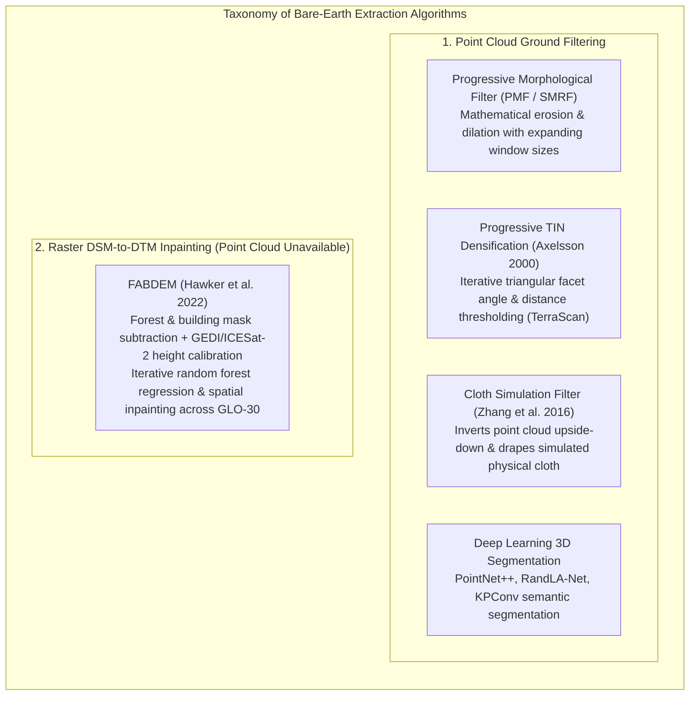
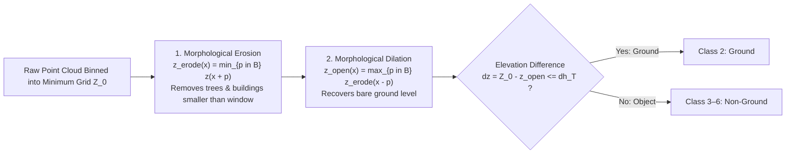
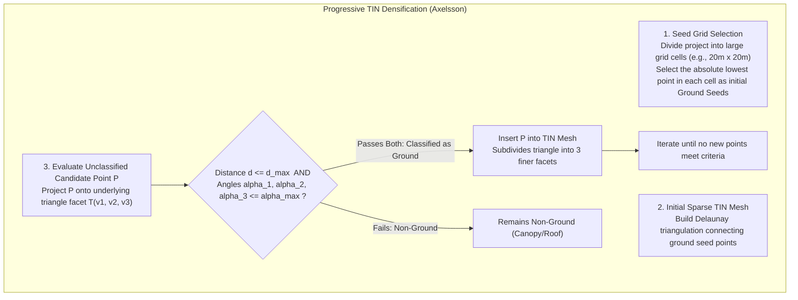
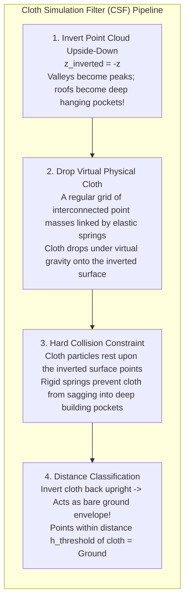

# Chapter 21: Bare-Earth Extraction (DSM to DTM), Data Gaps, Shadows, and Overhangs

*How objects are removed from a DSM to create a DTM, the hidden interpolation uncertainties under removed objects, and how to handle voids and vertical/overhanging geometry.*

Transforming a reflective first-surface Digital Surface Model (DSM) or an unclassified 3D point cloud into a bare-earth Digital Terrain Model (DTM) is one of the most computationally demanding tasks in elevation processing. The sensor cannot directly measure "the ground" beneath a multi-tiered rainforest or an industrial warehouse; it measures electromagnetic reflections from whatever physical matter intercepts its rays. 

Extracting the bare ground requires mathematical algorithms that filter out vegetation crowns, understory shrubs, buildings, vehicles, and transmission towers, while faithfully preserving natural geological breaks, razor-sharp ridge crests, and riverbanks.

---

## 21.1 Removing Objects from a DSM or Point Cloud to Create a DTM

Bare-earth extraction operates under two distinct technological paradigms: **3D Point Cloud Filtering** (when discrete spatial returns are available) and **Raster Inpainting / Height Subtraction** (when working with compiled spaceborne DSM rasters like SRTM or Copernicus).

---

### 21.1.1 Classical Point Cloud Ground Filtering Algorithms

#### 1. Progressive Morphological Filtering (PMF and SMRF)
Pioneered by Keqi Zhang et al. (2003) and refined by Thomas Pingel et al. (2013) as the Simple Morphological Filter (SMRF), morphological filtering applies mathematical grayscale **dilation** ($\oplus$) and **erosion** ($\ominus$) across an expanding spatial window:

* **The Morphological Opening:** $\gamma_B(z) = (z \ominus B) \oplus B$. Erosion replaces each cell with the minimum elevation in structuring element $B$, effectively slicing off tree canopies and building roofs. Dilation restores the eroded terrain back up to its local minimum level.
* **Progressive Window Expansion:** The filter starts with a small window ($w_1 = 1\text{ m}$) to remove telephone poles and small shrubs, iteratively expanding to $w_k = 20\text{–}50\text{ m}$ to eliminate commercial warehouse roofs.
* **Slope-Dependent Height Threshold ($dh_{T, k}$):** To prevent clipping sharp mountain ridges during large-window iterations, the threshold increases dynamically with local terrain slope $s$:
  $$dh_{T, k} = s \cdot (w_k - w_{k-1}) \, c + dh_0$$
  where $c$ is grid cell size and $dh_0$ is initial vertical tolerance ($\approx 0.15\text{–}0.30\text{ m}$).

#### 2. Progressive TIN Densification (PTD / Axelsson 2000)
Developed by Peter Axelsson in 2000 and licensed as the core engine of **Terrasolid TerraScan**, Progressive TIN Densification is the most widely deployed commercial ground filtering algorithm:

* **Selection Criteria:** A candidate point $P$ is added to the ground TIN if:
  1. The orthogonal vertical distance $d$ from $P$ to the underlying triangle plane is less than $d_{\max}$ (typically $0.3\text{–}0.5\text{ m}$).
  2. The angles $\alpha_1, \alpha_2, \alpha_3$ between the facet plane and the vectors from $P$ to the three triangle vertices are all less than $\alpha_{\max}$ (typically $6^\circ\text{–}10^\circ$).
* **Why PTD Excels:** In mountainous terrain, the TIN facets slope upward with the mountain, allowing Axelsson's algorithm to hug steep hillsides and preserve knife-edge ridge crests that morphological filters clip.

#### 3. Cloth Simulation Filter (CSF / Zhang et al. 2016)
Developed by Wuming Zhang et al. in 2016, the Cloth Simulation Filter (CSF) takes an ingenious physical approach based on computer graphics cloth animation:

* **Physical Analogy:** By inverting the surface upside-down ($z \to -z$), natural mountain peaks point downward, while tree canopies and building roofs point into the air like deep hanging pockets.
* When a virtual physical cloth (with programmable stiffness/rigidity) is dropped over the inverted model, the cloth rests naturally upon the bare ground peaks, but lacks the flexibility to sag into narrow tree pockets or building recesses.
* Inverting the cloth back upright yields a continuous bare-earth envelope. CSF is computationally fast, highly robust across rural terrain, and implemented natively in PDAL (`filters.csf`) and CloudCompare.

---

### 21.1.2 Raster DSM-to-DTM Inpainting: The FABDEM Paradigm

When original 3D point clouds are unavailable—such as when researchers must analyze global satellite radar DSMs (SRTM $30\text{-m}$, Copernicus GLO-30, or AW3D30)—ground extraction cannot rely on point-to-plane geometric tests. The reflective canopy and urban blocks must be identified and removed entirely within the 2D raster domain.

#### The FABDEM Methodology (Hawker et al. 2022)
**FABDEM** (Forest And Buildings removed Copernicus DEM) produced the first global $30\text{-meter}$ bare-earth DTM by systematically cleansing the Copernicus GLO-30 DSM:
1. **Machine Learning Predictor Training:** Trained a set of Random Forest regression models using NASA's spaceborne **GEDI** (Global Ecosystem Dynamics Investigation) and **ICESat-2** laser altimetry profiles as absolute, sub-canopy bare-ground truth.
2. **Feature Stack Ingestion:** Ingested multi-sensor spatial predictors: Copernicus GLO-30 elevations and slopes, ESA WorldCover land cover classifications, Global Forest Canopy Height models, and building footprint density rasters.
3. **Height Subtraction and Morphological Inpainting:** Where forests or buildings exist, the model predicts the height bias ($\Delta z_{\text{veg}}, \Delta z_{\text{bldg}}$) and subtracts it from the DSM. Across building footprints, the cleared voids are smoothly inpainted using constrained directional splines anchored to surrounding bare-earth ground pixels.

---

### 21.1.3 Deep Learning Point Cloud Segmentation (PointNet++, RandLA-Net)

Modern computer vision trains 3D deep neural networks directly on unstructured $(X, Y, Z, \text{Intensity})$ point coordinates:
* **PointNet++ (Qi et al. 2017):** Applies hierarchical neural feature aggregation over local metric neighborhoods, capturing geometric contextual features (planarity of roofs, curvature of trees, linear continuity of roadbeds).
* **RandLA-Net (Hu et al. 2020):** Employs random point sampling combined with local spatial encoding, enabling semantic segmentation of massive multi-million-point LiDAR swaths in seconds.
* **Advantage:** Neural networks classify points based on **geometric shape context** rather than simple elevation relative to neighbors, correctly identifying low dense shrubs (*chaparral*, *mangroves*) as vegetation even when they hug the ground.
