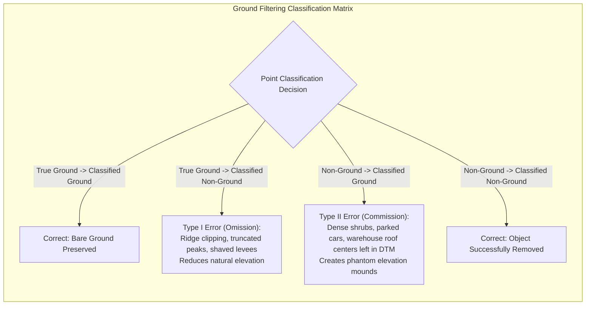
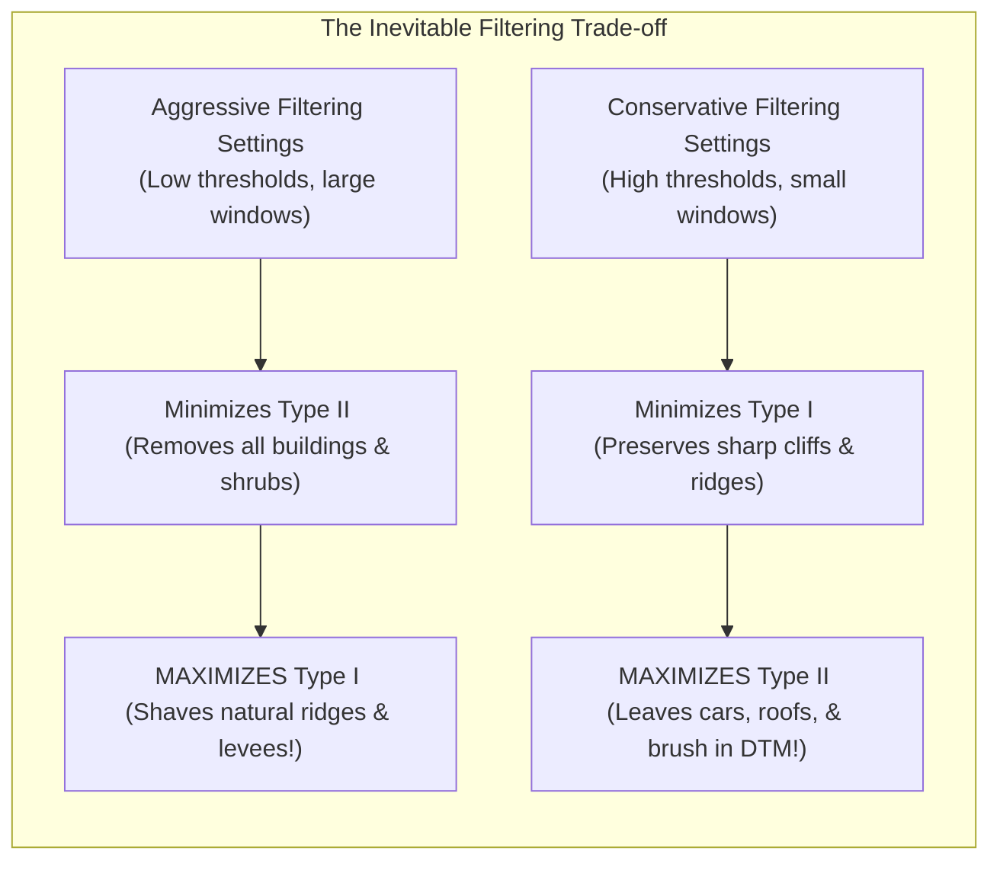
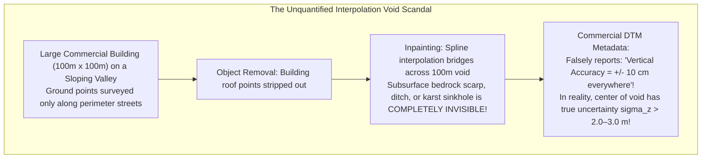

# Chapter 21: Bare-Earth Extraction (DSM to DTM), Data Gaps, Shadows, and Overhangs

*How objects are removed from a DSM to create a DTM, the hidden interpolation uncertainties under removed objects, and how to handle voids and vertical/overhanging geometry.*

---

## 21.2 Errors and Unknowns When Removing Objects (DSM $\to$ DTM)

Ground filtering is fundamentally an ill-posed inverse problem: an algorithm must decide whether an elevated surface point represents a human building, a tree branch, or a natural rocky ridge. Every ground filtering algorithm ever developed produces errors. In the seminal ISPRS benchmark by George Sithole and George Vosselman (2004), ground filtering errors were formally partitioned into **Type I (Omission)** and **Type II (Commission)** errors. 

Furthermore, once non-ground objects are removed, the ground surface beneath them is not measured; it is mathematically invented via interpolation. The failure of commercial elevation models to document the resulting uncertainty inflation represents one of the most pervasive transparency failures in modern GIS.

---

### 21.2.1 Type I vs. Type II Classification Errors

#### Type I Error (Omission Error: Rejecting True Ground)
A Type I error occurs when an algorithm misclassifies a true bare-earth point as an above-ground object, discarding it from the terrain model:

$$E_{\text{Type I}} = \frac{N_{\text{ground rejected as object}}}{N_{\text{total true ground}}} \times 100\%$$

* **Geomorphic Failure Modes:** Sharp mountain ridgelines, knife-edge aretes, coastal bluff crests, steep sand dunes, and earthen flood-control levees protrude abruptly above their surrounding neighborhood. Morphological and planar filters misinterpret the sharp break in slope as a building wall, **shaving off the tops of ridges and dunes**.
* **Impact:** In hydraulic engineering, shaving $1.0\text{ m}$ off an earthen levee crest falsely predicts overtopping failure during minor flood stages. In geotechnical modeling, truncating a cliff edge underestimates slope instability.

#### Type II Error (Commission Error: Accepting Non-Ground as Ground)
A Type II error occurs when an algorithm misclassifies an above-ground object as bare ground, retaining it in the DTM:

$$E_{\text{Type II}} = \frac{N_{\text{object accepted as ground}}}{N_{\text{total true objects}}} \times 100\%$$

* **Physical Failure Modes:**
  1. **Low Dense Shrubland and Mangroves:** In chaparral, coastal mangroves, and arctic tundra tussocks, vegetation forms an impenetrable, continuous carpet $0.5\text{–}1.5\text{ m}$ high. Laser pulses cannot penetrate to the mineral soil; all returns bounce off the dense woody stems. Algorithms assume the lower returns are ground, **baking a positive $0.5\text{–}1.5\text{ m}$ elevation bias** into the bare-earth DTM.
  2. **Massive Flat Warehouse Roofs:** Mega-distribution logistics warehouses (e.g., $300\text{ m} \times 300\text{ m}$ structures) have vast, perfectly flat horizontal roofs. If the maximum filter window size is smaller than half the building width ($w_{\max} < 150\text{ m}$), the algorithm's structuring element cannot bridge the roof. The center of the roof is identified as a flat, open plain, leaving a **flat-topped phantom mesa in the center of the DTM!**

---

### 21.2.2 The Interpolation Void Under Removed Objects

When a large building footprint ($100\text{ m} \times 100\text{ m}$) is removed from a point cloud, or beneath a dense tropical rainforest canopy where zero ground returns penetrate:
* There are **zero physical measurements** across an area of $10,000\text{ m}^2$.
* The elevation surface inside that perimeter is **pure mathematical interpolation** (spline, Delaunay triangulation, or Kriging) bridging between perimeter ground points.

#### The Spatial Uncertainty Inflation
In geostatistics, the interpolation prediction variance $\sigma^2(\mathbf{x}_0)$ at an unmeasured point $\mathbf{x}_0$ is governed by the distance $d$ to surrounding observation points:

$$\sigma^2(\mathbf{x}_0) = C(0) - \mathbf{c}^T \mathbf{C}^{-1} \mathbf{c}$$

* At the perimeter edge where ground points are dense ($d \to 0$), the uncertainty is small: $\sigma(\mathbf{x}_0) \approx \sigma_{\text{sensor}} \approx 0.10\text{ m}$.
* At the center of a $100\text{-meter}$ building footprint ($d = 50\text{ m}$ from the nearest ground return), the spatial covariance decays to zero ($C(d) \to 0$). The interpolation variance **inflates to the full sill variance of the terrain**:
  $$\sigma(\mathbf{x}_{\text{center}}) \approx \sigma_{\text{sill}} \approx 1.5\text{ to } 3.5\text{ meters}!$$
* If an unmapped natural drainage ditch, bedrock fault, or karst sinkhole passed beneath the original building footprint, the interpolated DTM will bridge smoothly across it, completely concealing the geotechnical hazard from construction excavators.

---

### 21.2.3 The Mandatory Remedy: Distance-to-Nearest-Ground-Point (DNGP) Rasters

To eliminate this transparency failure, national standards (such as USGS 3DEP LBS) mandate that digital terrain models produced from filtered point clouds must be accompanied by quality masks:

1. **Distance-to-Nearest-Ground-Point (DNGP) Layer:** A companion single-band raster recording the Euclidean distance from each cell to the nearest real, unclassified Class 2 ground laser return.
2. **Kriging Standard Error Surface:** Explicitly mapping the spatial expansion of vertical uncertainty ($\sigma_z$) across building footprints, water bodies, and dense forest voids.
3. Any engineering design or earthwork calculation conducted within cells where $\text{DNGP} > 15\text{–}20\text{ m}$ must require on-site geotechnical core drilling or supplementary terrestrial surveying before construction bids are finalized.
