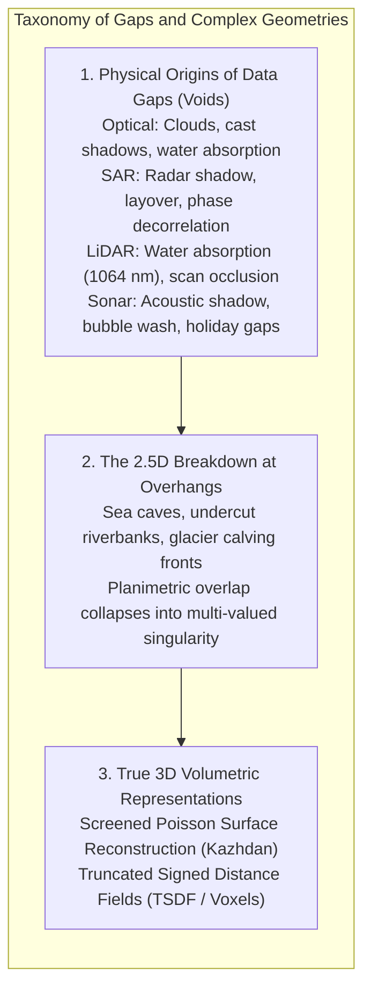
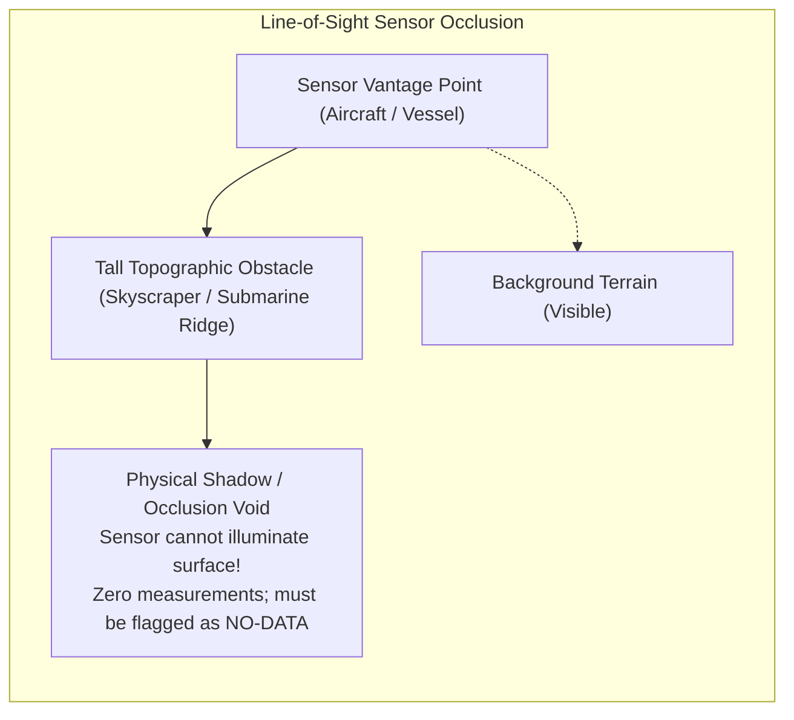
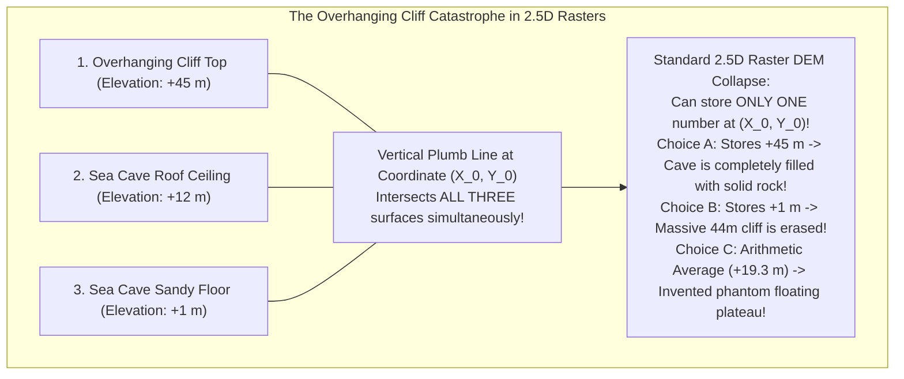
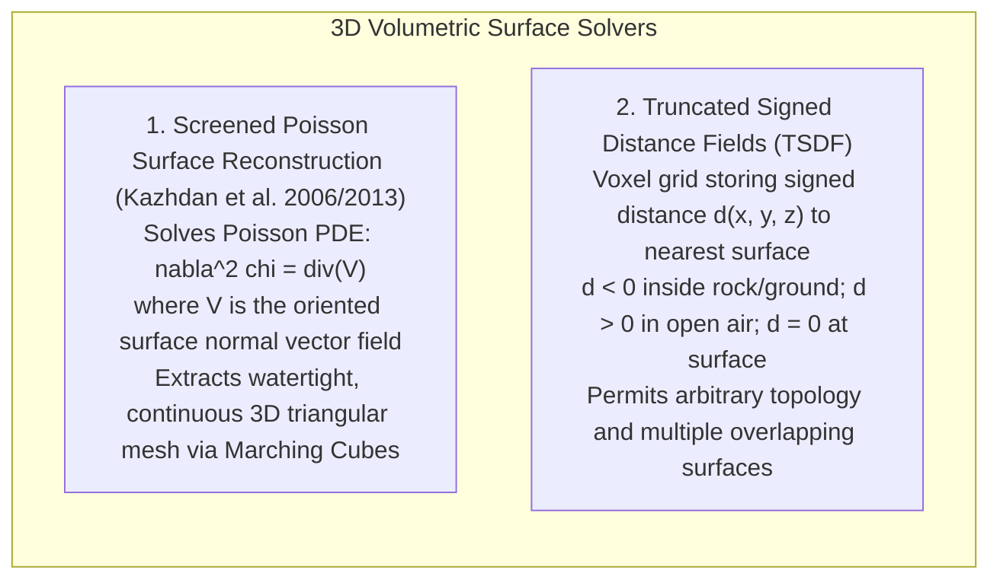

# Chapter 21: Bare-Earth Extraction (DSM to DTM), Data Gaps, Shadows, and Overhangs

*How objects are removed from a DSM to create a DTM, the hidden interpolation uncertainties under removed objects, and how to handle voids and vertical/overhanging geometry.*

---

## 21.3 Data Gaps, Shadows, Overlapping, and Overhanging Geometry

Real-world physical sensing never achieves total, omnidirectional coverage. Across all optical, microwave, laser, and acoustic modalities, physical occlusion, signal absorption, and geometric line-of-sight constraints create spatial voids (holidays). Furthermore, where the Earth's topography folds into vertical scarps, sea caves, and overhanging cliffs, the fundamental 2.5D mathematical assumption collapses, requiring true 3D surface reconstruction frameworks.

---

### 21.3.1 Physical Mechanisms Producing Data Gaps Across Modalities

A data gap (or void) occurs when a sensor fails to receive an identifiable echo or reflection from a patch of surface within its nominal field of view:

| Sensing Modality | Primary Physical Mechanisms Causing Data Voids | Environmental Conditions / Surface Types Affected |
| :--- | :--- | :--- |
| **Optical / Photogrammetry** | **Atmospheric Obscuration & Deep Cast Shadows** | Persistent cloud decks; steep north-facing mountain shadows; turbid coastal waters. |
| **Active Spaceborne SAR** | **Radar Shadow & Phase Decorrelation** | Back-slopes steeper than grazing angle; open water, wind-blown wet snow, dense rainforest canopy. |
| **Topographic Airborne LiDAR**| **Specular Water Absorption & Occlusion Shadows** | Clear water bodies (complete absorption at $1064\text{ nm}$); tar paper roofs; occlusions behind skyscrapers. |
| **Acoustic Multibeam Sonar** | **Acoustic Shadows & Bubble Attenuation** | Acoustic "shadows" cast behind tall pinnacles and wrecks; ship bow-wave bubble sweepdown; track gaps. |

---

### 21.3.2 Overlapping and Overhanging Topography

In steep geomorphic provinces—such as coastal sea cliffs, limestone karst arches, undercut riverbanks, glacial ice fronts, and urban cantilevered architecture—the Earth's surface violates the single-valued 2.5D constraint:

#### The False Choice of 2.5D Ingestion
When a mobile terrestrial laser scanner or drone photogrammetric mesh captures an overhanging cliff face and exports the result to a standard GeoTIFF:
1. **Highest-Surface Overwrite (DSM):** The raster engine stores the top cliff edge ($+45\text{ m}$). The open sea cave below is treated as solid impenetrable granite, blinding coastal engineers to the cavern undermining the highway above.
2. **Lowest-Surface Overwrite (DTM):** The raster engine stores the cave floor ($+1\text{ m}$). The massive cliff top disappears, creating a false flat plain.
3. **Point Averaging:** If points falling into the cell are averaged, the cell elevation becomes $\approx +19.3\text{ m}$—an unphysical, floating shelf hovering in mid-air!

---

### 21.3.3 True 3D Surface Reconstruction: Poisson and Signed Distance Fields

To preserve vertical cliffs, sea caves, and cantilevered structures without 2.5D collapse, computational geomorphologists deploy true **3D volumetric and boundary representation (B-Rep)** algorithms:

#### 1. Screened Poisson Surface Reconstruction (Kazhdan et al. 2006, 2013)
Implemented in open-source software like CloudCompare and PDAL (`PoissonRecon`), Poisson reconstruction treats oriented 3D point clouds $(p_i, \vec{n}_i)$ as samples of an underlying solid indicator function $\chi(\mathbf{x})$:
* $\chi(\mathbf{x}) = 1$ inside the solid earth.
* $\chi(\mathbf{x}) = 0$ in the open air/water.
* The gradient of the indicator function $\nabla \chi$ equals an inward-pointing surface normal vector field $\vec{V}$. 

The continuous surface is recovered by solving the Poisson partial differential equation:

$$\nabla^2 \chi = \nabla \cdot \vec{V}$$

Using an adaptive spatial octree, the solver computes the continuous scalar field $\chi(\mathbf{x})$ and extracts the zero-level iso-surface ($\chi = 0.5$) using the **Marching Cubes** algorithm. The resulting 3D triangular mesh wraps smoothly into sea caves, underneath river undercuts, and around vertical cliff faces, providing a watertight, manifold surface that preserves complex multi-valued topography.

#### 2. Truncated Signed Distance Fields (TSDF)
In robotic SLAM and autonomous vehicle mapping, 3D space is discretized into a 3D voxel grid. Each voxel stores:
* The scalar signed distance $d(\mathbf{x})$ to the nearest physical surface.
* A confidence weight $w(\mathbf{x})$.
* Overhanging cliffs, bridge decks, and subterranean tunnels are represented seamlessly as zero-crossings of the distance field ($d = 0$), completely liberating elevation analysis from the planimetric 2.5D coordinate trap.
