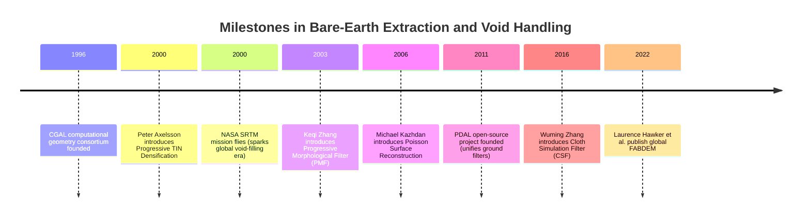
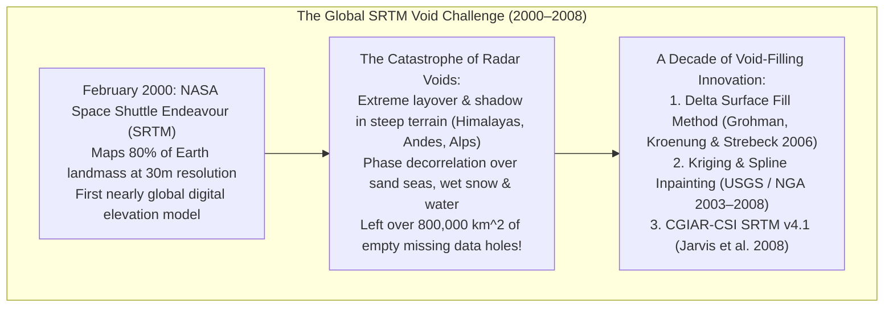

# Chapter 21: Bare-Earth Extraction (DSM to DTM), Data Gaps, Shadows, and Overhangs

*How objects are removed from a DSM to create a DTM, the hidden interpolation uncertainties under removed objects, and how to handle voids and vertical/overhanging geometry.*

---

## 21.4 Historical Evolution of Bare-Earth Extraction and Void-Filling

The scientific quest to extract the bare mineral earth and fill planetary data voids spans three decades of algorithm development: from early geometric triangulation libraries to global spaceborne radar void-filling challenges, open-source point cloud filters, and machine-learning-driven global bare-earth models.

---

### 21.4.1 Geometric Foundations and the Point Cloud Breakthrough (1996–2000)

#### 1996: CGAL (Computational Geometry Algorithms Library)
In 1996, a consortium of European academic and research institutions (INRIA, Max Planck Institute, Utrecht, Tel Aviv, ETH Zurich) founded **CGAL**. CGAL tackled the fundamental numerical problem that had paralyzed early GIS algorithms: floating-point precision round-off errors causing geometric predicates to flip sign. CGAL established exact arithmetic 2D and 3D Delaunay triangulations, alpha shapes, and mesh processing algorithms that became the foundation of modern point cloud filtering.

#### 2000: Peter Axelsson and Progressive TIN Densification (PTD)
In 2000, Swedish geodesist Peter Axelsson published *DEM Generation from Airborne Laser Scanner Data Using Triangulated Irregular Networks* in the *International Archives of Photogrammetry and Remote Sensing*. 

Axelsson solved the fundamental flaw of early morphological filters (which shaved off sharp mountain ridges) by introducing **Progressive TIN Densification (PTD)**:
* Starting with a sparse seed grid of local minimum points, PTD iteratively densified the terrain mesh by testing candidate points against local triangle facet slopes and angles.
* Axelsson licensed the algorithm to Arttu Soininen at Terrasolid, where it became the core computational engine of **TerraScan**, the dominant commercial LiDAR processing software for the next quarter-century.

---

### 21.4.2 The SRTM Global Void-Filling Challenge (2000–2006)

In February 2000, Space Shuttle *Endeavour* flew the **Shuttle Radar Topography Mission (SRTM)**, mapping the Earth's land surface between $60^\circ\text{ N}$ and $56^\circ\text{ S}$ using single-pass C-band and X-band radar interferometry.

#### The Magnitude of the Void Problem
When the raw SRTM dataset was released in 2003, it contained over **800,000 square kilometers of data voids** (empty NoData holes):
* In the Himalayas, Karakoram, and Southern Alps, steep mountain slopes tilted away from the radar beam suffered from complete radar shadow, while slopes facing the radar collapsed into unresolvable layover.
* In hyper-arid sand seas (the Rub' al Khali in Arabia) and deep lakes, microwave backscatter was completely absorbed or specularly reflected away.
* A flight simulator or hydrological model ingesting raw SRTM encountered gaping, vertical bottomless chasms right through Mount Everest!

#### The Evolution of Void-Filling Techniques
Between 2003 and 2008, NASA, the National Geospatial-Intelligence Agency (NGA), and the Consultative Group on International Agricultural Research (CGIAR-CSI) developed sophisticated void-filling pipelines:
1. **Delta Surface Fill (Grohman et al. 2006):** Ingested secondary elevation sources (coarse $1\text{-km}$ GTOPO30, national $10\text{-m}$ USGS DEMs, or digitized contour maps). The algorithm computed a low-frequency delta bias surface along the void boundary:
   $$\Delta z(x, y) = z_{\text{SRTM}}(x, y) - z_{\text{secondary}}(x, y)$$
   and smoothly adjusted the secondary dataset to match the SRTM void rim before inpainting.
2. **CGIAR-CSI SRTM Version 4.1 (Jarvis et al. 2008):** Used Kriging and continuous curvature splines with regional breaklines, creating the first seamlessly filled global $90\text{-meter}$ elevation model, which was downloaded hundreds of millions of times worldwide.

---

### 21.4.3 Open-Source Point Cloud Engines and FABDEM (2011–2022)

#### 2011: PDAL and the Unification of Ground Filters
In 2011, Howard Butler and the open-source community launched the **Point Data Abstraction Library (PDAL)**. 
* PDAL democratized ground filtering by integrating previously disparate academic algorithms into a unified, scriptable C++/JSON pipeline:
  * `filters.pmf`: Progressive Morphological Filter (Zhang et al. 2003).
  * `filters.smrf`: Simple Morphological Filter (Pingel et al. 2013).
  * `filters.csf`: Cloth Simulation Filter (Zhang et al. 2016).
* For the first time, researchers could execute complex ground-filtering pipelines on Linux supercomputers and cloud clusters without purchasing expensive proprietary desktop licenses.

#### 2022: FABDEM and Global Spaceborne Bare-Earth Extraction
In February 2022, Laurence Hawker, Peter Uhe, and colleagues at the University of Bristol published *A 30 m global map of elevation with forests and buildings removed (FABDEM)* in *Environmental Research Letters*.

FABDEM solved the century-old limitation of global spaceborne elevation models:
* Spaceborne radar missions (SRTM, TanDEM-X, Copernicus GLO-30) measure the reflective canopy top (DSM), not the ground. In the Amazon, Congo, and Southeast Asian river deltas, the "elevation" was falsely elevated by $15\text{–}30\text{ meters}$, severely distorting global sea-level rise and flood hazard predictions.
* By training gradient-boosted Random Forest models against NASA's spaceborne **GEDI** and **ICESat-2** laser altimeter photon profiles, FABDEM removed building heights and vegetative canopy biases across the entire globe, delivering the world's first open, global $30\text{-meter}$ bare-earth DTM.
