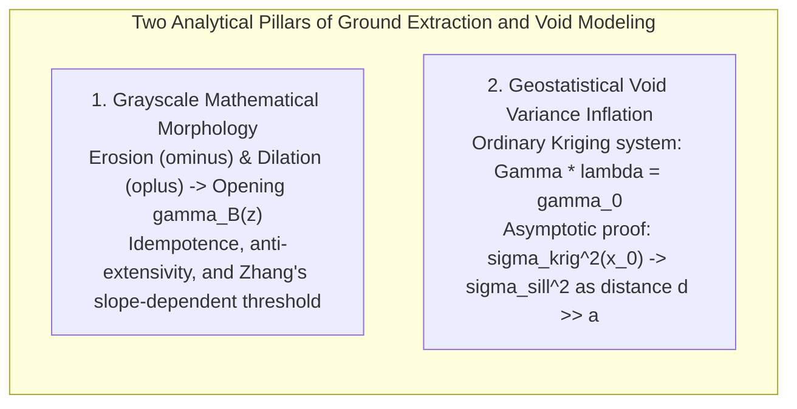
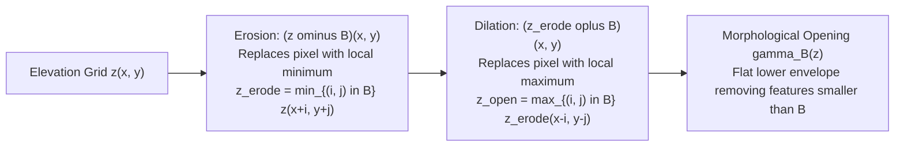
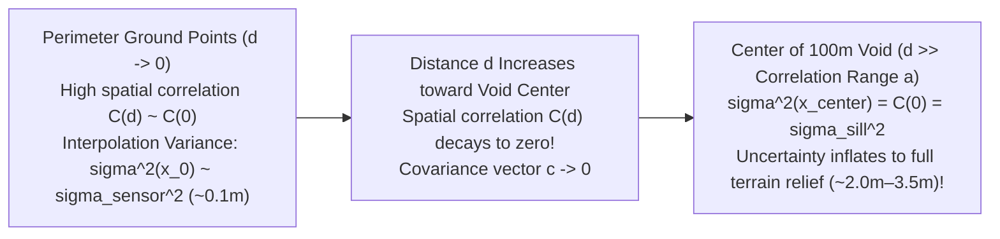

# Chapter 21: Bare-Earth Extraction (DSM to DTM), Data Gaps, Shadows, and Overhangs

*How objects are removed from a DSM to create a DTM, the hidden interpolation uncertainties under removed objects, and how to handle voids and vertical/overhanging geometry.*

---

## 21.5 Mathematical Foundations of Morphological Filtering and Spatial Void Uncertainty

Removing above-ground objects and interpolating across occluded voids requires rigorous mathematical formulations. This section derives the algebraic properties of the morphological opening operator, the progression of Zhang's slope-dependent height threshold, and the geostatistical proof of Kriging variance inflation across occluded building footprints.

---

### 21.5.1 Grayscale Mathematical Morphology on Digital Elevation Surfaces

In mathematical morphology (Serra, 1982), a digital elevation model is represented as a function $z: \mathbb{Z}^2 \to \mathbb{R}$. A structuring element $B \subset \mathbb{Z}^2$ defines a local spatial neighborhood (e.g., a flat disk or square window of width $w$).

#### 1. Grayscale Erosion ($\ominus$) and Dilation ($\oplus$)
For a flat structuring element $B$:
* **Grayscale Erosion:** Computes the local minimum within the structuring window:
  $$(z \ominus B)(x, y) = \min_{(i, j) \in B} \{ z(x + i, y + j) \}$$
* **Grayscale Dilation:** Computes the local maximum within the reflected structuring window:
  $$(z \oplus B)(x, y) = \max_{(i, j) \in B} \{ z(x - i, y - j) \}$$

#### 2. The Morphological Opening Operator ($\gamma_B$)
The morphological opening $\gamma_B(z)$ is the sequential composition of an erosion followed by a dilation:

$$\gamma_B(z) = (z \ominus B) \oplus B$$

#### Mathematical Properties of Opening
1. **Anti-Extensivity:** The opened surface is strictly bounded from above by the original surface:
   $$\gamma_B(z)(x, y) \le z(x, y) \quad \forall (x, y)$$
   Physical meaning: Opening can only remove elevated features (trees, roofs); it can never create artificial hills above the DSM.
2. **Idempotence:** Re-applying the opening operator with the same structuring element produces zero further change:
   $$\gamma_B(\gamma_B(z)) = \gamma_B(z)$$
   Physical meaning: Once an object of scale smaller than $B$ is filtered out, the filtered surface is topologically stable.
3. **Monotonicity:** If $z_1(x, y) \le z_2(x, y)$ everywhere, then:
   $$\gamma_B(z_1) \le \gamma_B(z_2)$$

---

### 21.5.2 Zhang's Progressive Morphological Filter (PMF) Formulation

In the Progressive Morphological Filter (Zhang et al., 2003), the structuring element width $w_k$ is expanded geometrically across iterations $k \in \{1, \dots, M\}$:

$$w_k = 2 b^k + 1 \quad \text{or} \quad w_k = 2 k A + 1$$

where $b$ is an expansion factor and $A$ is an initial step size.

#### The Slope-Dependent Height Threshold ($dh_{T, k}$)
If a constant height threshold were used across all iterations, large windows would shave off natural mountain peaks. Zhang formulated the dynamic threshold $dh_{T, k}$:

$$dh_{T, k} = \begin{cases} dh_0 & \text{if } w_k \le w_0 \\ s (w_k - w_{k-1}) c + dh_0 & \text{if } w_k > w_0 \\ dh_{\max} & \text{if } dh_{T, k} > dh_{\max} \end{cases}$$

where:
* $dh_0$ is the initial vertical threshold ($\approx 0.2\text{–}0.3\text{ m}$), accounting for sensor noise on flat ground.
* $s$ is the user-estimated maximum natural terrain slope ($s = \tan\alpha$, e.g., $s = 0.30$ for $30\%$ slope).
* $c$ is the grid cell resolution (meters per pixel).
* $(w_k - w_{k-1}) c$ is the horizontal distance increment between successive window sizes.
* $dh_{\max}$ is the maximum allowable building/canopy threshold ($\approx 5\text{–}20\text{ m}$).

At iteration $k$, a grid cell is classified as **Non-Ground** if its elevation difference relative to the opened surface exceeds the threshold:

$$z_{k-1}(x, y) - \gamma_{B_k}(z_0)(x, y) > dh_{T, k}$$

---

### 21.5.3 Geostatistical Kriging Variance Inflation Across Occluded Footprints

When a building footprint of diameter $D$ is removed from a point cloud, the elevation of the bare earth inside the footprint must be interpolated from perimeter ground points. We now prove mathematically why **vertical uncertainty inflates to the full regional variance of the landscape** at the center of the void.

#### Step 1: The Ordinary Kriging System
Let $\mathbf{x}_0$ be an unmeasured point inside a building or cloud void. Ordinary Kriging estimates elevation $\hat{z}(\mathbf{x}_0)$ as a linear combination of $N$ perimeter ground observations $z(\mathbf{x}_i)$:

$$\hat{z}(\mathbf{x}_0) = \sum_{i=1}^N \lambda_i z(\mathbf{x}_i) \quad \text{subject to } \sum_{i=1}^N \lambda_i = 1$$

The optimal weights $\boldsymbol{\lambda} = [\lambda_1, \dots, \lambda_N]^T$ and Lagrange multiplier $\mu$ are solved via the linear system:

$$\begin{bmatrix} \mathbf{C} & \mathbf{1} \\ \mathbf{1}^T & 0 \end{bmatrix} \begin{bmatrix} \boldsymbol{\lambda} \\ \mu \end{bmatrix} = \begin{bmatrix} \mathbf{c}_0 \\ 1 \end{bmatrix}$$

where $\mathbf{C} \in \mathbb{R}^{N \times N}$ is the covariance matrix between observation points ($C_{i, j} = C(\|\mathbf{x}_i - \mathbf{x}_j\|)$), and $\mathbf{c}_0 \in \mathbb{R}^N$ is the covariance vector between the target point $\mathbf{x}_0$ and the observations ($c_{0, i} = C(\|\mathbf{x}_0 - \mathbf{x}_i\|)$).

#### Step 2: The Kriging Estimation Variance Formula
The estimation variance $\sigma_{\text{krig}}^2(\mathbf{x}_0) = \operatorname{Var}(\hat{z}(\mathbf{x}_0) - z(\mathbf{x}_0))$ is:

$$\sigma_{\text{krig}}^2(\mathbf{x}_0) = C(0) - \sum_{i=1}^N \lambda_i C(\|\mathbf{x}_0 - \mathbf{x}_i\|) - \mu = C(0) - \mathbf{c}_0^T \boldsymbol{\lambda} - \mu$$

where $C(0) = \sigma_{\text{sill}}^2 = c_0 + c$ is the total variance (sill) of the terrain semivariogram.

#### Step 3: Asymptotic Behavior in the Center of a Void
Consider a spherical or exponential covariance model with spatial correlation range $a$:

$$C(d) = \begin{cases} c \left( 1 - \frac{3 d}{2 a} + \frac{d^3}{2 a^3} \right) & \text{for } d \le a \\ 0 & \text{for } d > a \end{cases}$$

Let the target point $\mathbf{x}_0$ be located at the geometric center of a large void of diameter $D \gg 2a$. 

The distance from $\mathbf{x}_0$ to every perimeter ground observation $\mathbf{x}_i$ satisfies:

$$d_i = \|\mathbf{x}_0 - \mathbf{x}_i\| \ge \frac{D}{2} > a \quad \forall i \in \{1, \dots, N\}$$

Because the distance exceeds the correlation range $a$, the spatial covariance between the center point and all observations is strictly zero:

$$C(\|\mathbf{x}_0 - \mathbf{x}_i\|) = 0 \implies \mathbf{c}_0 = \begin{bmatrix} 0 \\ 0 \\ \vdots \\ 0 \end{bmatrix}$$

Substituting $\mathbf{c}_0 = \mathbf{0}$ into the Kriging equations:

$$\mathbf{c}_0^T \boldsymbol{\lambda} = 0$$

The linear system simplifies to:

$$\mathbf{C} \boldsymbol{\lambda} + \mu \mathbf{1} = \mathbf{0} \implies \boldsymbol{\lambda} = -\mu \mathbf{C}^{-1} \mathbf{1}$$

Since $\mathbf{1}^T \boldsymbol{\lambda} = 1$:

$$-\mu \mathbf{1}^T \mathbf{C}^{-1} \mathbf{1} = 1 \implies \mu = -\frac{1}{\mathbf{1}^T \mathbf{C}^{-1} \mathbf{1}}$$

Notice that as the number of perimeter points $N$ increases, $\mathbf{1}^T \mathbf{C}^{-1} \mathbf{1} = \mathcal{O}(N) \to \infty \implies \mu \to 0$.

Substituting $\mathbf{c}_0^T \boldsymbol{\lambda} = 0$ and $\mu \approx 0$ into the estimation variance:

$$\lim_{D \gg 2a} \sigma_{\text{krig}}^2(\mathbf{x}_0) = C(0) = \sigma_{\text{sill}}^2$$

$$\sigma_{\text{krig}}(\mathbf{x}_0) \to \sigma_{\text{sill}} = \sqrt{\operatorname{Var}(z_{\text{terrain}})}$$

#### Physical Conclusion
This proof establishes that **at the center of a data void whose diameter exceeds the spatial correlation range of the terrain, mathematical interpolation provides zero reduction in uncertainty**. The true vertical uncertainty of the DTM at the center of the void is not the $\pm 10\text{-cm}$ sensor accuracy; it equals the **full regional standard deviation of the landscape** ($\pm 1.5\text{–}3.5\text{ meters}$).
