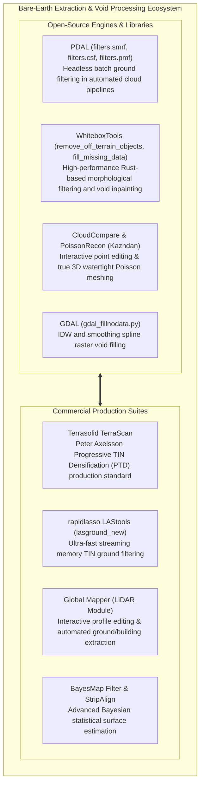

# Chapter 21: Bare-Earth Extraction (DSM to DTM), Data Gaps, Shadows, and Overhangs

*How objects are removed from a DSM to create a DTM, the hidden interpolation uncertainties under removed objects, and how to handle voids and vertical/overhanging geometry.*

---

## 21.6 Software Ecosystem for Bare-Earth Extraction, Void-Filling, and 3D Meshing

The computational ecosystem for removing above-ground objects, inpainting missing voids, and reconstructing 3D overhanging topography spans command-line point cloud filters, geospatial void-fill scripts, and commercial production pipelines.



---

### 21.6.1 Open-Source Tools and Pipelines

#### PDAL: Simple Morphological Filter (SMRF) Pipeline
PDAL's `filters.smrf` implements Thomas Pingel et al.'s (2013) improved morphological ground filter, separating vegetation and buildings from terrain in a declarative JSON pipeline:

```json
{
  "pipeline": [
    {
      "type": "readers.las",
      "filename": "unclassified_swath.laz"
    },
    {
      "type": "filters.elm",
      "threshold": 1.5
    },
    {
      "type": "filters.outlier",
      "method": "statistical",
      "mean_k": 12,
      "multiplier": 2.5
    },
    {
      "type": "filters.smrf",
      "cell": 1.0,
      "slope": 0.20,
      "window": 18.0,
      "threshold": 0.45,
      "scalar": 1.25,
      "returns": "last,only"
    },
    {
      "type": "writers.las",
      "filename": "smrf_classified.laz",
      "forward": "all"
    }
  ]
}
```

* `filters.elm` eliminates isolated low-point outliers (pits/multipath).
* `filters.outlier` strips mid-air high noise (birds, aircraft, cloud spray).
* `filters.smrf` applies progressive morphological opening, assigning classified ground points to **ASPRS Class 2**.

#### GDAL: Raster Void Inpainting with `gdal_fillnodata.py`
When raster digital elevation models contain localized voids (from cloud masks or removed buildings), GDAL fills missing cells by searching outward along valid perimeter pixels:

```bash
# Inpaint missing NoData pixels up to a maximum search distance of 50 pixels
# -md 50: Maximum distance (pixels) to search for valid values
# -si 1: Apply 1 smoothing iteration to blend seams smoothly
gdal_fillnodata.py -md 50 -si 1 \
    dem_with_voids.tif dem_inpainted.tif
```

#### 3D Watertight Meshing with `PoissonRecon`
For complex overhanging topography (sea cliffs, caves, river undercuts), Michael Kazhdan's stand-alone `PoissonRecon` binary extracts true 3D meshes from oriented point clouds:

```bash
# Reconstruct watertight 3D mesh using Screened Poisson Surface Reconstruction
PoissonRecon --in cliff_points.ply \
             --out cliff_mesh.ply \
             --depth 11 \
             --pointWeight 4.0 \
             --bType Dirichlet
```

---

### 21.6.2 Commercial and Production Suites

#### Terrasolid TerraScan
TerraScan remains the global benchmark for high-throughput airborne LiDAR processing:
* **Progressive TIN Densification (PTD):** Executes Axelsson's algorithm across thousands of flight strips in parallel.
* **Ground Macro Routines:** Chained macros first identify seed points, build the coarse TIN, densify ground points, and subsequently classify buildings and vegetation based on residual height above the ground TIN.

#### rapidlasso LAStools (`lasground_new`)
Developed by Martin Isenburg, `lasground_new` is optimized for high-speed streaming processing:
* Computes multi-scale TIN densification directly within memory-buffered tiles without holding entire multi-gigabyte point clouds in RAM.
* Includes presets for different landscape types: `-town`, `-city`, `-wilderness`, `-metropolis`, adjusting the maximum building window size dynamically.

#### Global Mapper LiDAR Module
* Provides an intuitive graphical interface for visualizing classification cross-sections.
* Allows operators to draw 3D profile boxes across problematic areas (such as dense brush or bridges), manually reclassifying points with a single keystroke.

---

### 21.6.3 Software Comparison Matrix

| Software Suite | License Model | Primary Algorithmic Core | Memory Architecture | Best-Suited Application |
| :--- | :--- | :--- | :--- | :--- |
| **PDAL** | Open-Source (BSD) | SMRF, PMF, CSF, ELM | Stream & Batch Pipeline | Headless cloud-native automated point classification. |
| **WhiteboxTools** | Open-Source (GPLv3) | Morphological filters, least-cost void inpainting | Rust multi-threaded | Rapid GIS raster DTM filtering and hydrologic conditioning. |
| **CloudCompare** | Open-Source (GPLv2) | CSF, CANUPO machine learning, PoissonRecon | Desktop GUI / In-memory | Detailed manual auditing, 3D cave/cliff meshing. |
| **GDAL** | Open-Source (MIT/X) | Inverse distance weighted inpainting | Chunked raster processing | Batch raster void filling (`gdal_fillnodata.py`). |
| **TerraScan** | Commercial (Terrasolid) | Axelsson Progressive TIN Densification (PTD) | Desktop / MicroStation | Production-scale industrial airborne LiDAR classification. |
| **LAStools** | Commercial / Core Open | Streaming TIN densification (`lasground_new`) | Streaming memory buffers | High-throughput command-line point cloud classification. |
| **Global Mapper** | Commercial (Blue Marble) | Geometric height and slope thresholds | Desktop GUI | Interactive profile QA/QC and manual reclassification. |
| **BayesMap** | Commercial (BayesMap) | Bayesian statistical surface estimation | High-performance C++ | Advanced strip alignment and multi-sensor ground extraction. |
