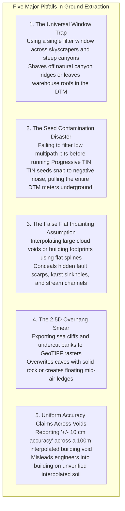

# Chapter 21: Bare-Earth Extraction (DSM to DTM), Data Gaps, Shadows, and Overhangs

*How objects are removed from a DSM to create a DTM, the hidden interpolation uncertainties under removed objects, and how to handle voids and vertical/overhanging geometry.*

---

## 21.7 Common Pitfalls and Key Takeaways

Filtering above-ground objects and inpainting spatial data gaps involves subtle algorithmic and geomorphic trade-offs. Misunderstanding these interactions leads to truncated mountain summits, false building mounds in floodplains, and unquantified multi-meter errors hidden beneath smooth interpolated surfaces.

---

### 21.7.1 Common Pitfalls in Ground Extraction and Void Handling

#### 1. The Universal Window Trap
Applying a single global filter parameter across diverse landscapes:
* If the maximum filter window is set small ($w_{\max} = 20\text{ m}$) to preserve steep gullies in mountain foothills, the algorithm cannot bridge large commercial buildings ($100\text{–}300\text{ m}$ wide). The centers of flat warehouse roofs remain in the bare-earth DTM as artificial mesas.
* If the window is enlarged ($w_{\max} = 150\text{ m}$) to eliminate warehouses, the filter misinterprets steep $40^\circ$ mountain ridges and sand dunes as buildings, shaving meters off the peaks.
* **Remedy:** Segment projects into land-cover zones (urban, forest, alpine) and apply adaptive, terrain-specific filtering parameters.

#### 2. The Seed Contamination Disaster in Progressive TINs
In Progressive TIN Densification (Axelsson / TerraScan), the algorithm seeds its initial ground surface from the lowest points in large spatial grid blocks:
* If the point cloud contains unclassified low-point noise (multipath reflections, acoustic second-sweeps, or sensor timing pits), the lowest point is not the ground—it is a false pit $5\text{–}20\text{ m}$ below the surface.
* The initial TIN snaps down to this corrupted seed point. The algorithm's search criteria now treat the real bare ground as an elevated "building," completely rejecting the true ground surface across hectares of terrain!
* **Remedy:** Always execute an **Extended Local Minimum (ELM)** or low-noise filter prior to running seed extraction.

#### 3. The Uniform Accuracy Delusion Across Inpainted Voids
Delivering a bare-earth DTM with a metadata accuracy statement claiming "$\text{RMSE}_z \le 10\text{ cm}$" across the entire file:
* Across open, flat agricultural fields, the accuracy may indeed be $\pm 8\text{ cm}$.
* But beneath a 2-hectare commercial mall or a dense cloud void that was inpainted via spline interpolation, **zero sensor measurements exist**.
* At the center of the void, the true vertical uncertainty has inflated to the regional geomorphic standard deviation ($\sigma_z \approx 1.5\text{–}3.5\text{ m}$).
* Claiming $\pm 10\text{-cm}$ accuracy inside unmeasured building footprints is a major professional liability failure.
* **Remedy:** Deliver an accompanying **Distance-to-Nearest-Ground-Point (DNGP)** or Kriging error surface.

#### 4. The 2.5D Overhanging Cliff Collapse
Exporting terrestrial laser scans or drone meshes of sea cliffs, caves, and undercut riverbanks directly to 2.5D GeoTIFF rasters:
* A 2.5D grid cannot store multi-valued geometry.
* The raster engine either clips the top cliff (leaving a flat beach) or fills the sea cave with solid rock, blinding coastal engineers to catastrophic bluff undermining.
* **Remedy:** Model complex vertical and overhanging terrain using true **3D Screened Poisson meshes (`PoissonRecon`)** or Truncated Signed Distance Fields (TSDF).

#### 5. Shaving Earthen Levees During Automated Extraction
Allowing automated algorithms to classify long, narrow linear earthen levees without human supervision:
* Levees protrude above the surrounding flat floodplain, mimicking low building walls or roadway ramps.
* Morphological filters frequently classify the levee crest as vegetation or human structure, shaving $1\text{–}3\text{ m}$ off the levee height in the bare-earth DTM.
* **Remedy:** Enforce 2D vector protective buffers around all flood-control levees, prohibiting ground filtering within the levee zone.

---

### 21.7.2 Key Takeaways for Practitioners

1. **Ground Filtering Is an Inevitable Trade-Off:** You cannot simultaneously minimize Type I (ridge clipping) and Type II (vegetation commission) errors with a single filter setting. Aggressive filters produce clean city models but destroy mountain ridges; conservative filters preserve topography but leave low brush in the DTM.
2. **Never Trust a Void Without an Uncertainty Layer:** Whenever an object is removed or a cloud void is inpainted, true measurement ceases and mathematical assumption begins. Always deliver a Distance-to-Nearest-Ground-Point (DNGP) layer alongside the DTM.
3. **Pre-Clean Low Noise Before Seeding:** Algorithms that seed from local minimums will fail catastrophically if low-point noise is present. Clean low points before running ground filters.
4. **Use 3D Meshes for Overhangs:** When mapping sea caves, natural rock arches, or undercut riverbanks, abandon 2.5D rasters in favor of true 3D watertight Poisson meshes.
5. **Protect Critical Flood Defense Structures:** Earthen levees and dams must be protected with vector inclusion masks to prevent automated filtering from shaving off flood defenses.
