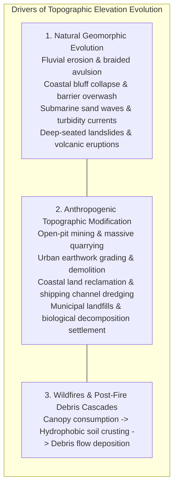
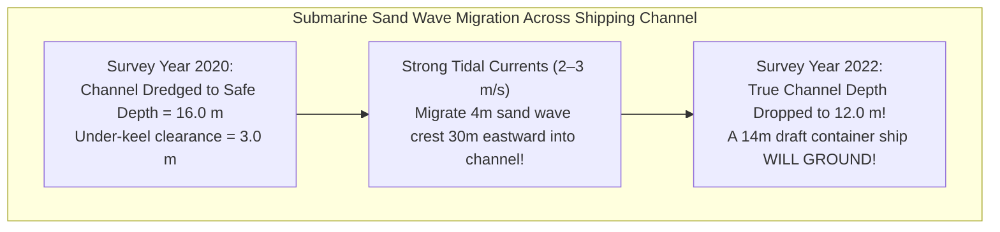
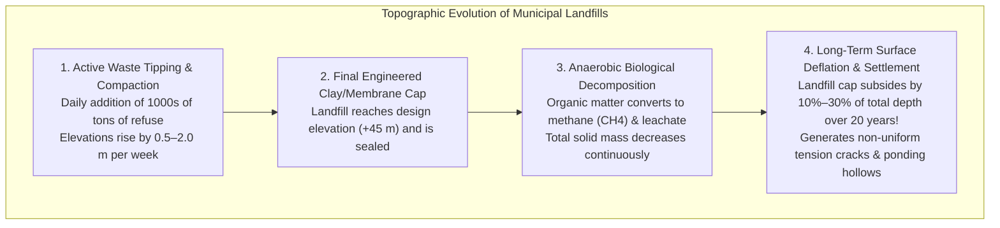
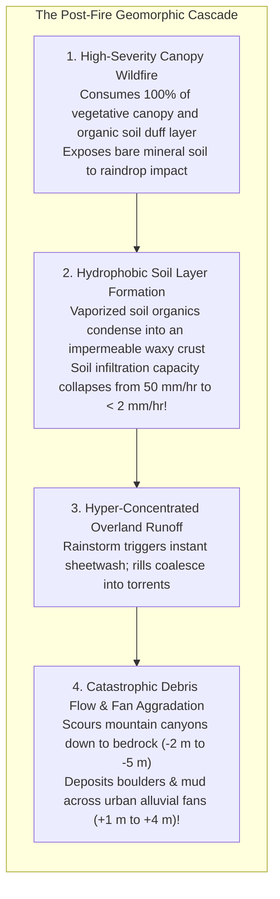

# Chapter 22: The Dynamic Earth: Temporal Changes, Moving Objects, AIS/ADS-B, Seasonality, and Change Detection

*The Earth's surface and the objects upon it are in constant motion across timescales from milliseconds to millennia.*

The fundamental conceit of traditional cartography is that the Earth's surface is static. In geographic information systems, digital elevation models are stored as static rasters, implicitly assuming that topography remains frozen in time. In reality, the planet's surface is a dynamic, living interface in continuous motion: coastal bluffs crumble into the sea, submarine sand waves migrate across shipping channels, open-pit mines excavate gigatons of bedrock, landfills settle as organic waste decays, wildfires consume forests, and catastrophic debris flows remap alluvial fans in minutes.

Elevation modeling must transition from static 2D rasters to **4D spatiotemporal elevation analysis** ($X, Y, Z, t$), tracking both continuous natural geomorphic evolution and rapid anthropogenic transformations.

---

## 22.1 Geomorphic and Anthropogenic Surface Evolution: Erosion and Deposition

Topographic change occurs through a spectrum of physical processes spanning sudden catastrophic mass movements and slow, relentless sediment transport:

---

### 22.1.1 Natural Geomorphic Evolution Across Landscapes and Seascapes

#### 1. Fluvial Dynamics and Channel Avulsion
Rivers are self-organizing dynamic conveyor belts of sediment:
* During seasonal floods, high shear stress erodes riverbanks, causing massive bank failure, meander neck cutoffs, and sudden **channel avulsion** (where a river abandons its old channel and carves a new path across the floodplain).
* Gravel bars and pool-riffle sequences migrate downstream at rates of meters to tens of meters per year. An engineering DEM captured in 2018 may show a dry gravel bar where a $3\text{-meter}$ deep scour pool exists today.

#### 2. Coastal Erosion and Barrier Island Breaches
Coastal margins represent the most rapidly evolving terrestrial environments:
* Severe winter storms and hurricanes generate storm surges that erode coastal foredunes, cut new tidal inlets across barrier islands, and trigger catastrophic bluff slumping.
* In unconsolidated glacial till (such as the Holderness Coast in England or coastal cliffs in California), coastal bluffs retreat landward by **$1\text{–}3\text{ meters per year}$**, turning cliffside homes into mid-air voids within decades.

#### 3. Submarine Bathymetric Dynamics: Migrating Sand Waves and Turbidity Currents
Underwater topography is far from static:
* **Migrating Submarine Sand Waves:** In high-energy tidal straits (such as the English Channel, the North Sea, and San Francisco Bay), strong bottom currents shape sand into massive submarine dunes and sand waves ($2\text{–}10\text{ m}$ high, wavelengths of $50\text{–}200\text{ m}$). These sand waves migrate horizontally by **$10\text{–}50\text{ meters per year}$**, shoaling navigation channels by $2\text{–}5\text{ m}$ in months and exposing buried submarine power cables to anchor snagging.
* **Turbidity Currents:** Catastrophic underwater sediment avalanches race down submarine canyons at speeds exceeding $50\text{–}70\text{ km/h}$. The historic **1929 Grand Banks earthquake** triggered a massive turbidity current that scoured the continental slope, snapping 12 transatlantic telegraph cables sequentially over 13 hours and transporting hundreds of cubic kilometers of sediment into the abyssal plain.

---

### 22.1.2 Anthropogenic Surface Modification: Mines, Cities, and Landfills

Human activities move more earth annually than all natural rivers combined:
* **Open-Pit Mining and Quarrying:** Massive open-pit copper and coal mines (such as Bingham Canyon in Utah) excavate vertical relief exceeding $1200\text{ m}$ across billions of cubic meters, creating dynamic artificial amphitheaters that must be surveyed weekly via UAV photogrammetry to detect wall slumping.
* **Urban Grading and Coastal Land Reclamation:** Cities like Singapore, Dubai, and Shenzhen have pushed coastlines kilometers into the sea, depositing millions of tons of dredged marine sand to convert ocean into dry land.

#### The Unique Physics of Landfills, Dumps, and Trash Piles
Municipal solid waste (MSW) landfills and unregulated trash heaps represent a unique, highly non-linear topographic horizon:

1. **Active Rapid Aggradation:** During operation, daily tipping and bulldozer compaction raise local elevations by meters per month.
2. **Post-Closure Deflation (Biological Settlement):** Once a landfill is capped, anaerobic microbes digest organic waste, venting methane and carbon dioxide while leachate drains away. Over $20\text{–}30\text{ years}$, the total solid volume diminishes, causing the surface to **subside by $10\%\text{–}30\%$ of the landfill's total thickness** ($3\text{–}15\text{ meters}$ of vertical deflation).
3. **Differential Subsidence Hazards:** Because organic decomposition is heterogeneous, differential settlement creates structural depressions that tear impermeable cap membranes, pond stormwater, and destabilize surface redevelopment (e.g., solar arrays or parks built on closed landfills).

---

### 22.1.3 Wildfires and Post-Fire Debris Cascades

Wildfires radically alter the physical and hydraulic behavior of digital elevation surfaces:

1. **Canopy and Duff Consumption:** In high-severity fires, dense forest canopies ($20\text{–}40\text{ m}$ tall) and ground leaf litter are vaporized within hours, instantly transforming a vegetative DSM into a charred bare-earth surface.
2. **Hydrophobic Waxy Soil Crusts:** Intense heat vaporizes organic compounds in the soil, which travel downward and condense onto cooler subsurface mineral particles $2\text{–}5\text{ cm}$ below ground. This forms a continuous, water-repellent (hydrophobic) waxy crust. 
3. **Debris Flow Scouring and Deposition:** In the first intense rainstorm following a fire, stormwater cannot infiltrate the soil. Runoff gathers into hyper-concentrated slurries of mud, ash, and boulders, scouring upper mountain canyons down to bedrock (eroding $2\text{–}5\text{ m}$ of channel depth) and burying downstream subdivisions under $1\text{–}4\text{ meters}$ of bouldery debris-flow fans within minutes. Multi-temporal LiDAR differencing provides the volumetric ground truth required to calibrate post-fire hazard models.
