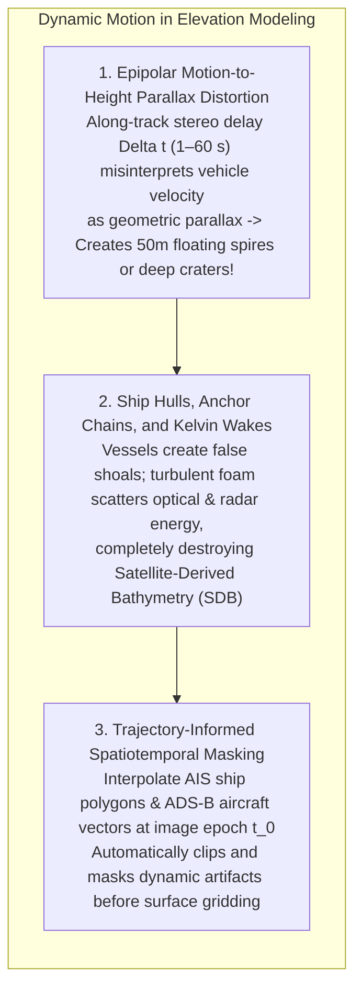
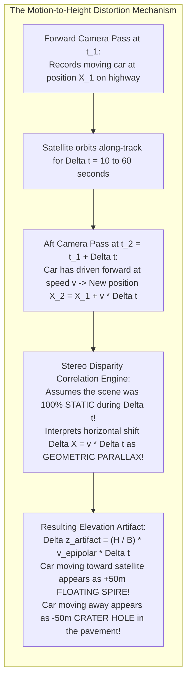
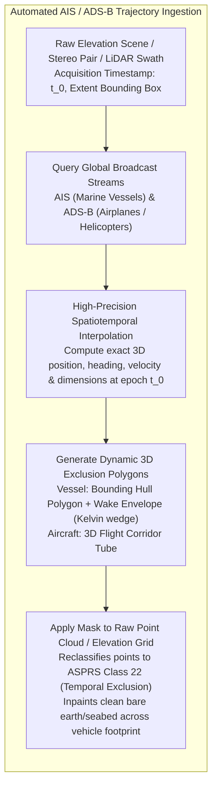

# Chapter 22: The Dynamic Earth: Temporal Changes, Moving Objects, AIS/ADS-B, Seasonality, and Change Detection

*The Earth's surface and the objects upon it are in constant motion across timescales from milliseconds to millennia.*

---

## 22.2 Dealing with Moving Objects and Timescale Impacts

Elevation mapping systems assume that the scene is stationary while the sensor moves. In reality, modern remote sensing captures a world teeming with dynamic traffic: passenger cars cruising on highways, freight trains traversing plains, container ships navigating harbors, turbulent ship wakes churning coastal waters, and commercial aircraft flying through the sky. 

When a moving object is interrogated by a multi-temporal or multi-view sensor, physical motion couples directly into the photogrammetric or LiDAR matching equations, generating massive, unphysical elevation artifacts. Removing these dynamic transient artifacts requires integrating external real-time tracking networks—specifically marine **Automatic Identification System (AIS)** and aviation **Automatic Dependent Surveillance–Broadcast (ADS-B)** telemetry.

---

### 22.2.1 Epipolar Motion-to-Height Parallax Distortion

The most spectacular elevation artifact in spaceborne optical stereo mapping (e.g., DigitalGlobe/Maxar WorldView-2/3, Airbus Pléiades) is the **motion-induced elevation spike or crater**.

#### The Mathematical Derivation of Motion Elevation Error
In along-track pushbroom stereo, the forward and backward cameras are separated by base-to-height ratio $B / H$ (typically $0.5\text{–}0.9$). The time delay between the two viewing passes is $\Delta t$ (typically $5\text{–}60\text{ seconds}$).

Let a vehicle travel along a straight highway with velocity component $v_{\text{epipolar}}$ parallel to the satellite's epipolar baseline. During the stereo time delay $\Delta t$, the vehicle physically moves a horizontal distance:

$$\Delta x_{\text{motion}} = v_{\text{epipolar}} \, \Delta t$$

The automated stereo disparity matcher compares the forward and aft image patches. Assuming the scene is rigid and static, it interprets the horizontal displacement $\Delta x_{\text{motion}}$ as stereoscopic parallax $p$:

$$p = \frac{B}{H} \Delta z$$

Equating disparity to physical motion displacement:

$$\frac{B}{H} \Delta z_{\text{artifact}} = v_{\text{epipolar}} \, \Delta t$$

Solving directly for the apparent vertical elevation error $\Delta z_{\text{artifact}}$:

$$\Delta z_{\text{artifact}} = \frac{H}{B} \, v_{\text{epipolar}} \, \Delta t$$

#### Concrete Numerical Example
Consider a highway vehicle traveling at a modest highway speed of $90\text{ km/h}$ ($v = 25\text{ m/s}$):
* Satellite stereo baseline ratio: $B / H = 0.6 \implies \frac{H}{B} \approx 1.67$.
* Camera along-track stereo time delay: $\Delta t = 15\text{ seconds}$.
* The vehicle travels a physical distance of $\Delta x = 25\text{ m/s} \times 15\text{ s} = 375\text{ meters}$ along the road.
* The resulting vertical elevation artifact is:
  $$\Delta z_{\text{artifact}} = 1.67 \times 375\text{ m} = \mathbf{+626\text{ meters}!}$$
* If the vehicle travels toward the satellite's line of sight, the vehicle is rendered as a **gigantic, $626\text{-meter}$ tall needle-like spire** hovering in the sky. If the vehicle travels in the opposite direction, it produces a **$626\text{-meter}$ deep subterranean crater** punched right through the highway roadbed!

---

### 22.2.2 Ships, Turbulent Wakes, and Anchor Chains in Hydrography

In coastal waters, harbors, and shipping lanes, dynamic maritime traffic corrupts bathymetric and topographic elevation models:
1. **False Navigation Shoals (Ships and Barges):** A moving bulk carrier ($200\text{ m}$ length, $30\text{ m}$ beam) captured during a bathymetric LiDAR or multibeam survey reflects optical and acoustic signals at the water surface, creating a massive, artificial shallow bank that mimics a dangerous navigation reef.
2. **Kelvin Wakes and Aerated Foam Plumes:** High-speed vessels generate V-shaped **Kelvin wake patterns** and dense trails of aerated, turbulent bubble plumes:
   * In Satellite-Derived Bathymetry (SDB), white foam dramatically alters water-leaving surface reflectance, causing radiative transfer inversions to misinterpret surface foam as shallow sandbars.
   * In spaceborne InSAR and airborne LiDAR, moving wave facets decorrelate radar phase and absorb laser photons, creating wide data voids along commercial shipping corridors.

---

### 22.2.3 Automated Artifact Removal Using AIS and ADS-B Trajectories

Rather than relying on tedious manual point-by-point cleaning, modern elevation pipelines ingest real-time radio tracking streams to autonomously identify and mask moving objects:

#### 1. Automatic Identification System (AIS) Ingestion
Under International Maritime Organization (IMO) SOLAS mandates (formalized in 2002), all commercial vessels over 300 gross tonnage and all passenger ships must broadcast real-time VHF AIS transponder messages (ITU-R M.1371):
* Every $2\text{–}10\text{ seconds}$, vessels transmit dynamic telemetry: MMSI identity, latitude, longitude, speed over ground (SOG), course over ground (COG), true heading, length, beam, and draft.
* Open-source libraries (e.g., Kurt Schwehr's **`libais`** and **MovingPandas**) interpolate ship trajectories to the exact microsecond of the remote sensing acquisition.
* A dynamic 2D polygon—scaled to the ship's physical length and beam, and extended astern along its heading vector to encompass the turbulent wake—is generated to mask out ship returns and aerated foam before computing Satellite-Derived Bathymetry or multibeam grids.

#### 2. ADS-B and ATCRBS Aviation Trajectories
Similarly, commercial aircraft broadcast **ADS-B** (Automatic Dependent Surveillance–Broadcast) messages over $1090\text{ MHz}$, transmitting GNSS position, pressure altitude, and velocity. 
* By matching flight trajectories against spaceborne laser profiles (such as ICESat-2 or GEDI), automated pipelines identify laser pulses intercepted by high-altitude airliners in mid-flight, reclassifying mid-air points into **ASPRS Class 22 (Temporal Exclusion)** rather than leaving mysterious floating spires in global elevation products.
