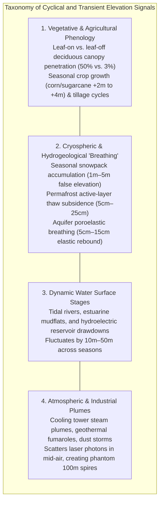
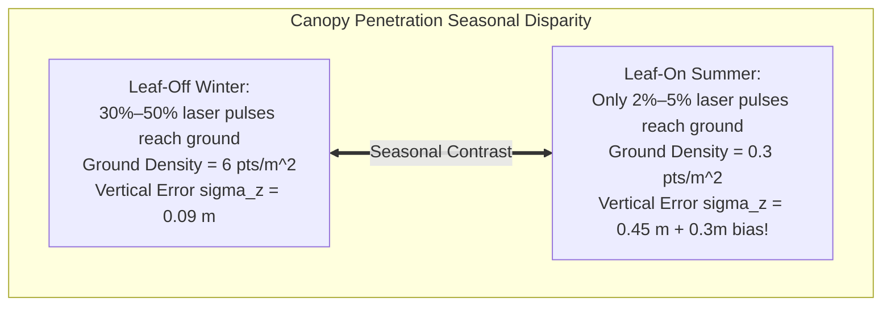
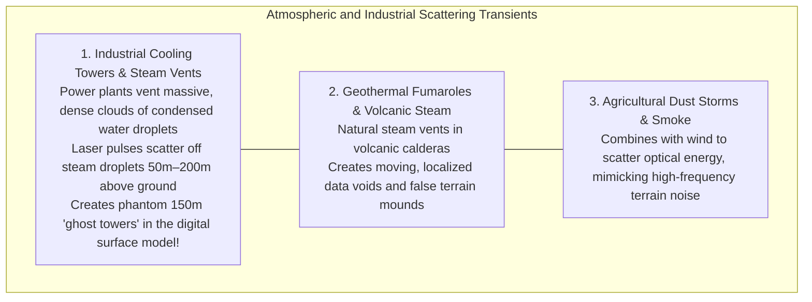

# Chapter 22: The Dynamic Earth: Temporal Changes, Moving Objects, AIS/ADS-B, Seasonality, and Change Detection

*The Earth's surface and the objects upon it are in constant motion across timescales from milliseconds to millennia.*

---

## 22.3 Seasonal, Vegetative, Agricultural, Hydrological, and Atmospheric Transients

Elevation models are frequently treated as secular geological baselines. In reality, the solid Earth undergoes continuous, cyclic "breathing" and transient surface modifications driven by seasonal weather, vegetative phenology, agricultural practices, hydrogeology, and atmospheric phenomena. 

When multi-temporal digital elevation models are differenced to detect tectonic fault slip, landslide movement, or coastal erosion, unmodeled seasonal and atmospheric transients generate massive, false change-detection signals that completely dwarf the underlying geological displacement.

---

### 22.3.1 Vegetative and Agricultural Phenology

#### Leaf-On vs. Leaf-Off Deciduous Canopy Penetration
In temperate and boreal forests, the deciduous tree canopy undergoes radical seasonal transformations:
* **Leaf-Off (Late Winter / Early Spring):** Bare branches allow **$30\%\text{–}50\%$ of transmitted LiDAR pulses** to reach the forest floor. Ground point density is high ($\rho_{\text{ground}} \ge 4\text{–}8\text{ pts/m}^2$), producing high-fidelity DTMs with vertical uncertainty $\sigma_z \approx 0.08\text{–}0.12\text{ m}$.
* **Leaf-On (Mid-Summer):** Dense foliage forms an opaque, multi-layered optical blanket. Ground penetration collapses to **$<2\%\text{–}5\%$ of pulses** ($\rho_{\text{ground}} < 0.2\text{ pts/m}^2$). 
* **The Failure:** If a bare-earth DTM is generated from leaf-on data, automated ground filters mistake low understory brush for ground, embedding an artificial **$+0.3\text{–}1.0\text{ m}$ positive elevation bias**. Differencing a leaf-on DTM from a leaf-off DTM produces a false signal of "regional tectonic uplift" across the entire forest!

#### Agricultural Tillage and Crop Cycles
Agricultural croplands represent an extreme cyclical elevation signal:
* In spring, plowed bare agricultural soil sits at baseline elevation ($Z_0$).
* By late summer, mature corn, sorghum, or sugarcane crops grow to heights of **$2.5\text{–}4.5\text{ meters}$**.
* Optical stereo matching and satellite InSAR (C-band and X-band) reflect off the top of the crop canopy, recording a $3\text{-meter}$ rise in elevation.
* Following autumn harvesting and winter plowing, the surface abruptly drops back to $Z_0$. Multi-temporal elevation models that fail to mask active croplands will misinterpret agricultural harvesting as catastrophic regional ground subsidence.

---

### 22.3.2 Cryospheric and Hydrogeological "Breathing"

#### 1. Seasonal Snowpack Accumulation
In alpine and high-latitude watersheds, winter snowfall accumulates into seasonal snowpacks **$1.0\text{–}6.0\text{ meters}$ thick**:
* To an airborne LiDAR scanner, optical stereo satellite, or high-frequency InSAR beam, the dry snow surface is a solid reflective horizon.
* Unless elevation models are acquired during strict snow-free summer windows (late August to September in the Northern Hemisphere), the DEM records the top of the snowpack rather than the solid earth. 

#### 2. Permafrost Active-Layer Freeze-Thaw Subsidence
In arctic tundra and sub-arctic regions underlain by permafrost, the uppermost soil horizon—the **active layer** ($0.5\text{–}2.0\text{ m}$ thick)—undergoes annual phase changes:
* In summer, ground ice thaws into liquid water, draining away and causing the ground surface to **subside by $5\text{–}25\text{ cm}$**.
* In winter, pore water refreezes and expands, ratcheting the tundra surface back upward through **frost heave**.
* Differential active-layer settlement creates dynamic **thermokarst terrain**: collapsing thaw lakes, retrogressive thaw slumps, and polygonal ground that cannot be described by a single static elevation value.

#### 3. Aquifer Poroelastic Breathing
In alluvial valleys dependent on groundwater extraction (e.g., California's Central Valley, the Po Plain in Italy, or Jakarta):
* During summer agricultural irrigation, deep groundwater pumping depressurizes confined clay aquitards, causing the skeleton of the aquifer to consolidate vertically.
* In wet winter months, natural recharge re-pressurizes the pore space, causing the ground surface to **elastically rebound upward by $5\text{–}15\text{ cm}$**:

$$\Delta z(t) = \int_0^H S_s \, \Delta h(z, t) \, dz$$

where $S_s$ is the specific storage of the aquifer and $\Delta h$ is hydraulic head change. InSAR time series (e.g., Sentinel-1) track this vertical seasonal breathing with millimeter precision.

---

### 22.3.3 Atmospheric and Industrial Transients

Airborne laser scanners and photogrammetric cameras record all optical scattering interfaces, including transient atmospheric plumes:

#### Industrial Cooling Tower Plumes
Dense, turbulent water vapor plumes discharged by nuclear and coal-fired power plant cooling towers or industrial paper mills:
* Condensed water droplets have high optical backscatter at $1064\text{ nm}$ and $905\text{ nm}$.
* An aircraft flying over an active power plant records hundreds of thousands of returns from the moving steam cloud, projecting a **phantom $100\text{–}200\text{-meter}$ tall mushroom-shaped spire** into the DSM.
* Because the steam plume drifts and dissipates with wind, adjacent flight strips flown 20 minutes apart record completely different steam shapes, creating violent seam tears during automated strip adjustment.
* **Remedy:** Industrial cooling facilities and geothermal steam fields must be manually delineated and masked using thermal infrared imagery or facility boundary polygons before computing surface models.
