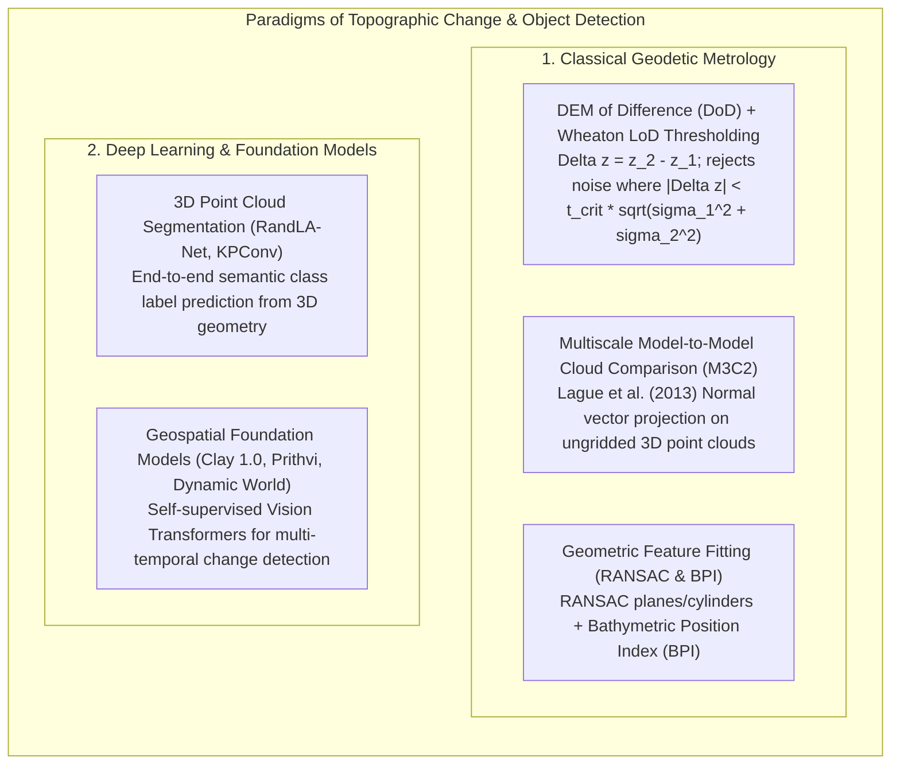
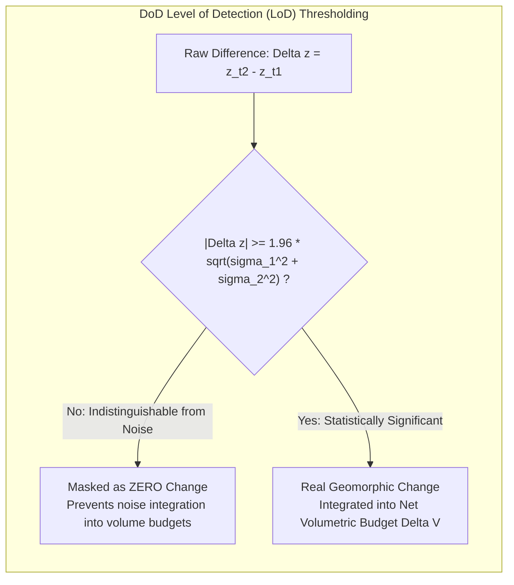
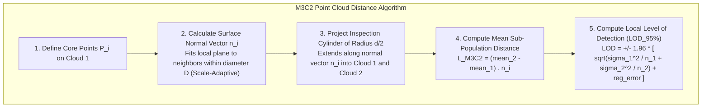
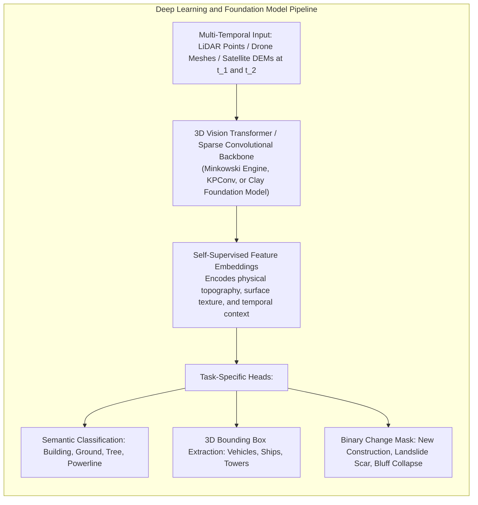

# Chapter 22: The Dynamic Earth: Temporal Changes, Moving Objects, AIS/ADS-B, Seasonality, and Change Detection

*The Earth's surface and the objects upon it are in constant motion across timescales from milliseconds to millennia.*

---

## 22.4 Change Detection and Object Detection: Traditional vs. Machine Learning Methods

Quantifying topographic change over time—such as measuring coastal sediment loss after a hurricane, tracking rockfall volumes in an active quarry, or detecting newly constructed buildings—requires separating true physical surface displacement from random measurement noise. 

The analytical methodology divides into two competing yet complementary approaches: **Classical Geodetic Metrology** (which relies on spatial error propagation and surface-normal projections) and **Machine Learning & Foundation Models** (which leverage learned visual and geometric patterns).

---

### 22.4.1 Classical Geodetic Change Detection: DoD and M3C2

#### 1. DEM of Difference (DoD) and Level of Detection ($\text{LoD}_{\min}$)
The most common raster change-detection technique is the **DEM of Difference (DoD)**, subtracting an earlier surface $z_{t_1}$ from a later surface $z_{t_2}$:

$$\Delta z(x, y) = z_{t_2}(x, y) - z_{t_1}(x, y)$$

However, naive raster subtraction is a dangerous trap: if both DEMs have an uncertainty of $\sigma_z \approx 0.15\text{ m}$, any cell showing an apparent change of $\Delta z = 0.12\text{ m}$ is statistically indistinguishable from zero!

To eliminate false change signals, Joe Wheaton et al. (2010) formalized **Level of Detection ($\text{LoD}_{\min}$)** thresholding:

$$\text{LoD}_{\min} = t_{\text{crit}} \sqrt{\sigma_{z, t_1}^2 + \sigma_{z, t_2}^2}$$

where $t_{\text{crit}}$ is the critical value from the Student's $t$-distribution for a chosen confidence level ($t_{\text{crit}} = 1.96$ for $95\%$ confidence under large sample sizes).
* Any grid cell where $|\Delta z| < \text{LoD}_{\min}$ is classified as **statistically insignificant noise** and set to zero.
* Total volumetric erosion ($V_{\text{erosion}}$) and deposition ($V_{\text{deposition}}$) are integrated exclusively over cells where true physical change exceeds the threshold at the $95\%$ confidence level.

#### 2. Multiscale Model-to-Model Cloud Comparison (M3C2)
While raster DoDs work well on horizontal floodplains, they fail catastrophically on vertical terrain:
* On a vertical sea cliff or canyon scarp, a small horizontal rockfall displacement ($\Delta x = 1.0\text{ m}$) translates into infinite vertical difference in a 2.5D raster.
* Dimitri Lague et al. (2013) developed **M3C2**, which operates directly on raw, ungridded 3D point clouds:

M3C2 computes true 3D distances along physical surface normal vectors, providing an explicit, spatially varying level of detection ($\text{LOD}_{95\%}$) that accounts for local surface roughness and point density.

---

### 22.4.2 Geometric Feature Extraction: RANSAC and Topographic Indices

Before deep learning, automated object extraction relied on rigorous geometric algorithms:
* **RANSAC (RANdom SAmple Consensus - Fischler & Bolles 1981):** Randomly samples minimal point subsets to fit mathematical primitives (planes, cylinders, spheres). In urban LiDAR, RANSAC detects flat and gabled roof planes, isolating building walls and filtering out surrounding trees. In industrial piping and forestry, RANSAC fits cylinders to extract pipeline centerlines and tree trunks.
* **Topographic & Bathymetric Position Index (TPI / BPI):** Measures the relative elevation of a cell compared to the mean elevation of an annular ring surrounding it:
  $$\text{TPI} = z_0 - \bar{z}_{\text{annulus}}$$
  Positive values denote ridges, hilltops, and submarine pinnacles; negative values denote valleys, gullies, and submarine canyons.

---

### 22.4.3 Deep Learning and Geospatial Foundation Models

Over the past five years, semantic object detection and change detection have been revolutionized by deep neural networks:

#### 1. 3D Sparse Convolutional Networks (Minkowski Engine, KPConv)
Operating directly on irregular 3D point coordinates, sparse convolutional networks process massive multi-kilometer LiDAR point clouds without rasterization. They classify complex urban scenes (buildings, wires, trees, roads) with overall accuracies exceeding $95\%$, isolating dynamic changes (e.g., a newly erected tower or demolished home) automatically.

#### 2. Geospatial Foundation Models (Clay 1.0, Prithvi, Dynamic World)
Trained on petabytes of multi-sensor Earth observation data (Sentinel-2, Landsat, SAR, and DEMs) using self-supervised masked autoencoding:
* Models like **Clay 1.0** and **Prithvi** generate generalized spatial representations that capture seasonal vegetation trends.
* When fine-tuned for elevation change detection, foundation models decouple natural seasonal green-up and snowmelt from real geomorphic landslides and urban construction, eliminating the false alarms that plague naive pixel-differencing algorithms.
