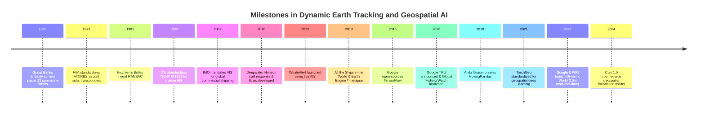
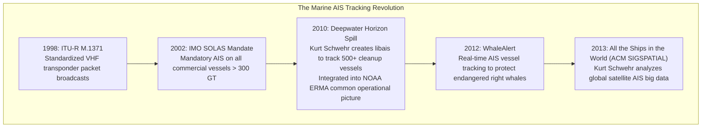
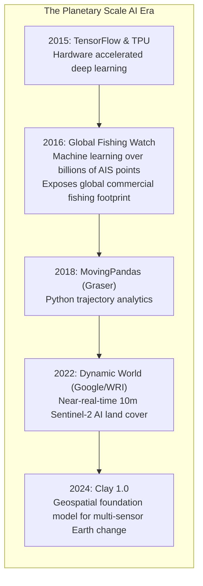

# Chapter 22: The Dynamic Earth: Temporal Changes, Moving Objects, AIS/ADS-B, Seasonality, and Change Detection

*The Earth's surface and the objects upon it are in constant motion across timescales from milliseconds to millennia.*

---

## 22.5 Historical Evolution of Dynamic Tracking, Marine Telemetry, and Spatiotemporal AI

The conceptual transition from viewing the Earth as a static map to analyzing it as a continuously evolving 4D system spanned nearly a century: from discovering submarine sediment avalanches via severed telegraph cables to global satellite ship tracking and planetary AI foundation models.

---

### 22.5.1 Submarine Dynamism and Aviation Transponders (1929–1981)

#### 1929: The Grand Banks Turbidity Current
On November 18, 1929, a magnitude 7.2 earthquake struck the Grand Banks off Newfoundland. Over the subsequent 13 hours, twelve separate transatlantic telegraph cables lying on the deep continental slope snapped in precise sequential order from north to south:
* In 1952, geologists Bruce Heezen and Maurice Ewing analyzed the telegraph break records, proving that an immense submarine sediment avalanche—a **turbidity current**—had traveled over $700\text{ km}$ across the abyssal plain at speeds exceeding $65\text{ km/h}$.
* The 1929 event demolished the Victorian assumption that the deep ocean floor was an eternal, static tomb, establishing that submarine bathymetry evolves through catastrophic, high-velocity mass wasting.

#### 1973: ATCRBS (Air Traffic Control Radar Beacon System)
In 1973, the Federal Aviation Administration standardized the **ATCRBS** secondary surveillance radar transponder protocol. By requiring aircraft to broadcast altitude-encoding Mode C "squawk" pulses in response to ground interrogations, ATCRBS created the first standardized digital 3D trajectory tracking network, later evolving into modern GPS-based ADS-B broadcast telemetry.

#### 1981: Fischler and Bolles: RANSAC
In 1981, Martin A. Fischler and Robert C. Bolles at SRI International published *Random Sample Consensus: A Paradigm for Model Fitting with Applications to Image Analysis and Automated Cartography* in *Communications of the ACM*. RANSAC solved the fundamental flaw of least-squares fitting: a single gross outlier corrupts a least-squares plane or cylinder. RANSAC became the universal mathematical tool for extracting building roofs, structural walls, and civil infrastructure from noisy 3D point clouds.

---

### 22.5.2 Marine Telemetry and the AIS Revolution (1998–2013)

#### 1998–2002: The ITU and IMO AIS Standards
In 1998, the International Telecommunication Union published **ITU-R M.1371**, standardizing the Automatic Identification System (AIS) on marine VHF channels. In 2002, the International Maritime Organization (IMO) amended SOLAS Chapter V, mandating AIS transponders on all commercial vessels over 300 gross tonnage. What was originally designed as a short-range ship-to-ship collision avoidance radio became the global foundation for marine spatial tracking.

#### 2010: Deepwater Horizon and the Birth of `libais`
In April 2010, the *Deepwater Horizon* drilling rig exploded in the Gulf of Mexico, triggering the largest marine oil spill in history. Over 500 skimming vessels, tugs, and research ships converged on the spill:
* To coordinate cleanup operations, oceanographer and software engineer Kurt Schwehr developed **`libais`**, an open-source C++/Python library capable of decoding high-throughput raw NMEA/AIVDM binary streams in real time.
* Deployed into NOAA's Environmental Response Management Application (ERMA), `libais` tracked vessel positions, boom deployments, and dispersant aircraft, proving that real-time marine telemetry was essential for coastal emergency response and remote sensing artifact filtering.

#### 2012–2013: WhaleAlert, *All the Ships*, and Earth Engine Timelapse
* **WhaleAlert (2012):** Deployed along the East Coast of the United States, WhaleAlert ingested live AIS streams to alert commercial ships when entering dynamic acoustic protection zones around endangered North Atlantic right whales, triggering automated speed reductions.
* **"All the Ships in the World" (2013):** At the ACM SIGSPATIAL conference, Kurt Schwehr presented landmark research demonstrating how global satellite AIS networks could track the movements of the entire global commercial shipping fleet, extracting shipping traffic densities and anchoring zones.
* **Google Earth Engine Timelapse (2013):** Google released the global 30-year Timelapse tool, assembling petabytes of Landsat pixels into an interactive global zoomable video, demonstrating to the public that planetary elevation and land cover are constantly shifting.

---

### 22.5.3 Cloud AI, Foundation Models, and Planetary Change (2015–2024)

* **2015–2016 (TensorFlow, TPUs, Global Fishing Watch):** Google released TensorFlow and deployed custom Tensor Processing Units (TPUs). In 2016, Google, SkyTruth, and Oceana launched **Global Fishing Watch**, running deep convolutional neural networks over billions of satellite AIS broadcasts to track global industrial fishing fleets in near-real-time.
* **2018 (MovingPandas):** Anita Graser created **MovingPandas**, extending GeoPandas to analyze trajectories of moving vessels, vehicles, and wildlife.
* **2021–2022 (TorchGeo & Dynamic World):** TorchGeo standardized spatial PyTorch loaders, and Google partnered with the World Resources Institute to launch **Dynamic World**, generating near-real-time $10\text{-meter}$ global land cover classifications for every Sentinel-2 satellite pass.
* **2024 (Clay 1.0):** The open-source community released **Clay 1.0**, the first open-source Vision Transformer foundation model pre-trained on multi-sensor satellite imagery and elevation models, enabling automated geomorphic change detection and disaster damage mapping at planetary scale.
