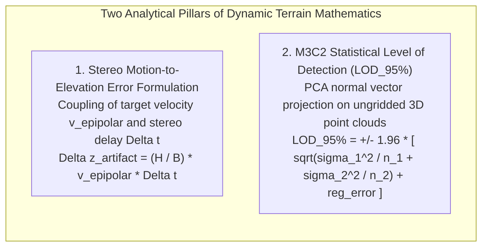
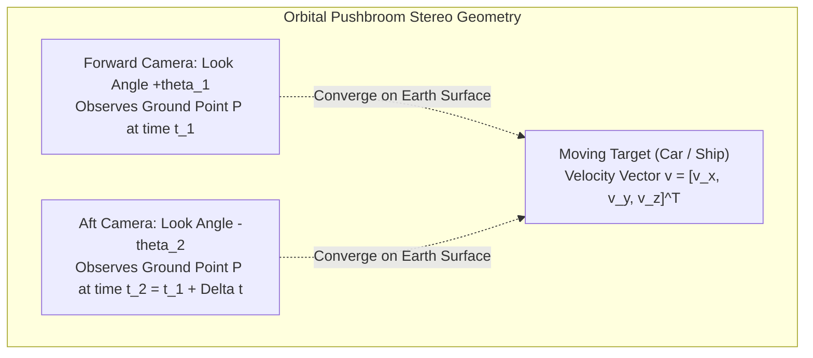
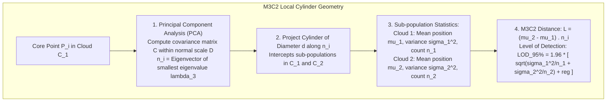

# Chapter 22: The Dynamic Earth: Temporal Changes, Moving Objects, AIS/ADS-B, Seasonality, and Change Detection

*The Earth's surface and the objects upon it are in constant motion across timescales from milliseconds to millennia.*

---

## 22.6 Mathematical Foundations of Dynamic Parallax and 3D Change Detection

This section provides complete, closed-form mathematical derivations for two core analytical models in dynamic elevation modeling: the along-track stereo velocity-to-elevation distortion formula, and the Multiscale Model-to-Model Cloud Comparison (M3C2) statistical confidence interval.

---

### 22.6.1 Derivation of Along-Track Stereo Velocity-to-Elevation Distortion

Consider an orbital pushbroom imaging satellite (e.g., WorldView-3) in Sun-synchronous orbit at altitude $H$ with orbital ground track velocity $v_{\text{sat}} \approx 7.0\text{ km/s}$. The satellite captures a multi-view stereoscopic pair using forward-pointing and aft-pointing line-scan cameras.

#### Step 1: Base-to-Height Ratio and Stereo Parallax
Let the forward and aft cameras converge at total convergence angle $\theta = \theta_1 + \theta_2$. The stereoscopic base-to-height ratio $B / H$ is:

$$\frac{B}{H} = \tan\theta_1 + \tan\theta_2 \approx 2 \tan\left(\frac{\theta}{2}\right)$$

In classical rigid photogrammetry, stereoscopic parallax $p$ (the differential planimetric shift along the epipolar line between the two rectified images) relates to surface height $z$ above the reference ellipsoid via:

$$p = \frac{B}{H} z \implies z = \left(\frac{H}{B}\right) p$$

#### Step 2: Target Motion and Induced Apparent Disparity
Now suppose a target on the ground (e.g., a highway vehicle or vessel) moves with velocity vector $\mathbf{v}$ during the acquisition interval $\Delta t = t_2 - t_1$. 

The true physical displacement of the target between the two camera observations is:

$$\Delta \mathbf{x} = \mathbf{v} \, \Delta t$$

Let $\hat{\mathbf{e}}_{\text{epi}}$ denote the unit vector pointing along the epipolar baseline (which aligns with the satellite's along-track flight direction). The component of vehicle motion parallel to the epipolar baseline is:

$$v_{\text{epipolar}} = \mathbf{v} \cdot \hat{\mathbf{e}}_{\text{epi}} = \|\mathbf{v}\| \cos\phi_{\text{heading}}$$

where $\phi_{\text{heading}}$ is the angle between the vehicle track and the satellite ground track.

During the interval $\Delta t$, the vehicle translates along the epipolar baseline by:

$$\Delta x_{\text{epi}} = v_{\text{epipolar}} \, \Delta t$$

#### Step 3: Deriving the Apparent Vertical Elevation Artifact ($\Delta z_{\text{artifact}}$)
The automated image matching algorithm (e.g., Semi-Global Matching [SGM]) cross-correlates image patches between the forward and aft frames. Because the algorithm assumes the Earth is static, it cannot distinguish between geometric parallax $p_{\text{geom}}$ caused by topography and physical translation $\Delta x_{\text{epi}}$ caused by vehicle motion.

The total apparent disparity $p_{\text{app}}$ measured by the correlator is the sum of real topographic parallax and motion displacement:

$$p_{\text{app}} = p_{\text{geom}} + \Delta x_{\text{epi}} = \frac{B}{H} z_{\text{true}} + v_{\text{epipolar}} \, \Delta t$$

Inverting this apparent disparity into elevation yields the reconstructed elevation $z_{\text{reconstructed}}$:

$$z_{\text{reconstructed}} = \left(\frac{H}{B}\right) p_{\text{app}} = z_{\text{true}} + \left(\frac{H}{B}\right) v_{\text{epipolar}} \, \Delta t$$

Subtracting true elevation $z_{\text{true}}$ isolates the **vertical elevation artifact ($\Delta z_{\text{artifact}}$)**:

$$\Delta z_{\text{artifact}} = \frac{H}{B} \, v_{\text{epipolar}} \, \Delta t = \frac{v_{\text{epipolar}} \, \Delta t}{2 \tan(\theta/2)}$$

#### Directional Analysis and Anisotropy
1. **Motion Parallel to Flight Track ($\phi = 0^\circ$):** Maximum vertical error. A vehicle driving along the satellite track at $v = 30\text{ m/s}$ with $\Delta t = 20\text{ s}$ and $B/H = 0.6$ creates an elevation artifact:
   $$\Delta z_{\text{artifact}} = \frac{1}{0.6} \times (30\text{ m/s} \times 20\text{ s}) = \mathbf{+1000\text{ meters}!}$$
2. **Motion Anti-Parallel ($\phi = 180^\circ$):** Reverses sign, punching a **$-1000\text{-meter}$ deep subterranean pit** into the road.
3. **Motion Perpendicular to Flight Track ($\phi = 90^\circ$):** $v_{\text{epipolar}} = 0 \implies \Delta z_{\text{artifact}} = 0$. Cross-track vehicle motion causes zero vertical elevation error, producing purely horizontal across-track displacement.

---

### 18.6.2 M3C2 3D Level of Detection ($\text{LOD}_{95\%}$) Derivation

The Multiscale Model-to-Model Cloud Comparison (**M3C2**, Lague et al., 2013) measures change directly on ungridded 3D point clouds, avoiding the grid interpolation errors that corrupt vertical cliffs and overhanging canyon walls.

#### Step 1: Scale-Adaptive Normal Estimation via PCA
For a core point $\mathbf{p}_i \in C_1$, let $\mathcal{N}_D(\mathbf{p}_i)$ be the set of $k$ neighboring points within a sphere of diameter $D$. The $3 \times 3$ spatial covariance matrix $\mathbf{C}$ is:

$$\mathbf{C} = \frac{1}{k} \sum_{j=1}^k (\mathbf{p}_j - \bar{\mathbf{p}})(\mathbf{p}_j - \bar{\mathbf{p}})^T$$

The eigenvalues of $\mathbf{C}$ satisfy $\lambda_1 \ge \lambda_2 \ge \lambda_3 \ge 0$. The eigenvector $\hat{\mathbf{n}}_i$ corresponding to the smallest eigenvalue $\lambda_3$ defines the **optimal local surface normal vector**.

#### Step 2: Inspection Cylinder Projection and Sub-Population Statistics
A cylinder of diameter $d$ and length $L$ oriented along normal $\hat{\mathbf{n}}_i$ is projected into both point clouds:
* Sub-population $S_1 \subset C_1$ contains $n_1$ points with positions along the normal axis $x_{1, j} = \mathbf{p}_{1, j} \cdot \hat{\mathbf{n}}_i$.
* Sub-population $S_2 \subset C_2$ contains $n_2$ points with positions along the normal axis $x_{2, j} = \mathbf{p}_{2, j} \cdot \hat{\mathbf{n}}_i$.

The mean positions along the normal are:

$$\mu_1 = \frac{1}{n_1} \sum_{j=1}^{n_1} x_{1, j}, \quad \mu_2 = \frac{1}{n_2} \sum_{j=1}^{n_2} x_{2, j}$$

The local surface roughness (standard deviation of point positions along the normal) is:

$$\sigma_1 = \sqrt{\frac{1}{n_1 - 1} \sum_{j=1}^{n_1} (x_{1, j} - \mu_1)^2}, \quad \sigma_2 = \sqrt{\frac{1}{n_2 - 1} \sum_{j=1}^{n_2} (x_{2, j} - \mu_2)^2}$$

The **M3C2 distance** $L_{\text{M3C2}}$ is:

$$L_{\text{M3C2}} = \mu_2 - \mu_1$$

#### Step 3: Derivation of the Statistical Level of Detection ($\text{LOD}_{95\%}$)
By the Central Limit Theorem, the sample means $\mu_1$ and $\mu_2$ are normally distributed with standard errors:

$$\operatorname{SE}_1 = \frac{\sigma_1}{\sqrt{n_1}}, \quad \operatorname{SE}_2 = \frac{\sigma_2}{\sqrt{n_2}}$$

The variance of the distance difference $\Delta L = \mu_2 - \mu_1$ is:

$$\operatorname{Var}(\Delta L) = \operatorname{Var}(\mu_1) + \operatorname{Var}(\mu_2) = \frac{\sigma_1^2}{n_1} + \frac{\sigma_2^2}{n_2}$$

In addition to point distribution noise, rigid alignment of Cloud 2 relative to Cloud 1 carries a residual registration uncertainty $\Delta_{\text{reg}}$ (typically derived from ICP residual RMSE or check-station residuals).

Under a two-tailed Student's $t$-distribution at the $95\%$ confidence level ($t_{\text{crit}} \approx 1.96$ for large degrees of freedom), the **Level of Detection ($\text{LOD}_{95\%}$)** is:

$$\text{LOD}_{95\%}(d) = \pm 1.96 \left( \sqrt{\frac{\sigma_1^2(d)}{n_1} + \frac{\sigma_2^2(d)}{n_2}} + \Delta_{\text{reg}} \right)$$

#### Decision Rule for Real Physical Change
* If $|L_{\text{M3C2}}| > \text{LOD}_{95\%}$, the measured 3D displacement represents **statistically significant physical surface change** at the $95\%$ confidence level.
* If $|L_{\text{M3C2}}| \le \text{LOD}_{95\%}$, the observed difference is indistinguishable from instrument noise and surface roughness, preventing false alarms in rockfall and landslide monitoring.
