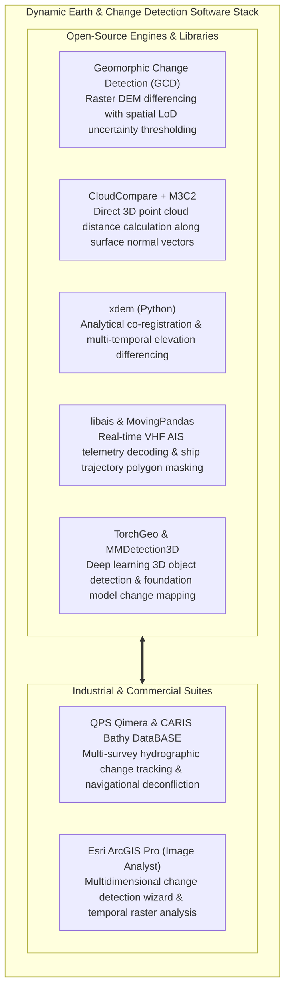

# Chapter 22: The Dynamic Earth: Temporal Changes, Moving Objects, AIS/ADS-B, Seasonality, and Change Detection

*The Earth's surface and the objects upon it are in constant motion across timescales from milliseconds to millennia.*

---

## 22.7 Software Ecosystem for Dynamic Earth Modeling, Change Detection, and Tracking

Processing multi-temporal elevation models, calculating statistically rigorous volume budgets, and removing dynamic traffic artifacts requires specialized software spanning marine telemetry decoders, point-cloud comparison plugins, and deep learning libraries.



---

### 22.7.1 Open-Source Tools and Pipelines

#### Geomorphic Change Detection (GCD)
The **Geomorphic Change Detection (GCD)** software (developed by Joe Wheaton and the Riverscapes Consortium):
* Automates DEM of Difference (DoD) calculations between multi-temporal surveys.
* Ingests spatial error surfaces (e.g., Kriging standard error or slope-dependent uncertainty rasters) to calculate the spatial **Level of Detection ($\text{LoD}_{\min}$)** for every pixel.
* Generates comprehensive volumetric sediment budgets: total volume eroded, total volume deposited, net sediment balance ($\Delta V = V_{\text{dep}} - V_{\text{ero}}$), and area-wide budget error bounds at user-defined confidence levels.

#### 3D Point Cloud Change Detection with CloudCompare (M3C2)
CloudCompare provides a native graphical and command-line implementation of the M3C2 algorithm:
```bash
# Execute headless M3C2 distance comparison between repeat cliff scans
CloudCompare -SILENT \
    -O cliff_survey_2021.las \
    -O cliff_survey_2023.las \
    -M3C2 m3c2_params.txt \
    -SAVE_CLOUDS
```
* The parameter file `m3c2_params.txt` declares normal diameter scale $D$, projection cylinder diameter $d$, maximum depth $L$, and coregistration uncertainty $\Delta_{\text{reg}}$.
* CloudCompare outputs a 3D scalar field containing the measured normal distance alongside the local level of detection ($\text{LOD}_{95\%}$), color-coding statistically significant rockfall scars.

#### Automated Ship Masking with `libais` and `MovingPandas`
To eliminate ship and wake artifacts from coastal satellite imagery or bathymetric LiDAR, Python scripts decode live AIS messages and buffer vessel hulls:

```python
"""Automated Vessel Masking using libais and MovingPandas."""

from datetime import datetime
import ais
import geopandas as gpd
import movingpandas as mpd
import pandas as pd
from shapely.geometry import Point


def parse_and_mask_vessels(
    nmea_sentences: list[str], image_timestamp: datetime
) -> gpd.GeoDataFrame:
  records = []
  for line in nmea_sentences:
    try:
      msg = ais.decode(line)
      # Message types 1, 2, 3: Position Report Class A
      if msg["id"] in [1, 2, 3]:
        records.append({
            "mmsi": msg["mmsi"],
            "timestamp": datetime.fromtimestamp(msg["time"]),
            "geom": Point(msg["x"], msg["y"]),  # Lon, Lat
            "sog": msg["sog"],  # Speed over ground (knots)
            "cog": msg["cog"],  # Course over ground (degrees)
        })
    except Exception:
      continue

  df = pd.DataFrame(records)
  gdf = gpd.GeoDataFrame(df, geometry="geom", crs="EPSG:4326")

  # Create trajectory collection and interpolate exact position at image acquisition
  traj_collection = mpd.TrajectoryCollection(
      gdf, "mmsi", t="timestamp", crs="EPSG:4326"
  )
  vessel_polygons = []

  for traj in traj_collection:
    pos = traj.interpolate_position_at(image_timestamp)
    # Buffer vessel position by length/beam + dynamic wake envelope (150m)
    wake_hull_polygon = pos.buffer(0.0015)  # ~160m buffer in degrees
    vessel_polygons.append(wake_hull_polygon)

  return gpd.GeoDataFrame(geometry=vessel_polygons, crs="EPSG:4326")
```

---

### 22.7.2 Commercial Hydrographic and Geospatial Suites

#### QPS Qimera and Teledyne CARIS Bathy DataBASE
In commercial hydrography and port management:
* **QPS Qimera:** Features a dedicated **Surface Difference Tool** that tracks migrating sand waves in commercial shipping channels, calculating remaining under-keel clearance (UKC) and triggering dredge mobilization alerts.
* **CARIS Bathy DataBASE:** Maintains an enterprise multi-survey database. When a new hydrographic survey is approved, CARIS compares the new bathymetry against historical smooth sheets, generating automated "shoaler-than-charted" change alerts to update nautical charts immediately.

#### Esri ArcGIS Pro (Image Analyst)
* **Compute Change Raster:** Calculates DoDs with difference masks (thresholding, relative difference, categorical change).
* **Multidimensional CRF Workflows:** Supports multidimensional Cloud Raster Formats storing decades of multi-temporal elevation grids (e.g., seasonal InSAR deformation time series), enabling animated profile transects and trend regressions.

---

### 22.7.3 Software Comparison Matrix

| Software / Tool | License Model | Primary Geometric Domain | Key Mathematical Core | Best-Suited Application |
| :--- | :--- | :--- | :--- | :--- |
| **GCD (Geomorphic Change Detection)** | Open-Source (GPL) | 2D Raster DEM | Wheaton Level of Detection ($\text{LoD}_{\min}$) | Fluvial and coastal sediment volumetric budgeting. |
| **CloudCompare (M3C2)** | Open-Source (GPLv2) | 3D Point Cloud | Scale-adaptive surface normal projection | Rockfall, cliff collapse, and structural landslide monitoring. |
| **`xdem`** | Open-Source (BSD-3) | 2D Raster DEM | Nuth & Kääb 3D co-registration, robust NMAD | Glacier thinning and tectonic geodetic change detection. |
| **`libais` / MovingPandas** | Open-Source (Apache/BSD)| Trajectory Data | NMEA/AIVDM decoding, spatial trajectory interpolation| Automated marine vessel and wake artifact masking. |
| **TorchGeo / Clay** | Open-Source (MIT/Apache)| Remote Sensing Arrays | Vision Transformers, self-supervised learning | Large-scale automated environmental and urban change detection. |
| **QPS Qimera** | Commercial (QPS) | Bathymetric Swaths | Real-time multi-surface difference & volume | Port channel shoaling and sand wave migration monitoring. |
| **CARIS Bathy DataBASE** | Commercial (Teledyne) | Bathymetric Grids / BAG | Enterprise surface deconfliction & shoal tracking | Updating national nautical charts from multi-temporal surveys. |
| **ArcGIS Pro Image Analyst** | Commercial (Esri) | Raster & Multidimensional | Multidimensional CRF change detection wizards | Enterprise GIS temporal elevation modeling and land monitoring. |
