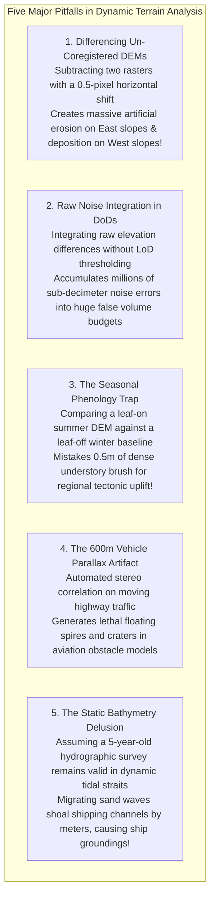

# Chapter 22: The Dynamic Earth: Temporal Changes, Moving Objects, AIS/ADS-B, Seasonality, and Change Detection

*The Earth's surface and the objects upon it are in constant motion across timescales from milliseconds to millennia.*

---

## 22.8 Common Pitfalls and Key Takeaways

Treating digital elevation models as static representations of a rigid Earth is a pervasive trap. When multi-temporal datasets are differenced without proper geodetic co-registration, noise thresholding, and seasonal awareness, analysts routinely mistake sensor noise, leaf phenology, and moving cars for real geological changes.

---

### 22.8.1 Common Pitfalls in Dynamic Elevation Analysis

#### 1. Differencing Un-Coregistered DEMs
Directly subtracting an older elevation raster from a newer raster ($z_{t_2} - z_{t_1}$) without first solving for 3D rigid horizontal misregistration:
* If the two datasets have an undocumented horizontal shift of just half a pixel ($\Delta x = 0.5\text{ m}$ on a $1\text{-m}$ grid) across terrain with a $35^\circ$ slope:
  $$dh = \Delta x \tan\alpha = 0.5\text{ m} \times \tan(35^\circ) \approx 0.35\text{ m}$$
* Every east-facing slope shows $35\text{ cm}$ of "erosion," while every west-facing slope shows $35\text{ cm}$ of "deposition." 
* Naive analysts publish flawed scientific papers reporting "asymmetric hillside mass wasting," when the entire signal is a simple sub-pixel horizontal coordinate offset!
* **Remedy:** Always execute analytical 3D co-registration (e.g., Nuth & Kääb or ICP via `xdem`) over stable, non-deforming bedrock before computing elevation differences.

#### 2. Raw Noise Integration in Volumetric Budgets
Summing raw pixel differences across a $100\text{ km}^2$ watershed ($M = 100,000,000$ cells) without applying a **Level of Detection ($\text{LoD}_{\min}$)** threshold:
* Even if individual pixel noise has a tiny mean bias of only $+0.02\text{ m}$ (well within nominal $\pm 10\text{-cm}$ sensor specifications), summing that bias across $100\text{ million}$ pixels yields:
  $$\Delta V = 100,000,000\text{ m}^2 \times 0.02\text{ m} = \mathbf{+2,000,000\text{ cubic meters}!}$$
* The modeler reports two million cubic meters of "sediment deposition" that does not exist in reality!
* **Remedy:** Enforce Wheaton's Level of Detection thresholding ($\text{LoD}_{\min} = t_{\text{crit}} \sqrt{\sigma_1^2 + \sigma_2^2}$); set all differences within the noise envelope to zero before computing volume integrals.

#### 3. The Seasonal Phenology Trap (Leaf-On vs. Leaf-Off)
Comparing a high-resolution LiDAR survey acquired in July (leaf-on) against a baseline acquired in March (leaf-off) to measure post-earthquake displacement:
* In July, dense deciduous foliage blocks $95\%$ of laser pulses, and ground filters misclassify low brush stems as ground, creating a $+0.4\text{ m}$ positive elevation bias.
* In March, bare branches allow pulses to reach true mineral soil.
* Differencing the two surfaces shows $+0.4\text{ m}$ of apparent "ground uplift" across the entire forest.
* **Remedy:** Restrict geomorphic change detection to phenologically matched acquisition seasons, or mask out vegetated terrain using canopy height models.

#### 4. The 600m Vehicle Stereo Spire Artifact
Relying on raw satellite optical stereo DEMs along highway corridors without dynamic object filtering:
* Moving cars translate along the road during the $10\text{–}60\text{ second}$ along-track stereo time delay.
* The stereo matcher converts along-track motion into massive vertical parallax errors ($\Delta z = \frac{H}{B} v \Delta t$), projecting vehicles as **$100\text{–}800\text{-meter}$ tall spikes** or deep chasms.
* **Remedy:** Ingest open street centerlines and mask moving traffic buffers prior to surface compilation.

#### 5. Assuming Static Bathymetry in Navigable Waters
Assuming that a high-resolution multibeam survey conducted five years ago accurately reflects current seabed depths in high-energy tidal straits:
* Migrating submarine sand waves travel $10\text{–}50\text{ meters per year}$, shoaling dredged shipping channels by $2\text{–}4\text{ meters}$.
* Commercial ships navigating on obsolete bathymetric grids will run hard aground on migrating sand crests.
* **Remedy:** Conduct regular repeat monitoring surveys in dynamic sandy channels and maintain active change-detection tracking in hydrographic databases (e.g., CARIS Bathy DataBASE).

---

### 22.8.2 Key Takeaways for Practitioners

1. **Elevation Is 4-Dimensional ($X, Y, Z, t$):** Never treat a digital elevation model as an eternal baseline. Every elevation value reflects a discrete temporal snapshot. Always embed ISO 8601 acquisition timestamps in file metadata and use per-pixel timestamp masks for multi-temporal mosaics.
2. **Co-Register Before Differencing:** Sub-pixel horizontal misregistration creates massive, slope-dependent vertical error artifacts. Always co-register multi-temporal datasets over stable bedrock using Nuth & Kääb or ICP algorithms.
3. **Threshold by Level of Detection:** Never compute net volumetric sediment budgets from raw pixel subtraction. Apply rigorous Level of Detection ($\text{LoD}_{\min}$) thresholding to prevent sensor noise from corrupting volume estimates.
4. **Use M3C2 for Steep Topography:** On sea cliffs, rockfalls, and river bluffs, 2.5D raster differencing collapses. Measure true 3D surface change along local surface normal vectors using the M3C2 algorithm.
5. **Leverage AIS and ADS-B for Dynamic Cleaning:** Moving ships and airplanes corrupt optical stereo, LiDAR, and satellite-derived bathymetry. Ingest broadcast transponder telemetry to automatically generate dynamic exclusion masks.
