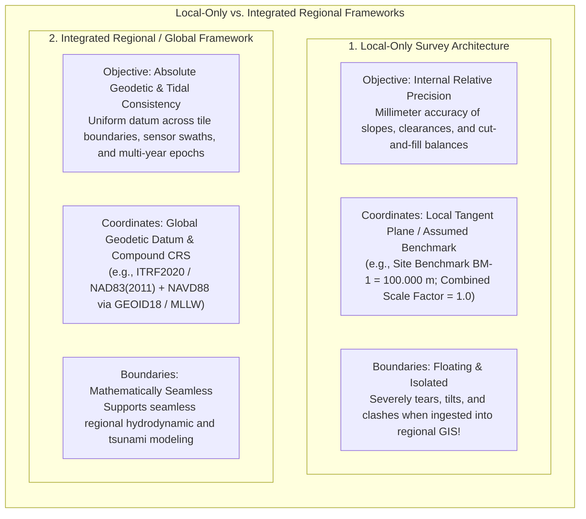
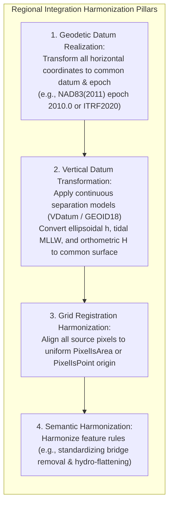

# Chapter 23: Local vs. Integrated Surveys and Building Composite DEM Products

*Reconciling isolated local surveys with global frameworks, and how to order, crop, blend, and override multi-source elevation datasets without introducing seams or destroying critical shoals.*

Digital elevation models are rarely created from a single, homogeneous survey. Instead, regional and national elevation products—such as the USGS 3D Elevation Program (3DEP), NOAA's Continuously Updated Digital Elevation Models (CUDEM), and the General Bathymetric Chart of the Oceans (GEBCO)—are composite mosaics assembled from hundreds or thousands of independent datasets. These source datasets span decades of acquisition, disparate sensor modalities (airborne LiDAR, satellite altimetry, multibeam sonar, legacy lead-lines), conflicting coordinate reference systems, and variable spatial resolutions.

Building a seamless, physically realistic composite elevation model requires solving the fundamental tension between isolated local survey precision and overarching geodetic consistency.

---

## 23.1 Local-Only Surveys vs. Integrated Regional Frameworks

Elevation surveys are commissioned for vastly different operational purposes. A civil engineering firm surveying a bridge foundation requires millimeter relative precision across a $500\text{-meter}$ construction site, whereas a national mapping agency requires seamless geodetic continuity across thousands of kilometers.

---

### 23.1.1 The Anatomy of Local-Only Surveys

Local surveys—such as an open-pit mine pit scan, a highway overpass topographic tie, or a commercial harbor berth dredging survey—are optimized strictly for **internal relative accuracy**:

1. **Local Assumed Datums:** To avoid negative numbers or complex geodetic calculations, local surveyors often establish an arbitrary site benchmark (e.g., "Top of fire hydrant $= 100.000\text{ m}$"). While relative elevation differences within the construction footprint are accurate to millimeters, the absolute vertical relationship to the national geoid or Mean Sea Level is completely unknown.
2. **Ground-Scale Coordinates (Combined Scale Factor $= 1.0$):** In local civil CAD design, one unit on the drawing must equal exactly one physical meter measured with a steel tape on the ground. The surveyor removes the map projection scale factor ($k$) and the elevation reduction factor ($R / (R + H)$), establishing a local ground-coordinate system.
3. **Local Water-Level Staffs:** In port dredging, depths are often measured relative to an un-leveled tide board bolted to a wooden pier face, lacking geodetic leveling ties to national geodetic networks.

#### The Ingestion Disaster
When a GIS analyst attempts to mosaic an isolated local survey into a regional digital elevation model:
* The assumed $100\text{-m}$ datum creates a massive, vertical cylindrical cliff standing $70\text{ m}$ above the surrounding $30\text{-m}$ terrain.
* The uncorrected ground-to-grid scale factor causes the local survey footprint to expand by $200\text{–}500\text{ parts per million}$ ($20\text{–}50\text{ cm}$ per kilometer), misaligning perimeter roads, fences, and drainage ditches.
* At the survey boundary, sharp step-seams appear, creating artificial waterfalls and computational divergence in hydrodynamic flood models.

---

### 23.1.2 Integrated Regional and Global Frameworks

In contrast, integrated regional frameworks (such as NOAA CUDEM, USGS 3DEP, and European EMODnet) prioritize **absolute geodetic and topological consistency**:

#### 1. Rigorous Vertical Datum Unification
To combine an inland airborne LiDAR survey (referenced to NAVD88 orthometric heights) with an offshore multibeam sonar survey (referenced to Mean Lower Low Water [MLLW] tidal depths), regional modelers cannot simply add numbers together. 
* They must evaluate a spatially continuous **vertical datum separation surface** (e.g., NOAA's **VDatum** tool or the UK Hydrographic Office's **VORF**).
* The transformation models the spatial separation $N(\lambda, \phi)$ between the reference ellipsoid, the gravimetric geoid, and local sea-surface tidal datums, accounting for estuarine tidal dampening and barrier island phase lags.

#### 2. Absolute Geodetic Seam Consistency
Across adjacent mapping swaths and project tiles:
* Horizontal positions must be harmonized to an identical realization and epoch to prevent fault-like step artifacts along sheet boundaries.
* Map projection scale factors must be strictly applied using conformal projection equations.
* The resulting elevation surface is continuous, differentiable, and hydrologically connected, allowing digital fluid to flow seamlessly from continental mountain divides across estuarine flats and onto the abyssal ocean floor.

---

### 23.1.3 Comparison: Local-Only vs. Integrated Regional Surveys

| System Characteristic | Local-Only Survey | Integrated Regional Framework |
| :--- | :--- | :--- |
| **Primary Goal** | Local engineering design, structural fit, volume cut/fill. | Regional modeling, hazard mitigation, national mapping. |
| **Dominant Metrological Quality**| **Relative Precision** (Repeatability within site). | **Absolute Accuracy** (Traceable to global ITRF/WGS84). |
| **Horizontal Coordinates** | Local Tangent Plane / Ground-scale CAD coordinates. | Projected CRS (UTM / State Plane) with explicit epoch. |
| **Vertical Reference** | Arbitrary benchmark ($100.00\text{ m}$) or un-tied tide staff. | National Orthometric (NAVD88) or Tidal (MLLW) via VDatum. |
| **Scale Distortion** | Zero at site ($k \equiv 1.0$), but diverges regionally. | Rigorously modeled map projection scale factor ($k$). |
| **Boundary Behavior** | **Discontinuous:** Sharp vertical steps and spatial gaps. | **Seamless:** Mathematically blended, continuous gradients. |
| **Downstream Usability** | Cannot be ingested into regional models without georeferencing.| Directly ingests into regional hydrodynamic and climate models. |
