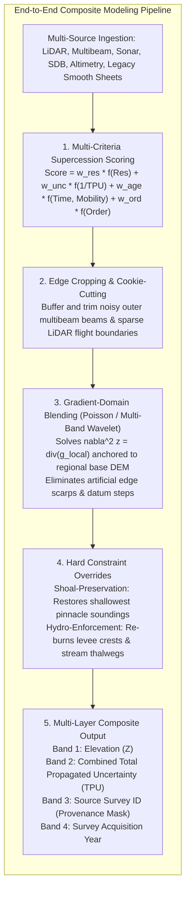
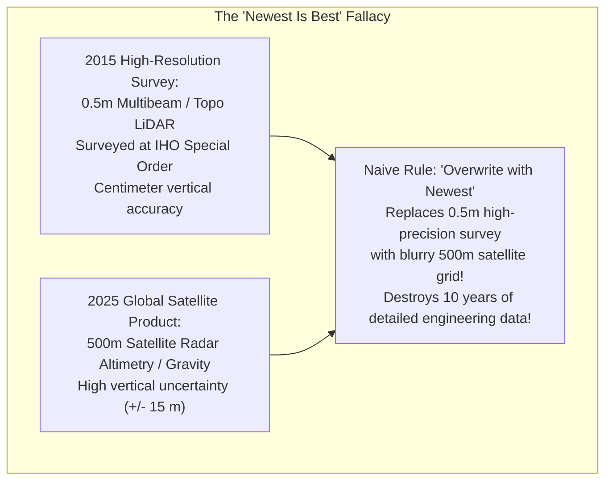
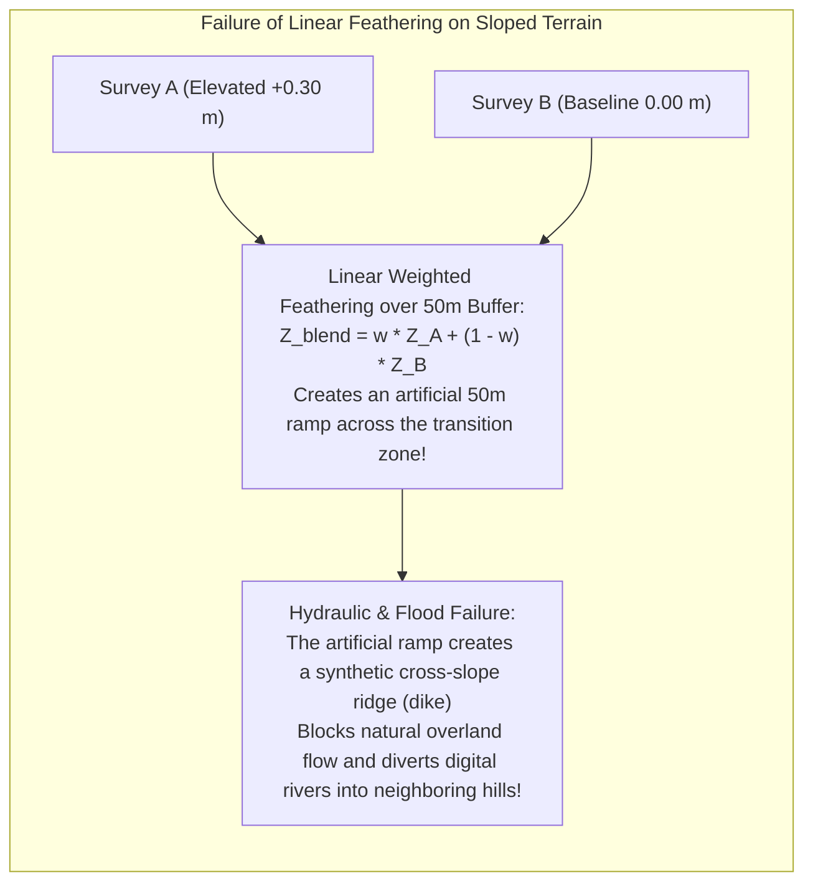
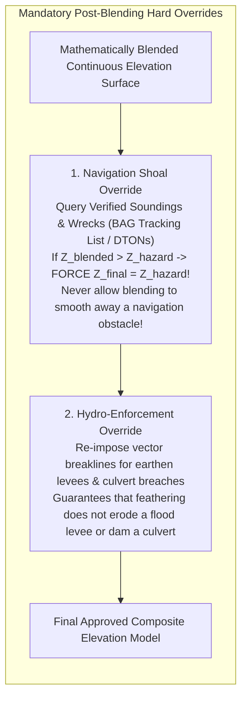

# Chapter 23: Local vs. Integrated Surveys and Building Composite DEM Products

*Reconciling isolated local surveys with global frameworks, and how to order, crop, blend, and override multi-source elevation datasets without introducing seams or destroying critical shoals.*

---

## 23.2 Building Composite Data Products: Ordering, Cropping, Blending, and Overrides

Assembling dozens of disparate elevation surveys into a seamless, unified digital elevation model requires an orchestrated multi-stage fusion pipeline. A naive approach—such as simply overwriting older rasters with newer rasters or applying unconstrained linear feathering—creates catastrophic artifacts: artificial ramps that divert rivers, blurred navigation hazards, and step-discontinuities across survey borders.

A rigorous composite modeling pipeline executes five sequential operations: **Source Supercession Scoring**, **Geometric Boundary Cropping**, **Gradient-Domain Blending**, **Hard Rule Overrides**, and **Companion Provenance Generation**.

---

### 23.2.1 Source Prioritization and Supercession Scoring

The most common operational failure in composite modeling is assuming that the **newest dataset is always the best dataset**.

#### Multi-Criteria Supercession Scoring
To prevent low-quality modern data from obliterating high-quality historical surveys, production engines (e.g., NOAA CUDEM `waffles`) calculate an objective **Supercession Score ($S_k$)** for every source dataset:

$$S_k = w_{\text{res}} \left( \frac{\Delta x_{\text{target}}}{\Delta x_k} \right) + w_{\text{unc}} \left( \frac{\sigma_{\text{target}}}{\sigma_{\text{TVU}, k}} \right) + w_{\text{age}} \cdot \mathcal{T}(t_k, M_{\text{sed}}) + w_{\text{order}} \cdot \mathcal{O}_k$$

where:
* $\Delta x_k$ is the spatial resolution of dataset $k$.
* $\sigma_{\text{TVU}, k}$ is the Total Vertical Uncertainty (IHO/ASPRS).
* $\mathcal{O}_k$ is the formal survey certification order (IHO Exclusive Order $= 4$, Special Order $= 3$, Order 1a $= 2$, Reconnaissance $= 1$).
* $\mathcal{T}(t_k, M_{\text{sed}})$ is a **temporal decay function** modulated by the local **Sediment Mobility Index ($M_{\text{sed}}$)**:
  * In stable, crystalline granite bedrock, age penalty is near zero ($\mathcal{T} \approx 1.0$), allowing a 1995 multibeam survey to supersede a 2025 global satellite altimetry grid.
  * In a dynamic sandy tidal inlet or active volcanic caldera ($M_{\text{sed}} \gg 1$), older surveys decay rapidly, ensuring that modern surveys capture recent morphological changes.

---

### 23.2.2 Geometric Cropping and Cookie-Cutting

Before two overlapping surveys are merged, their boundary margins must be cleaned:
* **Multibeam Outer-Beam Trimming:** As established in Chapter 10, the outermost $10\%\text{–}15\%$ of multibeam acoustic swaths suffer from sound speed refraction "smiles" and low grazing-angle phase noise. Automated scripts crop the outer beams along pre-computed swath quality masks before mosaicking.
* **LiDAR Flight-Edge Triangles:** The outer boundaries of airborne LiDAR swaths have low point density, producing long, stretched Delaunay triangles. Polygons are buffered inward by $2\text{–}5\text{ m}$ ("cookie-cutting") to eliminate ragged edge triangles.

---

### 23.2.3 Blending and Seam Removal: Why Linear Feathering Fails

When two overlapping elevation models have an uncorrected vertical datum offset ($\Delta z = 0.30\text{ m}$) or slight tilt:

#### The Gradient-Domain Solution: Poisson Surface Blending
To seamlessly insert a high-resolution local survey $z_{\text{local}}$ into a regional base surface $z_{\text{base}}$ without creating artificial dams, modern modeling employs **Poisson Surface Editing** (Pérez et al., 2003).

Instead of blending elevation values directly, Poisson blending operates in the **spatial gradient domain**:
1. It extracts the high-frequency terrain gradients from the local survey:
   $$\mathbf{g}_{\text{local}} = \nabla z_{\text{local}} = \left[ \frac{\partial z_{\text{local}}}{\partial x}, \, \frac{\partial z_{\text{local}}}{\partial y} \right]^T$$
2. It solves the Poisson partial differential equation over the insertion domain $\Omega$, enforcing the regional elevation values strictly along the boundary $\partial\Omega$:
   $$\nabla^2 z = \nabla \cdot \mathbf{g}_{\text{local}} \quad \text{subject to } \left. z \right|_{\partial\Omega} = \left. z_{\text{base}} \right|_{\partial\Omega}$$
3. The resulting surface preserves $100\%$ of the fine local topographic shapes (curbs, channels, boulders), while smoothly absorbing the boundary datum offset across the entire domain without localized scarps.

---

### 23.2.4 Hard Constraint Overrides: Shoals and Hydro-Enforcement

Automated mathematical blending filters (splines, wavelets, Poisson solvers) are unthinking numerical smoothers. If left unconstrained, they will destroy safety-critical features:

1. **The Navigation Shoal Override:** A submerged granite pinnacle rising to $2.0\text{ m}$ depth within an area of $30\text{-m}$ water will be partially smoothed down by spatial blending filters. Under international hydrographic standards (IHO S-102), the composite engine must enforce a **hard minimum override**:
   $$z_{\text{composite}}(\mathbf{x}) = \min(z_{\text{blended}}(\mathbf{x}), \, z_{\text{designated\_shoal}}(\mathbf{x}))$$
   preserving the exact shoal depth for maritime safety.
2. **The Hydro-Enforcement Override:** Linear blending across a river canal intersecting an elevated roadway will smear the road embankment into the canal. The pipeline must re-burn verified stream thalwegs and culvert breach lines after blending.

---

### 23.2.5 Companion Provenance and Uncertainty Masks

A professional composite digital elevation model is never a single-band file. It must be delivered as a multi-layer raster package:
* **Band 1 (Elevation):** The composite elevation/depth surface.
* **Band 2 (Combined Uncertainty):** The spatially propagated vertical uncertainty ($\sigma_z$), combining source survey TVU, interpolation variance, and temporal age decay.
* **Band 3 (Source Identifier / Provenance Mask):** An integer raster where each pixel stores an index key referencing the exact source survey that contributed that elevation.
* **Band 4 (Acquisition Year / Epoch):** Decimal year (e.g., `2019.28`) documenting the temporal origin of the terrain.
