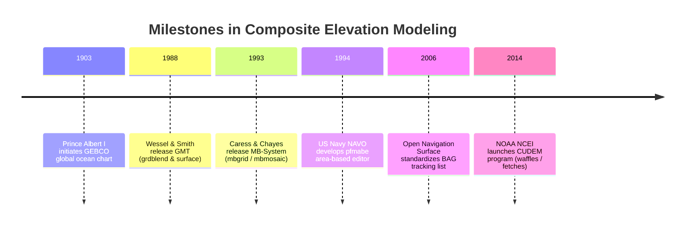
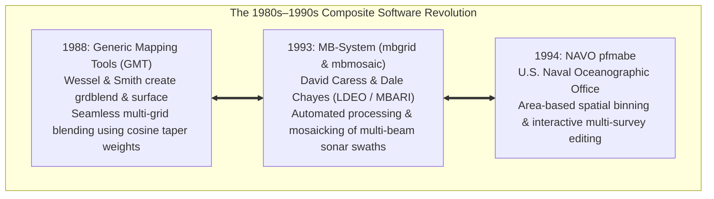
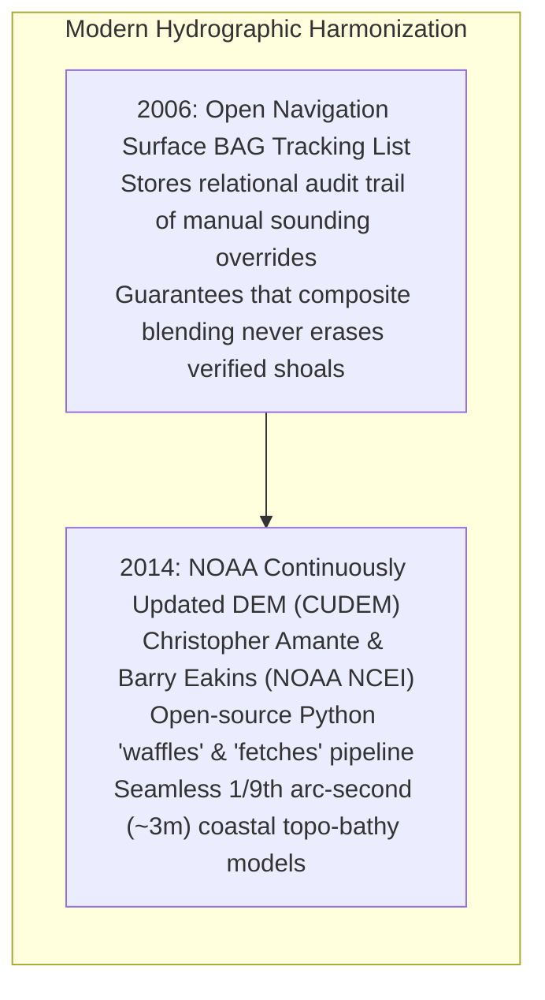

# Chapter 23: Local vs. Integrated Surveys and Building Composite DEM Products

*Reconciling isolated local surveys with global frameworks, and how to order, crop, blend, and override multi-source elevation datasets without introducing seams or destroying critical shoals.*

---

## 23.3 Historical Evolution of Composite Elevation Products and Harmonization

The methodology of assembling fragmented local soundings and regional surveys into unified planetary surfaces spans over 120 years: from hand-drawn contour charts of the global ocean to modern cloud-orchestrated, continuously updated coastal elevation frameworks.

---

### 23.3.1 The Dawn of Global Bathymetric Synthesis (1903)

#### 1903: Prince Albert I of Monaco and GEBCO
In 1903, Prince Albert I of Monaco convened an international committee of geographers and oceanographers in Paris to construct the first global bathymetric map of the oceans: the **General Bathymetric Chart of the Oceans (GEBCO)**. 
* Assembled from approximately 18,000 isolated mechanical lead-line soundings recorded by international naval and scientific expeditions.
* Produced a 24-sheet paper chart contouring the world's ocean floor.
* GEBCO established the founding principle of composite elevation modeling: **cooperative international data pooling**, where disparate national soundings are standardized onto a common projection, datum, and depth scale.

---

### 23.3.2 Computational Swath Mosaicking and Open Geophysical Tools (1988–1994)

#### 1988: Paul Wessel, Walter Smith, and GMT `grdblend`
In 1988, Paul Wessel and Walter H. F. Smith released the **Generic Mapping Tools (GMT)**. Facing the challenge of merging high-resolution local ship tracks with coarse satellite altimetric gravity predictions across entire ocean basins, they developed `grdblend`. 
* Implemented continuous 2D cosine-taper blending across overlapping raster boundaries.
* Allowed geophysicists to merge datasets of varying resolutions without sharp step-seams, establishing the open-source benchmark for global elevation compilation.

#### 1993: David Caress, Dale Chayes, and MB-System
In 1993, marine geophysicists David W. Caress (Lamont-Doherty Earth Observatory / MBARI) and Dale N. Chayes released **MB-System**:
* Solved the challenge of processing and mosaicking raw swath bathymetry from dozens of competing multibeam sonars (SeaBeam, Hydrosweep, Simrad).
* Introduced **`mbgrid`** and **`mbmosaic`**, which automated outer-beam footprint filtering, spatial binning, and cross-swath spline relaxation, enabling marine scientists to compile gigabyte-scale bathymetric mosaics directly from raw sonar ping files.

#### 1994: U.S. Navy NAVO `pfmabe`
In 1994, the Naval Oceanographic Office (NAVO) developed the **Pure File Magic Area-Based Editor (`pfmabe`)**:
* Broke away from single-line processing by loading hundreds of overlapping multibeam lines into a continuous 3D spatial cache.
* Enabled hydrographers to visually detect and deconflict vertical datum steps and outer-beam refraction smiles across multiple survey years simultaneously.

---

### 23.3.3 The Modern Era: Transparent Tracking and CUDEM (2006–2014)

#### 2006: The BAG Tracking List Standard
In 2006, the Open Navigation Surface (ONS) consortium standardized the **Bathymetric Attributed Grid (BAG)**:
* Formalized the **Tracking List**: an internal relational table inside the HDF5 file that records every instance where an operator manually overrode an automated surface estimate to preserve a critical navigation hazard.
* Solved the historical problem where automated grid merging or smoothing filters accidentally deepened verified rock pinnacles, ensuring legal defensibility for navigational safety.

#### 2014: NOAA CUDEM (Continuously Updated Digital Elevation Models)
In 2014, Christopher J. Amante, Barry W. Eakins, and researchers at the NOAA National Centers for Environmental Information (NCEI) and the Cooperative Institute for Research in Environmental Sciences (CIRES) launched the **CUDEM program**:
* Developed the open-source **`cudem`** framework (featuring the `fetches` data harvesting tool and the `waffles` gridding engine).
* Formulated an automated, multi-tiered supercession and weighting hierarchy: prioritizing high-resolution coastal LiDAR and multibeam sonar, transforming all inputs to a unified vertical datum via NOAA VDatum, and utilizing spline-in-tension and Poisson blending to generate seamless $1/9\text{th arc-second}$ ($\approx 3\text{-meter}$) topo-bathy elevation models across the United States coastline.
