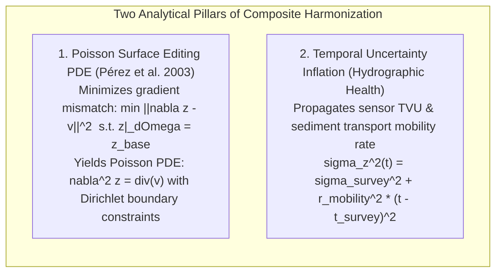
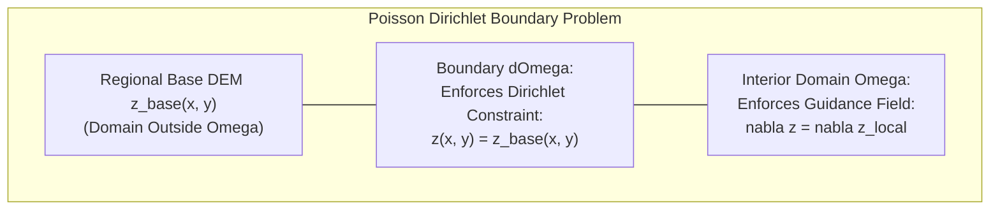
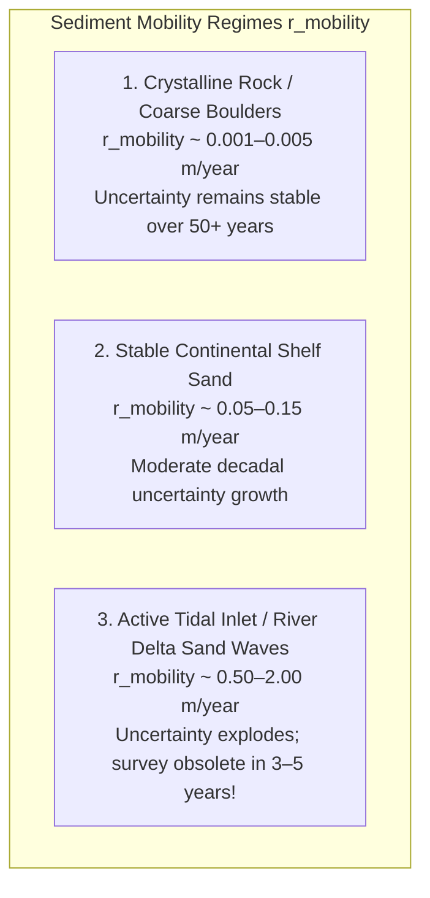

# Chapter 23: Local vs. Integrated Surveys and Building Composite DEM Products

*Reconciling isolated local surveys with global frameworks, and how to order, crop, blend, and override multi-source elevation datasets without introducing seams or destroying critical shoals.*

---

## 23.4 Mathematical Foundations of Gradient-Domain Blending and Temporal Uncertainty

Creating seamless composite elevation models requires solving two foundational mathematical problems: eliminating step-seams across survey boundaries without distorting fine local terrain geometry, and modeling the degradation of bathymetric and topographic accuracy over time due to active sediment transport. 

This section derives the Poisson surface editing partial differential equation with Dirichlet boundary conditions, followed by the time-decay uncertainty inflation model governing dynamic seafloors and floodplains.

---

### 23.4.1 Poisson Surface Editing and Gradient-Domain Fusion

Consider inserting a high-resolution local survey $z_{\text{local}}(x, y)$ defined over an interior domain $\Omega \subset \mathbb{R}^2$ with boundary $\partial\Omega$ into a continuous regional base elevation model $z_{\text{base}}(x, y)$. 

If an uncorrected vertical datum offset exists between the two models ($z_{\text{local}} - z_{\text{base}} = \Delta z \neq 0$), direct insertion produces a vertical cliff along $\partial\Omega$, while linear feathering creates an artificial ramp.

#### Step 1: The Variational Minimization Functional
Instead of interpolating elevation heights directly, Poisson editing solves for an unknown surface $z(x, y)$ whose spatial gradient matches an input guidance vector field $\mathbf{v}$, while strictly matching the regional base elevation along the perimeter $\partial\Omega$:

$$\min_{z(x, y)} E[z] = \iint_{\Omega} \|\nabla z - \mathbf{v}\|^2 \, dx \, dy \quad \text{subject to } \left. z \right|_{\partial\Omega} = \left. z_{\text{base}} \right|_{\partial\Omega}$$

where $\mathbf{v} = \nabla z_{\text{local}} = \left[ \frac{\partial z_{\text{local}}}{\partial x}, \, \frac{\partial z_{\text{local}}}{\partial y} \right]^T$ is the gradient vector field of the high-resolution local survey.

#### Step 2: Deriving the Euler-Lagrange Partial Differential Equation
Let $\delta z$ be an arbitrary smooth test variation vanishing on the boundary ($\left. \delta z \right|_{\partial\Omega} = 0$). The first variation $\delta E$ is:

$$\delta E = 2 \iint_{\Omega} (\nabla z - \mathbf{v}) \cdot \nabla(\delta z) \, dx \, dy = 0$$

Applying Green's first identity (integration by parts in 2D):

$$\iint_{\Omega} (\nabla z - \mathbf{v}) \cdot \nabla(\delta z) \, dx \, dy = -\iint_{\Omega} \nabla \cdot (\nabla z - \mathbf{v}) \, \delta z \, dx \, dy + \oint_{\partial\Omega} (\nabla z - \mathbf{v}) \cdot \hat{\mathbf{n}} \, \delta z \, ds$$

Because $\delta z = 0$ along $\partial\Omega$, the boundary contour integral vanishes:

$$\iint_{\Omega} \left[ \nabla \cdot \nabla z - \nabla \cdot \mathbf{v} \right] \delta z \, dx \, dy = \iint_{\Omega} \left[ \nabla^2 z - \nabla \cdot \mathbf{v} \right] \delta z \, dx \, dy = 0$$

Because this integral must vanish for any arbitrary variation $\delta z$, the integrand must equal zero everywhere in $\Omega$. This establishes the **Poisson partial differential equation**:

$$\nabla^2 z = \nabla \cdot \mathbf{v} = \operatorname{div}(\mathbf{v})$$

with **Dirichlet boundary conditions**:

$$\left. z \right|_{\partial\Omega} = \left. z_{\text{base}} \right|_{\partial\Omega}$$

where $\nabla^2 z = \frac{\partial^2 z}{\partial x^2} + \frac{\partial^2 z}{\partial y^2}$ is the 2D Laplacian operator, and $\nabla \cdot \mathbf{v} = \frac{\partial v_x}{\partial x} + \frac{\partial v_y}{\partial y}$ is the divergence of the local gradient field.

#### Step 3: Discrete 5-Point Finite-Difference Formulation
On a regular grid with spacing $h = \Delta x = \Delta y$, let pixel $p = (i, j)$ have a 4-connected spatial neighborhood $N_p = \{(i+1, j), (i-1, j), (i, j+1), (i, j-1)\}$.

The discrete divergence $\operatorname{div}(\mathbf{v})_p$ is computed from forward differences:

$$\operatorname{div}(\mathbf{v})_p = \frac{1}{h} \sum_{q \in N_p} \left( \mathbf{v} \cdot \hat{\mathbf{u}}_{pq} \right)$$

where $\hat{\mathbf{u}}_{pq}$ is the unit vector directed from pixel $p$ to neighbor $q$.

The discrete Poisson equation at interior pixel $p \in \Omega$ becomes:

$$4 z_p - \sum_{q \in N_p \cap \Omega} z_q = \sum_{q \in N_p \cap \partial\Omega} z_{\text{base}}(q) + \sum_{q \in N_p} v_{pq}$$

Collecting all unknown pixel values $z_p$ into a vector $\mathbf{z}$, this forms a large, sparse, symmetric positive-definite linear system:

$$\mathbf{A} \mathbf{z} = \mathbf{b}$$

Because $\mathbf{A}$ is strictly diagonally dominant, the system is solved rapidly using the **Preconditioned Conjugate Gradient (PCG)** method or multigrid relaxation. The resulting surface seamlessly absorbs boundary datum steps while preserving $100\%$ of fine local slope features.

---

### 23.4.2 Temporal Sediment-Mobility Uncertainty Inflation

A composite elevation model frequently merges a modern 2024 LiDAR survey with a 2005 multibeam acoustic survey. The vertical uncertainty of the 2005 survey today is not its nominal 2005 survey uncertainty ($\sigma_{z, \text{survey}}$); natural sediment transport has modified the surface over the intervening 19 years.

Under the International Hydrographic Organization (IHO) CATZOC framework and NOAA's Hydrographic Health Model, the time-decaying vertical variance $\sigma_z^2(t)$ is modeled as a quadratic function of elapsed time:

$$\sigma_z^2(t) = \sigma_{z, \text{survey}}^2 + r_{\text{mobility}}^2 (t - t_{\text{survey}})^2$$

where:
* $\sigma_{z, \text{survey}}$ is the Total Propagated Uncertainty (TVU) at the time of data acquisition ($1\sigma$).
* $t - t_{\text{survey}}$ is elapsed time in years ($\Delta t$).
* $r_{\text{mobility}}$ is the **Sediment Mobility Rate** ($\text{meters / year}$), parameterized by local seabed geomorphology, hydrodynamic wave energy, and sediment grain size.

#### Multi-Criteria Inverse-Variance Fusion Weights
When multiple surveys overlap at coordinate $\mathbf{x}$, modern composite engines (e.g., CUDEM `waffles`) assign Bayesian fusion weights inversely proportional to the time-inflated variance:

$$w_k(\mathbf{x}, t) = \frac{1}{\sigma_{z, k}^2(t)} = \frac{1}{\sigma_{\text{TVU}, k}^2 + r_{\text{mobility}}^2 (\Delta t_k)^2}$$

The optimal combined elevation $\hat{z}(\mathbf{x})$ and combined vertical uncertainty $\sigma_{\text{composite}}(\mathbf{x})$ are:

$$\hat{z}(\mathbf{x}) = \frac{\sum_{k=1}^K w_k(\mathbf{x}, t) \, z_k(\mathbf{x})}{\sum_{k=1}^K w_k(\mathbf{x}, t)}$$

$$\sigma_{\text{composite}}(\mathbf{x}) = \frac{1}{\sqrt{\sum_{k=1}^K w_k(\mathbf{x}, t)}}$$

This mathematical formulation guarantees that in dynamic sandy tidal channels, recent surveys automatically outweigh older surveys, while in stable deep bedrock canyons, high-accuracy historical surveys are preserved without artificial age degradation.
