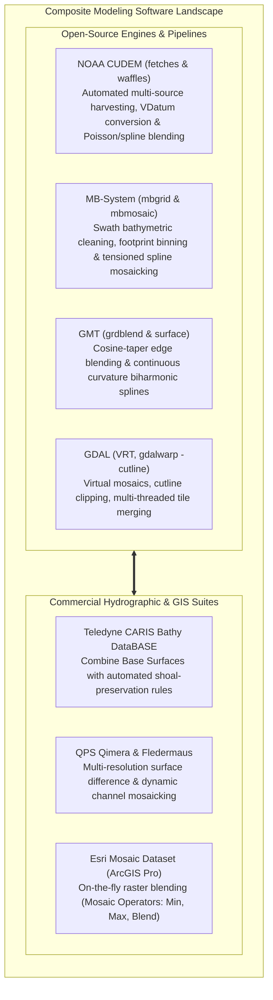

# Chapter 23: Local vs. Integrated Surveys and Building Composite DEM Products

*Reconciling isolated local surveys with global frameworks, and how to order, crop, blend, and override multi-source elevation datasets without introducing seams or destroying critical shoals.*

---

## 23.5 Software Ecosystem for Multi-Source Composite Modeling and Blending

Compiling hundreds of disparate elevation surveys into seamless composite elevation models requires software tools capable of harvesting multi-agency repositories, harmonizing datums, executing gradient-domain blending, and tracking per-pixel provenance. The software ecosystem divides into specialized scientific open-source engines and enterprise commercial database platforms.



---

### 23.5.1 Open-Source Tools and Pipelines

#### NOAA CUDEM: `fetches` and `waffles`
The **CUDEM (Continuously Updated Digital Elevation Model)** suite (developed by NOAA NCEI and CIRES in Python) is the benchmark open-source engine for generating seamless coastal topo-bathy models:
* **`fetches` (Automated Data Harvesting):** Queries and downloads data from dozens of federal and international repositories (USGS 3DEP, NOAA Digital Coast, USACE eHydro, NCEI multibeam, and NASA ICESat-2), transforming disparate vertical datums to a common geodetic surface using NOAA VDatum.
* **`waffles` (Modular Gridding & Blending Engine):** Assembles harvested soundings into composite rasters using multi-criteria weighting, Poisson surface editing, and spatial spline relaxation:

```bash
# Generate a seamless 1/9th arc-second (~3m) coastal topo-bathy CUDEM tile
# -R: Bounding box (xmin/xmax/ymin/ymax)
# -E: Grid resolution (1/9 arc-second ~ 0.0000308642 degrees)
# -M: Gridding module (surface spline in tension)
# -O: Output composite GeoTIFF
waffles -M surface:tension=0.35:extend=10 \
        -R -122.50/-122.40/37.75/37.85 \
        -E 0.0000308642 \
        -O coastal_cudem_tile \
        usgs_lidar_2022.laz:weight=10 \
        noaa_multibeam_2020.bag:weight=8 \
        usace_channel_dredge_2024.xyz:weight=12 \
        regional_crm_background.tif:weight=1
```

#### GMT: Seamless Raster Blending with `grdblend`
The Generic Mapping Tools (GMT) module `grdblend` blends multiple overlapping rasters using a continuous **2D cosine taper** across user-defined feathering buffers:

```bash
# 1. Create blend control file specifying grid filenames, bounding boxes, relative weights
cat << EOF > blend_list.txt
high_res_harbor.nc  -R-122.45/-122.40/37.80/37.85  10  -
medium_res_bay.nc   -R-122.50/-122.35/37.75/37.90   5  -
regional_base.nc    -R-122.60/-122.30/37.70/38.00   1  -
EOF

# 2. Blend grids into a seamless composite with a 100m cosine feather buffer
gmt grdblend blend_list.txt -R-122.60/-122.30/37.70/38.00 -I100e -N-9999 -C100e -Gblended_composite.nc -V
```

#### GDAL Virtual Rasters (VRT) and Cutlines
GDAL's Virtual Format (`.vrt`) mosaics thousands of individual GeoTIFF tiles into a single virtual raster without duplicating pixels on disk:

```bash
# 1. Build a virtual mosaic prioritizing newer surveys on top
gdalbuildvrt -resolution highest -overwrite composite.vrt \
    survey_2024_channel.tif \
    survey_2020_bay.tif \
    survey_2015_offshore.tif

# 2. Render seamless COG with ZSTD compression and overviews
gdal_translate -of COG -co COMPRESS=ZSTD -co PREDICTOR=3 composite.vrt final_composite.tif
```

---

### 23.5.2 Commercial Hydrographic and Enterprise Suites

#### Teledyne CARIS Bathy DataBASE
CARIS Bathy DataBASE is the premier commercial platform for hydrographic offices compiling national nautical charting bathymetry:
* **Combine Base Surfaces:** Ingests hundreds of validated BAG and VR-BAG surfaces into an enterprise database.
* **Shoal-Preservation Rules:** Employs rule-based operators that enforce **Designated Soundings**: when high-resolution nearshore surveys are merged with historical background data, the shallowest soundings on verified wrecks and rock pinnacles are hard-locked into the composite surface, preventing automated filters from smoothing away navigation hazards.

#### Esri ArcGIS Pro: Mosaic Datasets
The **Mosaic Dataset** is Esri's enterprise model for managing massive collections of overlapping elevation rasters:
* **Mosaic Operators:** Planners choose how overlapping pixels are resolved dynamically:
  * `First` / `Last`: Enforces strict chronological or priority ordering.
  * `Min` (Shoal-Biased): Preserves shallowest bathymetric depths for marine safety.
  * `Max`: Preserves highest obstacle elevations for aviation flight guidance.
  * `Blend`: Applies distance-weighted horizontal feathering across overlapping borders.

---

### 23.5.3 Software Comparison Matrix

| Software Suite | License Model | Primary Data Domain | Key Composite Blending Engine | Best-Suited Operational Role |
| :--- | :--- | :--- | :--- | :--- |
| **NOAA CUDEM (`waffles`)** | Open-Source (GPLv3) | Coastal Topo-Bathy | Multi-criteria scoring, VDatum, Poisson/splines | Building seamless coastal inundation & tsunami DEMs. |
| **MB-System (`mbgrid`)** | Open-Source (GPLv3) | Swath Bathymetry | Footprint-weighted spatial binning & splines | Research vessel multibeam swath processing and mosaicking. |
| **GMT (`grdblend`)** | Open-Source (LGPLv3) | Regional Geophysics | 2D Cosine-taper multi-grid feathering | Basin-scale geophysical, tectonic, and bathymetric synthesis. |
| **GDAL (VRT / `gdalwarp`)** | Open-Source (MIT/X) | General Raster | Virtual raster indexing, polygon cutline clipping | Cloud-native COG mosaic generation and format translation. |
| **CARIS Bathy DataBASE** | Commercial (Teledyne) | Nautical Hydrography | Combine Base Surfaces + Shoal Override rules | Compiling official IHO S-102 navigation bathymetry products. |
| **Esri Mosaic Dataset** | Commercial (Esri) | Enterprise GIS | Dynamic on-the-fly mosaic rules (Min, Max, Blend) | Enterprise web service publishing and multi-sensor catalogs. |
