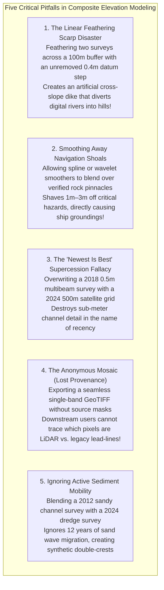

# Chapter 23: Local vs. Integrated Surveys and Building Composite DEM Products

*Reconciling isolated local surveys with global frameworks, and how to order, crop, blend, and override multi-source elevation datasets without introducing seams or destroying critical shoals.*

---

## 23.6 Common Pitfalls and Key Takeaways

Compiling disparate elevation datasets into a single composite model is an exercise in managing conflicting physical and mathematical assumptions. A modeler who relies on naive linear blending, ignores vertical datum biases, or allows automated smoothers to shave down navigation shoals creates hazardous products that corrupt hydrodynamic simulations and risk maritime groundings.

---

### 23.6.1 Common Pitfalls in Building Composite Elevation Products

#### 1. The Linear Feathering Scarp Disaster
Applying horizontal weighted feathering across overlapping surveys before reconciling their vertical datums:
* If Survey A (referenced to NAVD88) overlaps Survey B (referenced to local Mean Sea Level) with an uncorrected vertical datum offset of $\Delta z = 0.40\text{ m}$:
* A linear blend over a $100\text{-meter}$ transition zone creates a continuous $0.40\text{-meter}$ artificial ramp.
* If the terrain slopes parallel to the boundary, this artificial ramp forms a **synthetic earthen dike** running across the landscape.
* In flood inundation models, digital water backs up behind this synthetic feathering dike, falsely predicting massive neighborhood flooding and misrouting rivers into neighboring drainage basins.
* **Remedy:** Always perform 3D co-registration and vertical datum harmonization *before* merging. Use **Poisson gradient-domain blending** to absorb residual offsets without localized slope distortion.

#### 2. Smoothing Away Navigational Hazards
Allowing automated mathematical surface smoothers (e.g., biharmonic splines, bicubic resampling, or Gaussian filters) to operate unconstrained across verified navigation shoals:
* A sharp, needle-like granite rock rising to $2.5\text{ m}$ depth within an area of $25\text{-m}$ water represents an extreme high-frequency spatial spike.
* Low-pass blending filters smooth the pinnacle down by $1.0\text{–}3.0\text{ meters}$, reporting an apparent depth of $4.5\text{–}5.5\text{ m}$.
* A deep-draft commercial vessel navigating on this smoothed composite surface assumes the channel is safe, proceeds forward, and breaches its hull on the rock.
* **Remedy:** Mandate **Hard Shoal Overrides** (enforcing IHO S-102 Designated Soundings and BAG tracking lists) as the final, immutable step in the composite pipeline.

#### 3. The "Newest Is Best" Fallacy
Blindly sorting source datasets by acquisition date in automated mosaic tools (e.g., setting Esri Mosaic Operator to `Last` sorted by date):
* A coarse, low-accuracy $500\text{-meter}$ satellite altimetry grid released in 2025 will overwrite a $0.5\text{-meter}$ acoustic multibeam survey conducted in 2018.
* High-precision port channel bathymetry is wiped out and replaced by a blurry, interpolated satellite surface.
* **Remedy:** Implement **Multi-Criteria Supercession Scoring** combining resolution, sensor uncertainty, and formal survey order rather than sorting by timestamp alone.

#### 4. The Anonymous Mosaic (Lost Provenance)
Delivering a multi-source composite DEM as a single-band elevation raster without companion metadata masks:
* A civil engineering contractor or coastal modeler inspecting the surface cannot determine whether a given pixel was derived from $1\text{-cm}$ drone photogrammetry, $8\text{ pts/m}^2$ airborne LiDAR, or an interpolated 1930s lead-line smooth sheet.
* When discrepancies arise during site construction, it is impossible to audit the data lineage or assign liability.
* **Remedy:** Always deliver a companion **Source Identifier (Provenance Mask)** raster and a **Combined Uncertainty** layer alongside the composite elevation surface.

#### 5. Ignoring Active Sediment Mobility in Dynamic Channels
Merging hydrographic surveys from different years in mobile sandy estuaries without evaluating sediment transport rates:
* Submarine sand waves migrate horizontally at $10\text{–}50\text{ m/year}$.
* Merging a 2014 survey with a 2024 survey creates bizarre **double-crested sand waves** where the same physical dune appears in two different locations simultaneously.
* **Remedy:** Apply temporal uncertainty inflation models ($r_{\text{mobility}}$) and crop outdated surveys out of active sediment transport fairways.

---

### 23.6.2 Key Takeaways for Practitioners

1. **Reconcile Datums Before Blending:** Never blend two surfaces that have an uncorrected vertical datum offset. Blending spreads the error into an artificial ramp that corrupts fluid flow.
2. **Blend in the Gradient Domain:** Use Poisson surface editing ($\nabla^2 z = \nabla \cdot \mathbf{g}$) or multi-band Laplacian wavelets to absorb boundary datum steps while preserving $100\%$ of fine local slope features.
3. **Hard-Lock Navigation and Hydraulic Constraints:** Automated mathematical smoothers must never override verified rock pinnacles, shipwrecks, earthen levees, or stream thalwegs. Re-impose hard overrides as the final production step.
4. **Supercession Requires Multi-Criteria Scoring:** New data is not always better data. Weigh spatial resolution, sensor uncertainty, and sediment mobility against acquisition age.
5. **Always Preserve Per-Pixel Lineage:** Every composite DEM must include a companion integer Provenance Mask identifying the exact survey source for every cell on the grid.
