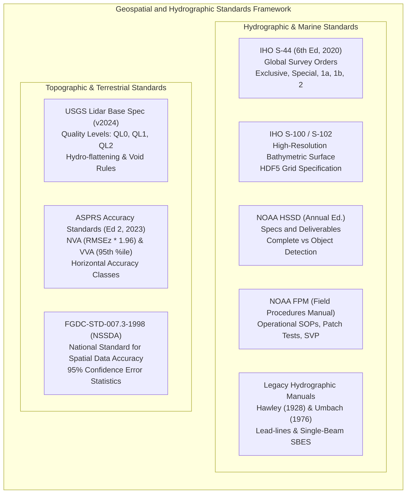

# Chapter 24: Survey Standards, Guide Documents, and Key Public DEM Products

*The official specifications that govern professional elevation and hydrographic surveys, and a critical comparison of the world's major open DEM datasets.*

---

## 24.1 Survey and Product Guide Documents

Digital elevation models are not mere mathematical surfaces; in engineering, navigation, and flood risk management, they are legal and regulatory instruments. A DEM used to dredge a shipping channel, delineate a 100-year floodplain, or guide an autonomous submarine must conform to codified, defensible survey specifications. Over the past century, national mapping agencies and international bodies have developed rigorous guide documents that translate instrument physics, statistical error bounds, and cartographic requirements into concrete operational standards.

Understanding these standards is essential not only for executing new surveys, but also for interpreting historical data: over $40\%$ of modern nautical charts and regional coastal DEMs still incorporate sounding soundings collected under historical manuals dating back to the early 20th century.

---

### 24.1.1 NOAA Hydrographic Standards: HSSD and FPM

The United States National Oceanic and Atmospheric Administration (NOAA) Office of Coast Survey (OCS) maintains the world's most detailed operational hydrographic specifications.

#### 1. NOAA Hydrographic Surveys Specifications and Deliverables (HSSD)
Updated annually since 2000, the HSSD dictates every phase of survey execution, processing, and data submission for NOAA vessels and private hydrographic contractors:

* **Coverage Types:**
  * *Object Detection Coverage:* Mandated in critical harbors, anchorages, and channels where the under-keel clearance of commercial navigation is minimal. Requires $100\%$ multibeam ensonification or $200\%$ side-scan sonar coverage capable of resolving a $1\text{-m}$ cubic hazard at depths $\le 20\text{ m}$ (or $2\text{-m}$ cube at depths $> 20\text{ m}$).
  * *Complete Bathymetric Coverage:* Mandated in open coastal waters and fairways. Eliminates the requirement to resolve $1\text{-m}$ cubes across the entire outer swath, but requires continuous, 100% gapless bathymetry with grid resolution scaling with water depth.
* **BAG Grid Resolution by Depth:**
  To maintain high detail in shallow waters without creating unmanageable file sizes offshore, HSSD mandates variable-resolution grids or depth-bracketed Bathymetric Attributed Grids (BAGs):
  $$\text{Depth Bracket } 0\text{–}20\text{ m} \implies \text{Cell Size } \le 0.50\text{ m or } 1.0\text{ m}$$
  $$\text{Depth Bracket } 20\text{–}40\text{ m} \implies \text{Cell Size } \le 1.0\text{ m or } 2.0\text{ m}$$
  $$\text{Depth Bracket } 40\text{–}80\text{ m} \implies \text{Cell Size } \le 2.0\text{ m or } 4.0\text{ m}$$
  $$\text{Depth Bracket } > 80\text{ m} \implies \text{Cell Size } \le 4.0\text{ m or } 8.0\text{ m}$$
* **Cross-line Agreement Requirements:**
  Every hydrographic survey must include orthogonal cross-lines totaling at least $4\%$ (for multibeam) or $8\%$ (for single-beam) of mainscheme linear mileage. HSSD mandates that at least $95\%$ of all grid nodes comparison differences between cross-lines and mainscheme lines must fall within the maximum allowable Total Vertical Uncertainty ($\text{TVU}_{\max}(d)$).
* **Designated Soundings & DTON Reporting:**
  * *Danger to Navigation (DTON):* Any uncharted shoal or obstruction that poses an immediate risk to surface navigation must be reported to the Marine Chart Division (MCD) within 24 hours of discovery, accompanied by raw point cloud verification and a preliminary chart cutout.
  * *Designated Sounding:* When surface gridding algorithms (such as CUBE) smooth out an authentic, hazardous high point of a rock or wreck, the hydrographer must manually flag the raw acoustic sounding as a "Designated Sounding." Gridding software must override the computed grid node with this exact shoal sounding depth.

#### 2. NOAA Field Procedures Manual (FPM)
Originally issued in 1997 and updated continuously, the FPM provides the physical recipes required to achieve HSSD compliance:
* **Patch Test Procedures:** Prescribes exact line geometry, speed variations, and seafloor topography required to resolve transducer angular mounting biases (roll $\Delta\theta_r$, pitch $\Delta\theta_p$, yaw $\Delta\theta_y$) and navigation time latency ($\Delta t_{\text{lat}}$).
* **Sound Speed Cast Protocols:** Mandates the frequency and spatial distribution of sound velocity profiler (SVP) casts or continuous Moving Vessel Profilers (MVP). If refractive "smiling" or "frowning" exceeds HSSD TVU limits at outer beams, the cast frequency must be increased or line spacing narrowed.
* **Ellipsoidally Referenced Surveys (ERS):** Field workflows for transitioning from traditional acoustic tide gauges and co-tidal discrete zoning to continuous GNSS kinematic positioning referenced to the GRS80/WGS84 ellipsoid, transformed to Low Water datums via NOAA VDatum.

#### 3. Historical Hydrographic Manuals: Hawley (1928) & Umbach (1976)
To model coastal hazards and compile composite coastal DEMs, practitioners frequently ingest soundings from smooth sheets surveyed prior to modern GPS and multibeam acoustics. Interpreting these data requires understanding the standards under which they were acquired:
* **Hawley (1928), *Hydrographic Manual* (USC&GS Special Publication 143):** Governed lead-line and early acoustic handle-sweep operations. Horizontal positioning relied on visual three-point sextant fixes to shore stations ($\sigma_{\text{pos}} \approx 10\text{–}50\text{ m}$ depending on geometry). Soundings were measured with braided hemp/lead lines marked in fathoms and feet. In depths $<10\text{ fathoms}$ ($18.3\text{ m}$), lead-line precision was typically $\pm 0.1\text{–}0.2\text{ m}$, but bottom coverage was essentially $0\%$ between discrete cast points spaced $50\text{–}100\text{ m}$ apart.
* **Umbach (1976), *Hydrographic Manual* (NOAA 4th Edition):** Governed the analog single-beam era (Raytheon 723, Ross Fineline echosounders). Horizontal positioning utilized microwave electronic systems (Raydist, Hi-Fix, Del Norte Trisponder) with horizontal precision of $\pm 5\text{–}15\text{ m}$. Vertical precision was analog paper trace interpretation ($\pm 0.3\text{ m}$), heavily degraded by uncorrected vessel squat, swell heave, and coarse discrete tide tables.

---

### 24.1.2 International Hydrographic Organization (IHO) Standards

The International Hydrographic Organization (IHO), headquartered in Monaco, sets universal baseline standards for the 98+ maritime nations across the globe.

#### 1. IHO S-44: Standards for Hydrographic Surveys (6th Edition, 2020)
IHO S-44 defines global survey categories. The 6th Edition introduced the "Exclusive Order" for critical port fairways:

| Survey Order | Target Environment & Operational Purpose | Feature Detection Capability | Horizontal Uncertainty ($\text{THU}_{\max}$) at 95% | Vertical Uncertainty ($\text{TVU}_{\max}$) at 95% ($a, b$) |
| :--- | :--- | :--- | :--- | :--- |
| **Exclusive Order** | Strict under-keel clearance ($<1\text{ m}$); critical berths, drydocks, and channel chokepoints | Cubic features $> 0.5\text{ m}$ | $1.0\text{ m}$ | $a = 0.15\text{ m}, \quad b = 0.0075$ |
| **Special Order** | Harbors, berthing areas, and associated critical fairways with limited clearance | Cubic features $> 1.0\text{ m}$ | $2.0\text{ m}$ | $a = 0.25\text{ m}, \quad b = 0.0075$ |
| **Order 1a** | Harbors, coastal approaches, and areas where under-keel clearance is an issue ($d \le 100\text{ m}$) | Cubic features $> 2.0\text{ m}$ in $d \le 40\text{ m}$; $10\% d$ in $d > 40\text{ m}$ | $5.0\text{ m} + 0.05 \cdot d$ | $a = 0.50\text{ m}, \quad b = 0.0130$ |
| **Order 1b** | Areas where under-keel clearance is not critical to surface navigation ($d \le 100\text{ m}$) | Feature detection not required; general bathymetry only | $5.0\text{ m} + 0.05 \cdot d$ | $a = 0.50\text{ m}, \quad b = 0.0130$ |
| **Order 2** | Open ocean, shelf waters $> 100\text{ m}$ depth where general bathymetry is sufficient | Feature detection not required | $20.0\text{ m} + 0.10 \cdot d$ | $a = 1.00\text{ m}, \quad b = 0.0230$ |

The allowable vertical uncertainty at depth $d$ is computed via:
$$\text{TVU}_{\max}(d) = \sqrt{a^2 + (b \cdot d)^2}$$
where parameter $a$ represents fixed vertical error independent of depth (e.g., heave sensor noise, tide datum conversion, antenna height measurement) and $b$ represents depth-dependent vertical error (e.g., sound velocity profile refraction, acoustic beam spreading, transducer tilt).

#### 2. IHO S-100 Framework and S-102 Bathymetric Surface Specification
The IHO S-100 Universal Hydrographic Data Model is replacing the legacy S-57 vector chart standard. Within this modern geospatial framework, **S-102** defines the specification for high-resolution bathymetric surface products:
* Built upon the HDF5 hierarchical container format.
* Stores primary depth rasters alongside per-cell Total Vertical Uncertainty (TVU), tracking list datasets, and metadata provenance.
* Enables dynamic, real-time depth contour generation and safety-depth shading on electronic chart display systems (ECDIS) based on a vessel's real-time draft, squat, and tidal stage.

---

### 24.1.3 Terrestrial LiDAR and Photogrammetric Standards: USGS 3DEP & ASPRS

On land, national elevation models are governed by geodetic accuracy standards rooted in statistical error propagation over open vs. vegetated surfaces.

#### 1. USGS Lidar Base Specification (3D Elevation Program - 3DEP)
Maintained by the National Geospatial Program of the USGS, the Lidar Base Specification establishes strict technical baselines for all airborne LiDAR collections across the United States.

* **Quality Levels (QL):**

| Quality Level | Minimum Pulse Density ($\text{pls/m}^2$) | Nominal Pulse Spacing ($\text{NPS}$) | Vertical Accuracy ($\text{RMSE}_z$ Non-Vegetated) | Required Grid Cell Size |
| :--- | :--- | :--- | :--- | :--- |
| **QL0** | $\ge 16.0$ | $\le 0.25\text{ m}$ | $\le 5.0\text{ cm}$ | $0.25\text{–}0.50\text{ m}$ |
| **QL1** | $\ge 8.0$ | $\le 0.35\text{ m}$ | $\le 10.0\text{ cm}$ | $0.50\text{ m}$ |
| **QL2** | $\ge 2.0$ | $\le 0.70\text{ m}$ | $\le 10.0\text{ cm}$ | $1.0\text{ m}$ |
| **QL3** | $\ge 0.5$ | $\le 1.40\text{ m}$ | $\le 20.0\text{ cm}$ | $2.0\text{ m}$ |

* **Hydro-Flattening Requirements:**
  USGS 3DEP establishes non-negotiable rules for cartographic and hydraulic hydro-flattening in bare-earth DTMs:
  * *Inland Lakes and Ponds:* All standing waterbodies with an area $\ge 2\text{ acres}$ ($\sim 8,000\text{ m}^2$) must be flattened to a single monotonic, constant elevation equal to or immediately below the surrounding bankline.
  * *Inland Streams and Rivers:* All flowing waterbodies with a nominal width $\ge 30\text{ m}$ ($\sim 100\text{ ft}$) must be carved as flat monotonic channels that decrease strictly downstream, preventing digital water from flowing uphill across pool-riffle sequences.
  * *Tidal Waters:* Estuaries, sounds, and oceans must be flattened to the water level at the time of flight or tidal datum boundary.

#### 2. ASPRS Positional Accuracy Standards for Digital Geospatial Data (2014 / 2nd Ed. 2023)
The American Society for Photogrammetry and Remote Sensing (ASPRS) standard decoupled accuracy metrics from traditional map scale (e.g., "1 inch = 100 feet") and contour intervals, defining precision purely by statistical error over distinct land covers:

* **Non-Vegetated Vertical Accuracy (NVA):**
  Evaluated exclusively on flat, open terrain (asphalt, concrete, bare soil, short turf) where laser returns directly strike the bare ground:
  * Evaluated using Gaussian error theory:
    $$\text{RMSE}_z = \sqrt{\frac{1}{n} \sum_{i=1}^n (z_{\text{DEM},i} - z_{\text{GCP},i})^2}$$
    $$\text{NVA (at 95\% confidence level)} = 1.9600 \cdot \text{RMSE}_z$$
* **Vegetated Vertical Accuracy (VVA):**
  Evaluated in brush, tall weeds, crops, and dense forested canopies where laser pulses may partially reflect off leaves, branches, or understory vegetation, introducing a positive vertical bias:
  * Evaluated using non-parametric statistics (due to skewness and non-normality):
    $$\text{VVA (at 95\% confidence level)} = 95\text{th percentile of absolute vertical errors } (|z_{\text{DEM}} - z_{\text{GCP}}|)$$
* **Low Confidence Polygons:** Areas where dense ground vegetation, standing water, or steep topography obscures the bare-earth model must be explicitly delineated with companion vector polygons, signaling to downstream structural and hydraulic engineers that the surface cannot be certified to standard NVA tolerances.
