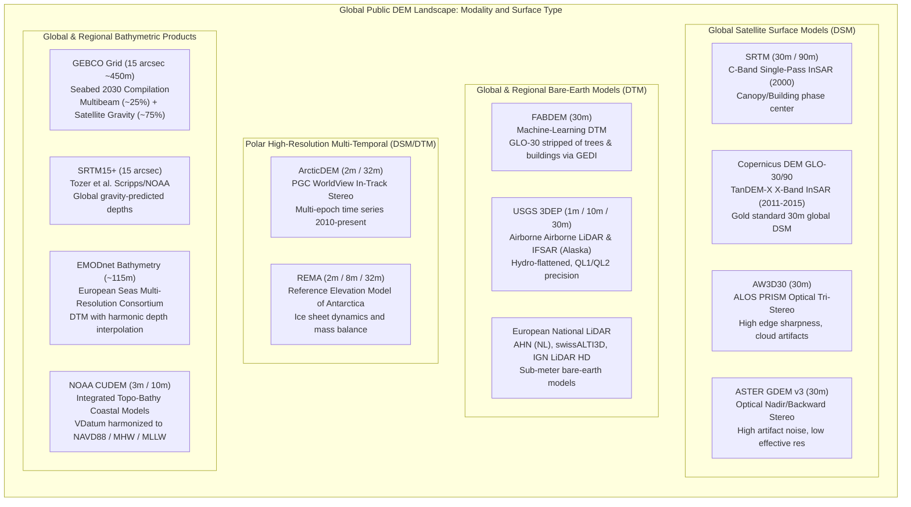
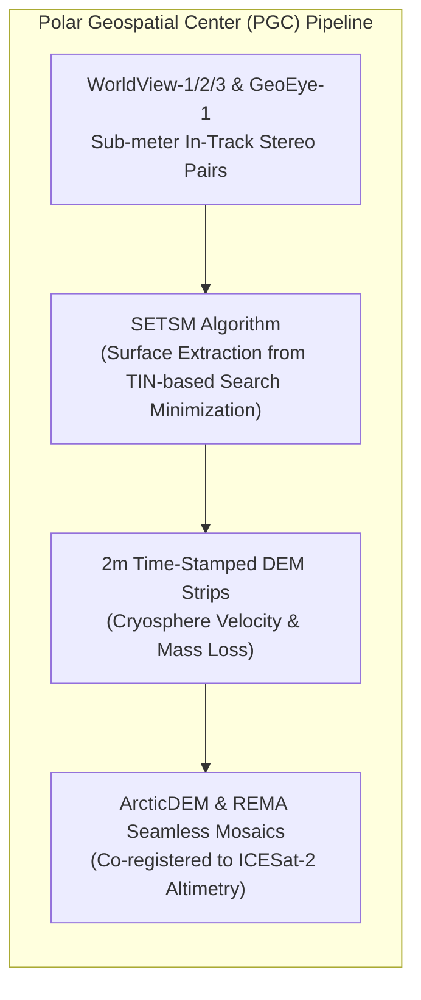
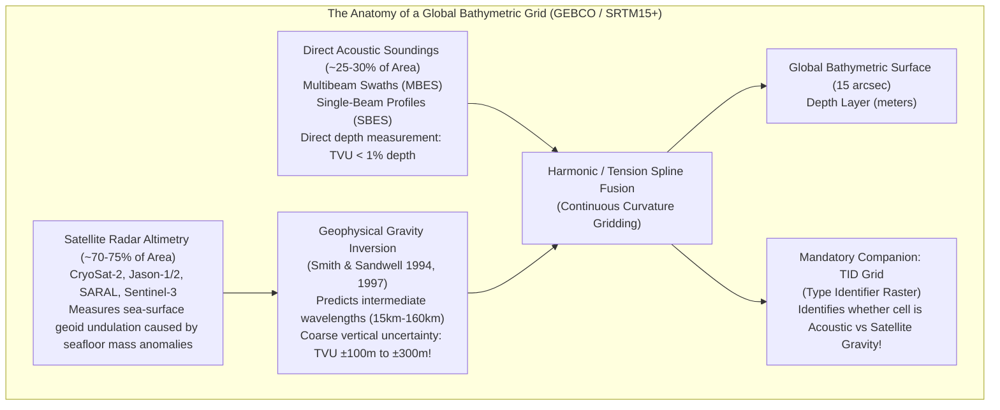

# Chapter 24: Survey Standards, Guide Documents, and Key Public DEM Products

*The official specifications that govern professional elevation and hydrographic surveys, and a critical comparison of the world's major open DEM datasets.*

---

## 24.2 Key Public DEM Products and How They Compare

Over the past three decades, satellite remote sensing, airborne campaigns, and international ocean mapping consortia have made vast digital elevation models freely accessible to the public. However, practitioners routinely stumble into catastrophic analytical errors by treating all "elevation" grids as interchangeable bare-earth terrain models. A flood modeler who deploys a radar DSM (reflecting the top of a dense forest canopy) instead of a bare-earth DTM will erroneously conclude that a low-lying swamp sits $25\text{ meters}$ above flood stage. Similarly, an ocean engineer who assumes a $450\text{-meter}$ GEBCO bathymetric grid represents measured multibeam soundings will design an offshore cable route across synthetic bathymetry predicted purely from satellite marine gravity anomalies.

This section provides an exhaustive, comparative forensic evaluation of the world's primary open-access digital elevation products across terrestrial, polar, and marine domains.

---

### 24.2.1 Global and Quasi-Global Terrestrial Surface Models

#### 1. SRTM (Shuttle Radar Topography Mission) and NASADEM
* **Sensing Modality:** C-band ($5.6\text{ cm}$, $5.3\text{ GHz}$) spaceborne single-pass interferometric synthetic aperture radar (InSAR), flown aboard Space Shuttle *Endeavour* (STS-99) in February 2000. Operating with a $60\text{-meter}$ deployable mast, SRTM captured the first homogeneous elevation model spanning $60^\circ\text{N}$ to $56^\circ\text{S}$ ($80\%$ of Earth's landmass).
* **Grid Spacing & Datum:** 1 arc-second ($\sim 30\text{ m}$) and 3 arc-second ($\sim 90\text{ m}$); horizontal datum WGS84; vertical datum EGM96 geoid.
* **Surface Type & Physics:** **Digital Surface Model (DSM)**. At C-band wavelengths, the radar scattering phase center penetrates only partially into vegetation canopies, returning an effective elevation roughly $50\text{–}70\%$ of canopy height above the true ground. In urban areas, it measures building roofs and averaged street canyons.
* **Artifacts & Limitations:**
  * Severe void zones in steep topography (Himalayas, Andes) caused by radar shadow, foreshortening, and layover.
  * Long-wavelength striped roll/pitch ripples ($\pm 1\text{–}3\text{ m}$ amplitude) caused by thermal oscillations of the Shuttle's $60\text{-m}$ mast during day/night orbital cycles.
* **NASADEM (2020 Reprocessing):** NASA reprocessed the raw 2000 radar signal data using modern multi-pass interferometry, calibrating the radar phase against spaceborne LiDAR control points from ICESat GLAS ($2003\text{–}2009$). Voids were filled using prioritized auxiliary sources (ASTER GDEM v3, ALOS AW3D30, and high-resolution commercial DEMs), dramatically reducing phase unwind errors and mast striping.

#### 2. Copernicus DEM (GLO-30 and GLO-90)
* **Sensing Modality:** X-band ($3.1\text{ cm}$, $9.6\text{ GHz}$) single-pass bistatic InSAR acquired by the German Aerospace Center (DLR) twin satellites TerraSAR-X and TanDEM-X between 2010 and 2015. Released openly by ESA/Airbus under the Copernicus programme.
* **Grid Spacing & Datum:** GLO-30 (1 arc-second, $\sim 30\text{ m}$) and GLO-90 (3 arc-second, $\sim 90\text{ m}$); WGS84 horizontal; EGM2008 vertical geoid.
* **Quality & Accuracy:** The undisputed gold standard for open global satellite elevation modeling. Demonstrates an absolute vertical accuracy ($\text{RMSE}_z$) of $<1.5\text{–}2.0\text{ m}$ globally over flat open terrain, outperforming SRTM by a factor of three.
* **Cartographic Editing:** Unlike raw TanDEM-X WorldDEM, Copernicus DEM underwent extensive hydrological editing: ocean coastlines are buffered and flattened to $0.0\text{ m}$ geoid elevation; inland lakes $\ge 0.2\text{ km}^2$ are flattened to constant elevations; and major rivers $\ge 100\text{ m}$ wide are enforced with monotonic downstream gradients.
* **Surface Type:** DSM. Because X-band has negligible canopy penetration ($<10\text{–}20\%$ into top leaves), GLO-30 measures the outermost canopy crown and urban rooftop envelopes.

#### 3. FABDEM (Forest And Buildings Removed Copernicus DEM)
* **Creation Methodology:** Developed by Hawker et al. (University of Bristol, 2022). Applies a machine-learning random forest regression model to Copernicus GLO-30, trained against millions of spaceborne LiDAR bare-earth footings from NASA's GEDI (Global Ecosystem Dynamics Investigation) and ICESat-2, along with airborne LiDAR DTMs.
* **Significance:** Represents the first globally consistent, open-access $30\text{-meter}$ **bare-earth Digital Terrain Model (DTM)** spanning $80^\circ\text{N}$ to $60^\circ\text{S}$.
* **Performance & Caveats:** Effectively removes $80\text{–}90\%$ of forest canopy height offsets and urban building blocks, dropping vertical bias in forested floodplains from $+12\text{ m}$ (in GLO-30) to $<1.0\text{ m}$. However, the machine learning algorithm can over-smooth steep, narrow topographic ridges, knife-edge cliffs, and natural river levees.

#### 4. ASTER GDEM v3 and ALOS AW3D30
* **ASTER GDEM v3 (2019):** Generated by METI (Japan) and NASA using optical along-track stereoscopic correlation from the Terra ASTER nadir and backward-looking telescopes. Covers $83^\circ\text{N}$ to $83^\circ\text{S}$. While broad in coverage, optical correlation is degraded by cloud cover, snowfields, and shadows. The effective spatial resolution is degraded to $\sim 70\text{–}120\text{ m}$ due to multi-image stacking filters, and it suffers from severe high-frequency pit and bump noise ("orange peel" texture). Should only be used when no radar or LiDAR coverage exists.
* **ALOS World 3D (AW3D30):** Generated by JAXA using optical tri-stereo imagery from the PRISM instrument on ALOS ($2006\text{–}2011$). Provides sharp horizontal delineation of ridgelines and urban perimeters, though early versions suffered from $1\text{-meter}$ vertical integer quantization stepping.

---

### 24.2.2 Polar and High-Resolution Regional Terrestrial Products

#### 1. ArcticDEM and REMA (Reference Elevation Model of Antarctica)
* **Developer:** Polar Geospatial Center (PGC) at the University of Minnesota, funded by the US National Science Foundation (NSF).
* **Sensor Modality:** High-resolution optical stereophotogrammetry from the Maxar (DigitalGlobe) satellite constellation (WorldView-1, WorldView-2, WorldView-3, and GeoEye-1) at native ground sample distances of $0.3\text{–}0.5\text{ m}$.
* **Processing:** Processed fully automatically using the open-source **SETSM** (Surface Extraction from TIN-based Search-space Minimization) algorithm running on petascale supercomputers (Blue Waters).
* **Deliverables:**
  * *Strip DEMs ($2\text{-m}$ resolution):* Individual stereopair footprints with absolute timestamps ($\pm 1\text{ second}$). Because glaciers and sea ice move rapidly, these multi-temporal strips allow direct calculation of glacial thinning, ice-shelf collapse, and retrogressive permafrost thaw slumps ($\frac{\partial z}{\partial t}$).
  * *Mosaics ($2\text{-m}, 8\text{-m}, 32\text{-m}$):* Seamless regional terrain models co-registered and vertically adjusted using spaceborne laser altimetry from ICESat-1 and ICESat-2.

#### 2. USGS 3DEP (3D Elevation Program)
* **Scope:** Systematic coverage of the conterminous United States, Hawaii, and US territories via high-density airborne LiDAR, and Alaska via airborne interferometric synthetic aperture radar (IFSAR).
* **Tiers of Resolution:**
  * *1-meter Bare-Earth DTMs:* Derived strictly from Quality Level 2 ($QL2 \ge 2\text{ pls/m}^2$, $\text{RMSE}_z \le 10\text{ cm}$) or Quality Level 1 ($QL1 \ge 8\text{ pls/m}^2$) airborne LiDAR collections.
  * *Standard Seamless Products:* $1/3\text{ arc-second}$ ($\sim 10\text{ m}$) and $1\text{ arc-second}$ ($\sim 30\text{ m}$) seamless national grids.
  * *Alaska 5-meter IFSAR:* X-band/C-band airborne radar mapping penetrating chronic sub-Arctic cloud cover.
* **Hydrographic Integration:** Full hydro-flattening of all open waterbodies and monotonic gradient enforcement of flowing streams.

#### 3. European National LiDAR Models
European mapping agencies provide public open data representing some of the highest-density bare-earth elevation models in the world:
* **AHN (Actueel Hoogtebestand Nederland):** AHN3 and AHN4 provide $0.5\text{-meter}$ bare-earth DTMs and classified point clouds ($>10\text{–}20\text{ pts/m}^2$) covering the entire Netherlands, essential for national dike safety and sea-level rise modeling.
* **swissALTI3D (Swisstopo):** $0.5\text{-meter}$ national DTM derived from airborne LiDAR below $2000\text{ m}$ elevation and stereo aerial photogrammetry in extreme alpine glaciated peaks, updated on a 6-year revision cycle with vertical accuracy of $\pm 0.1\text{–}0.3\text{ m}$ in non-alpine zones.
* **IGN LiDAR HD (France):** Multi-year nationwide campaign collecting $\ge 10\text{ pts/m}^2$ nationwide, providing $1\text{-meter}$ classified DTMs and DSMs.
* **UK Environment Agency (Defra):** Open $1\text{-meter}$ national LiDAR composite across England and Wales.

---

### 24.2.3 Global and Regional Bathymetric and Topo-Bathy Products

The ocean floor presents a fundamental physics barrier: electromagnetic waves (radar, LiDAR, optics) attenuate within centimeters to dozens of meters in seawater. Consequently, global bathymetric models are hybrid compilations that must bridge the vast divide between high-resolution acoustic soundings and coarse, gravity-interpolated deep-ocean depths.

#### 1. GEBCO (General Bathymetric Chart of the Oceans) & SRTM15+
* **The Nippon Foundation-GEBCO Seabed 2030 Project:** Operates under the joint auspices of the IHO and the Intergovernmental Oceanographic Commission (IOC) of UNESCO, targeting 100% of the world's ocean floor mapped by 2030.
* **Spatial Resolution:** 15 arc-seconds ($\sim 450\text{ m}$ at the equator). SRTM15+ (developed by Tozer, Sandwell, Smith et al. at Scripps Institution of Oceanography) forms the base bathymetric layer of the GEBCO grid.
* **The Dual Nature of the Surface:**
  * Approximately **$25\text{–}30\%$** of the grid cells are constrained by direct acoustic measurements (shipborne multibeam swaths, single-beam tracks, or airborne bathymetric LiDAR).
  * The remaining **$70\text{–}75\%$** of the global seafloor contains **no direct depth soundings**. These cells are mathematically predicted from marine gravity anomalies derived from satellite radar altimeter measurements of sea surface slopes (CryoSat-2, SARAL/AltiKa, Jason-1/2).
* **The Type Identifier (TID) Grid:**
  GEBCO publishes an indispensable companion raster: the **TID Grid**. Every single pixel in the elevation model has a corresponding integer code indicating how that depth was determined:
  * `TID 11`: Multibeam acoustic sounding (highest confidence, $\sigma_z \approx 0.5\text{–}20\text{ m}$).
  * `TID 13`: Single-beam sounding line (good depth, but zero cross-track feature detection).
  * `TID 41`: Predicted bathymetry derived purely from satellite marine gravity (uncertainty often $\pm 100\text{–}300\text{ m}$ over rugged seamounts or sediment-blanketed basements).
  * `TID 70`: Interpolated pre-existing regional grid.

#### 2. NOAA CUDEM (Continuously Updated Digital Elevation Model)
* **Scope & Geometry:** High-resolution integrated topographic-bathymetric ("topo-bathy") coastal DEMs covering the US Atlantic, Pacific, Gulf, and Great Lakes coasts. Published at $1/9\text{ arc-second}$ ($\sim 3\text{ m}$) and $1/3\text{ arc-second}$ ($\sim 10\text{ m}$).
* **Seam Elimination:** Uses NOAA VDatum to transform disparate land elevations (NAVD88) and nautical soundings (Mean Lower Low Water - MLLW) to a common geodetic reference frame before performing adaptive continuous-curvature spline gridding (`waffles`).

#### 3. EMODnet Bathymetry
* **Scope:** Comprehensive digital bathymetric model covering all European marine basins (North Sea, Baltic Sea, Mediterranean, Black Sea, Celtic Seas, and Arctic Europe).
* **Grid Spacing:** $1/16\text{ arc-minute}$ ($\sim 115\text{ m} \times 115\text{ m}$).
* **Harmonized Metadata:** Compiles over 16,000 discrete survey datasets contributed by European hydrographic offices, research institutes, and offshore industry partners, complete with per-cell Quality Index (QI) and vertical reference documentation.

---

### 24.2.4 Comprehensive Comparative Matrix

| Product Name | Producer / Curator | Spatial Resolution | Coverage Span | Modality / Sensor | Surface Type | Absolute Vert. Accuracy ($\text{RMSE}_z$) | Primary Use Cases & Operational Niches |
| :--- | :--- | :--- | :--- | :--- | :--- | :--- | :--- |
| **Copernicus GLO-30** | ESA / Airbus | $1\text{ arcsec}$ ($30\text{ m}$) | Global ($90^\circ\text{N}\text{–}90^\circ\text{S}$) | X-band Bistatic InSAR (TanDEM-X) | **DSM** | $1.5\text{–}2.5\text{ m}$ | Baseline global terrain, ortho-rectification, line-of-sight analysis. |
| **FABDEM** | Univ. Bristol / Hawker | $1\text{ arcsec}$ ($30\text{ m}$) | Global ($80^\circ\text{N}\text{–}60^\circ\text{S}$) | Machine Learning on GLO-30 + GEDI LiDAR | **DTM** | $1.8\text{–}3.2\text{ m}$ | Regional and global flood inundation, geomorphology, drainage modeling. |
| **NASADEM** | NASA / JPL | $1\text{ arcsec}$ ($30\text{ m}$) | $60^\circ\text{N}\text{–}56^\circ\text{S}$ | Reprocessed C-band InSAR + ICESat GLAS | **DSM** | $3.5\text{–}5.5\text{ m}$ | Historical baseline comparisons against Feb 2000 state of Earth. |
| **AW3D30** | JAXA | $1\text{ arcsec}$ ($30\text{ m}$) | $82^\circ\text{N}\text{–}82^\circ\text{S}$ | Tri-stereo Optical (ALOS PRISM) | **DSM** | $2.5\text{–}4.5\text{ m}$ | High-latitude terrain where SRTM has no coverage; sharp ridgelines. |
| **ASTER GDEM v3** | METI / NASA | $1\text{ arcsec}$ ($30\text{ m}$) | $83^\circ\text{N}\text{–}83^\circ\text{S}$ | Optical Stereo (Terra ASTER) | **DSM** | $6.0\text{–}12.0\text{ m}$ | Legacy reference; superseded by Copernicus GLO-30. |
| **USGS 3DEP** | USGS | $1\text{ m} \text{ \& } 10\text{ m}$ | United States (CONUS, AK, HI) | Airborne LiDAR (QL1/QL2) & IFSAR | **DTM** | $0.05\text{–}0.15\text{ m}$ (LiDAR) | Engineering design, FEMA flood insurance, local civil infrastructure. |
| **ArcticDEM / REMA** | PGC / NSF | $2\text{ m} \text{ \& } 32\text{ m}$ | Arctic ($>60^\circ\text{N}$) / Antarctica ($>60^\circ\text{S}$) | Optical In-Track Stereo (WorldView 1-3) | **DSM/DTM** | $0.2\text{–}1.0\text{ m}$ (co-reg) | Glaciology, ice sheet volume loss, permafrost subsidence monitoring. |
| **GEBCO 2024 / SRTM15+** | Nippon Fdn-GEBCO / Scripps | $15\text{ arcsec}$ ($\sim 450\text{ m}$) | Global Oceans ($90^\circ\text{N}\text{–}90^\circ\text{S}$) | Swath Multibeam (25%) + Sat. Gravity (75%) | **Bathy / Topo-Bathy** | Variable ($\pm 1\text{ m}$ to $\pm 250\text{ m}$) | Global ocean circulation, tsunami propagation, deep-sea exploration. |
| **NOAA CUDEM** | NOAA NCEI | $1/9\text{"} (3\text{ m}) \text{ \& } 1/3\text{"} (10\text{ m})$ | US Coastal Zones | Harmonized Multibeam + Topo-Bathy LiDAR | **Topo-Bathy DTM** | $0.15\text{–}0.50\text{ m}$ | Storm surge modeling, sea-level rise inundation, coastal resilience. |
| **EMODnet Bathy** | European Consortium | $1/16\text{ arcmin}$ ($\sim 115\text{ m}$) | All European Marine Basins | Multibeam + Hydrographic Surveys | **Bathy DTM** | Variable ($\pm 0.5\text{ m}$ to $\pm 20\text{ m}$) | European marine spatial planning, offshore wind farm siting, habitat mapping. |
