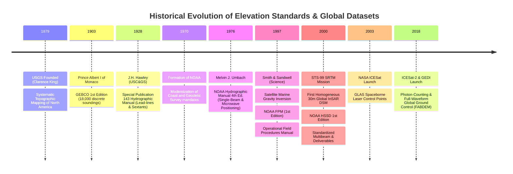

# Chapter 24: Survey Standards, Guide Documents, and Key Public DEM Products

*The official specifications that govern professional elevation and hydrographic surveys, and a critical comparison of the world's major open DEM datasets.*

---

## 24.3 Historical Evolution: From 19th-Century Manuals to Spaceborne Photons

The codification of elevation standards and the creation of open public DEM products did not emerge overnight. They represent a century-and-a-half progression from physical sounding weights and planetable topography to interferometric spaceborne radar and photon-counting orbital lasers. The milestones below, anchored in the `schwehr/gis-history` repository, illustrate how institutional mandates, catastrophic navigation accidents, and technological revolutions drove modern spatial standards.

---

### 24.3.1 Institutional Origins: 1879 USGS and 1903 GEBCO

#### 1879: Foundation of the United States Geological Survey (USGS)
Prior to 1879, topographic mapping of the American West was divided among rival military and civilian expeditions (the Wheeler, Hayden, King, and Powell surveys). On March 3, 1879, the 45th United States Congress enacted legislation establishing the USGS under its first director, Clarence King. 

The USGS standardized topographic cartography, establishing the $7.5\text{-minute}$ quadrangle series at $1:24,000$ scale. Field topographers mapped relief using planetables, alidades, and aneroid barometers. Crucially, King and his successor, John Wesley Powell, established the principle that national topography is a public good, creating the institutional mandate that culminated in the 3D Elevation Program (3DEP).

#### 1903: Prince Albert I of Monaco and the Birth of GEBCO
At the 7th International Geographical Congress in Berlin (1899), oceanographers recognized that deep-ocean soundings were scattered across private logbooks and colonial hydrographic offices. Prince Albert I of Monaco organized and financed a dedicated commission of oceanographers to compile the world's first unified bathymetric chart.

In 1903, Prince Albert published the **1st Edition of the General Bathymetric Chart of the Oceans (GEBCO)**:
* Consisted of 24 paper charts covering the globe from $72^\circ\text{N}$ to $72^\circ\text{S}$.
* Constrained by just **$18,000$ discrete depth soundings** across all the world's oceans (an average of one sounding per $20,000\text{ km}^2$!).
* Depths were hand-drawn into depth contour zones using bathymetric tints. This marked the founding of the international hydrographic cooperative framework that continues today under the IHO and UNESCO Seabed 2030 project.

---

### 24.3.2 The Manual Era: Hawley (1928) and Umbach (1976)

#### 1928: Hawley's *Hydrographic Manual* (USC&GS Special Publication 143)
Commander J.H. Hawley of the U.S. Coast and Geodetic Survey codified the rigorous operational rules of the pre-electronic era. Under Hawley's manual:
* Horizontal position was fixed by the "three-point problem" (measuring two horizontal angles simultaneously between three charted shore signals using brass sextants).
* Depths were obtained using the lead-line: a $10\text{-lb}$ to $20\text{-lb}$ lead weight attached to a hemp line soaked in tallow and beeswax to prevent stretching.
* In shoals and boulder fairways where lead-lines missed pinnacles between casts, Hawley mandated the **wire drag**: a continuous submerged horizontal wire supported by buoys and towed between two vessels. If the wire snagged, hydrographers verified the obstruction with direct divers. This established the conceptual foundation for modern "Object Detection" standards.

#### 1970: Creation of NOAA
On October 3, 1970, President Richard Nixon implemented Reorganization Plan No. 4, consolidating the Coast and Geodetic Survey (founded 1807 by Thomas Jefferson), the Weather Bureau, and the Bureau of Commercial Fisheries into the **National Oceanic and Atmospheric Administration (NOAA)**. The Coast and Geodetic Survey became NOAA's Office of Coast Survey (OCS).

#### 1976: Umbach's *Hydrographic Manual* (4th Edition)
Captain Melvin J. Umbach published what became the definitive global textbook of the late-20th-century analog hydrographic survey:
* Standardized analog single-beam echosounding (Raytheon DE-723 and Ross 200 instruments operating at $100\text{–}200\text{ kHz}$).
* Detailed the transition to shore-based microwave positioning (Raydist, Cubic Argo, Motorola Mini-Ranger, Del Norte Trisponder).
* Codified vessel dynamic squat tests, bar checks for acoustic sound speed calibration, and lead-line verification of analog chart traces.

---

### 24.3.3 The Digital and Satellite Revolution: 1997 to 2000

#### 1997: Satellite Gravity Bathymetry & The First NOAA FPM
The year 1997 marked a twin revolution in marine elevation modeling:
1. **The Smith & Sandwell Breakthrough:** In October 1997, Walter H. F. Smith and David T. Sandwell published their landmark paper in *Science*, "Bathymetric Topography from Satellite Altimetry and Ship Depth Soundings." By declassifying and combining US Navy Geosat and ESA ERS-1 radar altimetry data, they demonstrated that intermediate-wavelength marine gravity anomalies ($15\text{–}160\text{ km}$) correlate directly with seafloor topography. This provided the first continuous, high-resolution bathymetric estimation of the global ocean floor, forming the direct ancestor of SRTM15+ and modern GEBCO grids.
2. **NOAA Field Procedures Manual (FPM):** In 1997, NOAA OCS issued the 1st Edition of the FPM, transitioning field units from paper-based analog survey logs to computerized data collection systems (Coastal Oceanographics Hypack), high-accuracy DGPS navigation, and early shallow-water multibeam sonar (Reson SeaBat 9001/8101).

#### 2000: SRTM (STS-99) and the First NOAA HSSD
In February 2000, two milestones redefined spatial elevation standards:
1. **Shuttle Radar Topography Mission (SRTM):** Flown aboard the Space Shuttle *Endeavour* (STS-99), SRTM mapped $80\%$ of Earth's land area in 11 days using a $60\text{-meter}$ mast. It produced the first homogeneous, high-resolution digital surface model of the world (1 arc-second $30\text{ m}$ for the US, 3 arc-second $90\text{ m}$ global). SRTM became the primary global elevation reference for two decades.
2. **NOAA HSSD Codification:** In 2000, NOAA published the first formal edition of the *Hydrographic Surveys Specifications and Deliverables*. The 2000 HSSD broke decisively from single-beam line spacing guidelines, establishing mathematical statistical standards for multibeam swath coverage, Total Propagated Error (TPE/TPU), and digital data deliverables.

---

### 24.3.4 The Spaceborne LiDAR and Open Data Era: 2003 to 2018+

#### 2003: ICESat GLAS
In January 2003, NASA launched the **Ice, Cloud, and land Elevation Satellite (ICESat)** carrying the Geoscience Laser Altimeter System (GLAS). Operating with a $1064\text{-nm}$ infrared Nd:YAG laser, GLAS fired 40 pulses per second, projecting $60\text{-meter}$ laser footprints spaced $170\text{ m}$ apart along track. While designed for polar ice sheets, GLAS provided tens of millions of sub-decimeter vertical ground control points across the globe, allowing scientists to identify and calibrate long-wavelength vertical errors in SRTM and ASTER GDEM.

#### 2018: ICESat-2 (ATLAS) and GEDI (ISS)
In 2018, spaceborne elevation sensing achieved an order-of-magnitude leap in precision and density:
1. **ICESat-2 (September 2018):** Carrying the Advanced Topographic Laser Altimeter System (ATLAS), ICESat-2 replaced coarse full-waveform pulses with **micropulse photon-counting LiDAR** ($532\text{-nm}$ green laser). Firing at $10\text{ kHz}$, ATLAS projects six beams arranged in three pairs, measuring individual returning photons every $0.7\text{ m}$ along track with a $11\text{-meter}$ footprint. This provides sub-decimeter vertical profiles across ice, open ground, and shallow coastal waters.
2. **GEDI (December 2018):** Mounted on the International Space Station, the Global Ecosystem Dynamics Investigation deployed high-power $1064\text{-nm}$ multi-beam waveform LiDAR specifically optimized to penetrate dense forest canopies between $51.6^\circ\text{N}$ and $51.6^\circ\text{S}$. 

Together, ICESat-2 and GEDI provided the global ground control truth that made possible next-generation bare-earth terrain models such as **FABDEM**, transforming radar surface models into authentic bare-earth digital terrain models.
