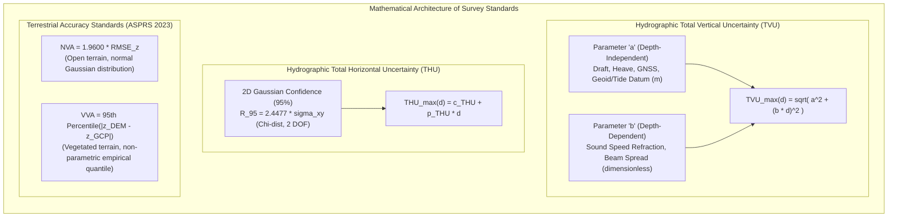
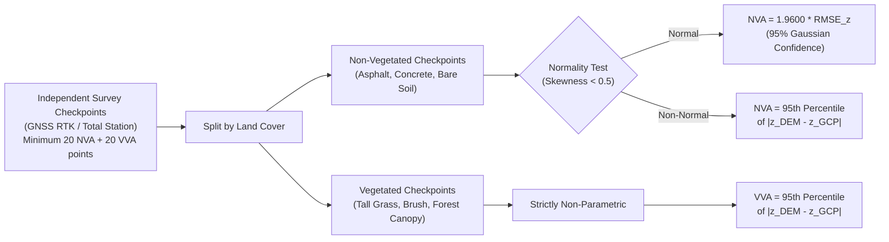

# Chapter 24: Survey Standards, Guide Documents, and Key Public DEM Products

*The official specifications that govern professional elevation and hydrographic surveys, and a critical comparison of the world's major open DEM datasets.*

---

## 24.4 Mathematical Foundations of Survey Standards

Both marine hydrographic standards (IHO S-44, NOAA HSSD) and terrestrial elevation standards (ASPRS, USGS 3DEP) are built upon rigorous statistical error propagation. Rather than defining accuracy as a vague single number, modern standards formulate allowable error as a continuous function of environmental depth, sensing geometry, and statistical confidence levels.

---

### 24.4.1 Hydrographic Vertical Uncertainty: The TVU Equation

Under IHO S-44 (6th Edition) and the NOAA HSSD, the maximum allowable Total Vertical Uncertainty ($\text{TVU}_{\max}$) at the **$95\%$ confidence level** is specified as a monotonic function of water depth $d$:

$$\text{TVU}_{\max}(d) = \sqrt{a^2 + (b \cdot d)^2}$$

#### 1. Physical Derivation of Coefficients $a$ and $b$
The total vertical variance $\sigma_z^2(d)$ of an acoustic sounding combines depth-independent variances $\sigma_{\text{fixed}}^2$ and depth-proportional variances $\sigma_{\text{prop}}^2(d)$:

$$\sigma_z^2(d) = \sigma_{\text{fixed}}^2 + \sigma_{\text{prop}}^2(d)$$

* **The Constant Term $a$ (Depth-Independent Uncertainty):**
  Represents all physical errors that do not scale with the water column thickness. In an ellipsoidally referenced survey (ERS), these include:
  $$\sigma_{\text{fixed}}^2 = \sigma_{\text{GNSS},z}^2 + \sigma_{\text{lever}}^2 + \sigma_{\text{heave}}^2 + \sigma_{\text{draft}}^2 + \sigma_{\text{geoid/vdatum}}^2$$
  * $\sigma_{\text{GNSS},z}$: Vertical kinematic GNSS positioning uncertainty ($\approx 0.02\text{–}0.05\text{ m}$).
  * $\sigma_{\text{lever}}$: Physical survey of the IMU-to-transducer acoustic lever arm ($\approx 0.005\text{–}0.01\text{ m}$).
  * $\sigma_{\text{heave}}$: Residual swell heave filter lag ($\approx 0.03\text{–}0.05\text{ m}$).
  * $\sigma_{\text{draft}}$: Static settlement and dynamic squat of the vessel hull ($\approx 0.02\text{–}0.05\text{ m}$).
  * $\sigma_{\text{geoid/vdatum}}$: Transformation uncertainty between the GRS80 ellipsoid and the tidal chart datum (e.g., MLLW via NOAA VDatum, $\approx 0.05\text{–}0.12\text{ m}$).
  Summing these in quadrature yields $a \approx 0.15\text{–}0.50\text{ m}$.

* **The Proportional Coefficient $b$ (Depth-Dependent Uncertainty):**
  Represents physical acoustic phenomena whose absolute vertical displacement scales linearly with depth $d$:
  $$\sigma_{\text{prop}}^2(d) = \left[ \left(\frac{\sigma_c}{c}\right)^2 + (\sigma_\theta \tan\theta)^2 + \left(\frac{\sigma_\tau}{\tau}\right)^2 \right] \cdot d^2$$
  * $\frac{\sigma_c}{c}$: Relative water-column sound velocity uncertainty ($\approx 0.1\%\text{–}0.5\%$).
  * $\sigma_\theta$: Transducer pointing error (roll/pitch accuracy) multiplied by the beam launch angle $\theta$.
  * $\sigma_\tau$: Acoustic pulse two-way travel time timing jitter.
  The dimensionless coefficient $b$ typically ranges from $0.0075$ ($0.75\%$ of depth) for ultra-precise surveys to $0.023$ ($2.3\%$ of depth) for deep-water shelf mapping.

#### 2. The 95% Confidence Level Multiplier
In 1D vertical measurement theory, assuming errors follow a zero-mean Gaussian distribution $\epsilon_z \sim \mathcal{N}(0, \sigma_z^2)$, the cumulative probability is:

$$P(-z_{\text{crit}} \le \epsilon_z \le +z_{\text{crit}}) = \frac{1}{\sqrt{2\pi}\sigma_z} \int_{-z_{\text{crit}}}^{z_{\text{crit}}} e^{-\frac{u^2}{2\sigma_z^2}} \, du = \text{erf}\left(\frac{z_{\text{crit}}}{\sigma_z\sqrt{2}}\right)$$

For a $95\%$ two-tailed confidence level ($P = 0.95$):
$$z_{\text{crit}} = \Phi^{-1}(0.975) \cdot \sigma_z = 1.95996 \cdot \sigma_z \approx 1.96 \cdot \sigma_z$$

Hence, the modeled Total Propagated Uncertainty (TPU) of a sounding $\sigma_{\text{TPU},z}$ must satisfy:
$$1.96 \cdot \sigma_{\text{TPU},z}(d) \le \text{TVU}_{\max}(d)$$

---

### 24.4.2 Hydrographic Horizontal Uncertainty: The THU Equation

Total Horizontal Uncertainty ($\text{THU}$) governs the allowable circular positioning error of a sounding. Because horizontal position is two-dimensional ($\Delta x, \Delta y$), its error distribution is bivariate.

Assuming independent and identically distributed Gaussian errors in easting and northing ($\sigma_x = \sigma_y = \sigma_h$):
$$\epsilon_r = \sqrt{\Delta x^2 + \Delta y^2}$$

The radial error $\epsilon_r$ follows a **Rayleigh distribution** with probability density function:
$$f(r) = \frac{r}{\sigma_h^2} e^{-\frac{r^2}{2\sigma_h^2}}, \quad r \ge 0$$

The cumulative probability of falling within a horizontal radius $R_{95\%}$ is:
$$P(r \le R_{95\%}) = \int_0^{R_{95\%}} \frac{r}{\sigma_h^2} e^{-\frac{r^2}{2\sigma_h^2}} \, dr = 1 - e^{-\frac{R_{95\%}^2}{2\sigma_h^2}} = 0.95$$

Solving for $R_{95\%}$:
$$e^{-\frac{R_{95\%}^2}{2\sigma_h^2}} = 0.05 \implies \frac{R_{95\%}^2}{2\sigma_h^2} = -\ln(0.05) \approx 2.9957$$
$$R_{95\%} = \sqrt{2 \cdot (-\ln 0.05)} \cdot \sigma_h \approx \sqrt{5.9915} \cdot \sigma_h \approx 2.4477 \cdot \sigma_h$$

Under IHO S-44 (6th Ed.), allowable horizontal uncertainty at $95\%$ confidence is specified as:
$$\text{THU}_{\max}(d) = c_{\text{THU}} + p_{\text{THU}} \cdot d$$

---

### 24.4.3 Survey Order Parameter Matrix

| Parameter / Order | Exclusive Order | Special Order | Order 1a | Order 1b | Order 2 |
| :--- | :--- | :--- | :--- | :--- | :--- |
| **Fixed TVU ($a$)** | $0.15\text{ m}$ | $0.25\text{ m}$ | $0.50\text{ m}$ | $0.50\text{ m}$ | $1.00\text{ m}$ |
| **Depth Coeff. ($b$)** | $0.0075$ ($0.75\%$) | $0.0075$ ($0.75\%$) | $0.0130$ ($1.30\%$) | $0.0130$ ($1.30\%$) | $0.0230$ ($2.30\%$) |
| **Max TVU at $10\text{ m}$** | **$0.168\text{ m}$** | **$0.261\text{ m}$** | **$0.517\text{ m}$** | **$0.517\text{ m}$** | **$1.026\text{ m}$** |
| **Max TVU at $30\text{ m}$** | **$0.271\text{ m}$** | **$0.336\text{ m}$** | **$0.634\text{ m}$** | **$0.634\text{ m}$** | **$1.214\text{ m}$** |
| **Max TVU at $100\text{ m}$** | N/A ($d \le 40\text{ m}$) | **$0.791\text{ m}$** | **$1.393\text{ m}$** | **$1.393\text{ m}$** | **$2.508\text{ m}$** |
| **Fixed THU ($c_{\text{THU}}$)** | $1.00\text{ m}$ | $2.00\text{ m}$ | $5.00\text{ m}$ | $5.00\text{ m}$ | $20.00\text{ m}$ |
| **Depth THU ($p_{\text{THU}}$)** | $0.0$ | $0.0$ | $0.05$ ($5\% d$) | $0.05$ ($5\% d$) | $0.10$ ($10\% d$) |
| **Feature Detection** | Cubic $> 0.5\text{ m}$ | Cubic $> 1.0\text{ m}$ | Cubic $> 2.0\text{ m}$ ($d \le 40\text{ m}$) | Not Required | Not Required |

---

### 24.4.4 Terrestrial Accuracy Statistics: ASPRS NVA and VVA

The American Society for Photogrammetry and Remote Sensing (ASPRS 2023) standard establishes two distinct vertical testing regimes based on land cover.

#### 1. Non-Vegetated Vertical Accuracy (NVA)
Given $N$ independent survey checkpoints $(x_i, y_i, z_{\text{GCP},i})$ surveyed on bare ground via high-precision GNSS RTK, and corresponding interpolated DEM values $z_{\text{DEM},i}$:

The vertical elevation error for point $i$ is:
$$\Delta z_i = z_{\text{DEM},i} - z_{\text{GCP},i}$$

The sample mean error (systematic bias) is:
$$\overline{\Delta z} = \frac{1}{N} \sum_{i=1}^N \Delta z_i$$

The vertical Root Mean Square Error ($\text{RMSE}_z$) is:
$$\text{RMSE}_z = \sqrt{\frac{1}{N} \sum_{i=1}^N (\Delta z_i)^2} = \sqrt{\overline{\Delta z}^2 + s_z^2}$$
where $s_z$ is the sample standard deviation. If the systematic bias is negligible ($\overline{\Delta z} \approx 0$), then $\text{RMSE}_z \approx s_z$.

Under the ASPRS standard, **Non-Vegetated Vertical Accuracy (NVA)** at the $95\%$ confidence level is defined as:
$$\text{NVA} = 1.9600 \cdot \text{RMSE}_z$$

*Mandatory Normality Test:* If sample skewness $S = \frac{\frac{1}{N}\sum (\Delta z_i - \overline{\Delta z})^3}{s_z^3}$ exceeds $\pm 0.5$, or if $| \overline{\Delta z} | > 0.1 \cdot \text{RMSE}_z$, the error distribution is non-Gaussian. In that case, the standard mandates evaluating NVA as the empirical $95\text{th percentile}$ of absolute errors rather than using the $1.9600$ multiplier.

#### 2. Vegetated Vertical Accuracy (VVA)
In vegetated environments (crops, brush, dense timber), laser returns frequently clip understory vegetation rather than reaching bare soil. This introduces a heavy positive skew ($\Delta z > 0$) with long non-Gaussian tails. 

Consequently, parametric Gaussian statistics ($\text{RMSE}_z \cdot 1.96$) are mathematically invalid. ASPRS mandates that **Vegetated Vertical Accuracy (VVA)** be computed using the **non-parametric 95th percentile**:

$$\text{VVA} = Q_{|\Delta z|}(0.95)$$

To calculate $Q_{|\Delta z|}(0.95)$ across $M$ vegetated checkpoints:
1. Compute absolute errors: $e_i = |\Delta z_i| = |z_{\text{DEM},i} - z_{\text{GCP},i}|$ for $i = 1, \dots, M$.
2. Sort in ascending order: $e_{(1)} \le e_{(2)} \le \dots \le e_{(M)}$.
3. Compute the rank index $k = 0.95 \cdot M$.
4. Determine the 95th percentile using linear interpolation between order statistics $e_{(\lfloor k \rfloor)}$ and $e_{(\lceil k \rceil)}$. Exactly $95\%$ of all surveyed check points have absolute errors less than or equal to the reported VVA value.

---

### 24.4.5 Acoustic Feature Detection Mathematics

To achieve IHO Special Order (resolving a $1.0\text{-m}$ cube) or Exclusive Order (resolving a $0.5\text{-m}$ cube), an acoustic multibeam system must place a minimum number of acoustic hits on the target. NOAA HSSD mandates a minimum of **$3 \times 3 = 9$ discrete acoustic soundings** across the top of any feature.

Given a vessel traveling at survey speed $V$ ($\text{m/s}$), ping repetition rate $f_p$ ($\text{Hz}$), across-track beam angular spacing $\Delta \theta$ ($\text{rad}$), and water depth $d$ ($\text{m}$):

1. **Along-Track Sounding Spacing:**
   $$\Delta x_{\text{along}} = \frac{V}{f_p}$$
2. **Across-Track Sounding Spacing at Nadir:**
   $$\Delta y_{\text{across}} = d \cdot \Delta \theta$$

To ensure that a target of horizontal dimension $s$ (e.g., $s = 1.0\text{ m}$) receives at least $m$ hits along-track ($m \ge 3$):
$$\Delta x_{\text{along}} \le \frac{s}{m} \implies \frac{V}{f_p} \le \frac{s}{m} \implies V \le \frac{s \cdot f_p}{m}$$

*Operational Example:*
In $d = 20\text{ m}$ water, with two-way travel time limiting ping rate to $f_p = 25\text{ Hz}$, resolving an Exclusive Order target ($s = 0.5\text{ m}$) with $m = 3$ along-track pings imposes a strict vessel speed limit:
$$V_{\max} = \frac{0.5\text{ m} \cdot 25\text{ s}^{-1}}{3} = 4.17\text{ m/s} \approx 8.1\text{ knots}$$
If the vessel accelerates to $12\text{ knots}$ ($6.17\text{ m/s}$), along-track spacing increases to $0.25\text{ m}$, leaving only 2 pings across the target and mathematically violating IHO Exclusive Order feature detection!
