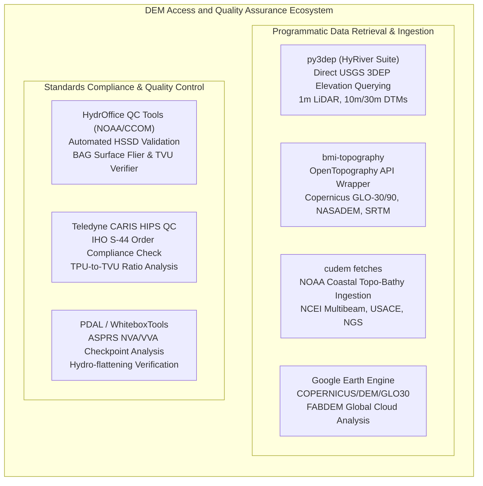

# Chapter 24: Survey Standards, Guide Documents, and Key Public DEM Products

*The official specifications that govern professional elevation and hydrographic surveys, and a critical comparison of the world's major open DEM datasets.*

---

## 24.5 Software Ecosystem

Accessing global and national public DEMs and verifying survey compliance against IHO S-44 or ASPRS standards requires a sophisticated ecosystem of programmatic APIs, cloud-native STAC catalogs, and automated quality-control software. This section details both open-source tools and commercial enterprise suites used to ingest, process, and audit elevation surfaces.



---

### 24.5.1 Open-Source Data Access Tools

#### 1. `py3dep`: Python Interface for USGS 3DEP
Part of the HyRiver geospatial software stack developed by Taher Chegini, `py3dep` provides seamless, cloud-native access to the USGS 3D Elevation Program. It handles coordinate transformations, bounding-box clipping, and multi-resolution fetching from USGS 3DEP AWS Cloud and 3D Elevation Web Coverage Services (WCS).

```python
"""
Fetch USGS 3DEP high-resolution bare-earth DTMs using py3dep.
Demonstrates extracting a 1-meter LiDAR DTM and computing slope/aspect.
"""

import py3dep
import xarray as xr
import matplotlib.pyplot as plt

def retrieve_usgs_elevation(bbox: tuple[float, float, float, float], resolution: int = 1) -> xr.DataArray:
    """
    Retrieves USGS 3DEP elevation raster for a bounding box.
    
    Args:
        bbox: (min_x, min_y, max_x, max_y) in EPSG:4326 (lon/lat).
        resolution: Target cell size in meters (1 for LiDAR, 10 for 1/3-arcsec).
        
    Returns:
        xr.DataArray containing elevation in meters (NAVD88).
    """
    print(f"Querying USGS 3DEP at {resolution}m resolution for bbox: {bbox}")
    
    # py3dep automatically queries the highest-resolution tier available
    dem = py3dep.get_map(
        layers="DEM",
        geometry=bbox,
        resolution=resolution,
        geo_crs="EPSG:4326",
        crs="EPSG:5070"  # Conus Albers Equal Area
    )
    
    print(f"Retrieved raster shape: {dem.shape}, min elevation: {dem.min().values:.2f}m, max: {dem.max().values:.2f}m")
    return dem

# Example bounding box: Boulder Creek Watershed, Colorado
# (min_lon, min_lat, max_lon, max_lat)
boulder_bbox = (-105.28, 40.01, -105.25, 40.03)
# dem_1m = retrieve_usgs_elevation(boulder_bbox, resolution=1)
```

#### 2. `bmi-topography`: OpenTopography API Integration
Developed by Mark Piper and the Community Surface Dynamics Modeling System (CSDMS), `bmi-topography` wraps the OpenTopography REST API into a Basic Model Interface (BMI) standard. It allows automated pulling of global datasets (Copernicus GLO-30/90, SRTM GL1/GL3, ALOS AW3D30, and NASADEM) directly into scientific simulation models.

```bash
# Fetch Copernicus GLO-30 using the OpenTopography command-line tool
# Requires OPENTOPOGRAPHY_API_KEY environment variable
bmi-topography --dem_type="COP30" \
               --south=36.0 \
               --north=36.2 \
               --west=-112.2 \
               --east=-112.0 \
               --output_format="GTiff" \
               --output_file="grand_canyon_cop30.tif"
```

#### 3. NOAA CUDEM `fetches`
The NOAA National Centers for Environmental Information (NCEI) developed `fetches` as part of the CUDEM toolchain. It provides specialized scrapers that query US federal and state marine repositories:
* `fetches -R -71.2/-70.8/42.1/42.4 nos_hydro`: Downloads all NOAA National Ocean Service multibeam and single-beam surveys.
* `fetches -R -71.2/-70.8/42.1/42.4 usace`: Fetches US Army Corps of Engineers dredge and channel condition hydrographic surveys.
* `fetches -R -71.2/-70.8/42.1/42.4 coast_lidar`: Queries NOAA Digital Coast for topo-bathy airborne LiDAR surveys.

#### 4. Google Earth Engine (GEE)
For petabyte-scale planetary analysis, Google Earth Engine hosts pre-processed, tiled versions of major public DEMs:
* `COPERNICUS/DEM/GLO30`: Copernicus $30\text{-m}$ global DSM with ocean masks and lake flattening.
* `USGS/3DEP/1m`: Conterminous US $1\text{-meter}$ LiDAR bare-earth elevation collections.
* `JAXA/ALOS/AW3D30/V3_2`: ALOS World 3D DSM version 3.2.
* `projects/sat-io/open-datasets/FABDEM`: Global $30\text{-m}$ bare-earth DTM (Hawker et al.).

---

### 24.5.2 Quality Control and Standards Compliance Software

#### 1. HydrOffice QC Tools (NOAA OCS / UNB CCOM)
The joint Center for Coastal and Ocean Mapping at the University of New Hampshire (CCOM/JHC) and NOAA OCS develop **QC Tools**, an open-source Python suite that automates the verification of hydrographic data against NOAA HSSD and IHO S-44 standards:
* **The "Flier Finder" Engine:** Evaluates BAG surfaces for high-frequency acoustic noise spikes (isolated multi-meter elevation departures caused by kelp, acoustic side-lobe multipath, or second-bounce reflections).
* **Grid QA / TVU Compliance Tool:** Ingests a Bathymetric Attributed Grid (BAG), extracts the per-node elevation $d$ and Total Propagated Uncertainty $\sigma_z$, and computes the compliance ratio against IHO S-44 orders.

```python
"""
Python verification script evaluating a Bathymetric Attributed Grid (BAG)
against IHO S-44 TVU thresholds across multiple survey orders.
"""

import numpy as np
import h5py

def evaluate_iho_tvu_compliance(bag_path: str, order: str = "Special") -> dict:
    """
    Evaluates hydrographic surface compliance against IHO S-44 TVU limits.
    
    Args:
        bag_path: Path to the HDF5 Bathymetric Attributed Grid (.bag).
        order: Target IHO S-44 Order ('Exclusive', 'Special', 'Order1a', 'Order2').
        
    Returns:
        Dictionary of compliance metrics (fraction passing, worst outliers).
    """
    # Define S-44 TVU parameters (a, b)
    s44_params = {
        "Exclusive": (0.15, 0.0075),
        "Special":   (0.25, 0.0075),
        "Order1a":   (0.50, 0.0130),
        "Order2":    (1.00, 0.0230)
    }
    
    if order not in s44_params:
        raise ValueError(f"Unknown IHO Order: {order}")
        
    a, b = s44_params[order]
    
    with h5py.File(bag_path, "r") as bag:
        # Read elevation (depth is stored as positive or negative depending on convention)
        depth = np.abs(bag["/BAG_root/elevation"][:])
        # Read Total Propagated Uncertainty (TPU) at 1-sigma
        tpu_1sigma = bag["/BAG_root/uncertainty"][:]
        
    # Mask out null / unobserved cells (BAG standard null is typically 1,000,000.0)
    valid_mask = (depth < 10000.0) & (tpu_1sigma < 1000.0) & (~np.isnan(depth)) & (~np.isnan(tpu_1sigma))
    
    valid_depth = depth[valid_mask]
    valid_tpu_1sigma = tpu_1sigma[valid_mask]
    
    # Scale modeled 1-sigma TPU to 95% confidence level (1.96 * sigma)
    modeled_tvu_95 = 1.9600 * valid_tpu_1sigma
    
    # Compute maximum allowable TVU under IHO S-44
    allowable_tvu_95 = np.sqrt(a**2 + (b * valid_depth)**2)
    
    # Compute compliance ratio: Ratio <= 1.0 means compliant
    compliance_ratio = modeled_tvu_95 / allowable_tvu_95
    passing_cells = np.sum(compliance_ratio <= 1.0)
    total_valid = len(valid_depth)
    percent_compliant = (passing_cells / total_valid) * 100.0
    
    results = {
        "order_tested": order,
        "total_nodes": total_valid,
        "nodes_passing": int(passing_cells),
        "percent_compliant": percent_compliant,
        "hssd_pass": percent_compliant >= 95.0,  # NOAA HSSD mandates >= 95% pass rate
        "mean_ratio": float(np.mean(compliance_ratio)),
        "max_ratio": float(np.max(compliance_ratio))
    }
    
    print(f"--- IHO S-44 Compliance Report: {order} Order ---")
    print(f"Total Valid Nodes: {results['total_nodes']:,}")
    print(f"Compliant Nodes:   {results['nodes_passing']:,} ({results['percent_compliant']:.2f}%)")
    print(f"NOAA HSSD Status:  {'PASS' if results['hssd_pass'] else 'FAIL (Requires Remediation)'}")
    print(f"Mean TVU Ratio:    {results['mean_ratio']:.3f} (Values <= 1.0 meet spec)")
    print(f"Max TVU Ratio:     {results['max_ratio']:.3f}")
    
    return results
```

#### 2. Commercial QC Suites: CARIS HIPS and Esri Living Atlas
* **Teledyne CARIS HIPS and SIPS:** The commercial standard for hydrographic data processing. Its built-in IHO S-44 QC module generates spatial color-coded compliance surfaces directly inside the CARIS Bathy DataBASE, highlighting sub-standard nodes where excessive vessel heave, high ship speeds, or poor GPS DOP breached Order 1a or Special Order thresholds.
* **Esri ArcGIS Living Atlas of the World:** Hosts dynamic multi-directional hillshades and elevation layers combining 3DEP, Copernicus GLO-30, and GEBCO. While convenient for rapid web visualization, GIS analysts must be cautious: Esri's dynamic image services employ bilinear or cubic resampling across pyramid levels, which can artificially smooth out extreme elevation peaks and navigation hazards during zooming.
