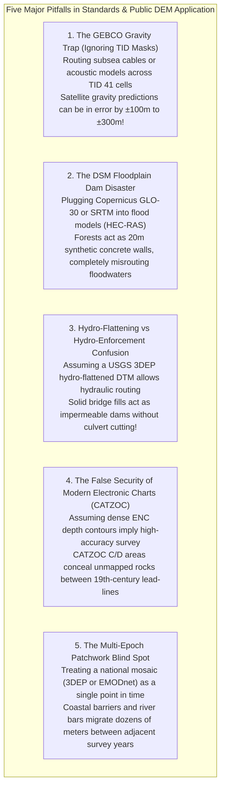

# Chapter 24: Survey Standards, Guide Documents, and Key Public DEM Products

*The official specifications that govern professional elevation and hydrographic surveys, and a critical comparison of the world's major open DEM datasets.*

---

## 24.6 Common Pitfalls and Key Takeaways

Working with open public DEM products and navigating formal survey standards requires continuous vigilance. Open-access elevation grids are among the most frequently abused geospatial datasets in the world: practitioners routinely apply satellite surface models to hydrodynamic flood equations, route subsea cables across unmeasured gravity approximations, and mistake cartographic lake-flattening for hydraulic culvert burning.

---

### 24.6.1 Common Pitfalls in Public DEMs and Standards Compliance

#### 1. The GEBCO Gravity Trap: Ignoring the Type Identifier (TID) Grid
* **The Failure Mode:** An offshore engineering contractor or oceanographic modeler downloads the global GEBCO 15 arc-second bathymetric grid and assumes that every grid cell represents a measured seafloor depth.
* **Physical Reality:** In deep water, approximately **$75\%$ of the grid has never been touched by a sonar beam**. These depths are mathematically inferred from satellite radar altimeter measurements of sea-surface geoid slopes (Smith & Sandwell method). 
* **Forensic Consequence:** While satellite gravity accurately reveals large abyssal hills and tectonic fracture zones, it cannot resolve features narrower than twice the ocean depth ($\sim 8\text{–}10\text{ km}$). Uncharted seamounts rising $1,000\text{ meters}$ above the abyssal plain can be completely smoothed out, while variations in sub-bottom sediment density create apparent bathymetric depressions where none exist. Cable routes laid across unverified `TID 41` (predicted) cells risk severe cable suspension spans, chafing, and catastrophic breakage.
* **Remedy:** Always query the companion **GEBCO TID Grid**. If an operation demands navigation safety or engineering design, never rely on predicted bathymetry (`TID 41` or `TID 70`).

#### 2. The DSM Floodplain Dam Disaster: Running Hydraulics on Canopies
* **The Failure Mode:** A hydrological engineering team setting up a 2D hydrodynamic flood simulation (e.g., HEC-RAS 2D, LISFLOOD-FP, or TUFLOW) ingests a freely available $30\text{-meter}$ satellite elevation model like Copernicus GLO-30 or SRTM.
* **Physical Reality:** Copernicus GLO-30 and SRTM are **Digital Surface Models (DSMs)**. At radar wavelengths (X-band and C-band), the returned signal reflects near the top of the forest canopy and urban rooftops.
* **Forensic Consequence:** In a river valley fringed by dense riparian forest, the model sees a $15\text{–}25\text{ meter}$ solid vertical wall of elevation on either side of the river. During a simulated 100-year storm event, simulated water cannot overtop the banks into the natural floodplain; instead, the digital floodwater is artificially bottled up inside the channel, generating impossible flow velocities and falsely predicting severe inundation in upstream cities.
* **Remedy:** For hydraulic and flood modeling, **never use a raw satellite DSM**. Use bare-earth DTM products: high-resolution airborne LiDAR (USGS 3DEP QL1/QL2) or global machine-learning bare-earth models like **FABDEM**.

#### 3. Confusing Hydro-Flattening with Hydro-Enforcement
* **The Failure Mode:** A civil engineer downloads a USGS 3DEP LiDAR bare-earth DTM and assumes it is ready for immediate drainage network extraction and watershed delineation.
* **Physical Reality:** USGS 3DEP mandates **hydro-flattening**, which is a *cartographic* aesthetic requirement. Lakes $\ge 2\text{ acres}$ are leveled flat, and rivers $\ge 30\text{ m}$ are given a monotonic downstream slope. However, hydro-flattening does *not* burn culverts or cut road bridges!
* **Forensic Consequence:** When an automated flow-routing algorithm (e.g., D8 or D-infinity) reaches a highway embankment crossing a river, the LiDAR surface shows a solid earthen dam. Because the culvert running underneath the highway is invisible to airborne lasers, flow routing stalls, fills a massive digital lake behind the highway, and spills water across neighboring ridgelines into the wrong drainage basin.
* **Remedy:** Understand that USGS 3DEP requires secondary **hydro-enforcement**—manually or semi-automatically trenching culverts and removing bridge decks using hydrologic conditioning tools.

#### 4. The False Security of Electronic Charts: Overlooking CATZOC
* **The Failure Mode:** A coastal mariner or offshore surveyor relies on an official Electronic Navigational Chart (ENC), assuming that because the chart was updated digitally last week, the depth data is modern and complete.
* **Physical Reality:** Electronic charts compile soundings spanning over a century. Over $40\%$ of coastal charts in developed nations rely on lead-line or early single-beam surveys.
* **Forensic Consequence:** The quality of the underlying survey is encoded in the chart's **CATZOC (Category of Zone of Confidence)** attribute:
  * `CATZOC A1 / A2`: Modern multibeam survey with full seafloor ensonification; high vertical accuracy.
  * `CATZOC B`: Complete bathymetry, but uncharted hazards may exist.
  * `CATZOC C / D`: Low accuracy, uncalibrated depth errors, and **zero guarantee of object detection**. Spaced lead-line soundings missed granite pinnacles and wrecks between lines.
* **Remedy:** Always inspect the CATZOC layer. In CATZOC C and D areas, treat the bathymetry as reconnaissance-grade only.

#### 5. The Multi-Epoch Patchwork Blind Spot
* **The Failure Mode:** An environmental team measures coastal erosion along a $100\text{-km}$ shoreline using a national seamless LiDAR raster (e.g., USGS 3DEP or European national mosaics).
* **Physical Reality:** "Seamless" national rasters are composite patchworks compiled from dozens of distinct airborne flight missions flown across multiple years (e.g., a 2017 county survey stitched against a 2023 state survey).
* **Forensic Consequence:** In highly dynamic sandy barrier islands or tidal inlets, beach profiles migrate horizontally by tens of meters annually. When the boundary between two survey years bisects an inlet, the composite DEM displays an artificial geomorphic step or duplicated barrier spit that never existed simultaneously in physical reality.
* **Remedy:** Inspect the spatial metadata index polygons for every national mosaic to verify that all comparison data was acquired within the same geomorphic epoch.

---

### 24.6.2 Key Takeaways for Practitioners

1. **Verify the Surface Type (DSM vs. DTM):** Never input a DSM (Copernicus GLO-30, SRTM, AW3D30) into overland flow, flood inundation, or earthwork volume calculations. Use verified bare-earth DTMs (3DEP, FABDEM, national LiDAR).
2. **Never Trust Deep-Ocean Grids Without the TID Mask:** In GEBCO and SRTM15+, ~75% of depth values are predicted from satellite marine gravity. Always inspect the Type Identifier (TID) band before making engineering or safety-critical decisions.
3. **Hydro-Flattening Is Not Hydro-Enforcement:** Hydro-flattened surfaces level waterbodies for cartographic display; hydro-enforced surfaces cut through bridges and culverts to establish hydraulic connectivity.
4. **IHO TVU Scales with Depth:** Allowable vertical error in hydrography is governed by $\text{TVU}_{\max}(d) = \sqrt{a^2 + (b \cdot d)^2}$. Shallow waters demand sub-decimeter control ($a$), while deep waters are dominated by refraction and ray-bending ($b$).
5. **ASPRS Distinguishes Non-Vegetated from Vegetated Terrain:** NVA relies on Gaussian parametric statistics ($1.9600 \cdot \text{RMSE}_z$); VVA strictly mandates non-parametric 95th percentile analysis due to understory laser clipping.
6. **CATZOC Governs Nautical Reality:** The freshness of a digital chart does not guarantee the freshness of its soundings. Always audit CATZOC ratings before operating in shallow or confined waters.
