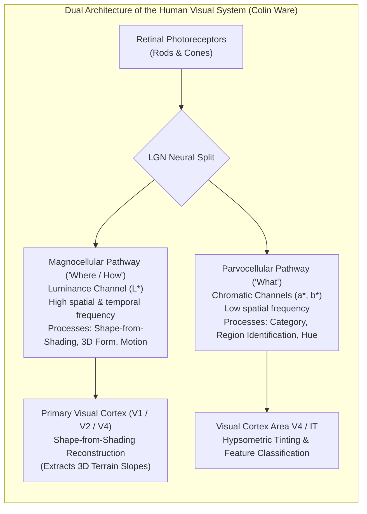
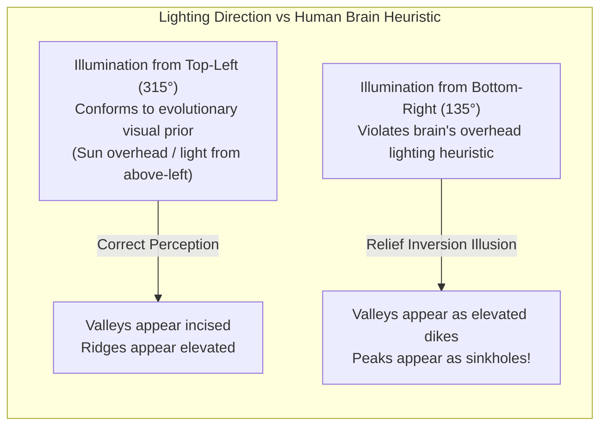
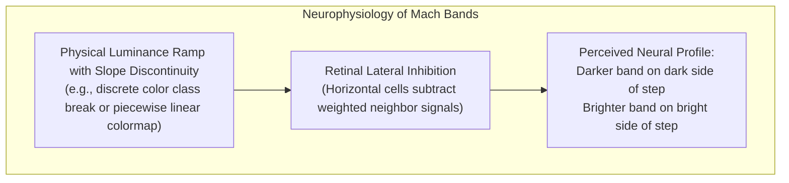

# Chapter 25: Deep Dive into Visualization of DEMs

*How human visual perception, colormaps, shading physics, 3D graphics engines, and 3D Gaussian Splats reveal—or distort—terrain and uncertainty.*

---

## 25.1 Visual Perception Science for Terrain

Visualizing a Digital Elevation Model is an act of sensory translation: converting floating-point arrays of spatial coordinates into optical stimuli that trigger accurate 3D mental reconstructions in the human brain. Too often, software engineers and GIS practitioners treat visualization as purely aesthetic "styling." In reality, visual perception is governed by neurobiology and psychophysics. An incorrectly chosen illumination angle or non-linear colormap does not merely look unattractive; it physically exploits evolutionary shortcuts in the human visual cortex to generate false topography, erase actual canyons, and invert mountains into valleys.

To design defensible terrain visualizations, one must ground cartographic design in the cognitive perception science codified by Colin Ware and vision researchers.

---

### 25.1.1 The Dual Neurological Pathways: Luminance vs. Chrominance

The human visual system processes visual information through two distinct anatomical channels originating in the retina and routed through the lateral geniculate nucleus (LGN) to the visual cortex:

1. **The Magnocellular (Luminance) Pathway:**
   * Carries achromatic intensity signals ($L^*$ in CIELAB space).
   * Possesses high spatial resolution and rapid temporal response.
   * **Crucial Rule:** The human brain's shape-from-shading cognitive engine operates *exclusively* on luminance contrast. When an observer perceives the 3D relief of a mountain range, glacial cirque, or submarine trench, the neural computation relies entirely on variations in perceived lightness.
2. **The Parvocellular (Chromatic) Pathway:**
   * Carries red-green ($a^*$) and yellow-blue ($b^*$) opponent color differences.
   * Possesses significantly lower spatial resolution (roughly one-third that of the luminance channel).
   * Cannot convey 3D shape, fine texture, or continuous spatial slope. Instead, it excel at categorical segmentation, grouping, and nominal boundary labeling.

**The Golden Rule of Terrain Visualization:**
*Use luminance variation to display continuous 3D surface geometry (shading, slope, curvature), and use chromatic variation (hue and saturation) to communicate elevation zones, land cover categories, or uncertainty bounds.* Never attempt to communicate fine relief using hue alone on a flat-lit surface.

---

### 25.1.2 The Relief Inversion Illusion (Pseudoscopic Vision)

The most striking perceptual failure in terrain cartography is the **Relief Inversion Illusion** (also known as the "crater-dome illusion"). When viewing a shaded relief surface, an observer's visual system can spontaneously invert the topography: deeply incised river canyons appear as sharp elevated ridges, and volcanic calderas appear as rounded domes.

#### The Neurobiology of Relief Inversion
The human visual cortex reconstructs 3D depth from 2D shaded images using a hardwired evolutionary heuristic: **light comes from above**. Because terrestrial organisms evolved under sunlight falling from the sky, the brain assumes that a surface patch with light on top and shadow on the bottom is convex (a bump or ridge), while a patch with shadow on top and light on the bottom is concave (a crater or trench).

* **The Cartographic Convention (Top-Left Illumination):**
  In standard cartographic hillshading, the artificial illumination source is placed in the **northwest (azimuth $315^\circ$)**, typically with an elevation angle (altitude) of $45^\circ$. Because map reading places "North" at the top of the page or screen, northwest illumination causes light to fall from the top-left, satisfying the brain's overhead prior.
* **The Southern Hemisphere & Real-Sun Trap:**
  When novices render shaded relief using physical sun azimuths (e.g., placing the sun at azimuth $135^\circ\text{–}180^\circ$ for a northern hemisphere midday winter sun, or $045^\circ$ for morning sun), illumination originates from the bottom or right of the screen. The viewer's brain instantly flips the scene: the Grand Canyon appears as an enormous elevated highway, and mountain ridges appear as subterranean chasms.
* **Anchoring Cues:**
  The illusion can sometimes be overridden if the map includes strong, unambiguous contextual cues, such as blue river networks occupying valley bottoms or shaded aerial orthophotography. However, for standalone elevation and bathymetric grids, strictly enforcing northwest ($315^\circ$) or multi-directional diffuse illumination is mandatory to prevent cognitive inversion.

---

### 25.1.3 Simultaneous Contrast and Retinal Mach Bands

The visual system does not function as an absolute photometer; it is a differential contrast detector. Two physiological phenomena heavily distort the interpretation of elevation maps: **Simultaneous Contrast** and **Mach Bands**.

#### 1. Simultaneous Contrast
A region of constant luminance or color appears significantly different depending on the background against which it is viewed:
* A gray patch with $50\%$ reflectance surrounded by an $80\%$ white background appears perceptually darker than the identical $50\%$ patch surrounded by a $20\%$ black background.
* In hypsometric elevation maps, an identical elevation zone rendered in a neutral yellow will appear greenish when surrounded by blue ocean bathymetry, and reddish when surrounded by dark green lowland tints.
* *Consequence:* Quantitative visual estimation of elevation from a color legend is inherently error-prone. A reader cannot reliably match a local patch of color to an elevation scale bar if surrounding terrain colors induce lateral chromatic induction.

#### 2. Lateral Inhibition and Mach Bands
In the human retina, when a photoreceptor cell is excited by light, it transmits inhibitory signals to its neighboring cells via horizontal and amacrine cells. This neural mechanism—known as **lateral inhibition**—acts as an analog high-pass spatial filter designed to sharpen biological edge detection.

When an elevation model is visualized using stepped intervals, discrete contour fills, or piecewise-linear colormaps that have sharp slope discontinuities in their luminance curves:
* At the boundary between two elevation bands, lateral inhibition causes the eye to perceive an artificial bright spike immediately inside the lighter band, and an artificial dark trench immediately inside the darker band.
* These perceptual artifacts—**Mach Bands**—are purely optical illusions generated inside the retina. They do not exist in the underlying DEM data!
* *Consequence:* A geomorphologist or geophysicist examining an unshaded, stepped elevation map will identify linear "cliffs" and structural "fault scarps" that are entirely hallucinations of the human nervous system. Eliminating Mach bands requires smooth, continuously differentiable ($C^1$-continuous) luminance transitions across all color ramps.
