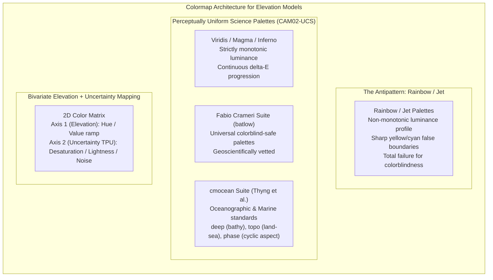
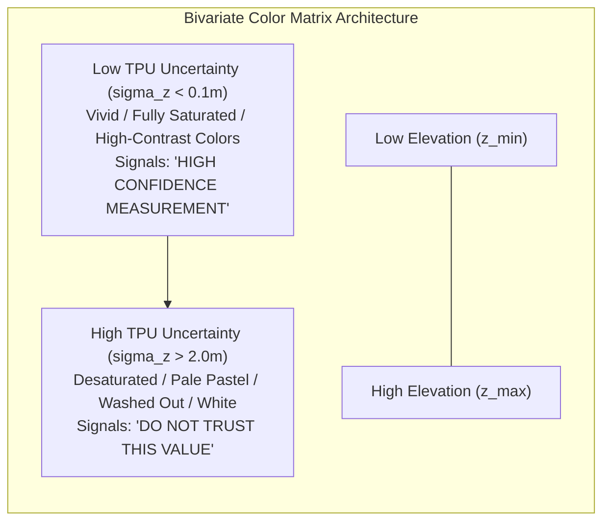

# Chapter 25: Deep Dive into Visualization of DEMs

*How human visual perception, colormaps, shading physics, 3D graphics engines, and 3D Gaussian Splats reveal—or distort—terrain and uncertainty.*

---

## 25.2 Colormaps for Elevation, Bathymetry, and Derivatives

Color is the most prominent visual attribute in geospatial cartography. Yet, improper color mapping remains the single most common source of scientific misinterpretation in earth sciences. When a non-monotonic colormap (such as the ubiquitous "rainbow" or "jet") is applied to a digital elevation model, the visual system perceives non-existent structural barriers, ignores real geological faults, and excludes color-vision deficient individuals.

Designing rigorous color scales requires aligning palette progression with mathematical perceptual uniformity ($\Delta E_{00}$), choosing domain-appropriate hypsometric hinges, and explicitly encoding uncertainty alongside elevation.



---

### 25.2.1 The Rainbow / Jet Colormap Antipattern

Despite decades of condemnation by visual scientists and geophysicists (e.g., Borland & Taylor 2007; Crameri et al. 2020), the "rainbow" (or MATLAB's legacy `jet`) colormap persists across geospatial dashboards and legacy GIS software. Its flaws are severe and mathematically fatal to scientific analysis:

#### 1. Non-Monotonic Luminance and False Structural Boundaries
In the physical world, human depth perception relies on monotonic luminance gradients. A rainbow colormap cycles through:
$$\text{Blue (Dark)} \to \text{Cyan (Bright)} \to \text{Green (Medium)} \to \text{Yellow (Ultra-Bright)} \to \text{Red (Medium)}$$

* The perceived luminance curve does not increase monotonically; instead, it has two sharp, violent luminance peaks at **Cyan** and **Yellow**, and deep troughs at **Blue** and **Red**.
* When applied to a smooth, uniform planar slope, the yellow and cyan transitions create sharp, artificial linear boundaries—inducing retinal Mach bands.
* Geologists routinely mistake these artificial yellow bands for active fault scarps, sediment boundaries, or marine terrace notches that do not exist in the underlying DEM.

#### 2. Loss of Contrast in Broad Color Plateaus
Inside the broad green and red segments of the spectrum, the rate of change of perceived lightness ($\frac{dL^*}{dz}$) drops near zero. Subtle geomorphic micro-relief—such as $1\text{-meter}$ sand ripples, ancient irrigation channels, or landslide scarps—is completely hidden if it falls within the wide green band of a rainbow palette.

#### 3. Catastrophic Exclusion of Color-Vision Deficient Viewers
Approximately **$8\%$ of men and $0.5\%$ of women** possess congenital red-green color vision deficiency (deuteranomaly or protanomaly). For these individuals, the red and green bands of the rainbow palette collapse into an identical, undifferentiated muddy yellow-brown. A colorblind mariner or emergency manager reading a rainbow flood depth map cannot distinguish between a $1\text{-meter}$ shallow puddle and a $10\text{-meter}$ fatal flood surge.

---

### 25.2.2 Perceptually Uniform Scientific Colormaps

A colormap is defined as **perceptually uniform** if a constant step in elevation ($\Delta z$) corresponds to a constant perceptual color difference ($\Delta E$) across the entire data range:

$$\frac{\Delta E}{\Delta z} = \text{constant}, \quad \forall z \in [z_{\min}, z_{\max}]$$

Modern perceptual palettes are constructed in advanced color appearance models (such as CIELAB or CAM02-UCS), ensuring that lightness $L^*$ increases or decreases monotonically with zero artificial inflection points.

#### 1. Sequential Terrestrial Palettes: `viridis`, `magma`, `cividis`, `batlow`
* **`viridis`:** Developed by Stéfan van der Walt and Nathaniel Smith for Matplotlib. Features a monotonically increasing luminance ramp from deep purple ($L^* \approx 10$) to bright yellow ($L^* \approx 95$). Preserves high-frequency spatial slope details even when printed in grayscale.
* **`cividis`:** Specially optimized by Nuñez, Anderton, and Renslow (2018) for severe red-green deuteranopia; it provides mathematically identical $\Delta E$ curves for both normal and colorblind observers.
* **`batlow`:** Formulated by Fabio Crameri (University of Oslo). A smooth, perceptually uniform rainbow alternative that avoids yellow/cyan luminance spikes while preserving distinct hues across the spectrum. Widely adopted by the international geophysics and geodynamics community.

#### 2. The `cmocean` Suite for Marine and Topographic Science
Developed by Kristen Thyng et al. (2016) under the sponsorship of the Oceanography Society, `cmocean` provides specialized perceptual palettes tailored to specific marine physical variables:

* **`cmocean.deep`:** Designed specifically for ocean bathymetry. Luminance decreases monotonically from light sea-foam turquoise at sea level ($z = 0\text{ m}$) down into pitch black in abyssal trenches ($z = -11,000\text{ m}$).
* **`cmocean.topo`:** A balanced hypsometric/bathymetric palette. Bathymetry transitions through cool deep blues to light cyan at the coast, with a sharp transition into warm greens, browns, and buff tans on land.
* **`cmocean.phase` (Cyclic Palette for Terrain Aspect):**
  Terrain aspect is an angular circular quantity defined on the interval $[0^\circ, 360^\circ)$ where $0^\circ \equiv 360^\circ$ (North). Applying a standard linear colormap creates an artificial visual seam at North (where $359^\circ$ is red and $001^\circ$ is blue). `cmocean.phase` is a **cyclic colormap** whose color endpoints match identically at $0^\circ$ and $360^\circ$, while maintaining two symmetric luminance peaks to ensure aspect relief is clearly readable.

```python
"""
Generating a cyclic aspect map using cmocean.phase and Matplotlib.
Demonstrates seamless circular visualization without artificial North seams.
"""

import numpy as np
import matplotlib.pyplot as plt
import cmocean

def plot_aspect_cyclic(aspect_deg: np.ndarray, output_path: str = "aspect_cyclic.png"):
    """
    Plots terrain aspect using the cyclic cmocean.phase colormap.
    
    Args:
        aspect_deg: 2D array of aspect values in degrees [0, 360).
    """
    fig, ax = plt.subplots(figsize=(8, 6), dpi=300)
    
    # Use cmocean.cm.phase which wraps seamlessly at 0 and 360 degrees
    im = ax.imshow(aspect_deg, cmap=cmocean.cm.phase, vmin=0, vmax=360)
    
    cbar = fig.colorbar(im, ax=ax, ticks=[0, 90, 180, 270, 360])
    cbar.ax.set_yticklabels(['N (0°)', 'E (90°)', 'S (180°)', 'W (270°)', 'N (360°)'])
    cbar.set_label('Terrain Aspect (Illumination Azimuth)', rotation=270, labelpad=15)
    
    ax.set_title("Perceptually Uniform Cyclic Aspect (cmocean.phase)")
    ax.axis("off")
    plt.tight_layout()
    plt.savefig(output_path)
    plt.close()
```

---

### 25.2.3 Domain-Specific Hypsometric & Bathymetric Palettes

While abstract monotonic ramps (`viridis`, `batlow`) are mathematically ideal, regional mapping and navigation require intuitive, culturally familiar hypsometric palettes.

#### 1. Bill Haxby's Bathymetric Palette (`GeoMapApp`)
In the early 1990s, marine geophysicist William (Bill) F. Haxby at Lamont-Doherty Earth Observatory designed the iconic **Haxby colormap** to visualize the first satellite marine gravity and bathymetric grids. Rather than harsh primary colors, Haxby employed subtle pastel hues:
$$\text{Deep Indigo} \to \text{Steel Blue} \to \text{Sea-Foam Cyan} \to \text{Sage Green} \to \text{Warm Sand} \to \text{Crimson / White}$$
The Haxby palette became the global visual signature of deep-sea exploration, popularized by the `GeoMapApp` GIS viewer.

#### 2. Eduard Imhof and Tom Patterson Natural Hypsometric Tints
Pioneered by Swiss cartographer Eduard Imhof (1895–1986) and refined digitally by Tom Patterson (US National Park Service):
* Land elevations do not follow abstract physics; they reflect climate, ecology, and human visual experience.
* Low elevations (river valleys, coastal plains) are tinted with soft, desaturated **olive and sage greens** (suggesting vegetation).
* Mid-elevations (foothills, plateaus) transition through **warm ochre, buff, and amber browns**.
* High mountain peaks transition into **cool purplish grays and chalk white** (suggesting alpine rock and permanent snow).
* Crucially, Imhof's palettes keep color saturation very low ($<30\%$), ensuring that overlaid contour lines, road vectors, and analytical hillshading remain crisp and legible.

#### 3. The Shoreline Hinge ($z = 0$)
In integrated topo-bathy coastal models, the most critical physical boundary is the coastline. A composite land-sea colormap must feature a sharp, unambiguous **perceptual hinge** exactly at the vertical datum boundary ($z = 0\text{ m}$ NAVD88 or Mean High Water / Mean Lower Low Water). The transition from shallow marine cyan to subaerial shoreline green must produce a distinct change in hue while maintaining continuous slope illumination.

---

### 25.2.4 Bivariate Colormaps: Visualizing Elevation and Uncertainty Simultaneously

One of the greatest dangers in digital elevation analysis is that a rendered map portrays all pixels with equal visual authority, concealing underlying interpolation gaps and survey errors. To solve this, advanced cartographers use **Bivariate (2D) Colormaps**, where two independent physical variables are mapped to a two-dimensional color square:

$$\text{Pixel Color } \mathbf{C}(x, y) = f\big( z(x, y), \, \sigma_{\text{TPU}}(x, y) \big)$$



#### Operational Mechanics of Elevation-Uncertainty Bivariate Mapping
* **Axis 1 (Elevation $z$):** Encoded along the **Hue** or **Color Tone** spectrum (e.g., transitioning from blue to green to gold to brown).
* **Axis 2 (Total Propagated Uncertainty $\sigma_{\text{TPU}}$):** Encoded along the **Saturation** or **Value / Whiteness** axis:
  * *High Confidence ($\sigma_{\text{TPU}} \to 0$):* Colors are rendered with **$100\%$ vibrant saturation**. The viewer's attention is naturally drawn to crisp, verified measurements (e.g., multibeam soundings or QL1 LiDAR).
  * *High Uncertainty ($\sigma_{\text{TPU}} \gg 0$):* Colors are progressively **desaturated toward pure neutral gray or washed-out white**. Areas of high uncertainty (such as wide gaps between survey lines or predicted satellite bathymetry) recede into the visual background.
* *Alternative Texture Overlays:* In black-and-white publications or nautical navigation screens, high-uncertainty areas are rendered with an explicit **stippled dot screen** or **diagonal cross-hatch pattern**, visually alerting the user that the underlying surface is unverified.
