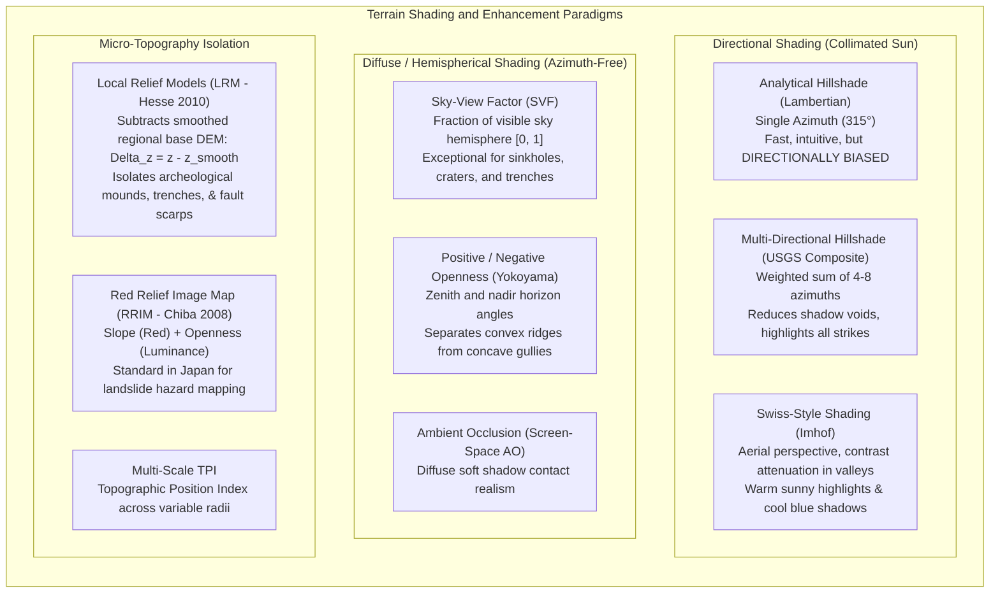
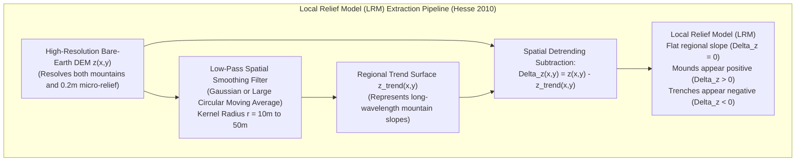

# Chapter 25: Deep Dive into Visualization of DEMs

*How human visual perception, colormaps, shading physics, 3D graphics engines, and 3D Gaussian Splats reveal—or distort—terrain and uncertainty.*

---

## 25.3 Filtering, Shading, and Terrain Enhancement Techniques

Standard analytical hillshading—introduced to computer graphics in the late 1960s—is an approximation of diffuse Lambertian reflectance under a single collimated light source. While computationally cheap, single-source hillshading suffers from a fatal physical defect: **directional illumination bias**. Topographic features whose strikes run parallel to the illumination vector receive identical irradiance on both flanks, rendering major geological faults, glacial lineaments, and ancient cultural earthworks completely invisible.

To overcome directional blindness and uncover subtle micro-relief obscured by regional topography, geoscientists and cartographers have developed sophisticated non-directional shading filters, diffuse horizon occlusion models, and spatial detrending algorithms.



---

### 25.3.1 Directional Shading: From Analytical to Swiss Relief

#### 1. Analytical Lambertian Hillshading and Directional Blindness
In standard analytical hillshading (Horn 1981), the terrain is treated as an ideal Lambertian surface that reflects incident light uniformly in all directions. The reflectance intensity $I \in [0, 1]$ is proportional to the cosine of the angle between the surface unit normal $\hat{\mathbf{n}}$ and the illumination unit vector $\hat{\mathbf{s}}$:

$$I = \max(0, \, \hat{\mathbf{n}} \cdot \hat{\mathbf{s}})$$

Given sun azimuth $\phi_{\text{az}}$ (measured clockwise from North) and sun altitude $\theta_z$ (measured upward from the horizon):
$$\hat{\mathbf{s}} = \big( \sin\phi_{\text{az}}\cos\theta_z, \; \cos\phi_{\text{az}}\cos\theta_z, \; \sin\theta_z \big)^T$$

Given terrain surface gradients $p = \frac{\partial z}{\partial x}$ and $q = \frac{\partial z}{\partial y}$:
$$\hat{\mathbf{n}} = \frac{1}{\sqrt{1 + p^2 + q^2}} \begin{pmatrix} -p \\ -q \\ 1 \end{pmatrix}$$

Computing the dot product yields:
$$I = \frac{\sin\theta_z - \cos\theta_z (p \sin\phi_{\text{az}} + q \cos\phi_{\text{az}})}{\sqrt{1 + p^2 + q^2}}$$

* **The Directional Blindness Pitfall:**
  If a geological fault scarp or glacial drumlin strikes at azimuth $\phi_{\text{strike}}$, its normal vector points perpendicular to the strike: $\phi_{\text{normal}} = \phi_{\text{strike}} \pm 90^\circ$.
  If the illumination source is placed perpendicular to the feature's normal (i.e., $\hat{\mathbf{s}}$ is parallel to the strike), then:
  $$p \sin\phi_{\text{az}} + q \cos\phi_{\text{az}} = 0$$
  Both the uphill-facing and downhill-facing flanks receive identical illumination $I = \frac{\sin\theta_z}{\sqrt{1 + p^2 + q^2}}$. The structural scarp completely vanishes from the rendered image.

#### 2. Multi-Directional Hillshading (USGS Composite)
To eliminate directional blindness, Mark (1992) and the USGS developed multi-directional hillshading. Rather than simulating a single collimated sun, the algorithm computes analytical hillshades from multiple azimuths (typically four at $225^\circ, 270^\circ, 315^\circ, 360^\circ$ or eight azimuths spaced at $45^\circ$) with varying sun altitudes. 

The individual shading rasters $I_k$ are combined using weighted averaging:
$$I_{\text{multi}}(x, y) = \sum_{k=1}^K w_k \cdot I_k(x, y)$$
where weights $w_k$ emphasize illumination from the northwest ($315^\circ$) to preserve human depth orientation while providing secondary fill light from oblique angles to illuminate hidden northwest-trending structures.

#### 3. Swiss-Style Shading (Eduard Imhof Tradition)
Refined manually by Eduard Imhof and implemented algorithmically in tools like *Eduard* (Bernhard Jenny et al.):
* **Aerial Perspective:** Reduces contrast in low-elevation valley bottoms by blending with a hazy valley tone, while sharpening contrast along alpine ridgelines.
* **Warm-Cool Tinting:** Sunny slopes are tinted with warm yellow-white light, while shaded northwest slopes are illuminated with cool, bluish skylight (simulating Rayleigh atmospheric scattering).
* **Local Illumination Adjustment:** The algorithm dynamically alters the illumination vector $\hat{\mathbf{s}}$ along curved mountain ridges, ensuring ridgelines are never washed out when terrain slope directly faces the sun.

---

### 25.3.2 Diffuse, Non-Directional Techniques: SVF, Openness, and Ambient Occlusion

In archaeology, geomorphology, and crater analysis, directional light introduces deceptive shadows that can be mistaken for real trenches. **Diffuse illumination models** calculate illumination based on the geometric openness of the entire upper hemisphere, completely eliminating azimuth bias.

#### 1. Sky-View Factor (SVF)
Formulated by Zakšek, Oštir, and Kokalj (2011), the **Sky-View Factor (SVF)** quantifies the portion of the sky hemisphere visible from a given ground point $(x_0, y_0)$. 

```mermaid
flowchart LR
    CenterPoint["Grid Node (x0, y0)"] --> SearchRays["Cast N Radial Search Rays (e.g., N=16)\nSearch outward to radius R (e.g., R=10-50m)"]
    SearchRays --> MaxHorizon["Find Maximum Horizon Elevation Angle gamma_i\nalong each azimuth sector i"]
    MaxHorizon --> SVF_Calc["SVF = 1 - (1/N) * sum( sin(gamma_i) )\nExposed peaks: gamma -> 0 => SVF -> 1.0 (Bright)\nDeep trenches: gamma -> 90° => SVF -> 0.0 (Dark)"]
end
```

The mathematical formulation for $N$ radial search directions is:
$$\text{SVF} = 1 - \frac{1}{N}\sum_{i=1}^N \sin\gamma_i$$
where $\gamma_i$ is the maximum horizon elevation angle along azimuth direction $i$ within search radius $R$:
$$\gamma_i = \max_{r \le R} \left[ \arctan\left( \frac{z(r, \phi_i) - z(0)}{r} \right) \right]$$

* **Interpretation:**
  * $\text{SVF} = 1.0$: An exposed, flat mountain plateau or isolated pinnacle with an unobstructed $360^\circ$ view of the entire sky vault. Appears bright white.
  * $\text{SVF} \to 0.0$: The bottom of a narrow slot canyon, karst sinkhole, bomb crater, or building lightwell. Appears pitch black due to horizon occlusion.
  * *Application:* SVF has revolutionized airborne LiDAR archaeology, effortlessly revealing ancient Maya causeways, Roman road ruts, and subtle burial mounds beneath dense tropical forest canopies.

#### 2. Positive and Negative Openness (Yokoyama et al. 2002)
Yokoyama, Matsuoka, and Shirai formulated **Topographic Openness** to separate convex surface forms from concave surface forms:
* **Positive Openness ($\Phi_R$):** The average zenith angle $\theta_i$ to the highest terrain horizon within radius $R$:
  $$\Phi_R = \frac{1}{N}\sum_{i=1}^N \theta_i, \quad \theta_i = 90^\circ - \gamma_i$$
  High values highlight convex landforms (ridges, crests, escarpments, dune crests).
* **Negative Openness ($\Psi_R$):** The average nadir angle measured downward from the subterranean horizon:
  High values highlight concave landforms (valleys, stream thalwegs, sinkholes, fault rifts).

---

### 25.3.3 Micro-Topography Isolation and Detrending

When a landscape contains $2,000\text{-meter}$ mountains alongside $0.5\text{-meter}$ archaeological ruins or fault scarps, standard global color ramps and hillshades allocate $99.9\%$ of their dynamic range to the regional mountain slopes. Isolating local features requires spatial frequency detrending.



#### 1. Local Relief Models (LRM - Ralf Hesse 2010)
An LRM extracts micro-relief by subtracting a heavily smoothed representation of the terrain from the original high-resolution DEM:
$$\Delta z_{\text{LRM}}(x, y) = z(x, y) - \mathcal{K}_{\text{smooth}} * z(x, y)$$
where $\mathcal{K}_{\text{smooth}}$ is a large low-pass kernel (e.g., Gaussian filter with $\sigma = 20\text{ m}$ or moving average circular filter of radius $R = 25\text{ m}$).
* The resulting $\Delta z_{\text{LRM}}$ surface has a regional slope of zero.
* Rendered with a bipolar diverging colormap (or centered grayscale ramp $[-1\text{ m}, +1\text{ m}]$), structural foundations, burial mounds, trenches, abandoned military fieldworks, and fault scarps stand out with razor-sharp clarity.

#### 2. Red Relief Image Map (RRIM - Tatsuro Chiba et al. 2008)
Developed in Japan for active fault and landslide hazard analysis, the **Red Relief Image Map (RRIM)** combines two independent topographic attributes into an intuitive composite that requires zero directional lighting:
1. **Slope Steepness ($S$):** Mapped directly to the **Red Saturation / Intensity** channel. Flat plains are neutral gray, while vertical cliffs are brilliant vivid red.
2. **Topographic Openness ($I_{\text{open}}$):** Mapped to the **Lightness / Value** channel:
   $$I_{\text{open}} = \frac{\Phi_R - \Psi_R}{2}$$
   Convex ridges appear bright and pale; concave valleys appear dark and shadowed.
* *Result:* The RRIM presents an unambiguous 3D perception of slopes and ridges that looks identical regardless of how the map sheet is rotated, making it the premier tool for disaster response in mountainous terrain.
