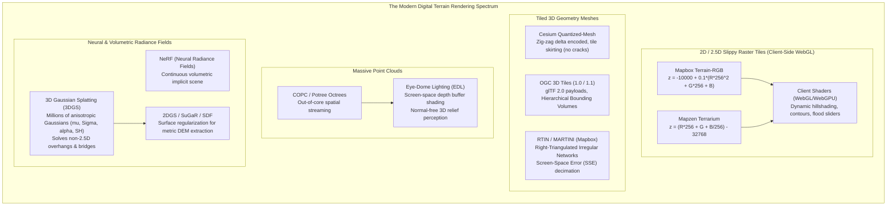

# Chapter 25: Deep Dive into Visualization of DEMs

*How human visual perception, colormaps, shading physics, 3D graphics engines, and 3D Gaussian Splats reveal—or distort—terrain and uncertainty.*

---

## 25.4 Rendering Types: From 2D Slippy Tiles to 3D Meshes, Point Clouds, and Gaussian Splats

Modern digital terrain visualization operates across an expansive spectrum of graphics representations—from lightweight 2D raster tiles designed for web browsers to out-of-core LiDAR octrees and bleeding-edge differentiable 3D Gaussian Splatting. Each representation makes explicit trade-offs between bandwidth, memory footprint, client rendering throughput, and mathematical surface fidelity.



---

### 25.4.1 Client-Side WebGL Elevation: Terrain-RGB and Terrarium

Historically, web mapping servers rendered static hillshade PNG images on the server side and streamed them to the client. This wasted bandwidth and prevented user interaction. In modern web cartography (MapLibre GL JS, Mapbox GL, CesiumJS), servers stream raw floating-point elevation encoded into standard 24-bit RGB PNG or WebP tiles. Client-side GPU fragment shaders unpack the red, green, and blue bytes into floating-point meters, enabling dynamic real-time hillshading, interactive contour generation, and instant flood-level simulation.

#### 1. Mapbox Terrain-RGB Encoding
Mapbox encodes elevation $z$ (in meters) into 24-bit unsigned integers with a precision of $0.1\text{ meters}$:

$$z = -10000 + 0.1 \cdot \big( R \cdot 256^2 + G \cdot 256 + B \big)$$

* **Dynamic Range:** Spans from $-10,000\text{ m}$ (Marianas Trench) to $+16,777.2\text{ m}$ (twice Mount Everest).
* **Quantization Step:** Exactly $0.1\text{ m}$ ($10\text{ cm}$). While sufficient for regional terrain, it introduces visible $10\text{-cm}$ contour stepping on gentle floodplains and athletic fields.

#### 2. Mapzen Terrarium Encoding
Developed by Mapzen, Terrarium uses a mixed fixed-point fraction with higher vertical precision ($1/256\text{ m} \approx 0.0039\text{ m}$):

$$z = \left( R \cdot 256 + G + \frac{B}{256} \right) - 32768$$

* **Dynamic Range:** Spans from $-32,768.0\text{ m}$ to $+32,767.996\text{ m}$.
* **Quantization Step:** $\frac{1}{256}\text{ m} \approx 3.9\text{ mm}$, providing smooth, sub-centimeter gradients that eliminate banding artifacts in hydraulic models.

```glsl
// GLSL Fragment Shader: Decoding Mapbox Terrain-RGB in WebGL
precision highp float;
uniform sampler2D u_terrain_texture;
varying vec2 v_texCoord;

float decodeElevation(vec2 uv) {
    vec4 rgb = texture2D(u_terrain_texture, uv);
    // Convert 0.0-1.0 float texture colors to 0-255 byte integers
    float r = rgb.r * 255.0;
    float g = rgb.g * 255.0;
    float b = rgb.b * 255.0;
    // Mapbox formula: z = -10000.0 + 0.1 * (r * 65536.0 + g * 256.0 + b)
    return -10000.0 + 0.1 * (r * 65536.0 + g * 256.0 + b);
}
```

---

### 25.4.2 3D Surface Meshes: Quantized-Mesh and OGC 3D Tiles

When navigating terrain in full 3D perspectives (e.g., flight simulators, drone mission planning, virtual globes), raster displacement shaders struggle with steep viewing angles and horizon silhouettes. Applications stream explicit 3D triangular meshes.

#### 1. Cesium Quantized-Mesh
Developed by Analytical Graphics, Inc. (AGI) for CesiumJS, **Quantized-Mesh-1.0** is an open binary format optimized for rapid GPU upload:
* **Quantization:** Vertex coordinates $(u, v, h)$ are quantized to 16-bit unsigned integers $[0, 65535]$ within the tile's bounding box.
* **Zig-Zag Delta Encoding:** Coordinates and triangle indices are delta-encoded using zig-zag compression, shrinking tile payload size by up to $70\%$.
* **Tile Skirting (Eliminating Seams):** When two adjacent terrain tiles render at different Level-of-Detail (LoD) resolutions, a higher-resolution tile has more edge vertices than its neighbor, creating visible "cracks" in the 3D ground. Quantized-mesh solves this by appending vertical **mesh skirts** around the outer perimeter of each tile, projecting downward by a small distance to visually seal cracks between mismatched LoD levels.

#### 2. OGC 3D Tiles (1.0 / 1.1) and RTIN (MARTINI)
* **OGC 3D Tiles:** An international standard by the Open Geospatial Consortium (OGC). Uses a hierarchical spatial data structure (octree or KD-tree) governed by **Screen-Space Error (SSE)** thresholds. If the projected screen-space error of a coarse parent tile exceeds a target pixel budget (e.g., $\text{SSE} > 16\text{ pixels}$), the engine loads and refines child tiles containing binary glTF 2.0 meshes.
* **RTIN (Right-Triangulated Irregular Network):** Implemented in Mapbox's `martini` library. It transforms regular raster elevation tiles into adaptive TINs in real time directly inside the browser using JavaScript/WebAssembly. Flat plains are simplified into single large triangles, while jagged mountain cliffs retain full triangle density.

---

### 25.4.3 Massive Point Cloud Rendering and Eye-Dome Lighting (EDL)

Airborne and mobile LiDAR surveys produce unstructured collections of hundreds of millions to billions of discrete 3D points $(x, y, z, I)$. Rendering these datasets without meshing requires out-of-core octree architectures and specialized screen-space shading.

#### 1. Out-of-Core Point Streaming (Potree and COPC)
The **Cloud Optimized Point Cloud (COPC)** format arranges LAS/LAZ 1.4 point records into a hierarchical octree stored within a single backward-compatible LAZ file. Web viewers (such as Potree or Cesium) stream only the octree nodes required to satisfy the camera's current viewport and LoD limit.

#### 2. Eye-Dome Lighting (EDL)
A raw point cloud contains no surface connectivity: points have no polygon faces and often lack computed surface normals $\hat{\mathbf{n}}$. Under standard Lambertian lighting, an unmeshed point cloud appears as an undifferentiated, flat blob of uniform color.

Pioneered by Christian Boucheny (2009) and popularized by Potree (Markus Schütz), **Eye-Dome Lighting (EDL)** is an image-space, non-photorealistic shading filter that operates entirely on the GPU **depth buffer ($z$-buffer)**:

```mermaid
flowchart LR
    PointRaster["Rasterize Points to Screen\n(Generate Depth Buffer z_buffer)"] --> Kernel["Sample 8 Neighboring Pixels in Cross/Circle\nat Screen Distance d = 1 to 2 pixels"]
    Kernel --> DepthDiff["Compute Local Depth Discontinuities:\nDelta_z_k = max(0, z_neighbor - z_center)"]
    DepthDiff --> ShadingFactor["Compute EDL Shading Attenuation:\nS = exp( -s * sum(Delta_z_k) )\nModulate pixel color by S"]
    ShadingFactor --> Output["Crisp 3D Relief Silhouette\n(Requires Zero Surface Normals!)"]
end
```

The EDL shading factor $S$ for pixel $(x, y)$ with depth $z_0$ is computed over $K$ neighborhood directions (typically 4 or 8 neighbors spaced by radius $r$):

$$S(x, y) = \exp\left( -s \cdot \sum_{k=1}^K \max\big(0, \, z_k - z_0\big) \right)$$
where $s$ is an empirical shading strength parameter and $z_k$ is the depth of neighbor $k$.
* If a point sits on a flat plane, its neighbors have nearly identical depths ($z_k - z_0 \approx 0$), yielding $S \approx 1.0$ (no darkening).
* If a point sits on a ridge or edge above deeper background points, $z_k - z_0$ is large, driving $S \to 0$ (drawing a crisp, dark silhouette shadow along the back edge).
* *Result:* EDL provides immediate, high-contrast 3D depth perception on raw, unmeshed LiDAR point clouds in real time without the computational cost of generating surface normals or triangulated meshes.

---

### 25.4.4 Neural Radiance Fields (NeRF) and 3D Gaussian Splatting (3DGS)

The year 2023 witnessed an epochal paradigm shift in 3D scene representation with the introduction of **3D Gaussian Splatting (3DGS)** by Kerbl, Kopanas, Leimkühler, and Drettakis. 

#### 1. The Breakdown of 2.5D DEMs in Complex Geometry
Traditional digital elevation models are strictly **2.5D**: every horizontal coordinate $(x, y)$ is restricted to a single scalar height $z = f(x, y)$. This mathematical assumption fails completely when mapping:
* Overhanging sea cliffs, sea caves, and natural arches.
* Multi-level civil infrastructure (double-deck bridges, highway flyovers, parking garages).
* Dense forest canopies overhanging steep riverbanks.

While Neural Radiance Fields (NeRFs) can represent complex 3D volumes implicitly via multi-layer perceptrons (MLPs), their rendering requires ray-marching through thousands of network evaluations per pixel, making real-time interactive navigation on commodity hardware impossible ($<5\text{–}15\text{ fps}$).

#### 2. The Mechanics of 3D Gaussian Splatting (3DGS)
3DGS replaces implicit neural networks with a discrete, explicit collection of millions of **anisotropic 3D Gaussians**. Each Gaussian $i$ is parameterized by:
1. **Center Position:** $\boldsymbol{\mu}_i = (x_i, y_i, z_i)^T \in \mathbb{R}^3$.
2. **3D Covariance Matrix:** $\boldsymbol{\Sigma}_i \in \mathbb{R}^{3 \times 3}$, parameterized by a 3D scaling vector $\mathbf{s} \in \mathbb{R}^3$ and a rotation quaternion $\mathbf{q} \in \mathbb{H}$ ($\boldsymbol{\Sigma} = \mathbf{R}\mathbf{S}\mathbf{S}^T\mathbf{R}^T$).
3. **Opacity:** $\alpha_i \in [0, 1]$.
4. **View-Dependent Color:** Spherical Harmonic (SH) coefficients encoding direction-dependent radiance.

During rendering, the 3D Gaussians are projected to 2D image screen space as 2D elliptical splats via the camera Jacobian $\mathbf{J}$ and viewing transformation $\mathbf{W}$:
$$\boldsymbol{\Sigma}' = \mathbf{J}\mathbf{W}\boldsymbol{\Sigma}\mathbf{W}^T\mathbf{J}^T$$
A GPU tile-based radix sort orders the splats by depth, and standard $\alpha$-blending accumulates radiance along viewing rays:
$$C = \sum_{i \in \mathcal{N}} c_i \alpha_i \prod_{j=1}^{i-1} (1 - \alpha_j)$$
This achieves photorealistic, view-dependent rendering at **$>100\text{ frames per second}$** at $4\text{K}$ resolution.

#### 3. Strengths vs. Fatal Pitfalls of 3DGS for Elevation Modeling
* **Strengths:** 
  * Seamlessly captures true 3D non-2.5D geometry: overhanging rock arches, ship hulls in drydocks, and bridge undersides are fully resolved with photorealistic texture.
  * Allows interactive, immersive fly-through inspections for engineering diagnostics.
* **The "Floater" and Cloud Pitfall:**
  Differentiable optimization frequently creates semi-transparent, needle-shaped Gaussians floating in mid-air ("floaters") or under the ground surface that minimize training photometric loss without corresponding to physical geometry.
* **The Ambiguous Metric Surface Trap:**
  Because Gaussians are volumetric probability clouds, **3DGS does not define a physical surface**. If a surveyor asks, "What is the ground elevation at $(x, y)$?", standard 3DGS cannot provide a single, defensible metric depth.
* **Surface Regularization (2DGS and SuGaR):**
  To extract defensible DEMs from Gaussian splatting, researchers have developed **2D Gaussian Splatting (2DGS)** (Huang et al. 2024) and **SuGaR** (Surface Gaussians for Reconstruction). 2DGS collapses the 3D ellipsoid into flat, planar 2D disk splats that explicitly align with the physical surface geometry. By regularizing disk normals against ray-splat intersection depths, 2DGS allows automated, metrically accurate Poisson surface reconstruction and bare-earth DEM extraction from dense drone and terrestrial camera sweeps.
