# Chapter 25: Deep Dive into Visualization of DEMs

*How human visual perception, colormaps, shading physics, 3D graphics engines, and 3D Gaussian Splats reveal—or distort—terrain and uncertainty.*

---

## 25.5 Historical Evolution: From Pen Plotters to 3D Gaussian Splats

The visualization of digital terrain is an unbroken six-decade arc spanning mainframe pen plotters, specialized silicon graphics workstations, virtual globes, browser-based WebGL engines, and differentiable radiance fields. The milestones below, anchored in the `schwehr/gis-history` repository, trace how computational graphics transformed static elevation matrices into interactive, immersive representations of the planet.

```mermaid
timeline
    title Historical Evolution of Terrain Visualization & Graphics
    1965 : Harvard Lab (SYMAP / SYMVU) : Line-printer isarithm maps & isometric pen plots
    1967 : Experimental Cartography Unit (ECU) : Early digital contouring & vector relief
    1981 : SGI Founded (Jim Clark) : Dedicated Geometry Engine hardware revolution
    1988 : GMT Released (Wessel & Smith) : Scriptable analytical hillshading & PostScript
    1989 : SGI Open Inventor : Object-oriented 3D retained-mode scene graphs
    1992 : OpenGL 1.0 Specification : Universal cross-platform rasterization API
    1993 : NASA Ames VEVI : Virtual reality terrain navigation for planetary rovers
    1997 : VRML 2.0 / X3D : Early web-based 3D terrain standard
    1999 : Keyhole Inc. Founded : Clipmapping & streaming multi-resolution pyramids
    2000 : Colin Ware *Information Visualization* : Neurobiology applied to cartography
    2001 : Keyhole EarthViewer 1.0 : Desktop 3D globe (CNN 2003 Iraq war broadcast)
    2004 : GeoMapApp (Haxby & Ryan) : Deep-sea marine bathymetric visualization
    2005 : Google Maps : 256x256 Web Mercator 'slippy tiles' revolutionize web GIS
    2007 : Google Earth & Google Ocean (2009) : Global virtual globe with ocean floor
    2010 : Three.js & Leaflet : Browser WebGL 3D rendering & mobile slippy maps
    2011 : CesiumJS (Patrick Cozzi) : Open-source WebGL virtual globe & Quantized-Mesh
    2013 : Mapbox GL JS / MapLibre : Vector tiles & GPU fragment shader terrain
    2016 : deck.gl & kepler.gl (2018) : High-performance GPU-accelerated spatial analytics
    2023 : 3D Gaussian Splatting (Kerbl et al.) : Real-time differentiable 3D radiance fields
```

---

### 25.5.1 The Mainframe and Dedicated Silicon Era: 1965 to 1992

#### 1965: Harvard Lab for Computer Graphics (SYMAP and SYMVU)
Under the leadership of Howard Fisher at the Harvard Laboratory for Computer Graphics and Spatial Analysis, researchers created **SYMAP** (Synagraphic Mapping System). SYMAP generated the world's first digital isarithmic and choropleth elevation maps by overstriking characters on standard IBM 1403 line printers to create gray tonal shades.

In 1968, Frank Renshaw and Carl Steinitz developed **SYMVU**, which parsed grid matrices to draw 3D perspective terrain wireframes on mechanical CalComp pen plotters. For the first time, geographers could view a digital elevation grid from arbitrary azimuths and elevation angles without physical clay models.

#### 1967: The Experimental Cartography Unit (ECU, London)
Founded by David Bickmore in London, the ECU pioneered high-precision automated cartography. Working with Ferranti flatbed plotters, the ECU generated the first digitally contoured and shaded relief maps directly from stereoplotter digital elevation strings.

#### 1981–1992: Silicon Graphics (SGI) and the OpenGL Revolution
In 1981, Jim Clark and colleagues from Stanford University founded **Silicon Graphics, Inc. (SGI)**. Clark invented the **Geometry Engine**—a custom VLSI chip dedicated exclusively to 3D geometric matrix transformations, clipping, and perspective division. SGI workstations (IRIS, Indigo, Onyx) dominated computer graphics for two decades.

* **1989: SGI Open Inventor:** Rikk Carey and Paul Strauss developed an object-oriented 3D scene graph library in C++. It introduced hierarchical nodes, camera projections, light sources, and materials, defining the architectural pattern that governs all modern 3D engines.
* **1992: OpenGL 1.0:** SGI released the open, vendor-neutral OpenGL specification, abstracting hardware acceleration across Unix, Windows, and Macintosh platforms. Every modern GIS rendering engine (from QGIS 3D to CesiumJS) traces its graphics pipeline directly to OpenGL.

#### 1988: Generic Mapping Tools (GMT)
Paul Wessel and Walter H. F. Smith released **GMT**. Scriptable on Unix command lines, GMT introduced the first open-source implementation of analytical shaded relief (`grdgradient` and `grdimage`) and tension splines (`surface`), establishing the publication cartography standard for global marine and solid-earth geophysics.

---

### 25.5.2 Virtual Reality and the Birth of Virtual Globes: 1993 to 2004

#### 1993: NASA Ames VEVI (Virtual Environment Vehicle Interface)
At NASA Ames Research Center, Scott Fisher and the Intelligent Mechanisms Group developed **VEVI**. Created to steer teleoperated vehicles in hostile environments, VEVI ingested stereo photogrammetric DEMs from Antarctic sub-ice exploration and the Mars Pathfinder rover mission, allowing scientists wearing head-mounted displays to walk across reconstructed planetary landscapes.

#### 1999–2001: Keyhole Inc. and EarthViewer
Founded by John Hanke, Mark Aubin, and Brian McClendon, **Keyhole Inc.** solved the fundamental barrier of 3D planetary rendering: how to stream gigabytes of high-resolution imagery and elevation over slow internet connections.
* Utilizing SGI's **Clipmapping** algorithm (Tanner et al. 1998), Keyhole constructed a hierarchical spherical quadtree pyramid of elevation and imagery. The client only streamed the mipmap tiles needed to satisfy screen-space pixel density.
* Released as **EarthViewer 1.0** in 2001, the software stunned the world during the 2003 US invasion of Iraq when CNN and ABC News used it nightly for live 3D flyovers of Baghdad. In 2004, Google acquired Keyhole, rebranding EarthViewer as **Google Earth**.

#### 2000: Colin Ware and Perception Science
Colin Ware published the 1st Edition of *Information Visualization: Perception for Design*. Ware bridged psychophysics and computer graphics, establishing the cognitive rules governing luminance contrast, relief inversion, and colorblind-safe palettes that remain the bedrock of terrain cartography.

#### 2004: GeoMapApp
William (Bill) F. Haxby and William B. F. Ryan at Lamont-Doherty Earth Observatory released **GeoMapApp**. Operating as a dynamic Java application, GeoMapApp provided instantaneous global bathymetric navigation using Haxby's custom pastel marine colormaps, opening deep-sea oceanic exploration to researchers worldwide.

---

### 25.5.3 The Web Browser and WebGL Revolution: 2005 to 2018

#### 2005: Google Maps and the Slippy Tile Standard
Google Maps launched in February 2005, introducing the **Web Mercator (EPSG:3857)** 256x256 "slippy tile" standard. By caching pre-rendered tiles across a quadtree pyramid ($z/x/y$), web browsers achieved fluid pan-and-zoom navigation using asynchronous XMLHttpRequests (AJAX), fundamentally reshaping human geographic navigation.

#### 2007–2009: Google Earth 4.0 and Google Ocean
Google Earth transitioned to cross-platform desktop deployment. In February 2009, Google Earth 5.0 launched **Google Ocean**, integrating Smith & Sandwell global marine bathymetry alongside thousands of historical ship tracks and research dive logs. That same year, SGI—once the titan of 3D hardware—filed for Chapter 11 bankruptcy, reflecting the total commoditization of GPU silicon by NVIDIA and ATI.

#### 2010–2011: Three.js and CesiumJS
* **2010: Three.js:** Ricardo Cabello (Mr.doob) released Three.js, bringing lightweight, scene-graph-based 3D graphics directly into web browsers via the nascent HTML5 WebGL standard without plugins.
* **2011: CesiumJS:** Patrick Cozzi and AGI created CesiumJS, the world's first production-grade, open-source WebGL virtual globe. Cesium introduced **Quantized-Mesh** terrain streaming and later standardized **OGC 3D Tiles**, enabling massive geospatial meshes and city-scale BIM models to render seamlessly in web browsers.

#### 2013–2018: GPU Vector Tiles and Large-Scale Spatial Analytics
* **2013: Mapbox GL JS (MapLibre):** Replaced static raster image tiles with GPU-rendered vector tiles and floating-point **Terrain-RGB** rasters. Fragment shaders on the user's local graphics card perform dynamic hillshading and real-time contouring at 60 fps.
* **2016–2018: deck.gl and kepler.gl:** Developed by Shan He and the visualization team at Uber, deck.gl combined WebGL2 and WebGPU compute shaders to render tens of millions of dynamic 3D geospatial points, elevation meshes, and flow paths at interactive framerates.

---

### 25.5.4 The Differentiable Radiance Era: 2023+

#### 2023: 3D Gaussian Splatting (3DGS)
In July 2023, Bernhard Kerbl, Georgios Kopanas, Thomas Leimkühler, and George Drettakis published *3D Gaussian Splatting for Real-Time Radiance Field Rendering* at ACM SIGGRAPH. By representing physical scenes as millions of parameterized 3D ellipsoids optimized via differentiable rasterization, 3DGS shattered the speed and resolution limits of Neural Radiance Fields (NeRFs). 

For the first time in GIS history, non-2.5D topography—vertical sea cliffs, natural arches, overhanging rock faces, and urban infrastructure—can be rendered with photorealistic view-dependent fidelity at over $100\text{ fps}$. The subsequent development of **2DGS** and **SuGaR** in 2024 bridged the gap between photorealistic graphics and rigorous geodetic elevation modeling, allowing surveyors to extract metrically accurate bare-earth DEMs from drone radiance fields.
