# Chapter 25: Deep Dive into Visualization of DEMs

*How human visual perception, colormaps, shading physics, 3D graphics engines, and 3D Gaussian Splats reveal—or distort—terrain and uncertainty.*

---

## 25.6 Mathematical Foundations of Terrain Shading and Splatting

Visualizing elevation data requires solving mathematical models of light propagation, geometric projection, and hemispherical solid angles. This section derives the exact equations governing analytical hillshading, hemispherical Sky-View Factor horizon integrals, and the anisotropic screen-space covariance projection of 3D Gaussian Splats.

```mermaid
flowchart TD
    subgraph MathFoundations["Mathematical Formulations for Terrain Visualization"]
        direction TB
        subgraph LambertShade["Analytical Hillshade Reflectance"]
            HornGrad["Discrete Finite Differences (Horn 1981)\nEstimates p = dz/dx and q = dz/dy"]
            NormalVec["Surface Normal n_hat\nCross product of tangent vectors"]
            DotProduct["Lambertian Reflectance: I = max( 0, n_hat . s_hat )\nIllumination vector s_hat(azimuth, altitude)"]
            HornGrad --> NormalVec --> DotProduct
        end

        subgraph HorizonIntegral["Sky-View Factor (SVF)"]
            SolidAngle["Hemispherical Solid Angle Integral\nIntegral from horizon gamma(phi) to zenith pi/2"]
            DiscreteSVF["Discrete Approximation:\nSVF = 1 - (1/N) * sum( sin(gamma_i) )"]
            SolidAngle --> DiscreteSVF
        end

        subgraph SplatCovariance["3D Gaussian Splatting Projection"]
            CovParam["3D Covariance: Sigma = R * S * S^T * R^T\nQuaternion rotation R, scale matrix S"]
            Jacobian["Projective Jacobian Matrix J (2x3)\nLinearizes perspective division at t = W * mu"]
            ProjCov["2D Screen Covariance: Sigma' = J * W * Sigma * W^T * J^T\nTile-based GPU Alpha-Blending"]
            CovParam --> Jacobian --> ProjCov
        end
    end
```

---

### 25.6.1 Derivation of Analytical Lambertian Hillshade Reflectance

An analytical hillshade computes the radiant intensity reflected from an ideal diffuse surface under a single collimated light source.

#### 1. Surface Tangents and the Unit Normal Vector
Let the terrain surface be parameterized as $z = f(x, y)$ in a right-handed Cartesian coordinate system where $+x$ points East, $+y$ points North, and $+z$ points Upward.

The orthogonal tangent vectors spanning the tangent plane at $(x, y)$ are:
$$\mathbf{t}_x = \begin{pmatrix} 1 \\ 0 \\ \frac{\partial z}{\partial x} \end{pmatrix}, \quad \mathbf{t}_y = \begin{pmatrix} 0 \\ 1 \\ \frac{\partial z}{\partial y} \end{pmatrix}$$

Let the directional spatial gradients be denoted as $p = \frac{\partial z}{\partial x}$ and $q = \frac{\partial z}{\partial y}$. The unnormalized outward surface normal vector is obtained by their cross product:
$$\mathbf{n} = \mathbf{t}_x \times \mathbf{t}_y = \begin{vmatrix} \hat{\mathbf{i}} & \hat{\mathbf{j}} & \hat{\mathbf{k}} \\ 1 & 0 & p \\ 0 & 1 & q \end{vmatrix} = \begin{pmatrix} -p \\ -q \\ 1 \end{pmatrix}$$

Normalizing $\mathbf{n}$ yields the unit normal vector $\hat{\mathbf{n}}$:
$$\hat{\mathbf{n}} = \frac{\mathbf{n}}{\|\mathbf{n}\|} = \frac{1}{\sqrt{1 + p^2 + q^2}} \begin{pmatrix} -p \\ -q \\ 1 \end{pmatrix}$$

#### 2. Illumination Vector Parameterization
Let the light source (sun) be defined by solar zenith angle $\theta_z$ (measured from the vertical $+z$ axis, where sun altitude above the horizon is $\alpha_{\text{alt}} = 90^\circ - \theta_z$) and solar azimuth angle $\phi_{\text{az}}$ (measured clockwise from North / $+y$):

$$\hat{\mathbf{s}} = \begin{pmatrix} \sin\theta_z \sin\phi_{\text{az}} \\ \sin\theta_z \cos\phi_{\text{az}} \\ \cos\theta_z \end{pmatrix} = \begin{pmatrix} \cos\alpha_{\text{alt}} \sin\phi_{\text{az}} \\ \cos\alpha_{\text{alt}} \cos\phi_{\text{az}} \\ \sin\alpha_{\text{alt}} \end{pmatrix}$$

#### 3. Reflectance Equation
Under Lambert's cosine law, the reflected intensity $I \in [0, 1]$ is:
$$I = \max\big(0, \, \hat{\mathbf{n}} \cdot \hat{\mathbf{s}}\big)$$

Computing the inner product:
$$\hat{\mathbf{n}} \cdot \hat{\mathbf{s}} = \frac{-p \cos\alpha_{\text{alt}}\sin\phi_{\text{az}} - q \cos\alpha_{\text{alt}}\cos\phi_{\text{az}} + \sin\alpha_{\text{alt}}}{\sqrt{1 + p^2 + q^2}}$$

Factoring $\cos\alpha_{\text{alt}}$:
$$I = \max\left(0, \; \frac{\sin\alpha_{\text{alt}} - \cos\alpha_{\text{alt}} \big( p \sin\phi_{\text{az}} + q \cos\phi_{\text{az}} \big)}{\sqrt{1 + p^2 + q^2}} \right)$$

#### 4. Discrete Finite Difference Gradient Estimation (Horn 1981)
On a discrete raster grid with grid cell spacing $\Delta x$ and $\Delta y$, the partial derivatives $p$ and $q$ at cell $(i, j)$ are computed across a $3 \times 3$ moving window using Horn's weighted finite-difference operator:

$$\begin{matrix} z_{i-1, j+1} & z_{i, j+1} & z_{i+1, j+1} \\ z_{i-1, j} & z_{i, j} & z_{i+1, j} \\ z_{i-1, j-1} & z_{i, j-1} & z_{i+1, j-1} \end{matrix}$$

$$p = \frac{\partial z}{\partial x} \approx \frac{(z_{i+1, j+1} + 2z_{i+1, j} + z_{i+1, j-1}) - (z_{i-1, j+1} + 2z_{i-1, j} + z_{i-1, j-1})}{8 \cdot \Delta x}$$
$$q = \frac{\partial z}{\partial y} \approx \frac{(z_{i+1, j+1} + 2z_{i, j+1} + z_{i-1, j+1}) - (z_{i+1, j-1} + 2z_{i, j-1} + z_{i-1, j-1})}{8 \cdot \Delta y}$$
Horn's formulation uses a distance-weighted average ($1, 2, 1$) that acts as a low-pass filter, minimizing the propagation of high-frequency random sensor noise into the hillshade image.

---

### 25.6.2 Derivation of the Sky-View Factor (SVF) Horizon Integral

The Sky-View Factor (SVF) represents the proportion of unobstructed sky hemisphere visible from a point on the ground, corresponding to diffuse irradiance under an isotropic overcast sky.

#### 1. Hemispherical Solid Angle Formulation
Consider a point $P$ on the terrain surface. The total upper hemisphere $\Omega$ has a solid angle of $2\pi$ steradians. In spherical coordinates $(\theta, \phi)$ where $\theta$ is the zenith angle ($\theta \in [0, \pi/2]$) and $\phi$ is the azimuth angle ($\phi \in [0, 2\pi)$):

The differential solid angle element is:
$$d\omega = \sin\theta \, d\theta \, d\phi$$

Under Lambert's diffuse emission law, the projected solid angle weighting includes a factor of $\cos\theta$ (projected area onto the horizontal plane). The total visible diffuse flux fraction is:

$$\text{SVF} = \frac{1}{\pi} \int_0^{2\pi} \left[ \int_0^{\frac{\pi}{2} - \gamma(\phi)} \cos\theta \sin\theta \, d\theta \right] d\phi$$
where $\gamma(\phi)$ is the maximum terrain horizon elevation angle above the horizontal plane along azimuth direction $\phi$.

#### 2. Evaluating the Zenith Integral
Using the trigonometric identity $\cos\theta \sin\theta = \frac{1}{2}\sin(2\theta)$:
$$\int_0^{\frac{\pi}{2} - \gamma(\phi)} \cos\theta \sin\theta \, d\theta = \left[ \frac{\sin^2\theta}{2} \right]_0^{\frac{\pi}{2} - \gamma(\phi)} = \frac{1}{2}\sin^2\left(\frac{\pi}{2} - \gamma(\phi)\right) = \frac{1}{2}\cos^2\gamma(\phi) = \frac{1 - \sin^2\gamma(\phi)}{2}$$

Substituting back into the azimuthal integral:
$$\text{SVF} = \frac{1}{\pi} \int_0^{2\pi} \frac{1 - \sin^2\gamma(\phi)}{2} \, d\phi = \frac{1}{2\pi}\int_0^{2\pi} \big(1 - \sin^2\gamma(\phi)\big) \, d\phi = 1 - \frac{1}{2\pi}\int_0^{2\pi} \sin^2\gamma(\phi) \, d\phi$$

#### 3. Discrete Approximation for Computational GIS
In operational software (such as the Relief Visualization Toolbox - RVT), the continuous integral is discretized over $N$ equally spaced azimuth search rays (typically $N = 16$ or $32$):

$$\text{SVF} \approx 1 - \frac{1}{N} \sum_{i=1}^N \sin\gamma_i$$
where the horizon angle $\gamma_i$ along azimuth $\phi_i = \frac{2\pi (i-1)}{N}$ is determined by searching radially outward to a maximum user-defined radius $R$:
$$\gamma_i = \max_{r \in [1, R]} \left[ \arctan\left( \frac{z(r, \phi_i) - z(0)}{r \cdot \Delta s} \right) \right]$$

---

### 25.6.3 3D Gaussian Splatting Covariance Projection

3D Gaussian Splatting (Kerbl et al. 2023) represents continuous 3D scenes by a collection of anisotropic 3D Gaussians $G(\mathbf{x})$.

#### 1. 3D Covariance Parameterization
Each Gaussian in world space is centered at $\boldsymbol{\mu} \in \mathbb{R}^3$ with 3D covariance matrix $\boldsymbol{\Sigma} \in \mathbb{R}^{3 \times 3}$:
$$G(\mathbf{x}) = \exp\left( -\frac{1}{2} (\mathbf{x} - \boldsymbol{\mu})^T \boldsymbol{\Sigma}^{-1} (\mathbf{x} - \boldsymbol{\mu}) \right)$$

To guarantee that $\boldsymbol{\Sigma}$ remains positive semi-definite during gradient descent optimization, it is decomposed into a rotation matrix $\mathbf{R}$ and a scaling matrix $\mathbf{S}$:
$$\boldsymbol{\Sigma} = \mathbf{R} \mathbf{S} \mathbf{S}^T \mathbf{R}^T$$
where $\mathbf{S} = \text{diag}(s_x, s_y, s_z)$ is defined by 3 learned scale parameters, and $\mathbf{R}$ is computed from a normalized unit quaternion $\mathbf{q} = (w, x, y, z)^T$:
$$\mathbf{R} = \begin{pmatrix} 1 - 2(y^2 + z^2) & 2(xy - wz) & 2(xz + wy) \\ 2(xy + wz) & 1 - 2(x^2 + z^2) & 2(yz - wx) \\ 2(xz - wy) & 2(yz + wx) & 1 - 2(x^2 + y^2) \end{pmatrix}$$

#### 2. Projective Jacobian and Screen-Space Covariance
To render a 3D Gaussian onto a 2D camera sensor, the 3D ellipsoid must be projected into screen coordinates.
Let $\mathbf{W} \in \mathbb{R}^{3 \times 3}$ be the viewing transformation (rotation matrix of the camera view matrix), mapping world coordinates to camera coordinates:
$$\mathbf{t} = \mathbf{W}\boldsymbol{\mu} = \begin{pmatrix} t_x \\ t_y \\ t_z \end{pmatrix}$$

The pinhole perspective projection maps camera coordinates $(t_x, t_y, t_z)$ to 2D image coordinates $\mathbf{u} = (u, v)^T$:
$$u = f_x \frac{t_x}{t_z} + c_x, \quad v = f_y \frac{t_y}{t_z} + c_y$$
where $f_x, f_y$ are focal lengths and $(c_x, c_y)$ is the principal point.

Because perspective projection is non-linear, it is linearized around the Gaussian center $\mathbf{t}$ via the first-order Taylor expansion **affine Jacobian matrix $\mathbf{J} \in \mathbb{R}^{2 \times 3}$**:

$$\mathbf{J} = \begin{pmatrix} \frac{\partial u}{\partial t_x} & \frac{\partial u}{\partial t_y} & \frac{\partial u}{\partial t_z} \\ \frac{\partial v}{\partial t_x} & \frac{\partial v}{\partial t_y} & \frac{\partial v}{\partial t_z} \end{pmatrix} = \begin{pmatrix} \frac{f_x}{t_z} & 0 & -\frac{f_x t_x}{t_z^2} \\ 0 & \frac{f_y}{t_z} & -\frac{f_y t_y}{t_z^2} \end{pmatrix}$$

Applying the transformation of Gaussian random variables (Zwicker et al. 2001 EWA splatting), the **2D screen-space covariance matrix $\boldsymbol{\Sigma}' \in \mathbb{R}^{2 \times 2}$** is:

$$\boldsymbol{\Sigma}' = \mathbf{J} \mathbf{W} \boldsymbol{\Sigma} \mathbf{W}^T \mathbf{J}^T$$

To prevent visual aliasing when Gaussians become smaller than a single pixel, a low-pass filter of variance $\sigma_{\text{filter}}^2 = 0.3$ is added to the diagonal elements:
$$\boldsymbol{\Sigma}'_{\text{final}} = \boldsymbol{\Sigma}' + \begin{pmatrix} 0.3 & 0 \\ 0 & 0.3 \end{pmatrix}$$

#### 3. Screen-Space Alpha-Blending Rasterization
The projected 2D Gaussian evaluated at screen pixel $\mathbf{u} = (u, v)^T$ determines the local opacity $\alpha_i$:
$$\alpha_i = o_i \cdot \exp\left( -\frac{1}{2} (\mathbf{u} - \boldsymbol{\mu}'_i)^T (\boldsymbol{\Sigma}'_i)^{-1} (\mathbf{u} - \boldsymbol{\mu}'_i) \right)$$
where $o_i \in [0, 1]$ is the learned opacity and $\boldsymbol{\mu}'_i$ is the projected 2D center on screen.

The screen pixels are sorted by depth $t_z$, and color $C(\mathbf{u})$ is accumulated via front-to-back alpha blending:
$$C(\mathbf{u}) = \sum_{i \in \mathcal{N}} c_i \alpha_i \prod_{j=1}^{i-1} (1 - \alpha_j)$$
where $c_i$ is the view-dependent color evaluated from the spherical harmonics. This closed-form formulation allows GPU CUDA threads to render entire mountain terrains and infrastructure overhangs with extreme speed and gradient differentiability.
