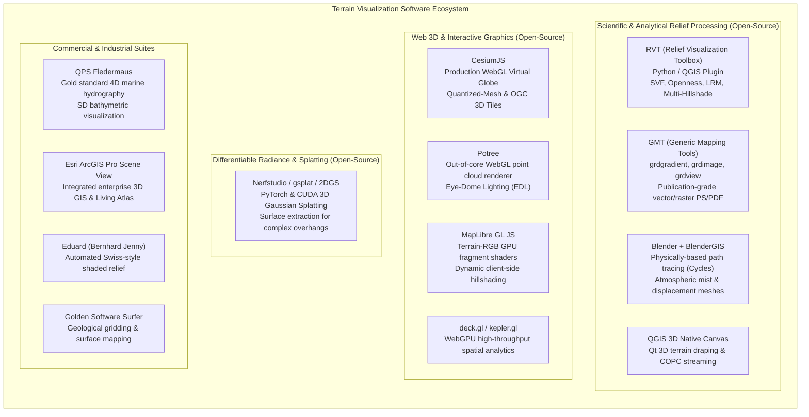

# Chapter 25: Deep Dive into Visualization of DEMs

*How human visual perception, colormaps, shading physics, 3D graphics engines, and 3D Gaussian Splats reveal—or distort—terrain and uncertainty.*

---

## 25.7 Software Ecosystem

The software ecosystem for digital terrain visualization ranges from scriptable command-line utilities and scientific Python libraries to photorealistic 3D ray-tracers, browser-based WebGL globes, and CUDA-accelerated Gaussian splatting engines. This section reviews the primary open-source and commercial platforms used to process, render, and publish elevation surfaces.



---

### 25.7.1 Open-Source Analytical and Scientific Tools

#### 1. Relief Visualization Toolbox (RVT)
Developed by Žiga Kokalj, Klemen Zakšek, and Peter Pehani at the Research Centre of the Slovenian Academy of Sciences and Arts (ZRC SAZU), **RVT** is the premier scientific library for advanced terrain visualization. Available as a standalone GUI, a QGIS plugin, and an open-source Python library (`rvt-py`), RVT provides optimized NumPy/C++ implementations of:
* Analytical Hillshading (single and multi-directional).
* Sky-View Factor (SVF) and Anisotropic SVF.
* Positive and Negative Openness.
* Local Relief Models (LRM).
* Simple Local Relief Model (SLRM).
* Sky-illumination models and shadow analysis.

```python
"""
Compute Sky-View Factor (SVF) and Multi-Directional Hillshade
using the open-source Relief Visualization Toolbox (rvt-py).
"""

import rvt.vis
import rvt.default
import rasterio

def generate_enhanced_terrain_layers(input_dem_path: str, output_svf_path: str, output_hillshade_path: str):
    """
    Computes SVF and multi-directional hillshade from a high-resolution DEM raster.
    
    Args:
        input_dem_path: Path to input GeoTIFF elevation raster.
        output_svf_path: Path to save 8-bit or 32-bit Sky-View Factor GeoTIFF.
        output_hillshade_path: Path to save multi-directional hillshade GeoTIFF.
    """
    with rasterio.open(input_dem_path) as src:
        dem_arr = src.read(1)
        profile = src.profile.copy()
        res_x = src.transform[0]
        res_y = -src.transform[4]  # Pixel heights are typically negative in affine transforms
        
    res = (res_x + res_y) / 2.0
    print(f"Loaded DEM: {dem_arr.shape}, nominal resolution: {res:.2f}m")
    
    # 1. Compute Sky-View Factor (radius = 10 cells, 16 search directions)
    print("Computing Sky-View Factor (16 directions, search radius 10 cells)...")
    svf_dict = rvt.vis.sky_view_factor(
        dem=dem_arr,
        resolution=res,
        compute_svf=True,
        compute_asvf=False,
        compute_opns=False,
        nr_dir=16,
        svf_n_dir=16,
        svf_r_max=10,
        svf_noise=1
    )
    svf_arr = svf_dict["svf"]
    
    # 2. Compute Multi-Directional Hillshade (16 directions, sun altitude 35 deg)
    print("Computing Multi-Directional Hillshade...")
    multi_hillshade = rvt.vis.multi_hillshade(
        dem=dem_arr,
        resolution=res,
        nr_dir=16,
        sun_elevation=35
    )
    
    # Export layers as GeoTIFF
    profile.update(dtype=rasterio.float32, count=1)
    with rasterio.open(output_svf_path, "w", **profile) as dst:
        dst.write(svf_arr.astype(rasterio.float32), 1)
        
    with rasterio.open(output_hillshade_path, "w", **profile) as dst:
        dst.write(multi_hillshade.astype(rasterio.float32), 1)
        
    print(f"Successfully exported:\n  - SVF: {output_svf_path}\n  - Hillshade: {output_hillshade_path}")
```

#### 2. The Generic Mapping Tools (GMT)
GMT remains the gold standard for publication-grade static figures in earth science journals (Nature, JGR, GRL, Science).
* `gmt grdgradient dem.nc -A315 -Ne0.8 -Ggradient.nc`: Computes directional directional directional derivatives normalized to a Laplace distribution for high dynamic-range hillshading.
* `gmt grdimage dem.nc -Igradient.nc -Cbatlow -JM15c -Baf -P > map.ps`: Drapes a perceptually uniform colormap over shaded relief with sub-pixel antialiasing.
* `gmt grdview dem.nc -Igradient.nc -Cbatlow -JZ3c -p135/30 -Qs > 3d_mesh.ps`: Generates 3D perspective surface meshes with full vector hidden-line removal.

#### 3. Blender and `BlenderGIS`
For cinematic scientific communication and high-end visualization, the open-source 3D package **Blender** paired with the **`BlenderGIS`** addon allows direct import of GeoTIFF elevation grids and shapefiles:
* Converts floating-point rasters into dynamic micro-displacement modifier meshes.
* Employs the **Cycles** physically-based path-tracing render engine to simulate real-world atmospheric Rayleigh scattering, true soft sun shadows, volumetrics, and water specular reflections.

---

### 25.7.2 Open-Source WebGL and Real-Time Interactive Engines

#### 1. CesiumJS
The standard for browser-based 3D virtual globes. Provides native support for **Quantized-Mesh** terrain streaming and **OGC 3D Tiles 1.1**. Features real-time sun position calculation based on UTC date/time, atmospheric fog, dynamic terrain exaggeration, and terrain-clamped vector draping.

#### 2. Potree and COPC Viewers
An open-source WebGL point cloud renderer developed by Markus Schütz at TU Wien:
* Streams billions of LiDAR points over HTTP using an out-of-core octree hierarchy.
* Uses hardware-accelerated **Eye-Dome Lighting (EDL)** to render dense point clouds with high-contrast structural relief without generating surface normals.

#### 3. MapLibre GL JS
The community-led fork of Mapbox GL JS. Supports GPU-based **Terrain-RGB** and **Terrarium** slippy tiles. Executes fragment shaders on client GPUs to perform real-time analytical hillshading with interactive sun azimuth/altitude sliders, client-side contour line generation, and instantaneous elevation profiling along user-drawn paths.

#### 4. Nerfstudio, `gsplat`, and 2DGS
Open-source research toolchains (developed by UC Berkeley, INRIA, and the graphics research community) for training and rendering 3D Gaussian Splats:
* `gsplat`: A highly optimized, differentiable CUDA/PyTorch rasterization library for Gaussian splatting.
* `2DGS` (2D Gaussian Splatting): Explicitly designed to constrain Gaussian ellipsoids to flat 2D surfels, enabling geometrically valid surface reconstruction and DEM extraction of overhanging sea cliffs and rock arches.

---

### 25.7.3 Commercial and Industrial Visualization Suites

#### 1. QPS Fledermaus
Developed by Quality Positioning Services (QPS), **Fledermaus** is the unchallenged industry standard for marine hydrographic visualization:
* Built upon the proprietary **SD (Spatial Data)** file format, which enables real-time 4D exploration of massive multibeam bathymetry, water column acoustic backscatter, and sub-bottom profiler seismic horizons.
* Provides real-time dynamic vertical exaggeration, custom bathymetric palettes (including Haxby), and interactive flight-path recording for deep-ocean ROV dive debriefs.

#### 2. Esri ArcGIS Pro Scene View
Esri's flagship desktop 3D visualization environment:
* Renders global and local scenes using Esri's World Elevation Service (combining 3DEP, Copernicus GLO-30, and GEBCO).
* Seamlessly integrates BIM (Revit/IFC) models, textured multipatch buildings, and subsurface geological strata.

#### 3. Eduard (Swiss-Style Shaded Relief)
Developed by Bernhard Jenny (Monash University / Oregon State University), **Eduard** is a specialized desktop application that automates the generation of classic Swiss-style relief shading:
* Adjusts light direction locally along mountain ridgelines to prevent flat-lit washouts.
* Applies multi-scale aerial perspective, desaturating valley floors and brightening alpine crags.
* Replaces mechanical, uniform analytical shading with artistic, cartographically expressive shaded relief.
