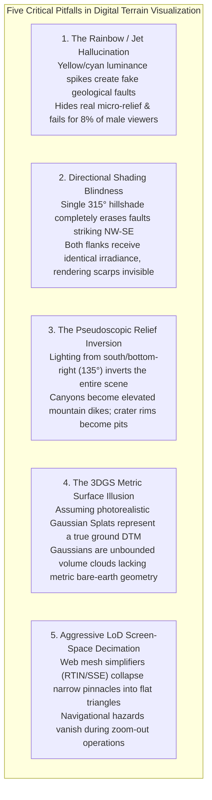

# Chapter 25: Deep Dive into Visualization of DEMs

*How human visual perception, colormaps, shading physics, 3D graphics engines, and 3D Gaussian Splats reveal—or distort—terrain and uncertainty.*

---

## 25.8 Common Pitfalls and Key Takeaways

Terrain visualization sits at the volatile intersection of human visual neurobiology, physics, and computer graphics. Errors in visual rendering are particularly insidious because they do not crash software pipelines; instead, they quietly manipulate the human visual cortex, leading geologists to drill dry wells on hallucinated faults, navigators to misjudge shallow shoals, and engineers to trust ungrounded radiance fields.

---

### 25.8.1 Common Pitfalls in Terrain Visualization

#### 1. The Rainbow / Jet Hallucination
* **The Failure Mode:** An earth scientist or GIS analyst maps an elevation model or bathymetric surface using standard rainbow, `jet`, or `hsv` palettes.
* **Perceptual Mechanism:** The human visual system's shape-from-shading engine relies entirely on monotonic luminance gradients ($L^*$). Rainbow palettes contain violent, non-monotonic luminance spikes at Yellow ($L^* \approx 95$) and Cyan ($L^* \approx 85$), alternating with dark troughs at Blue and Red.
* **Forensic Consequence:** The sharp rate of change of luminance across the yellow and cyan bands triggers lateral inhibition in retinal ganglion cells, creating artificial **Mach Bands**. Analysts frequently document linear "fault scarps," "stratigraphic boundaries," or "marine terrace steps" that are purely retinal illusions. Furthermore, $8\%$ of male viewers with deuteranomaly cannot distinguish red hazard zones from green safe zones.
* **Remedy:** Permanently ban rainbow and jet from spatial data visualization. Mandate perceptually uniform palettes (`batlow`, `viridis`, `cmocean.deep`, `cmocean.topo`).

#### 2. Directional Shading Blindness
* **The Failure Mode:** An environmental impact team or earthquake hazard mapper generates a single analytical hillshade using standard northwest illumination (azimuth $315^\circ$, altitude $45^\circ$) to map regional faults or glacial lineations.
* **Physical Mechanism:** Lambertian reflectance intensity is $I = \max(0, \hat{\mathbf{n}} \cdot \hat{\mathbf{s}})$. When a linear topographic ridge or fault scarp strikes parallel to the illumination azimuth ($\phi_{\text{strike}} \approx 315^\circ$), its cross-strike slope normal is perpendicular to the light rays.
* **Forensic Consequence:** Both the uphill-facing and downhill-facing slopes receive identical solar irradiance ($p \sin\phi + q \cos\phi = 0$). The fault scarp has zero shading contrast and completely vanishes from the rendered map. Major earthquake fault ruptures and subsea pipeline hazards striking northwest have been overlooked for decades due to single-azimuth hillshades.
* **Remedy:** Never rely on a single directional hillshade. Supplement with **Multi-Directional Hillshading** (USGS 8-direction composite), **Sky-View Factor (SVF)**, or **Topographic Openness**.

#### 3. The Pseudoscopic Relief Inversion Trap
* **The Failure Mode:** A drone operator or cartographer sets the hillshade sun azimuth to the "true" local sun position at the time of survey (e.g., azimuth $135^\circ\text{–}180^\circ$ for morning or winter sun in the Northern Hemisphere).
* **Perceptual Mechanism:** The human brain evolved under an immutable prior: *light comes from above*. On a map where North is at the top of the screen, light from $135^\circ$ (the bottom-right) violates this neural heuristic.
* **Forensic Consequence:** The visual cortex undergoes an involuntary **pseudoscopic inversion**. River canyons appear as elevated volcanic dikes, and mountain ridges appear as deeply incised ravines. Field crews following such maps make disastrous navigational errors, confusing ridge crests with stream beds.
* **Remedy:** Always illuminate cartographic relief from the **top-left quadrant ($315^\circ$)**, or employ non-directional diffuse models (SVF/RRIM) where light direction is irrelevant.

#### 4. The 3D Gaussian Splatting Metric Surface Illusion
* **The Failure Mode:** A surveyor captures a drone video of an active landslide, trains a 3D Gaussian Splat (3DGS) model, and attempts to calculate earthwork cut-and-fill volumes directly from the rendered model.
* **Physical Mechanism:** 3DGS optimizes millions of semi-transparent, anisotropic 3D ellipsoids purely to minimize photometric image reproduction loss. The Gaussians float volumetrically in space without explicit surface connectivity, normal vectors, or a singular ground elevation $z = f(x, y)$.
* **Forensic Consequence:** The rendered scene appears razor-sharp and photorealistic, but measuring depths produces chaotic results: rays pass through floating atmospheric "floaters" or penetrate into subsurface transparent Gaussians. Calculated earthwork volumes can be in error by hundreds of cubic meters.
* **Remedy:** Do not treat raw 3DGS as a metrically defensible DEM. Use surface-regularized models like **2D Gaussian Splatting (2DGS)** or **SuGaR** to reconstruct geometrically verified polygonal meshes and bare-earth elevation rasters before computing volumes.

#### 5. Aggressive LoD Screen-Space Decimation
* **The Failure Mode:** A web mapping developer configures a real-time 3D terrain viewer (using RTIN, Quantized-Mesh, or Cesium 3D Tiles) with an overly permissive Screen-Space Error threshold ($\text{SSE} > 20\text{ pixels}$) to maximize mobile framerates.
* **Geometric Mechanism:** Quadtree mesh decimation simplifies continuous grids into adaptive triangles based on flat geometric error tolerances across the entire screen.
* **Forensic Consequence:** High-frequency, sharp topographic spires—such as a $2\text{-meter}$ navigation rock pinnacle in a shallow harbor or an earthen flood protection levee—have a small horizontal footprint ($<5\text{ m}$). At medium zoom levels, the LoD simplifier collapses the pinnacle into a single flat triangle spanning the surrounding sea floor. The navigational hazard disappears from the screen until the vessel is within dozens of meters of grounding.
* **Remedy:** Implement feature-aware LoD preservation. Force the mesh decimation engine to respect a **hard constraint mask** (such as IHO S-102 designated soundings or USACE levee crest vectors) that prohibits simplification regardless of camera distance.

---

### 25.8.2 Key Takeaways for Practitioners

1. **Luminance Carries Form; Hue Carries Category:** Use perceived brightness ($L^*$) to convey 3D slopes, hillshades, and surface textures. Use hue and saturation exclusively for elevation bands, categorical regions, or uncertainty bounds.
2. **Ban Rainbow Colormaps:** Replace `jet` and `rainbow` with perceptually uniform, colorblind-safe palettes (`batlow`, `viridis`, `cmocean.deep`, `cmocean.topo`).
3. **Always Light from the Northwest ($315^\circ$):** Never illuminate terrain from the bottom or right of the screen unless you intentionally want to invert mountains into valleys.
4. **Direction-Independent Shading Uncovers the Invisible:** Supplement analytical hillshades with Sky-View Factor (SVF) or Topographic Openness to reveal structures obscured by directional illumination shadows.
5. **Always Visualize Uncertainty:** Never publish a composite elevation map with uniform visual confidence. Use bivariate colormaps or stippled texture overlays to show where data is measured vs. interpolated.
6. **3DGS Requires Surface Regularization:** Photorealistic 3D Gaussian Splats are radiance models, not metric surfaces. Use 2DGS or SuGaR when engineering measurements or volume calculations are required.
