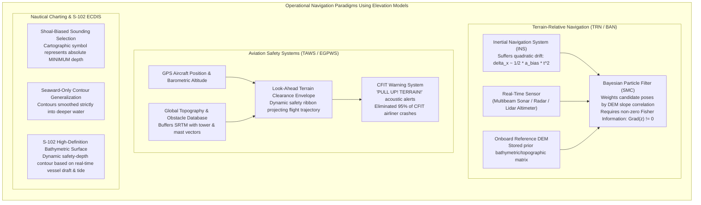
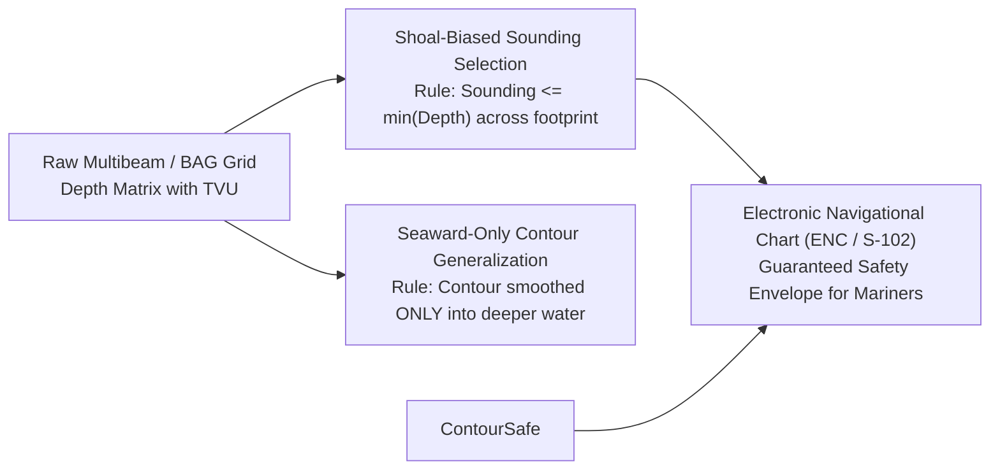

# Chapter 26: Navigating, Charting, Topographic Maps, and Cartographic Production

*Turning elevation models into operational navigation systems, official nautical charts, and publication-grade topographic maps.*

---

## 26.1 Navigating and Charting Based on DEMs

Digital elevation models do not merely represent the Earth's surface for passive visual inspection; they are mission-critical reference databases that guide autonomous systems, prevent commercial airline crashes, and ensure the safety of global maritime commerce. In navigation, elevation models are weaponized against spatial uncertainty. An error of five meters in an aviation terrain database can cause Controlled Flight Into Terrain (CFIT), while an unpreserved two-meter pinnacle on an electronic nautical chart will breach the double hull of an oil tanker.

This section explores how elevation models power **Terrain-Relative Navigation (TRN)** in GNSS-denied environments, drive **Aviation Terrain Awareness and Warning Systems (TAWS)**, and dictate the life-or-death rules of **Nautical Charting**.

---

### 26.1.1 Terrain-Relative Navigation (TRN) and Bathymetric-Aided Navigation (BAN)

In environments where Global Navigation Satellite Systems (GNSS) are physically impossible—such as submerged submarines, autonomous underwater vehicles (AUVs), electronic warfare jamming zones, or planetary descent capsules—navigators cannot rely on satellite signals.

#### 1. The Physics of Inertial Drift
An Inertial Navigation System (INS) integrates dead-reckoning accelerations ($\mathbf{a}$) and angular rates ($\boldsymbol{\omega}$) from ring-laser or fiber-optic gyroscopes. However, residual sensor biases $\mathbf{a}_{\text{bias}}$ compound quadratically over time:

$$\delta \mathbf{x}(t) \approx \frac{1}{2} \mathbf{a}_{\text{bias}} t^2 + \mathbf{v}_{\text{drift}} t$$

After 24 hours of submerged navigation, even a navigation-grade INS ($0.1\text{ nmi/hr}$ drift rate) can accumulate positional uncertainty of $2\text{–}5\text{ kilometers}$, risking collision with underwater seamounts or drifting off mission targets.

#### 2. The TRN Particle Filter Solution
**Terrain-Relative Navigation (TRN)**—and its marine equivalent, **Bathymetric-Aided Navigation (BAN)**—eliminates drift by matching real-time altimeter or sonar profiles against a pre-loaded reference DEM stored inside the vehicle's computer.

* **Sensing:** As the vehicle moves, an acoustic multibeam sonar (on an AUV) or downward-looking radar/LiDAR (on an aircraft or planetary lander like Mars 2020 *Perseverance*) measures a swath of ranges to the ground.
* **State Estimation:** A **Sequential Monte Carlo (Bayesian Particle Filter)** maintains a swarm of thousands of candidate pose hypotheses (particles $\mathbf{x}_k$). Each particle computes the expected depth or altitude it should observe from the reference DEM:
  $$\hat{y}_{k, m} = h_{\text{DEM}}(\mathbf{x}_k, \boldsymbol{\theta}_m)$$
* **Weight Update:** Particles whose expected elevations match the real sensor returns are rewarded with high statistical weights, while particles predicting non-existent terrain are terminated:
  $$w_k^{(t)} \propto w_k^{(t-1)} \cdot \exp\left( -\frac{1}{2} \sum_{m=1}^M \frac{(y_m - \hat{y}_{k, m})^2}{\sigma_{\text{sensor}}^2 + \sigma_{\text{DEM}}^2} \right)$$
Within minutes of flying over rugged topography, the particle cloud collapses to the true geographic position, bounding INS drift to the resolution of the DEM ($\pm 1\text{–}5\text{ meters}$).

#### 3. The Fisher Information Criterion: The Flat Terrain Trap
TRN is fundamentally dependent on topographic roughness. The **Fisher Information Matrix (FIM)** governing horizontal position observability is directly proportional to the squared spatial gradients of the reference DEM:

$$\mathbf{J}_{\text{TRN}} \propto \sum_{m=1}^M \begin{pmatrix} \left(\frac{\partial z}{\partial x}\right)^2 & \frac{\partial z}{\partial x}\frac{\partial z}{\partial y} \\ \frac{\partial z}{\partial x}\frac{\partial z}{\partial y} & \left(\frac{\partial z}{\partial y}\right)^2 \end{pmatrix}$$

* If a submarine traverses an **abyssal plain** or an aircraft flies over the **Bonneville Salt Flats**, terrain gradients are zero: $\nabla z = (0, 0)^T$.
* In flat terrain, $\mathbf{J}_{\text{TRN}} = \mathbf{0}$; the Fisher Information vanishes, and the particle filter receives zero spatial positioning updates. The vehicle's position estimate immediately resumes unconstrained inertial drift.
* If the reference DEM contains an unmodeled systematic bias or an unmapped sand-wave shift, the particle filter can experience catastrophic divergence, locking onto an erroneous terrain peak miles away.

---

### 26.1.2 Aviation Terrain Awareness and Warning Systems (TAWS / EGPWS)

Historically, **Controlled Flight Into Terrain (CFIT)**—in which a fully airworthy aircraft under the control of the flight crew is inadvertently flown into terrain, water, or obstacles—was the single leading cause of commercial aviation fatalities.

#### 1. The Don Bateman Revolution (EGPWS)
In the late 1990s, legendary Honeywell engineer C. Donald Bateman invented the **Enhanced Ground Proximity Warning System (EGPWS)**, later codified by the FAA and ICAO as the **Terrain Awareness and Warning System (TAWS Class A)**:
* EGPWS abandoned legacy radar altimeters that merely looked straight down beneath the fuselage (which gave zero warning when flying level into a sheer vertical cliff).
* Instead, Bateman paired continuous GPS horizontal positioning with an onboard global digital elevation model (derived from Space Shuttle SRTM and USGS 3DEP) and a database of tall man-made obstacles.

#### 2. The Dynamic Look-Ahead Envelope
EGPWS projects a 3D dynamic safety ribbon ahead of the aircraft based on current ground speed, roll angle, vertical velocity, and aircraft climb performance capabilities:
* If the projected flight path penetrates the **Caution Envelope** ($40\text{–}60\text{ seconds}$ prior to projected terrain impact), cockpit synthesized audio issues: `"TERRAIN, AHEAD! PULL UP!"`
* If the aircraft penetrates the **Warning Envelope** ($20\text{–}30\text{ seconds}$ to impact), the system commands immediate maximum thrust and climb: `"PULL UP! PULL UP!"`
* *Impact:* Since the mandatory adoption of TAWS worldwide, commercial passenger airline CFIT accidents have declined by over **$95\%$**, making digital elevation models one of the most successful aviation safety interventions in human history.

---

### 26.1.3 Nautical Charting: The Shoal-Biased Safety Imperative

Civilian GIS software (such as QGIS or ArcGIS) is built for statistical cartography, where contour smoothing and surface gridding prioritize aesthetic symmetry and mean least-squares fits. In nautical charting, this mindset is fatal.

#### 1. Shoal-Biased Sounding Selection
When compiling an Electronic Navigational Chart (ENC) or paper nautical chart from a dense multibeam Bathymetric Attributed Grid (BAG), cartographers must generalize millions of soundings into a legible pattern of printed depth numbers:
* **The Non-Negotiable Rule:** The depth value chosen to represent a charted area must be the **absolute shoalest (shallowest) depth** within that graphic symbol's footprint:
  $$z_{\text{charted}} \le \min_{\mathbf{x} \in \mathcal{A}_{\text{footprint}}} z_{\text{bathymetry}}(\mathbf{x})$$
* If an area contains an average depth of $18\text{ meters}$ with an isolated $4.2\text{-meter}$ granite pinnacle, the printed sounding number **must read $4.2$** (or be depicted with an explicit rock symbol). Under no circumstances may an automated generalization algorithm report the local average ($17.5\text{ m}$)!

#### 2. Seaward-Only (One-Sided) Contour Generalization
Contour lines drawn from high-resolution bathymetric grids are naturally jagged and visually cluttered. While cartographers smooth these lines for visual clarity, nautical standards strictly mandate **one-sided, shoal-safe generalization**:
* A smoothed depth contour $C_{\text{smooth}}(z_0)$ must never shift shoreward into shallower water than the true physical depth boundary.
* Contours may **only expand outward (seaward) into deeper water**.
* *Operational Reason:* A vessel master navigating in low visibility uses the $10\text{-meter}$ depth contour as an absolute boundary line. If the vessel remains outside (seaward of) the printed $10\text{-m}$ line, the navigator must be $100\%$ legally and physically guaranteed that water depth everywhere beneath the keel is $\ge 10\text{ meters}$. A symmetric smoothing filter (such as a Gaussian or B-spline) that cuts across a shallow rock outcrop creates a lethal trap.

#### 3. IHO S-102 High-Definition Bathymetric Overlays in ECDIS
Under the IHO S-100 framework, **S-102** delivers high-resolution, ungeneralized bathymetric surfaces (HDF5 BAG grids) directly into the vessel's Electronic Chart Display and Information System (ECDIS):
* Rather than relying on static, generalized paper contours, the ECDIS ingests the vessel's dynamic real-time parameters: static keel draft, dynamic vessel squat (which increases draft at high speeds), safety under-keel clearance margin, and real-time GNSS water-level tides.
* The system computes a **dynamic safety contour** on the fly, rendering shallow waters in high-contrast danger red and automatically sounding navigational alarms if the ship's projected safety corridor crosses into hazardous depth nodes.
