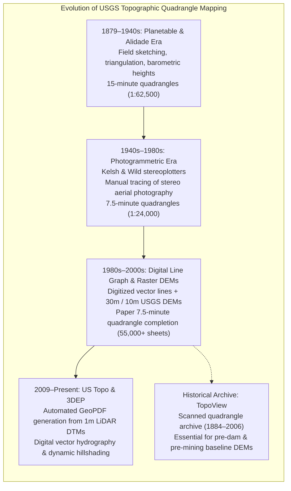
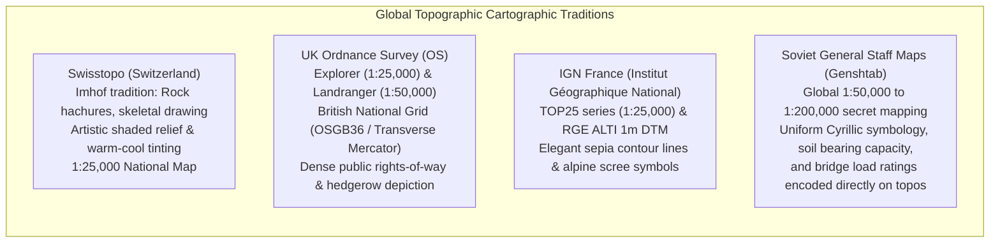

# Chapter 26: Navigating, Charting, Topographic Maps, and Cartographic Production

*Turning elevation models into operational navigation systems, official nautical charts, and publication-grade topographic maps.*

---

## 26.2 USGS Topos and Topographic Maps in General

The printed topographic quadrangle is the quintessential artifact of terrestrial cartography. For over a century, topographic maps served as the primary interface between human society and the three-dimensional geometry of the landscape. Today, while manual copperplate engraving has been replaced by cloud-native pipelines pulling directly from airborne LiDAR, the visual grammar of topographic contours remains governed by strict geodetic accuracy standards.

This section traces the evolution of national topographic series, compares international cartographic traditions, and derives the mathematical rules governing honest contour interval selection.

---

### 26.2.1 Evolution of the USGS Topographic Quadrangle

The United States Geological Survey (USGS) topographic program transformed North American spatial administration through four distinct operational eras:

#### 1. 1879–1940s: The Planetable and Alidade Era
Topographers occupied high mountain summits and baseline towers with transit telescopes and planetables. Traversing terrain on horseback and foot, topographers measured horizontal angles, sighted stadia rods, and calculated elevation differences using vertical angles:
$$\Delta h = d_{\text{horizontal}} \cdot \tan\alpha + h_{\text{inst}} - h_{\text{rod}}$$
Contour lines were hand-sketched in the field between surveyed spot elevations. Over $55,000$ historical quadrangles were drawn, establishing the $15\text{-minute}$ ($1:62,500$) and early $7.5\text{-minute}$ ($1:24,000$) standards.

#### 2. 1940s–1980s: The Analog Photogrammetric Era
World War II accelerated the adoption of aerial photography. Using stereoplotters (e.g., Kelsh, Bausch & Lomb, Wild A8), cartographers viewed overlapping stereo pairs through polarized or anaglyph glasses, using mechanical pantographs to trace three-dimensional "floating dots" along lines of equal elevation. This produced the classic USGS $7.5\text{-minute}$ series, renowned for its delicate brown contour lines.

#### 3. 1980s–2000s: Digital Line Graphs (DLGs) and USGS DEMs
The USGS scanned paper quadrangles to produce Digital Line Graphs (DLGs) and interpolated the world's first national elevation rasters: the $30\text{-meter}$ (1 arc-second) and $10\text{-meter}$ ($1/3$ arc-second) National Elevation Dataset (NED).

#### 4. 2009–Present: *US Topo* and the 3DEP Era
Today, the USGS produces **US Topo** maps: layered GeoPDFs generated completely automatically on a 3-year refresh cycle. Elevation contours are no longer hand-drawn; they are extracted dynamically from the **3D Elevation Program (3DEP)** $1\text{-meter}$ and $1/3\text{-arcsecond}$ LiDAR bare-earth models. Contours are smoothed using polynomial splines and layered over high-resolution USDA NAIP aerial orthoimagery.

#### 5. The TopoView Historical Archive
The USGS maintains **TopoView**, an open public archive of over $180,000$ historical georeferenced topographic maps dating from 1884 to 2006. 
* *Engineering Importance:* TopoView is the primary tool for reconstructing historical "pre-disturbance" elevation models. When an environmental engineer evaluates groundwater contamination beneath an open-pit mine, or calculates sediment accumulation behind a dam built in 1935, historical quadrangle contours provide the only physical record of the original pre-construction terrain.

---

### 26.2.2 International Topographic Traditions

Different physiographic environments and military doctrines shaped distinct national cartographic traditions:

* **Swisstopo (Swiss Federal Office of Topography):** The international benchmark for alpine cartography. Developed under the artistic and scientific leadership of Eduard Imhof, Swisstopo maps replace mechanical contours with hand-drawn **rock hachures and skeletal crest lines** in vertical cliffs where contour lines would otherwise collapse into a solid brown smear.
* **UK Ordnance Survey (OS):** Built around the British National Grid (OSGB36). Renowned for recreational trail navigation, OS maps depict field boundaries, stone walls, and public rights-of-way with sub-meter horizontal precision.
* **Soviet General Staff (Genshtab) Topographic Maps:** Conducted between 1945 and 1990, the Soviet military executed an unprecedented global mapping campaign, producing complete topographic quadrangles across Europe, Asia, Africa, and North America. Genshtab maps are prized by civil engineers because they explicitly annotated riverbed substrate materials, water velocity, bridge structural load limits, and forest tree trunk diameters directly on the map margin.

---

### 26.2.3 The Mathematical Rule of Contour Interval Selection

In professional cartography and civil engineering, choosing a contour interval ($\text{CI}$) is not an aesthetic preference; it is a **mathematical commitment to vertical precision**. 

Under the **National Map Accuracy Standards (NMAS)** and codified by the American Society for Photogrammetry and Remote Sensing (ASPRS):
* At least **$90\%$ of tested elevations** interpolated from map contours must fall within **half of the contour interval ($\pm 0.5 \cdot \text{CI}$)**:

$$P\big( |z_{\text{interpolated}} - z_{\text{true}}| \le 0.5 \cdot \text{CI} \big) \ge 0.90$$

#### Derivation of the Minimum Allowable Contour Interval
Assuming elevation errors follow a zero-mean Gaussian distribution $\epsilon_z \sim \mathcal{N}(0, \sigma_z^2)$ where $\sigma_z \approx \text{RMSE}_z$:

The probability of falling within a symmetric error bound $\pm e_{\text{max}}$ is:
$$P\big(|\epsilon_z| \le e_{\text{max}}\big) = \text{erf}\left( \frac{e_{\text{max}}}{\sigma_z \sqrt{2}} \right) = 0.90$$

Using the inverse error function:
$$\frac{e_{\text{max}}}{\sigma_z \sqrt{2}} = \text{erf}^{-1}(0.90) \approx 1.163087 \implies e_{\text{max}} = 1.163087 \cdot \sqrt{2} \cdot \sigma_z \approx 1.6449 \cdot \text{RMSE}_z$$

Since NMAS dictates that $e_{\text{max}} = 0.5 \cdot \text{CI}$:
$$0.5 \cdot \text{CI} \ge 1.6449 \cdot \text{RMSE}_z$$

Multiplying both sides by 2:
$$\text{CI} \ge 3.2897 \cdot \text{RMSE}_z \approx 3.3 \cdot \text{RMSE}_z$$

$$\text{Minimum Allowable Contour Interval: } \quad \text{CI}_{\min} = 3.3 \cdot \text{RMSE}_z$$

#### The Forensic Danger of Dishonest Contours
A widespread malpractice in modern GIS is generating micro-contour lines from coarse or noisy elevation models:
* If a surveyor downloads an SRTM or Copernicus GLO-30 DEM with an $\text{RMSE}_z = \pm 2.0\text{ meters}$, the minimum honest contour interval is:
  $$\text{CI}_{\min} = 3.3 \cdot 2.0\text{ m} = 6.6\text{ meters} \implies \text{Round to } 10\text{ meters}$$
* If the practitioner uses GIS software to generate **$1\text{-foot}$ ($0.30\text{-m}$) contours** from this dataset, the resulting map is a **fraudulent representation**. The dense, squiggling contour lines reflect instrument noise, radar phase jitter, and interpolation artifacts rather than real terrain geometry.
* Generating $1\text{-foot}$ contours mathematically mandates an elevation dataset with $\text{RMSE}_z \le \frac{0.3048\text{ m}}{3.2897} \approx 0.0926\text{ m}$ ($9.3\text{ cm}$)—a precision achievable only by **USGS 3DEP Quality Level 1 (QL1) airborne LiDAR** or high-precision drone photogrammetry.

---

### 26.2.4 The Graphic Hierarchy of Contours

Topographic maps employ an established graphic grammar to make dense elevation contours visually decipherable:

1. **Index Contours:** Every **fourth or fifth contour line** is drawn with a heavy line weight (typically $0.35\text{–}0.50\text{ mm}$). Index contours are broken at regular intervals to insert the explicit numeric elevation.
2. **Intermediate Contours:** Fine, unbroken lines ($0.10\text{–}0.15\text{ mm}$) drawn between index contours at the specified interval $\text{CI}$.
3. **Supplementary Contours:** Dashed or dotted lines drawn at **half the standard interval ($\frac{1}{2}\text{CI}$)** in extremely flat regions (such as Mississippi River delta floodplains or coastal mudflats) where standard contours are spaced kilometers apart.
4. **Depression Contours:** Closed contour loops enclosing a topographic low (a sinkhole, volcanic crater, glacial kettle hole, or open-pit gravel quarry). To distinguish a depression from an isolated hilltop, cartographers append **inward-pointing hachures (tick marks)** along the inner edge of the line pointing downhill toward the pit.
5. **Spot Elevations and Benchmarks:** Discrete elevation points ($BM \times 1248$) surveyed with millimeter to centimeter precision at road intersections, mountain peaks, and geodetic brass disks.
