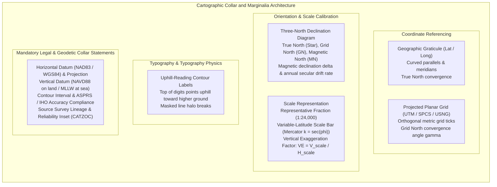
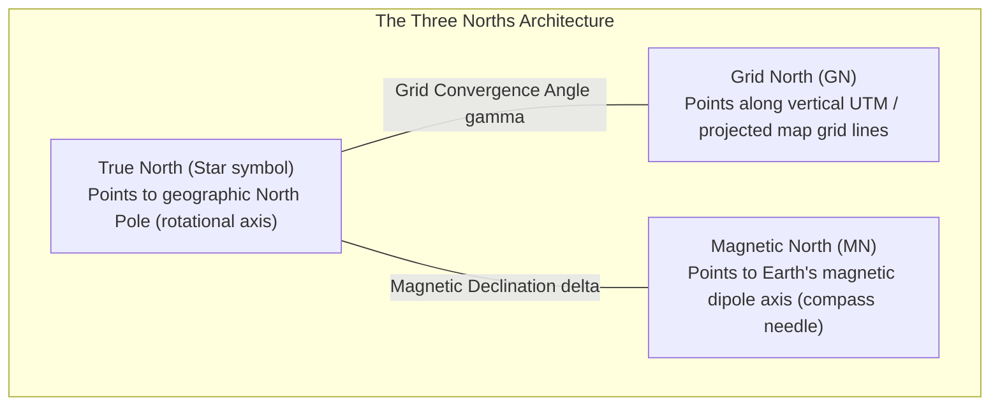
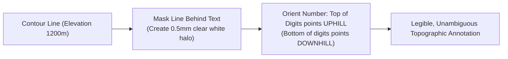

# Chapter 26: Navigating, Charting, Topographic Maps, and Cartographic Production

*Turning elevation models into operational navigation systems, official nautical charts, and publication-grade topographic maps.*

---

## 26.3 Creating Maps with DEM Products: Graticules, Labels, and Marginalia

A digital elevation model rendered on a screen without coordinates, datums, scale bars, and marginalia is an ungrounded graphic illustration. In professional engineering, wilderness navigation, and maritime operations, a map's **marginalia** (the map collar) provides the legal and mathematical metadata that binds the physical terrain to an absolute geodetic reference frame.

Designing publication-grade cartographic products from DEMs requires mastering coordinate reference graticules, declination diagrams, variable-scale distortions, label placement rules, and mandatory datum certifications.

---

### 26.3.1 Coordinate Grids and Graticules

A professional elevation map must enable the user to determine positions in both spherical ellipsoidal coordinates and planar metric grids.

#### 1. Geographic Graticules (Latitude and Longitude)
A **graticule** depicts lines of constant latitude ($\phi$, parallels) and constant longitude ($\lambda$, meridians):
* **Geometry on Projections:** On cylindrical projections (such as Mercator or Transverse Mercator), graticule lines appear as straight lines. On conformal conic projections (such as the Lambert Conformal Conic used in USGS 7.5-minute quadrangles and State Plane systems), meridians converge toward the rotational pole as straight radiating rays, while parallels curve as concentric circular arcs.
* **Notation:** Coordinates should be labeled on the map collar using traditional Degrees, Minutes, Seconds (`DMS`: $44^\circ 15' 30''\text{ N}$) or Decimal Degrees (`DD`: $44.25833^\circ\text{ N}$) with consistent tick marks spaced across the inner border.

#### 2. Planar Projected Grids (UTM, State Plane, USNG/MGRS)
A **grid** consists of uniformly spaced, perpendicular metric lines:
* **Universal Transverse Mercator (UTM):** Divides the world into $6^\circ$ longitudinal zones ($1\text{ to }60$) with an arbitrary false easting of $500,000\text{ m}$ at the central meridian.
* **State Plane Coordinate System (SPCS):** High-precision state zones in the United States designed to limit scale distortion to less than 1 part in 10,000.
* **Dual-Grid Collars:** Topographic maps typically incorporate a **dual-grid border**: the neatline displays black ticks for geographic latitude/longitude, overlaid with blue ticks or a full $1,000\text{-meter}$ grid corresponding to the local UTM or US National Grid (USNG/MGRS) coordinate reference.

---

### 26.3.2 Standard Marginalia Elements: The Three Norths and Variable Scale

#### 1. The Three-North Declination Diagram
Every topographic map must feature a declination diagram illustrating the angular relationship between the three distinct definitions of North:

* **True North ($\star$):** Direction of the geographic North Pole (the Earth's axis of rotation). All meridians of longitude point toward True North.
* **Grid North ($\text{GN}$):** Direction of the $+y$ grid lines on the map projection. Because meridians converge while planar grid lines remain strictly parallel, Grid North deviates from True North by the **Grid Convergence Angle ($\gamma$)**:
  $$\gamma = \Delta \lambda \cdot \sin\phi_0$$
  where $\Delta \lambda$ is the longitude offset from the central meridian and $\phi_0$ is the projection origin latitude.
* **Magnetic North ($\text{MN}$):** Direction indicated by a magnetic compass needle pointing toward the geomagnetic pole. The angle between True North and Magnetic North is the **Magnetic Declination ($\delta$)**.
* **Mandatory Declination Collar Note:** The map collar must state the epoch year of the declination, the magnetic model used (e.g., World Magnetic Model - WMM2025), and the **annual secular change**:
  $$\text{Example: } \text{Magnetic Declination at Center of Sheet: } 11^\circ 15' \text{ W (2025), decreasing } 4' \text{ per year.}$$

#### 2. Scale Bars and the Mercator Scale Trap
* **Representative Fraction (RF):** Ratio of map distance to ground distance (e.g., $1:24,000$ indicates that $1\text{ cm}$ on the map represents $24,000\text{ cm} = 240\text{ m}$ on the ground).
* **The Mercator Scale Distortion Trap:**
  On a Mercator projection (standard in marine navigation and Web Mercator), the linear scale factor $k$ increases exponentially with latitude $\phi$:
  $$k = \sec\phi = \frac{1}{\cos\phi}$$
  At latitude $\phi = 60^\circ$, $k = \sec(60^\circ) = 2.0$; an object of a given physical size is displayed twice as large on the map as at the equator!
  * *Cartographic Mandate:* A single static scale bar on a small-scale or regional Mercator map is physically invalid. Cartographers must provide a **Variable-Latitude Scale Bar**, displaying separate graphic scale bars calibrated for $0^\circ, 20^\circ, 40^\circ, \text{and } 60^\circ$ latitude.
* **Vertical Exaggeration Factor ($VE$):**
  When rendering 3D perspective terrain views or cross-sectional elevation profiles, vertical heights are often stretched relative to horizontal distances:
  $$VE = \frac{\text{Vertical Scale}}{\text{Horizontal Scale}}$$
  The map collar or figure caption must explicitly report $VE$ (e.g., $VE = 3.0\times$); concealing vertical exaggeration leads engineers to severely misjudge real slope gradients.

---

### 26.3.3 The Art and Science of Contour Label Placement

Numeric elevation labels on topographic contour lines are governed by strict ergonomic rules:

#### 1. The Uphill-Reading Orientation Rule
The non-negotiable rule of elevation typography is **uphill-reading orientation**:
* The top of the numeric digits must always point **uphill toward higher elevation**.
* *Perceptual Purpose:* When a navigator scans a dense contour field, reading the numbers immediately reveals the direction of the slope without needing to search for an adjacent index contour or check the surrounding spot heights. If the top of the number "1200" points northeast, the slope rises toward the northeast.

#### 2. Line Breaking and Halos
A contour line must never pass directly through the text of an elevation label. Cartographers must either:
* Physically break the vector contour geometry across the text bounding box, or
* Apply a vector **knockout halo** (typically $0.3\text{–}0.5\text{ mm}$ of clear white margin around the text) that suppresses the underlying contour line.
* On steep scarps where contours are densely packed, labels should be aligned into a straight **contour ladder** crossing the lines orthogonally, ensuring labels do not overlap adjacent intermediate contours.

---

### 26.3.4 Mandatory Elevation Map Collar Statements

A professional topographic or bathymetric product must include five mandatory certification statements in its collar marginalia:

1. **Horizontal Geodetic Datum & Map Projection:**
   * "North American Datum of 1983 (NAD83 2011 Epoch 2010.00). Universal Transverse Mercator Projection, Zone 18 North. Transverse Mercator Central Meridian $75^\circ\text{W}$."
2. **Vertical Datum Specification:**
   * On land: "North American Vertical Datum of 1988 (NAVD88). Elevations derived using NGS GEOID18."
   * On coastal/marine charts: "Depths in meters, referenced to Mean Lower Low Water (MLLW) tidal datum. Shoreline reflects Mean High Water (MHW). Tidal transformation executed via NOAA VDatum v4.5."
3. **Contour Interval Declaration:**
   * "Contour Interval: 10 Meters. Supplementary Contours at 5 Meter Intervals shown by dashed lines."
4. **Accuracy and Standards Compliance:**
   * "This map complies with the ASPRS Positional Accuracy Standards for Digital Geospatial Data (2024 Edition 2). Non-Vegetated Vertical Accuracy (NVA): $\pm 0.196\text{ m}$ at $95\%$ confidence level. Vegetated Vertical Accuracy (VVA): $\pm 0.350\text{ m}$ at $95\%$ confidence level."
5. **Source Lineage & Reliability Diagram (CATZOC):**
   * An inset diagram showing the boundary polygons, sensor modalities (e.g., USGS 3DEP QL1 LiDAR vs. 1954 legacy photogrammetry), flight dates, and hydrographic CATZOC confidence ratings.
