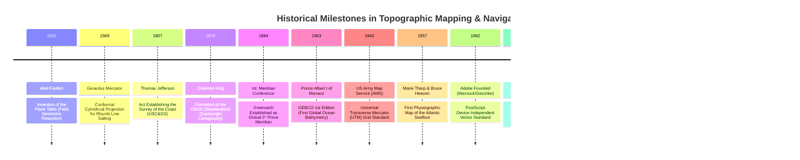

# Chapter 26: Navigating, Charting, Topographic Maps, and Cartographic Production

*Turning elevation models into operational navigation systems, official nautical charts, and publication-grade topographic maps.*

---

## 26.4 Historical Evolution: From Plane Tables to CalTopo

The history of navigating and mapping from elevation models is written in the instruments of field topographers, the mathematical projections of navigators, and the catastrophic accidents that exposed gaps in public charts. The milestones below, anchored in the `schwehr/gis-history` repository, trace the lineage of topographic mapping and hydrographic charting from Renaissance surveying tables to cloud-native backcountry tools.

---

### 26.4.1 The Renaissance and Nautical Geodesy: 1551 to 1807

#### 1551: Abel Foullon and the Plane Table
French engineer Abel Foullon invented the **plane table** (published in his 1551 treatise *L'holomètre*). By mounting a drafting board on a tripod equipped with a rotating alidade ruler, surveyors could perform graphic geometric triangulation directly in the field. Sighting distant mountain peaks and plotting intersection rays eliminated complex trigonometry, enabling topographers to hand-sketch terrain relief directly onto paper in the field.

#### 1569: Gerardus Mercator's Conformal Cylindrical Projection
Flemish geographer Gerardus Mercator published his 1569 world nautical map, *Nova et Aucta Orbis Terrae Descriptio ad Usum Navigantium Emendata*. Mercator mathematically warped the spacing of latitude parallels by $\sec\phi$, ensuring that lines of constant compass bearing (rhumb lines or loxodromes) plot as straight lines. For five centuries, Mercator's projection has governed marine navigation and modern web slippy maps (EPSG:3857).

#### 1807: Foundation of the Survey of the Coast
On February 10, 1807, President Thomas Jefferson signed an Act of Congress authorizing a survey of the coasts of the United States. Under Swiss geodesist Ferdinand Rudolph Hassler, the **Survey of the Coast** (later the U.S. Coast and Geodetic Survey, and today NOAA OCS and NGS) established the nation's primary geodetic triangulation networks, ensuring that shipping channels and coastal topography were tied to astronomical coordinates.

---

### 26.4.2 Institutional Cartography and Military Grids: 1879 to 1942

#### 1879: USGS and 1884 International Meridian Conference
* **1879:** The USGS was formed, establishing the $15\text{-minute}$ and $7.5\text{-minute}$ topographic quadrangle standards that mapped the American continent.
* **1884:** Delegates from 25 nations convened at the **International Meridian Conference in Washington, D.C.**, voting to adopt the Royal Observatory at Greenwich, London, as the universal Prime Meridian ($0^\circ$ longitude) and establishing universal 24-hour solar time. This unified global hydrographic charts, which had previously used local prime meridians (Paris, Washington, Ferro, Cadiz).

#### 1942: Universal Transverse Mercator (UTM) Standard
During World War II, artillery units suffered severe targeting errors because Allied nations used mismatched local conic grids and non-standard coordinate systems. In 1942, the **US Army Map Service (AMS)** created the **Universal Transverse Mercator (UTM)** grid:
* Divided the Earth between $80^\circ\text{S}$ and $84^\circ\text{N}$ into 60 uniform $6^\circ$ longitudinal zones.
* Applied a central scale reduction factor $k_0 = 0.9996$ to limit distortion to $1$ part in $2,500$ across each zone.
* Standardized the **Military Grid Reference System (MGRS)**, enabling soldiers to transmit $1\text{-meter}$ coordinate fixes across tactical radio.

---

### 26.4.3 The Seafloor Revolution and Digital Typography: 1952 to 1993

#### 1952–1977: Marie Tharp and the Discovery of the Mid-Atlantic Rift
At Columbia University's Lamont Geological Observatory, cartographer **Marie Tharp** and oceanographer Bruce Heezen faced thousands of analog single-beam paper echograms collected by research vessels. 
* Because women were barred from sailing aboard Lamont research vessels at the time, Tharp worked ashore, painstakingly plotting sounding profiles across the Atlantic.
* In 1952, Tharp discovered a continuous, V-shaped central depression running down the middle of the North Atlantic ridge. When Bruce Heezen cross-referenced her profiles against earthquake epicenters, the data revealed an active mid-ocean spreading rift.
* Collaborating with Austrian landscape painter Heinrich Berann, Tharp published the **1977 World Ocean Floor Panorama**. Tharp's physiographic maps visually proved the theory of plate tectonics and seafloor spreading to the global public.

#### 1982–1993: Adobe PostScript and PDF
* **1982: PostScript:** John Warnock and Charles Geschke founded Adobe Systems and created **PostScript**, a Turing-complete, device-independent vector page description language. PostScript allowed mathematical representation of Bézier curves, line dashing, font rendering, and coordinate transformations, liberating cartographers from manual scribing tools.
* **1988: Generic Mapping Tools (GMT):** Paul Wessel and Walter H. F. Smith leveraged PostScript to create GMT, allowing scientists to write Unix shell scripts that generated camera-ready shaded relief maps and topographic contours directly from digital matrices.
* **1993: Portable Document Format (PDF):** Adobe released PDF 1.0. Decades later, the addition of geospatial metadata tags (GeoPDF) allowed USGS *US Topo* quadrangles to be delivered as multi-layer vector/raster PDF files readable on any computer or tablet.

---

### 26.4.4 Modern Maritime Tragedies and Cloud-Native Backcountry Mapping: 2005 to 2011

#### 2005: The Grounding of the *USS San Francisco* (SSN-711)
On January 8, 2005, the Los Angeles-class nuclear attack submarine **USS *San Francisco* (SSN-711)** was operating submerged at full flank speed ($33\text{ knots}$, $\sim 38\text{ mph}$) at a depth of $525\text{ feet}$ ($160\text{ m}$) south of Guam.
* The crew was navigating using a Department of Defense navigation chart prepared in 1989. The chart showed an open, deep-water fairway with depths $>1,000\text{ meters}$.
* The submarine slammed head-on into an uncharted underwater seamount rising to within $30\text{ meters}$ of the surface. The bow was crushed, 98 crew members were injured, and Machinist's Mate Second Class Joseph Allen Ashley was killed.
* *Investigation Findings:* Satellite radar altimetry data collected years earlier by Smith and Sandwell had detected a distinct marine gravity anomaly at that exact coordinate, indicating a massive underwater seamount. However, the military hydrographic chart had not been updated with the satellite-derived bathymetric anomaly. The disaster forced navies worldwide to integrate multi-source satellite bathymetry and high-definition DEMs into submarine navigation systems.

#### 2011: Matt Jacobs and CalTopo
In 2011, volunteer search-and-rescue (SAR) technician and software engineer Matt Jacobs created **CalTopo**. Frustrated by cumbersome desktop GIS software during mountain rescues:
* Jacobs built a high-performance web mapping interface that overlaid historical USGS $7.5\text{-minute}$ topos, modern 3DEP LiDAR hillshading, USFS trails, real-time fire progression satellite data, and SNOTEL snow sensors.
* CalTopo introduced real-time **slope-angle shading** (highlighting avalanche-prone terrain between $30^\circ$ and $45^\circ$) and printable high-resolution PDF topos with UTM coordinates. CalTopo became the primary digital mapping platform for mountain search-and-rescue teams, wildland firefighters, and wilderness backcountry navigators across North America.
