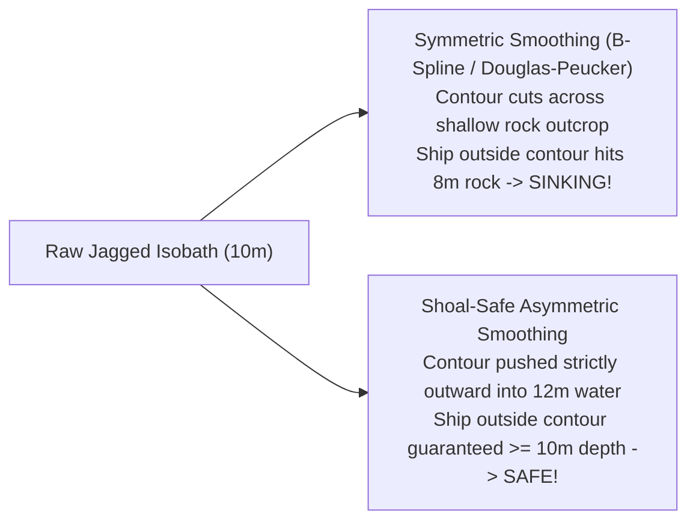

# Chapter 26: Navigating, Charting, Topographic Maps, and Cartographic Production

*Turning elevation models into operational navigation systems, official nautical charts, and publication-grade topographic maps.*

---

## 26.5 Mathematical Foundations of Nautical Generalization and TRN

Cartography and autonomous navigation impose rigorous mathematical constraints on digital elevation models. In nautical charting, line smoothing is governed by asymmetric safety inequalities; in autonomous navigation, terrain models serve as non-linear observation manifolds within Bayesian particle filters.

```mermaid
flowchart TD
    subgraph MathParadigms["Mathematical Formulations for Navigation and Charting"]
        direction TB
        subgraph HydroSafety["Nautical Shoal-Safe Contour Generalization"]
            RawContour["Raw Depth Contour C(z0):\nz_depth(x) = z0"]
            AsymmetricIneq["One-Sided Safety Inequality:\nFor all x in Omega_safe(C_tilde): z_depth(x) - TVU_95(x) >= z0"]
            Morphological["Morphological Dilation / Rolling-Disk Operator\nGuarantees zero encroachment into shallow water"]
            RawContour --> AsymmetricIneq --> Morphological
        end

        subgraph BayesianTRN["Terrain-Relative Navigation (TRN) Particle Filter"]
            MotionState["Inertial State Propagation:\nx_t = f(x_{t-1}, u_t) + w_t\nCompound quadratic INS error growth"]
            DEM_Lookup["DEM Observation Manifold:\ny_hat_m = h_DEM(x_k, theta_m)\nInterpolated depth/elevation along beam ray"]
            LikelihoodUpdate["Likelihood & Weight Evaluation:\nw_k^(t) = w_k^(t-1) * prod( exp( -1/2 * (y_m - y_hat_m)^2 / (sigma_s^2 + sigma_DEM^2) ) )"]
            Resample["Effective Sample Size Resampling: N_eff < K/2\nBounds INS drift to DEM resolution"]
            MotionState --> DEM_Lookup --> LikelihoodUpdate --> Resample
        end
    end
```

---

### 26.5.1 The Shoal-Safe One-Sided Bathymetric Contour Inequality

In topographic mapping, line simplification algorithms (such as Douglas-Peucker, Visvalingam-Whyatt, or Chaikin corner-cutting) treat spatial deviations symmetrically: a contour line is allowed to cut across ridges or valleys provided the perpendicular displacement falls within an aesthetic tolerance $\epsilon$.

In nautical charting, symmetric generalization is legally and physically prohibited. A smoothed depth contour defining navigable water must obey a **strict one-sided inequality constraint**.

#### 1. Formal Set Formulation
Let the continuous bathymetric depth surface be denoted as $z_{\text{depth}}(\mathbf{x}) \ge 0$ for horizontal coordinates $\mathbf{x} = (x, y) \in \mathbb{R}^2$, where depth is measured downward from the chart tidal datum (e.g., Mean Lower Low Water).

For a target safety depth contour $z_0$ (e.g., $z_0 = 10.0\text{ meters}$), the raw, ungeneralized isobath is the level set:
$$C(z_0) = \big\{ \mathbf{x} \in \mathbb{R}^2 : z_{\text{depth}}(\mathbf{x}) = z_0 \big\}$$

This contour partitions the marine domain into two regions:
1. **The Navigable Deep Water Domain:** $\Omega_{\text{deep}} = \big\{ \mathbf{x} \in \mathbb{R}^2 : z_{\text{depth}}(\mathbf{x}) \ge z_0 \big\}$
2. **The Hazardous Shoal Water Domain:** $\Omega_{\text{shoal}} = \big\{ \mathbf{x} \in \mathbb{R}^2 : z_{\text{depth}}(\mathbf{x}) < z_0 \big\}$

#### 2. The Cartographic Safety Constraint
Let $\tilde{C}(z_0)$ denote the generalized, smoothed cartographic contour line presented to the mariner on an official chart, and let $\Omega_{\text{safe}}\big(\tilde{C}(z_0)\big)$ be the region on the deep-water side of this line.

To guarantee that no vessel drawing draft $z_0$ can run aground while navigating within the designated safe region, $\tilde{C}(z_0)$ must satisfy the **Shoal-Safe Generalization Inequality**:

$$\forall \mathbf{x} \in \Omega_{\text{safe}}\big(\tilde{C}(z_0)\big), \quad z_{\text{depth}}(\mathbf{x}) - \text{TVU}_{95\%}(\mathbf{x}) \ge z_0$$
where $\text{TVU}_{95\%}(\mathbf{x})$ is the Total Vertical Uncertainty of the underlying survey at the $95\%$ confidence level under IHO S-44.

#### 3. Mathematical Proof of Failure for Symmetric Smoothing
Let $\mathbf{x}_p$ be an isolated submerged rock pinnacle rising to depth $z_{\text{depth}}(\mathbf{x}_p) = 8.0\text{ m}$ surrounded by $15\text{-m}$ deep water. The rock pinnacle creates an isolated closed loop $C_{\text{rock}}(10\text{m})$ of diameter $10\text{ meters}$.
* If an automated cartographic tool applies a symmetric low-pass filter (e.g., Gaussian convolution with kernel $\sigma = 50\text{ m}$), the high-frequency $10\text{-m}$ loop is eliminated by the filter:
  $$\Omega_{\text{safe}}(\tilde{C}) \cap \Omega_{\text{shoal}}(C) \ne \emptyset$$
* At point $\mathbf{x}_p$:
  $$\mathbf{x}_p \in \Omega_{\text{safe}}(\tilde{C}) \quad \text{but} \quad z_{\text{depth}}(\mathbf{x}_p) = 8.0\text{ m} < 10.0\text{ m}$$
* The safety inequality is violated by $2.0\text{ meters}$. A vessel master relying on this chart will pilot the vessel directly over the rock, resulting in a hull breach.

#### 4. The Morphological Rolling-Disk Operator
To generate mathematically compliant shoal-safe contours, hydrographic algorithms employ **mathematical morphology** using a structuring element $B_R$ (a disk of radius $R$ representing the minimum cartographic legibility radius):
$$\Omega_{\text{shoal, safe}} = \Omega_{\text{shoal}} \oplus B_R = \bigcup_{\mathbf{b} \in B_R} (\Omega_{\text{shoal}} + \mathbf{b})$$
The generalized contour is extracted as the boundary of the dilated shoal domain:
$$\tilde{C}(z_0) = \partial \big( \Omega_{\text{shoal}} \oplus B_R \big)$$
Because morphological dilation is an extensive operator ($\Omega \subseteq \Omega \oplus B_R$), the shoal region can only expand; it can never contract. Consequently, the safe navigable boundary is pushed strictly outward into deeper water, ensuring $100\%$ compliance with the safety inequality.

---

### 26.5.2 Terrain-Relative Navigation (TRN) Bayesian Particle Filter

In Terrain-Relative Navigation (TRN) and Bathymetric-Aided Navigation (BAN), an autonomous vehicle computes its position by matching altimeter or sonar returns against an onboard DEM using a **Sequential Monte Carlo (Particle Filter)** framework.

#### 1. State Space and Kinematic Motion Model
Let the vehicle state vector at discrete time step $t$ be defined as:
$$\mathbf{x}_t = \begin{pmatrix} \mathbf{p}_t \\ \mathbf{v}_t \end{pmatrix} = \begin{pmatrix} p_x, & p_y, & p_z, & v_x, & v_y, & v_z \end{pmatrix}^T \in \mathbb{R}^6$$
where $\mathbf{p}_t$ is 3D position in the geodetic reference frame and $\mathbf{v}_t$ is 3D velocity.

The system propagates state hypotheses via the non-linear strapdown inertial integration equation:
$$\mathbf{x}_t = \mathbf{f}(\mathbf{x}_{t-1}, \, \mathbf{u}_t) + \mathbf{w}_t$$
where $\mathbf{u}_t = (\tilde{\mathbf{f}}_b, \tilde{\boldsymbol{\omega}}_b)^T$ contains specific force accelerations and angular velocity rates measured by the vehicle's onboard IMU, and $\mathbf{w}_t \sim \mathcal{N}(\mathbf{0}, \mathbf{Q}_t)$ is zero-mean Gaussian process noise modeling accelerometer and gyroscope drift.

#### 2. Non-Linear DEM Measurement Equation
At time step $t$, the vehicle acquires $M$ discrete distance measurements from a downward-looking sensor (e.g., $M$ beams of an acoustic multibeam sonar or laser altimeter).

For beam $m \in \{1, \dots, M\}$ pointing along unit direction vector $\boldsymbol{\theta}_m$ in the vehicle body frame, the sensor measures range $\rho_m$. The observed terrain elevation $y_{t, m}$ is:
$$y_{t, m} = p_{z, t} - \rho_m \cos\phi_m$$
where $\phi_m$ is the vertical off-nadir angle of the beam.

The theoretical measurement expected from candidate particle position $\mathbf{x}_t$ is computed by querying the onboard digital elevation model $h_{\text{DEM}}$:
$$\hat{y}_{t, m}(\mathbf{x}_t) = h_{\text{DEM}}\big( p_{x, t} + \Delta x_m(\boldsymbol{\theta}_m), \; p_{y, t} + \Delta y_m(\boldsymbol{\theta}_m) \big)$$
where $\Delta x_m, \Delta y_m$ represent the horizontal footprint offset of beam $m$.

#### 3. Measurement Likelihood and Weight Update
Let the total measurement error $\epsilon_m = y_{t, m} - \hat{y}_{t, m}$ be modeled as a Gaussian random variable. Its variance combines the physical sensor range noise $\sigma_{\text{sensor}}^2$ and the spatial interpolation uncertainty of the reference elevation model $\sigma_{\text{DEM}}^2$:

$$\sigma_{\text{total}, m}^2(\mathbf{x}_t) = \sigma_{\text{sensor}}^2 + \sigma_{\text{DEM}}^2(\mathbf{x}_t)$$

The joint likelihood of observing measurement vector $\mathbf{y}_t = (y_{t, 1}, \dots, y_{t, M})^T$ given candidate particle pose $\mathbf{x}_{t, k}$ is:

$$p(\mathbf{y}_t \mid \mathbf{x}_{t, k}) = \prod_{m=1}^M \frac{1}{\sqrt{2\pi \sigma_{\text{total}, m}^2(\mathbf{x}_{t, k})}} \exp\left( -\frac{\big( y_{t, m} - \hat{y}_{t, m}(\mathbf{x}_{t, k}) \big)^2}{2 \sigma_{\text{total}, m}^2(\mathbf{x}_{t, k})} \right)$$

For a filter maintaining $K$ discrete particles ($k = 1, \dots, K$), the importance weights are updated recursively:
$$w_k^{(t)} = w_k^{(t-1)} \cdot p(\mathbf{y}_t \mid \mathbf{x}_{t, k})$$

The weights are normalized:
$$\tilde{w}_k^{(t)} = \frac{w_k^{(t)}}{\sum_{j=1}^K w_j^{(t)}}$$

#### 4. State Estimation and Resampling
The minimum mean-square error (MMSE) vehicle position estimate is the weighted ensemble mean:
$$\hat{\mathbf{x}}_t = \sum_{k=1}^K \tilde{w}_k^{(t)} \mathbf{x}_{t, k}$$

To prevent particle degeneracy (where a single particle accumulates $99.9\%$ of the weight while the rest become statistically irrelevant), the **Effective Sample Size ($N_{\text{eff}}$)** is evaluated at every step:
$$N_{\text{eff}} = \frac{1}{\sum_{k=1}^K \big(\tilde{w}_k^{(t)}\big)^2}$$

When $N_{\text{eff}} < \frac{K}{2}$, the filter executes **Systematic Resampling**, replicating high-probability particles in rugged terrain and discarding divergent particles. Through this closed mathematical loop, the reference DEM continuously bounds unbounded inertial integration drift.
