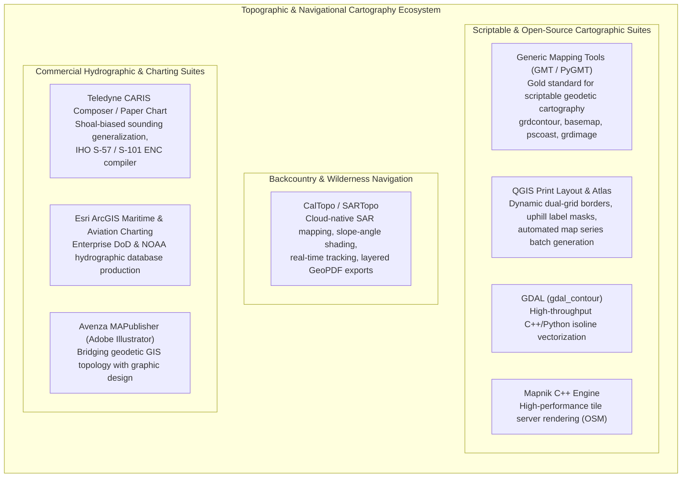

# Chapter 26: Navigating, Charting, Topographic Maps, and Cartographic Production

*Turning elevation models into operational navigation systems, official nautical charts, and publication-grade topographic maps.*

---

## 26.6 Software Ecosystem

Producing navigational charts, national topographic maps, and publication-grade cartographic figures from digital elevation models requires specialized software architectures. The ecosystem divides into scriptable open-source cartographic engines, desktop GIS layout environments, web-based search-and-rescue platforms, and mission-critical hydrographic compilation suites.



---

### 26.6.1 Open-Source Scriptable and Desktop Tools

#### 1. Generic Mapping Tools (GMT and PyGMT)
For scientific publishing (e.g., Nature, JGR, Geophysical Journal International), **GMT** is the undisputed reference standard. It provides mathematical control over projection distortion, dual-grid borders, variable-scale bars, and vector typography:
* `gmt grdcontour`: Generates contour lines with uphill-reading labels, automated index contour intervals, and masked halos behind numbers.
* `gmt basemap`: Draws complex map frames with alternating black-and-white "railroad" borders, annotating geographic coordinates (DMS) alongside projected metric grid ticks (UTM).
* `gmt coast`: Overlays high-resolution shoreline vectors from the GSHHG database, automatically clipping bathymetry to marine areas and land to terrestrial elevations.

```bash
#!/usr/bin/env bash
# Automated GMT Script: Compiling a Publication-Grade Shaded Topo Map
# Generates a high-resolution PDF with dual UTM/Geographic collar and uphill contours

set -euo pipefail

REGION="-105.35/-105.20/39.95/40.05"
PROJ="M15c" # 15 cm wide Mercator projection
DEM="boulder_dem.nc"
GRADIENT="boulder_grad.nc"
OUTPUT="boulder_topographic_map.pdf"

# 1. Compute directional illumination gradient for shaded relief (azimuth 315°)
gmt grdgradient ${DEM} -A315 -Ne0.8 -G${GRADIENT}

# 2. Render shaded relief with perceptually uniform 'batlow' colormap
gmt begin ${OUTPUT} pdf
    gmt grdimage ${DEM} -I${GRADIENT} -Cbatlow -R${REGION} -J${PROJ}

    # 3. Overlay topographic contours:
    # -C50: Draw intermediate contours every 50m
    # -A250+f8p+u" m"+v: Draw index contours every 250m with 8pt font, unit 'm', uphill orientation (+v)
    gmt grdcontour ${DEM} -C50 -A250+f8p+u" m"+v -Wc0.15p,gray30 -Wa0.5p,black -Q10k

    # 4. Draw publication frame with geographic annotations and north arrow
    # -Baf: Primary annotations and frame ticks
    # -BWSen: Annotate West and South borders, draw tick marks on East and North
    gmt basemap -R${REGION} -J${PROJ} -Baf -BWSen \
        --FONT_ANNOT_PRIMARY=9p,Helvetica,black \
        --FORMAT_GEO_MAP=ddd:mmF

    # 5. Add a 5 km metric scale bar and True North arrow
    gmt basemap -Lg-105.23/39.96+c39.96+w5k+l"Kilometers"+u -Tdg-105.32/40.03+w1.5c+d+l,,,N
gmt end show
```

#### 2. QGIS Print Layout and the Atlas Engine
The QGIS layout environment provides enterprise cartographic publishing tools:
* **The Atlas Generation Engine:** Automatically iterates through a polygon coverage layer to generate hundreds of consecutive, standardized $7.5\text{-minute}$ topographic quadrangle GeoPDFs.
* **Dynamic Grid Overlays:** Allows cartographers to stack multiple coordinate systems onto a single map frame (e.g., drawing WGS84 geographic lat/long crosses across the map canvas while rendering UTM Zone 13N metric grid coordinates along the collar).
* **Contour Label Masking:** Utilizes advanced text buffer halos with selective feature masking, suppressing contour segments directly underneath numeric labels without erasing adjacent contour lines.

#### 3. GDAL `gdal_contour`
The standard command-line utility for extracting vector isolines from raster elevation matrices. Written in C++ on top of the marching-squares algorithm:
```bash
# Extract 10m contours from a 3DEP GeoTIFF, flagging 50m index contours
gdal_contour -a elev_m \
             -i 10.0 \
             -f "GPKG" \
             -p \
             input_3dep_1m.tif \
             output_contours.gpkg
```

#### 4. CalTopo and SARTopo
Created by Matt Jacobs, **CalTopo** is the operational standard for wildland search-and-rescue, structural backcountry navigation, and avalanche forecasting:
* **Slope-Angle Shading:** Interactively color-codes elevation gradients to highlight avalanche terrain ($30^\circ\text{–}45^\circ$).
* **Layered Georeferenced PDFs:** Compiles historical USGS quads, high-resolution LiDAR relief, and active satellite wildfire thermal infrared hot-spots into layered GeoPDF files exported directly to GPS-enabled mobile applications (e.g., Avenza Maps).

---

### 26.6.2 Commercial Marine and Aviation Charting Suites

#### 1. Teledyne CARIS Paper Chart and CARIS Composer
The international benchmark software used by national hydrographic offices (including NOAA, the UK Hydrographic Office, and the Canadian Hydrographic Service) for official chart production:
* **Automated Shoal-Biased Sounding Selection:** Implements topological spatial point-thinning algorithms that enforce the shoal-bias rule ($z_{\text{charted}} \le \min(z)$), ensuring that the shallowest sounding within any symbol cluster is preserved while suppressing deeper soundings.
* **Nautical Contour Generalization:** Implements asymmetric morphological snake and rolling-disk operators that guarantee depth contours are displaced strictly into deeper waters, preventing navigation hazards.

#### 2. Esri ArcGIS Maritime and Aviation Charting
Specialized extensions for ArcGIS Pro providing full compliance with defense and civilian charting specifications:
* **ArcGIS Maritime:** Manages hydrographic databases structured according to IHO S-57, S-101 (next-generation vector ENCs), and S-102 (high-definition bathymetric surfaces).
* **ArcGIS Aviation:** Evaluates airborne obstruction surfaces under FAA Part 77 and ICAO Annex 14. Projects 3D runway clearance funnels over airborne LiDAR DTMs, automatically flagging tree canopies, cell towers, and cranes that penetrate protected approach airspace.

#### 3. Avenza MAPublisher
A bridge connecting spatial GIS data with Adobe Illustrator:
* Ingests georeferenced DEM contours, hillshades, and shapefiles directly into Illustrator artboards while preserving geodetic projection parameters.
* Allows graphic designers and cartographers to apply sophisticated artistic typography, custom vector stroke profiles, and brand styling while maintaining geodetic alignment and GeoPDF export capability.
