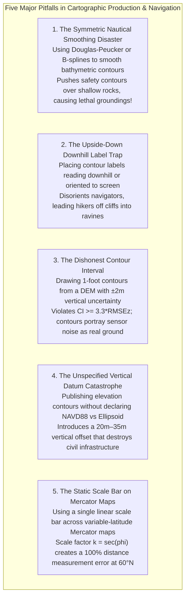

# Chapter 26: Navigating, Charting, Topographic Maps, and Cartographic Production

*Turning elevation models into operational navigation systems, official nautical charts, and publication-grade topographic maps.*

---

## 26.7 Common Pitfalls and Key Takeaways

Cartographic production transforms mathematical surfaces into operational decision tools. While visualization errors mislead the eye, cartographic errors directly endanger life and property: an unpreserved submerged pinnacle on a nautical chart rips open a ship's hull, an upside-down contour label disorients a lost hiker in a blizzard, and an omitted vertical datum on a flood map leads civil engineers to construct levees below the 100-year flood stage.

---

### 26.7.1 Common Pitfalls in Topographic and Navigational Cartography

#### 1. The Symmetric Nautical Smoothing Disaster
* **The Failure Mode:** A GIS specialist generates a bathymetric contour layer for a maritime zone using standard automated vector smoothing tools (e.g., Douglas-Peucker simplification, PAEK, or cubic B-splines).
* **Physical Mechanism:** Standard GIS smoothing algorithms are symmetric: they minimize overall geometric displacement by cutting across sharp outward corners and infilling inward indentations equally.
* **Forensic Consequence:** A $10\text{-meter}$ raw isobath contains a sharp outward lobe that skirts around an isolated $8.5\text{-meter}$ submerged rock pinnacle. The symmetric smoothing filter cuts straight across the lobe, pushing the generalized $10\text{-m}$ line into shallower water. A commercial vessel navigating outside the printed $10\text{-m}$ contour assumes it has safe under-keel clearance, strikes the pinnacle, and ruptures its fuel tanks.
* **Remedy:** Never apply symmetric smoothing to nautical depth contours. Enforce **one-sided, shoal-safe morphological dilation** ($\Omega_{\text{shoal}} \oplus B_R$), pushing contours strictly into deeper water.

#### 2. The Upside-Down Downhill Contour Label Trap
* **The Failure Mode:** An automated cartographic labeling engine is allowed to place contour numbers oriented horizontally to the page, or oriented such that the top of the text points downhill.
* **Cognitive Mechanism:** Human reading conventions assume top-to-bottom hierarchy. On a topographic map, navigators rely on the universal cartographic rule: **the top of contour numbers must point uphill**.
* **Forensic Consequence:** In rugged, unfamiliar terrain during low-visibility search-and-rescue operations, a team reading downhill-oriented labels will interpret the elevation numbers in reverse. A descending ridgeline flanked by fatal vertical drop-offs is misperceived as an ascending, gentle valley floor, leading search teams directly over precipices.
* **Remedy:** Mandate uphill-reading orientation in all GIS labeling engines (e.g., in GMT using `-A+v`, or in QGIS setting label orientation to "Up-slope").

#### 3. The Dishonest Contour Interval: Violating $\text{CI} \ge 3.3 \cdot \text{RMSE}_z$
* **The Failure Mode:** A civil engineering firm downloads a free global satellite DEM (e.g., SRTM or Copernicus GLO-30 with vertical accuracy $\text{RMSE}_z \approx \pm 2.0\text{ meters}$) and generates high-density **$1\text{-foot}$ ($0.30\text{-m}$) contours** for an urban subdivision design.
* **Statistical Mechanism:** Under National Map Accuracy Standards (NMAS), $90\%$ of interpolated elevations must be accurate to within half the contour interval. This establishes the immutable mathematical boundary:
  $$\text{CI}_{\min} \ge 3.29 \cdot \text{RMSE}_z$$
* **Forensic Consequence:** For a dataset with $\text{RMSE}_z = 2.0\text{ m}$, the minimum honest contour interval is $6.6\text{ meters}$ (or $20\text{ feet}$). Generating $1\text{-foot}$ contours amplifies random phase noise, orbital mast vibration ripples, and interpolation ringing by a factor of 20. The resulting squiggly lines do not represent real drainage swales; they are digital hallucinations. Foundations poured according to these dishonest contours suffer catastrophic water pooling and drainage failures.
* **Remedy:** Strictly enforce the $3.3 \cdot \text{RMSE}_z$ rule. High-density $1\text{-foot}$ contours legally mandate Quality Level 1 (QL1) airborne LiDAR ($\text{RMSE}_z \le 9.3\text{ cm}$).

#### 4. The Unspecified Vertical Datum Catastrophe
* **The Failure Mode:** A coastal flood evacuation map or regional drainage study publishes $1\text{-meter}$ topographic contours, labeling them simply as "Elevation in Meters" without specifying the vertical datum.
* **Geodetic Mechanism:** Elevation can be referenced to an **ellipsoidal height** ($h$, relative to the WGS84 or GRS80 reference ellipsoid), an **orthometric height** ($H$, relative to the NAVD88 geoid), or a **local tidal chart datum** (e.g., MLLW). The geoid undulation $N = h - H$ varies across North America from $-10\text{ meters}$ to $-35\text{ meters}$.
* **Forensic Consequence:** If a civil contractor assumes the contours are orthometric (NAVD88) when they were actually extracted directly from uncorrected GNSS ellipsoidal heights, the entire construction site is built **$25\text{ meters}$ below the intended geodetic datum**. In coastal estuaries, this error places a brand-new multi-million-dollar hospital entirely beneath high tide!
* **Remedy:** Every elevation map must include an explicit, unambiguous collar declaration: horizontal datum, projection, and vertical datum (including the specific geoid model used, e.g., "NAVD88 via NGS GEOID18").

#### 5. The Static Scale Bar Fallacy on Mercator Maps
* **The Failure Mode:** A cartographer designs a regional navigation map spanning $25^\circ\text{N}$ to $60^\circ\text{N}$ using Web Mercator (EPSG:3857) or standard Mercator, placing a single static linear scale bar at the bottom of the sheet.
* **Geometric Mechanism:** The Mercator projection preserves conformal angles at the cost of severe area and distance distortion. The linear scale factor varies with latitude as $k = \sec\phi$.
* **Forensic Consequence:** A distance of $100\text{ kilometers}$ measured at $60^\circ\text{N}$ is drawn **twice as large** on the map as $100\text{ kilometers}$ measured at the equator ($k = \sec(60^\circ) = 2.0$). An aviator or mariner using the static bottom scale bar to calculate fuel burn and transit time at high latitudes will underestimate the actual ground distance by $50\%$, risking fuel exhaustion.
* **Remedy:** On small-scale Mercator maps, never use a single static scale bar. Mandate a **Variable-Latitude Scale Bar** showing distinct scale divisions for multiple latitude bands, or switch to an equidistant/conformal conic projection.

---

### 26.7.2 Key Takeaways for Practitioners

1. **Shoal Bias Governs Nautical Safety:** Sounding selection must preserve the minimum depth ($\min z$), and depth contours must only be generalized outward into deeper water. Symmetric smoothing kills ships.
2. **Observe the Contour Accuracy Bound:** Never draw contours tighter than $\text{CI} \ge 3.3 \cdot \text{RMSE}_z$. Dense contours derived from noisy DEMs reflect sensor jitter, not topography.
3. **Uphill-Reading Typography Is Mandatory:** Always orient contour labels so the top of the numbers points uphill toward higher elevation.
4. **Anchor Every Map with Three Norths:** Provide an explicit declination diagram showing True North ($\star$), Grid North ($\text{GN}$ with convergence angle $\gamma$), and Magnetic North ($\text{MN}$ with epoch and secular change).
5. **Always Certify the Vertical Datum:** Explicitly state the vertical reference system (e.g., NAVD88 with GEOID18, or tidal MLLW) on every published figure, map sheet, and dataset collar.
6. **Terrain-Relative Navigation Requires Relief:** TRN particle filters cannot navigate over flat plains where $\nabla z = \mathbf{0}$; operational routes must traverse areas with non-zero Fisher Information.
