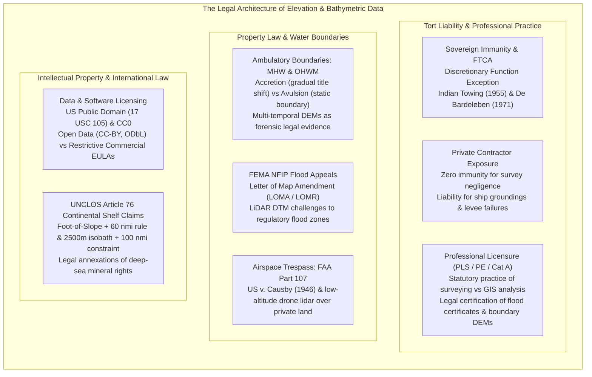
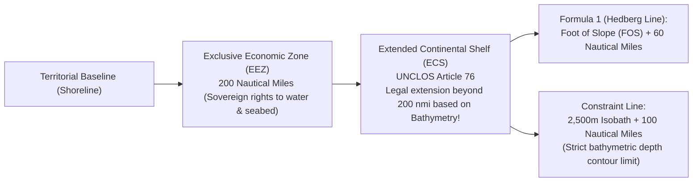

# Chapter 27: Legal, Privacy, Sovereignty, National Security, and Cost Optimization

*The human, legal, geopolitical, and economic dimensions of collecting and publishing 3D models of the world.*

---

## 27.1 Legal Issues in Elevation and Bathymetric Mapping

A digital elevation model is not merely a scientific abstraction; it is a legal instrument with direct economic, civil, and geopolitical consequences. A DEM used to delineate an insurance floodplain determines which homeowners must purchase flood insurance; an elevation dataset used in highway grading dictates contractor payouts; and a bathymetric surface submitted to the United Nations under UNCLOS Article 76 can legally redraw the sovereign borders of a nation to annex thousands of square kilometers of mineral-rich continental shelf.

Operating within this domain requires a comprehensive understanding of tort liability, professional licensing statutes, boundary law, open vs. commercial licensing regimes, and international maritime treaties.

---

### 27.1.1 Liability for Navigational Charts, Flood Maps, and Engineering DEMs

When a ship strikes an uncharted rock, an airliner collides with a mountain ridge, or a neighborhood floods behind an uncertified levee, the digital elevation model is brought into court as primary evidence.

#### 1. Sovereign Immunity and the Federal Tort Claims Act (FTCA)
In the United States, common law historically protected government agencies under sovereign immunity: "the King can do no wrong." The **Federal Tort Claims Act of 1946 (FTCA, 28 U.S.C. §§ 1346(b), 2671–2680)** created a limited waiver of immunity, permitting private citizens to sue the federal government for personal injury or property damage caused by the negligence of federal employees.

However, the government retains absolute immunity under the **Discretionary Function Exception (28 U.S.C. § 2680(a))**:
* If an agency action involves an element of judgment or choice grounded in social, economic, or political policy (e.g., how the USGS allocates its budget between national LiDAR priorities, or how NOAA schedules survey ships), the government cannot be sued.
* **The Landmark Precedents:**
  * ***Indian Towing Co. v. United States* (350 U.S. 61, 1955):** The US Supreme Court held that while the Coast Guard has discretion whether or not to establish a lighthouse, once it undertakes to operate it, it has a non-discretionary duty to maintain it with reasonable care. If a light fails due to negligence and a tugboat grounds, the government is liable.
  * ***De Bardeleben Marine Corp. v. United States* (451 F.2d 140, 5th Cir. 1971):** A tug's anchor struck an uncharted natural gas pipeline depicted incorrectly on a Coast and Geodetic Survey nautical chart. The Fifth Circuit held that the government owes a duty of reasonable care in publishing navigational charts, but fulfilled that duty because navigators failed to consult weekly *Notices to Mariners*.

#### 2. Private Contractor Liability
Unlike federal agencies, private hydrographic and photogrammetric survey firms enjoy **zero sovereign immunity**:
* If a private contractor performs an airborne LiDAR survey or multibeam harbor survey and fails to identify a Danger to Navigation (DTON), miscalculates a tidal datum conversion, or delivers an elevation model containing an unflagged $1.5\text{-meter}$ vertical bias, the contractor is exposed to catastrophic tort liability.
* In commercial maritime shipping, damages from a grounded tanker (hull loss, cargo salvage, environmental oil spill remediation) routinely exceed hundreds of millions of dollars. Consequently, commercial survey contracts mandate strict professional indemnity insurance and rigorous quality compliance certifications.

#### 3. Professional Licensure: Surveying vs. General GIS
In all 50 US states and most developed nations, the practice of **Land Surveying and Photogrammetric Mapping** is strictly regulated by state licensure boards:
* While anyone may download a public DEM and render a 3D hillshade, **certifying an elevation surface** for boundary determination, legal subdivisions, FEMA flood elevation certificates, structural foundation engineering, or official earthwork billing legally constitutes the practice of **Professional Land Surveying (PLS)** or **Licensed Professional Photogrammetrist**.
* Unlicensed engineers or GIS analysts who certify DEM-derived boundaries or volume calculations face cease-and-desist orders, civil fines, and criminal misdemeanor prosecution.

---

### 27.1.2 Property Boundaries, Water Rights, and Cadastres

Where terrain meets water, property boundaries are dynamic and legally contentious.

#### 1. Ambulatory Boundaries: Accretion vs. Avulsion
Under Anglo-American common law, the boundary between private upland property and public sovereign submerged lands is defined by the **Mean High Water (MHW)** line (in tidal waters) or the **Ordinary High Water Mark (OHWM)** (in navigable inland rivers and lakes):
* Because waterlines shift naturally, these are **ambulatory boundaries**.
* **Accretion (and Erosion):** When water gradually and imperceptibly deposits sediment over time, expanding the upland shoreline, the legal boundary moves with the water; the riparian landowner acquires title to the newly formed dry land.
* **Avulsion:** When a sudden, violent flood or hurricane breaches a barrier island or carves a new river channel overnight, the legal boundary **does not move**. Title remains frozen along the pre-avulsion boundary line.
* *The Role of DEMs:* Multi-temporal LiDAR DTMs (e.g., comparing a 2018 pre-hurricane DTM with a 2024 post-storm DTM) provide the definitive forensic evidence in federal and state courts to prove whether shoreline alteration was gradual accretion or sudden avulsion.

#### 2. FEMA Flood Insurance Appeals: LOMA and LOMR
The Federal Emergency Management Agency (FEMA) delineates Special Flood Hazard Areas (SFHA, the 100-year floodplain) on Flood Insurance Rate Maps (FIRMs):
* Many legacy FIRMs were drawn using coarse, interpolated $10\text{-meter}$ or $30\text{-meter}$ USGS contour maps, erroneously placing high, natural knolls inside regulatory flood zones.
* Property owners can appeal these designations by submitting a **Letter of Map Amendment (LOMA)** or **Letter of Map Revision (LOMR)**. 
* Under FEMA regulations, a licensed surveyor can utilize a certified **USGS 3DEP Quality Level 1 or Quality Level 2 LiDAR DTM** to legally prove that a structure's Lowest Adjacent Grade (LAG) sits above the Base Flood Elevation (BFE), permanently removing the property from mandatory, expensive flood insurance mandates.

#### 3. Low-Altitude Drone LiDAR and Airspace Trespass
The proliferation of drone-based LiDAR operating under FAA Part 107 has collided with common law property rights:
* Under the historic Latin doctrine *Cuius est solum, eius est usque ad coelum* ("Whoever owns the soil owns up to the heavens"), landowners claimed vertical air rights.
* In ***United States v. Causby* (328 U.S. 256, 1946)**, the US Supreme Court rejected unlimited vertical ownership, establishing that landowners own only the immediate airspace necessary for the full enjoyment and use of their land (typically up to the tree line or $\sim 50\text{–}83\text{ feet}$).
* While flying a drone in navigable national airspace ($\ge 100\text{ feet}$) is federally protected, hovering at low altitudes ($<50\text{ feet}$) over private backyards to pulse LiDAR across private gardens, patios, or fences exposes operators to common law claims of **trespass**, **nuisance**, and invasion of privacy.

---

### 27.1.3 Licensing and Intellectual Property in Elevation Data

Managing spatial elevation pipelines requires balancing public domain mandates with open-source software licenses and commercial data restrictions.

#### 1. Public Domain vs. Open Data Licenses
* **US Federal Public Domain (17 U.S.C. § 105):** Works created by officers or employees of the US Government as part of their official duties cannot be copyrighted within the United States. USGS 3DEP, SRTM, NOAA CUDEM, and NASA ICESat-2 data are in the **public domain** and can be freely modified, republished, and sold commercially without licensing fees.
* **Creative Commons Zero (CC0 1.0):** Universal public domain dedication used globally by open science consortia (e.g., OpenTopography, GEBCO Seabed 2030) to waive all copyright and database rights worldwide.
* **Open Data Commons Open Database License (ODbL 1.0):** The license governing OpenStreetMap. Requires that any enhanced spatial database derived from ODbL data must also be shared under the ODbL ("Share-Alike").

#### 2. Open-Source Geospatial Software Licensing
* **Permissive Licenses (MIT, BSD, Apache 2.0):** Allow code to be freely used, modified, and incorporated into closed-source, proprietary commercial software (e.g., GDAL, PROJ, PDAL, MapLibre).
* **Copyleft Licenses (GPL v2/v3, LGPL):** Mandate that any derivative work incorporating copyleft code must release its complete source code under the same license (e.g., QGIS, GRASS GIS).

#### 3. Commercial Satellite Stereo EULAs and the "Derivative Work" Threshold
Commercial satellite constellations (Maxar WorldView-3, Airbus Pleiades Neo) sell high-resolution optical stereo imagery under strict End User License Agreements (EULAs) that forbid redistributing the raw imagery.
* *The Legal Threshold:* When an organization processes commercial stereo imagery through photogrammetric correlation (e.g., SETSM or Ames Stereo Pipeline) to extract a digital elevation model:
* If the resulting DTM contains **pure spatial coordinates $(x, y, z)$** and does not incorporate the original image pixel radiance or orthorectified imagery bands, it is classified as a **Derivative Work**.
* Under major satellite vendor policies (e.g., the National Science Foundation PGC ArcticDEM and REMA agreements), the extracted bare-earth and surface elevation grids are legally freed from the imagery EULA, allowing public, open distribution under CC-BY licenses.

---

### 27.1.4 International Maritime Law: UNCLOS Article 76

The United Nations Convention on the Law of the Sea (UNCLOS, signed 1982, effective 1994) represents the largest legal application of digital bathymetric modeling in human history.

#### 1. Defining the Extended Continental Shelf (ECS)
Under UNCLOS Article 76, every coastal nation possesses sovereign rights over the seabed and subsoil within its **Exclusive Economic Zone (EEZ)** out to $200\text{ nautical miles}$ ($370.4\text{ km}$). However, if a nation can geologically and bathymetrically prove that its continental margin extends naturally beyond $200\text{ nmi}$, it can claim an **Extended Continental Shelf (ECS)** out to $350\text{ nmi}$ or beyond.

#### 2. The Bathymetric Formula and Constraint Lines
To establish an ECS claim before the UN Commission on the Limits of the Continental Shelf (CLCS), nations must conduct deep-sea multibeam surveys to mathematically establish two bathymetric boundaries:
1. **The Foot of the Continental Slope (FOS):** Defined as the point of maximum change in gradient at the base of the continental slope:
   $$\text{FOS} = \arg\max_x \left| \frac{d^2 z}{dx^2} \right|$$
   Under the Hedberg Formula, the ECS boundary extends **$60\text{ nautical miles}$ seaward of the Foot of Slope**.
2. **The 2,500-Meter Isobath Constraint:** The maximum allowable legal claim cannot exceed **$100\text{ nautical miles}$ beyond the $2,500\text{-meter}$ bathymetric depth contour**.
* *Sovereign Impact:* By rigorously mapping the $2,500\text{-meter}$ isobath and Foot of Slope using multibeam acoustics, nations (including the US, Canada, Russia, and Australia) have successfully established legal ownership over millions of square kilometers of deep seabed, securing exclusive sovereign rights to vast subsea rare-earth mineral deposits, polymetallic nodules, and oil and gas reservoirs.
