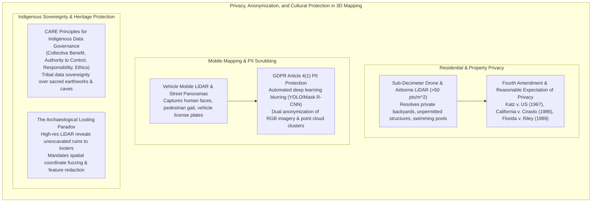
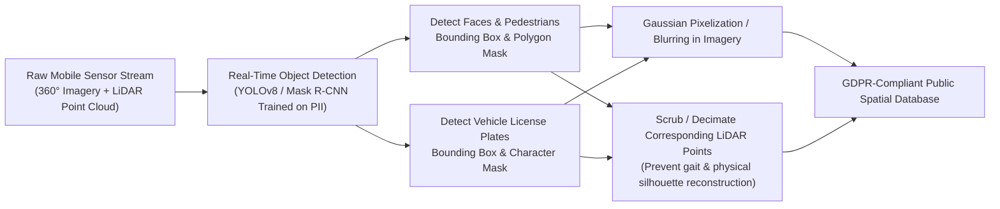

# Chapter 27: Legal, Privacy, Sovereignty, National Security, and Cost Optimization

*The human, legal, geopolitical, and economic dimensions of collecting and publishing 3D models of the world.*

---

## 27.2 Privacy Issues in High-Resolution 3D Elevation

As spatial elevation sensors evolved from kilometer-scale satellite radar to sub-centimeter terrestrial mobile mapping, drone LiDAR, and 3D Gaussian Splats, the physical resolution of the data breached the threshold of human privacy. Today, an airborne LiDAR survey does not merely measure the topography of a hillside; it counts the individual boards on a private residential fence, measures the water level in a backyard swimming pool, and peers through glass skylights.

Balancing the public benefits of high-resolution elevation mapping (flood modeling, infrastructure safety) with individual privacy rights, international data protection statutes (GDPR), Indigenous data sovereignty, and antiquities preservation represents one of the most urgent ethical challenges in modern geomatics.

---

### 27.2.1 Residential Privacy and Aerial Surveillance Law

In the United States, privacy from government surveillance is anchored in the **Fourth Amendment**. However, the legal doctrine governing aerial observation was formulated during an era of coarse human eyesight from airplanes, long before laser scanners could penetrate foliage to map the contents of private yards.

#### 1. The Curtilage and the Reasonable Expectation of Privacy
Under ***Katz v. United States* (389 U.S. 347, 1967)**, Fourth Amendment protection extends to areas where an individual possesses a subjective expectation of privacy that society recognizes as objectively reasonable. The **curtilage**—the immediate enclosed backyard and private grounds surrounding a home—enjoys the highest constitutional protection.

#### 2. The Aerial Surveillance Precedents
* ***California v. Ciraolo* (476 U.S. 207, 1986):** Police flew a private airplane at $1,000\text{ feet}$ in navigable airspace to visually identify marijuana plants growing inside a fenced backyard. The US Supreme Court held that the Fourth Amendment is not violated by naked-eye aerial observation from public navigable airspace.
* ***Florida v. Riley* (488 U.S. 445, 1989):** Police observed the interior of a partially covered greenhouse from a helicopter hovering at $400\text{ feet}$. The Court upheld the search because the helicopter was in lawful airspace.
* ***Kyllo v. United States* (533 U.S. 27, 2001):** Police used a thermal imaging device from a public street to detect abnormal heat escaping from a private home. The Supreme Court decisively ruled this **unconstitutional**, holding that when the government uses a device that is *not in general public use* to explore details of the home that would previously have been unknowable without physical intrusion, the surveillance is a Fourth Amendment search requiring a warrant.

#### 3. The 3D Digital Elevation Challenge
Modern low-altitude drone LiDAR ($<400\text{ feet}$) and 3D Gaussian Splatting blur these lines:
* Unlike a passing human eye, a drone LiDAR mission fires hundreds of thousands of laser pulses per second, constructing a permanent, millimeter-accurate 3D digital replica of a resident's private curtilage.
* Tax assessors routinely ingest high-resolution LiDAR DTMs and automated change-detection algorithms to detect unpermitted swimming pools, backyard sheds, deck expansions, and retaining walls, generating property tax reassessments and building code fines without a physical search warrant.
* In civil law, neighbors deploying personal drones to map adjoining properties risk lawsuits for **invasion of privacy** and **private nuisance**.

---

### 27.2.2 Mobile Mapping and GDPR Personally Identifiable Information (PII)

Vehicle-mounted mobile mapping systems (such as those operated by Google Street View, Apple Maps, and municipal engineering contractors) combine $360^\circ$ panoramic RGB cameras with multi-beam LiDAR profilers (e.g., Riegl VMX, Velodyne Alpha Prime).

#### 1. GDPR Article 4(1) Compliance
Under the European Union's **General Data Protection Regulation (GDPR)**, **Personally Identifiable Information (PII)** is defined as any information relating to an identified or identifiable natural person. 
* A human face, a pedestrian's unique physical gait/silhouette, and a motor vehicle license plate are statutory PII.
* Processing and publishing unblurred mobile street-level data without explicit individual consent constitutes a severe violation, subjecting operators to regulatory fines up to $€20\text{ million}$ or $4\%$ of global annual turnover.

#### 2. Automated Dual-Domain Anonymization Pipelines
To achieve compliance, geospatial data pipelines deploy automated neural network inference engines prior to publishing:
* **Optical Blurring:** Convolutional neural networks (CNNs) detect bounding boxes around human faces and vehicle license plates, applying heavy Gaussian blur or adaptive pixelization.
* **Point Cloud Scrubbing:** High-density LiDAR points reflecting off pedestrians and private car license plates are automatically identified via semantic segmentation (e.g., PointNet++ or RandLA-Net) and either geometrically decimated, classified into a private attribute class, or stripped entirely from the public point cloud deliverable.

---

### 27.2.3 Indigenous Data Sovereignty: The CARE Principles

For centuries, colonial expeditions mapped Indigenous lands without the consent of native inhabitants, often using spatial coordinates to facilitate resource extraction, military subjugation, and cultural dispossession. In response, international Indigenous leaders and scholars established the **CARE Principles for Indigenous Data Governance** (Carroll et al. 2020), which operate alongside the open-science FAIR principles:

1. **Collective Benefit:** Data ecosystems must be designed to enable Indigenous Peoples to derive benefit from the data collected over their territories.
2. **Authority to Control:** Indigenous Peoples have the inherent right to control the collection, ownership, and application of data concerning their lands, sacred sites, and cultural resources.
3. **Responsibility:** Those working with Indigenous data have an obligation to demonstrate how the data supports Indigenous self-determination and well-being.
4. **Ethics:** Indigenous ethical values and worldviews must guide the collection and publication of spatial data.

#### Operational Implementation in Elevation Modeling
When mapping tribal reservations, ancestral lands, or cultural heritage sites:
* **The Redaction of Sacred Sites:** High-resolution digital elevation models and bare-earth hillshades frequently expose sacred burial grounds, ceremonial earthworks, and ancestral medicine wheels. Under tribal data governance agreements, national mapping agencies (such as USGS or Geoscience Australia) must collaborate directly with Tribal Historic Preservation Officers (THPOs) to **embargo, coarsen, or completely redact** elevation layers over sensitive cultural parcels.
* **Data Repatriation:** Raw LiDAR point clouds and derivative high-resolution models collected over sovereign tribal lands are formally transferred to tribal ownership rather than dumped unconditionally into open public domain repositories.

---

### 27.2.4 The Archaeological Looting Paradox

Airborne LiDAR has revolutionized archaeology: by penetrating dense tropical rain forests in Guatemala, Cambodia, and the Amazon, it has revealed tens of thousands of previously unknown Maya pyramids, causeways, agricultural terraces, and Khmer hydraulic cities. However, this success created the **Archaeological Looting Paradox**:

* **The Threat:** Unexcavated archaeological ruins (ancient tombs, temples, burial mounds) contain valuable antiquities. Publishing raw, unredacted $0.5\text{-meter}$ bare-earth LiDAR DTMs provides a literal high-resolution "treasure map" to organized looting cartels and black-market antiquities smugglers.
* **Underwater Cultural Heritage:** Similarly, high-resolution multibeam sonar bathymetry that resolves the wooden hull of an 18th-century treasure galleon or an ancient Roman amphora wreck exposes the site to commercial salvagers and illegal plunder, in direct violation of the **UNESCO 2001 Convention on the Protection of the Underwater Cultural Heritage**.

#### Technical Sanitization Protocols for Cultural Preservation
To protect unexcavated sites while preserving scientific utility:
1. **Coordinate Fuzzing:** Publishing regional hillshades in local arbitrary coordinates with stripped spatial georeferencing tags, preventing GPS field navigation by looters.
2. **Selective Feature Redaction:** Identifying cultural mounds and tomb entrances via semantic segmentation, and applying Poisson surface infilling or synthetic smoothing to erase the structural mounds from the public elevation model.
3. **Restricted Tiered Repositories:** Storing full-resolution point clouds in credentialed, access-controlled scientific repositories accessible only to licensed archaeological researchers bound by institutional review boards (IRBs) and legal non-disclosure agreements.
